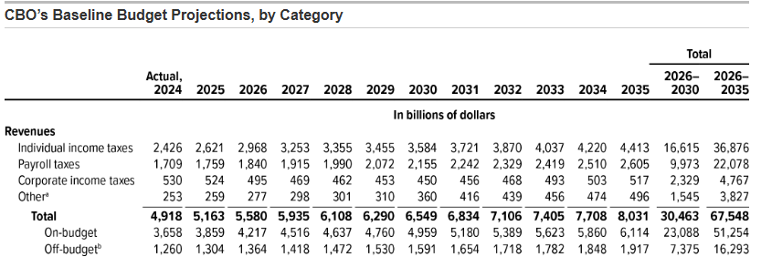
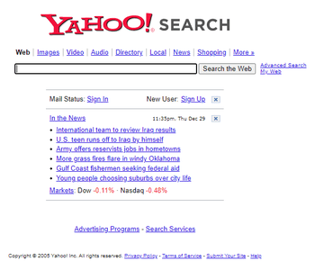
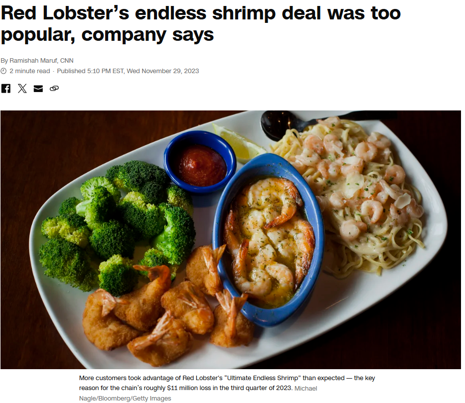
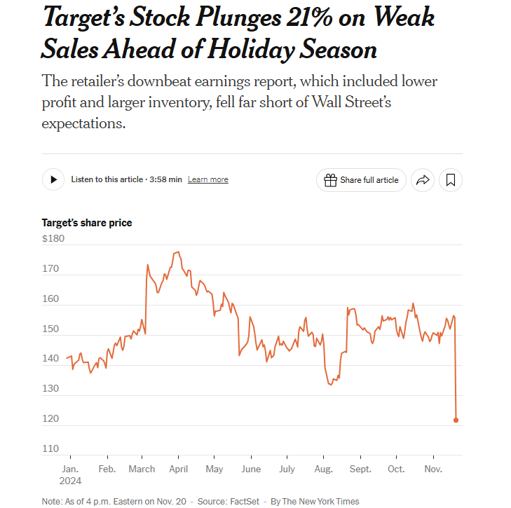
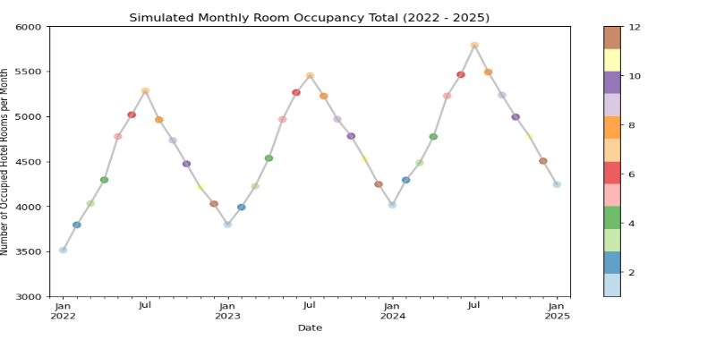
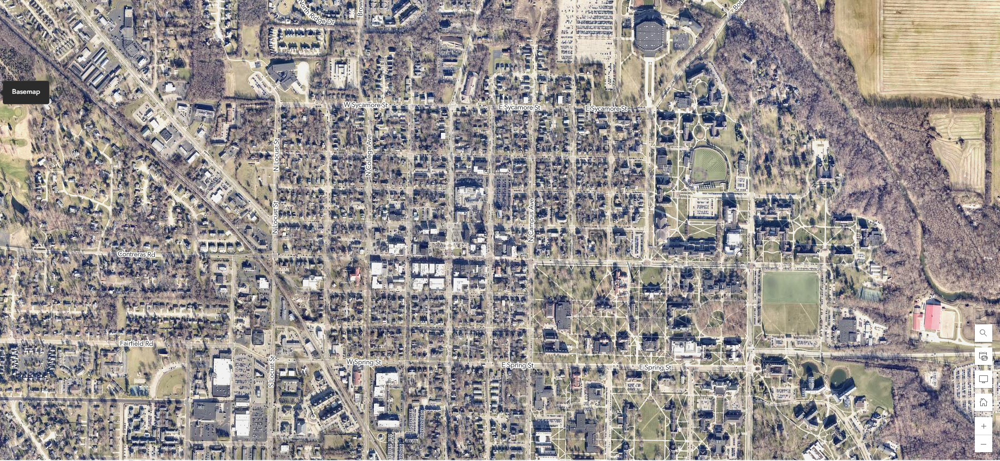
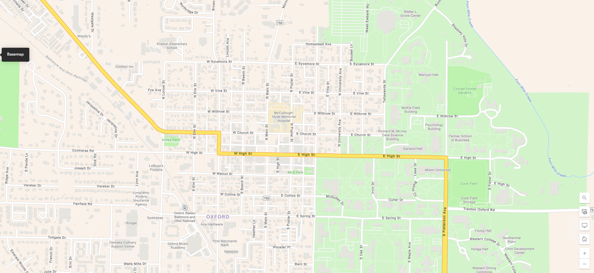
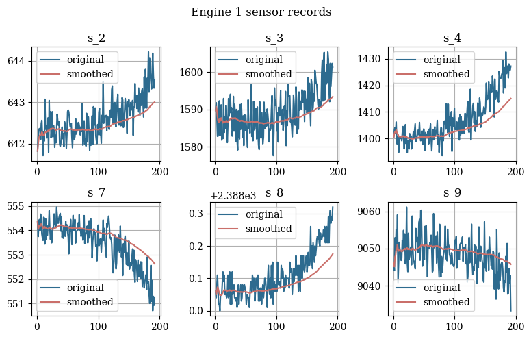
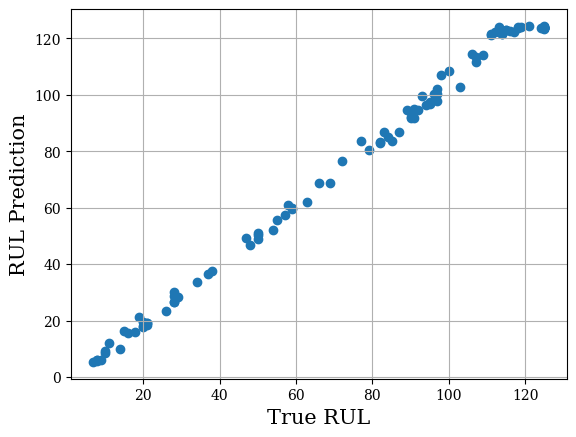
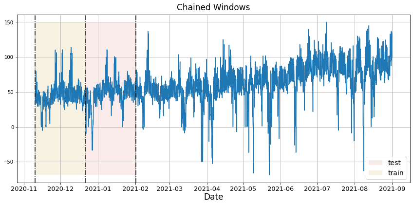

```{r setup, include=FALSE}
knitr::opts_chunk$set(cache = FALSE,
                      echo = TRUE,
                      warning = FALSE,
                      message = FALSE,
                      progress = FALSE, 
                      verbose = FALSE,
                      dev = 'png',
                      fig.height = 2.75,
                      dpi = 300,
                      fig.align = 'center')

options(htmltools.dir.version = FALSE)


miamired = '#C3142D'

if(require(pacman)==FALSE) install.packages("pacman")
if(require(devtools)==FALSE) install.packages("devtools")
if(require(countdown)==FALSE) devtools::install_github("gadenbuie/countdown")
if(require(xaringanExtra)==FALSE) devtools::install_github("gadenbuie/xaringanExtra")
if(require(urbnmapr)==FALSE) devtools::install_github('UrbanInstitute/urbnmapr')
if(require(emo)==FALSE) devtools::install_github("hadley/emo")

pacman::p_load(tidyverse, magrittr, lubridate, janitor, # data analysis pkgs
               DataExplorer, scales, plotly, calendR, pdftools, # plots
               tmap, sf, urbnmapr, tigris, # maps
               bibliometrix, # for bibliometric analysis of my papers
               gifski, av, gganimate, ggtext, glue, extrafont, # for animations
               emojifont, emo, RefManageR, xaringanExtra, countdown) # for slides
```

```{r xaringan-themer, include=FALSE, warning=FALSE}
if(require(xaringanthemer) == FALSE) install.packages("xaringanthemer")
library(xaringanthemer)

style_mono_accent(base_color = "#84d6d3",
                  base_font_size = "20px")

xaringanExtra::use_extra_styles(
  hover_code_line = TRUE,         
  mute_unhighlighted_code = TRUE  
)

xaringanExtra::use_xaringan_extra(c("tile_view", "animate_css", "tachyons", "panelset", "broadcast", "share_again", "search", "fit_screen", "editable", "clipboard"))

```


# Learning Objectives for Today's Class

- Describe the role of forecasting in business.  

- Describe the key components of a **time-series** (**trend**, **seasonality**, **multiple seasonality**, and **cycles**).

- Explain the concept of data-generating process (DGP)

- Discuss limits of forecasting

- Understand key forecasting terminology


---
class: inverse, center, middle

# Course Motivation

---

## Forecasting Impacts Everything and Everyone

.pull-left[
- **Businesses**: Sales forecasts set revenue targets, inventory projections optimize supply chains, and staffing plans ensure workforce readiness during demand fluctuations.

- **Gov.**: Tax revenue and social programs forecasts aid budgeting and resource allocation.

- **Individuals**: Financial forecasts support budgeting, saving, and retirement planning.

- **Weather**: Forecast inform agriculture, disaster prep, and daily decisions.


]

.pull-right[

<center>
  <br>

  

.font80[Source: [Congressional Budget Office](https://www.cbo.gov/publication/61172#_idTextAnchor040)]

<br><br><br>

<a class="weatherwidget-io" href="https://forecast7.com/en/39d47n84d75/45056/" data-label_1="OXFORD" data-label_2="WEATHER" data-theme="original" >OXFORD WEATHER</a>
<script>
!function(d,s,id){var js,fjs=d.getElementsByTagName(s)[0];if(!d.getElementById(id)){js=d.createElement(s);js.id=id;js.src='https://weatherwidget.io/js/widget.min.js';fjs.parentNode.insertBefore(js,fjs);}}(document,'script','weatherwidget-io-js');
</script>
.font80[Source: [Weather Widget's Forecast](https://weatherwidget.io/)]
</center>

]


---

## Microsoft's Missed Opportunity with Mobile Phones

.pull-left-2[

.font90[
> **Q**: People get passionate when Apple comes out with something new—the iPhone; of course ... **Is that something you'd want them to feel about Microsoft?**

<br>

> **A**: It's sort of a funny question. **Would I trade 96% of the market for 4%?** *(Laughter.)*  

> **I want to have products that appeal to everybody.** There's no chance that the iPhone is going to get any significant market share. **No chance.** It's a $500 subsidized item. They may make a lot of money. 

> But if you actually take a look at the 1.3 billion phones that get sold, **I'd prefer to have our software in 60% or 70% or 80% of them**, than I would **2% or 3%, which is what Apple might get**. 

]
]

.pull-right-2[
.center[


.font90[
Steve Ballmer, Former CEO of Microsoft in his infamous interview with [USA Today 2007](https://web.archive.org/web/20070502033654/https://www.usatoday.com/money/companies/management/2007-04-29-ballmer-ceo-forum-usat_N.htm)
]
]
]


---

## Microsoft's Missed Opportunity: Back of a Napkin Calc.

.pull-left[

.font90[

- Since Q1 2009, **Windows' Mobile OS's market share <= 2.5%**, and is now at 0.02% ([StatCounter](https://gs.statcounter.com/os-market-share/mobile/worldwide/#quarterly-200901-202403)).

- **Apple's Mobile iOS market share > 19%**, and is now at **27.69%** ([StatCounter](https://gs.statcounter.com/os-market-share/mobile/worldwide/#quarterly-200901-202403)).

- Apple's **iPhone revenues** from 2007 to 2024 was **$2.037 trillion** (per [statista](https://www.statista.com/statistics/263402/apples-iphone-revenue-since-3rd-quarter-2007/)).

- Assuming Microsoft could have captured just **5%** of Apple's market revenue $\rightarrow$ **$102 billion**.

- This estimate **excludes app store and brand value**, which will make the missed opportunity even larger.
]

]

.pull-right[


```{python market_share, echo=FALSE}
import pandas as pd
import matplotlib.pyplot as plt

mshare = pd.read_csv("../../data/os_combined-ww-quarterly-20091-20243.csv")

mshare['Date'] = pd.to_datetime(mshare['Date'])

ax = mshare.plot(
    x='Date',
    y=['Windows', 'iOS', 'Android'],
    kind='line',
    figsize=(6, 3.625),
    legend=True,
    linestyle='-',
    color=['red', 'black', 'gray'],
    alpha=0.7,
    linewidth=2,
    title="Mobile OS Market Share for Windows, iOS and Android (2009 - 2024)",
    xlabel="Date (Years)",
    ylabel="Market Share (%)",
    grid=True
)

plt.tight_layout(pad = 2.25)
plt.show()

```


<div style="margin-top:-30px;">

```{python apple_revenue, echo=FALSE}
import pandas as pd
import matplotlib.pyplot as plt
import matplotlib as mpl

apple_rev = pd.read_csv("../../data/statistic_id263402_apple-iphone-sales-revenue-2007-2024.csv")

apple_rev['date'] = pd.to_datetime(apple_rev['date'])
apple_rev['revenue'] = apple_rev['revenue'].str.replace(r',', '').astype(int)

ax = apple_rev.plot(
    x='date',
    y=['revenue'],
    kind='line',
    figsize=(6, 3.625),
    legend=True,
    linestyle='-',
    color=['black'],
    alpha=0.7,
    linewidth=2,
    title="Apple's iPhone Revenues (2007 - 2024)",
    xlabel="Date",
    ylabel="Revenues in Millions",
    grid=True
)

scatter = apple_rev.plot(
    x='date',
    y='revenue',
    kind='scatter',
    ax=ax,
    c='black',
    s=50,
    alpha=0.7,
    ylabel="Revenues in Millions",
    xlabel="Date (Years)",
    legend = False
)

scatter.yaxis.set_major_formatter(mpl.ticker.StrMethodFormatter('{x:,.0f}'))
plt.tight_layout(pad = 2.25)
plt.show()

```

</div>

]


---

## Other Real-World Forecasting Failures in Tech

.pull-left[
  .center[
  
  
  
 .font80[**IBM**: Missed the PC revolution.]  


 

  .font80[**Kodak**: Missed the digital camera revolution.]

]
]

.pull-right[
  .center[
  
  
  
  .font80[**Blockbuster**: Missed the streaming revolution.]
 

 
 
  .font80[**Yahoo**: Missed the search engine revolution.]
 
]

]


---

## Non-Tech Failures: Red Lobster's Endless Shrimp

.center[
  
]


---

## Non-Tech Failures: Target's Overestimation

.center[
  
]


---

## Why Do These Stories Matter?

**(1) Forecasting Errors = Real Money Lost**  
  - **Microsoft**: $102 billion in potential mobile phone revenues.
  - **Target:** .bold[Overestimation] leads to unsold stock or overservicing (e.g., [Target's Stock Plunging by 21% due to lower profit and larger inventories](https://www.nytimes.com/2024/11/20/business/target-earnings-holiday-shopping.html?unlocked_article_code=1.sU4.BN7Y.DRvnq7F_52NO&smid=url-share)).
  - **Red Lobster**: $11M in losses due to .bold[underestimating] demand for their endless shrimp deal.

<br>

**(2) Course Relevance:**

This class will teach you how to identify .black[.bold[trends]], .black[.bold[seasonality]], and .black[.bold[cycles]], and .black[.bold[how to apply forecasting tools and models]] so you can **avoid these pitfalls** in your future roles. The goal is to allow you to make **data-driven forecasts**, not just gut-based decisions, and more importantly, be able to **quantify the uncertainty** in your forecasts.


---

## Can you Avoid Common Forecasting Mistakes?

```{python motivating_example, include=FALSE}
import pandas as pd

import matplotlib.pyplot as plt
import matplotlib.dates as mdates

import numpy as np

np.random.seed(2025)

data = {
    "date": pd.date_range(start="2022-01-01", end="2025-01-01", freq="MS"),
    "hotel_occupancy": [
        350, 375, 400, 425, 475, 500, 525, 500, 475, 450, 425, 400,
        375, 400, 425, 450, 500, 525, 550, 525, 500, 475, 450, 425,
        400, 425, 450, 475, 525, 550, 575, 550, 525, 500, 475, 450,
        425
    ]
}

# Convert to a DataFrame and add randomness
df_hotel = (
    pd.DataFrame(data)
    .assign(
        month=lambda x: x['date'].dt.month,
        month_name=lambda x: x['date'].dt.month_name(),
        hotel_occupancy=lambda x: x['hotel_occupancy']*10 + np.random.randint(-50, 50, size=len(x))
    )
)

# Create the plot with a hue for months
ax = df_hotel.plot(
    x='date',
    y='hotel_occupancy',
    kind='line',
    figsize=(14, 7),
    legend=False,
    linestyle='-',
    color='darkgray',
    alpha=0.7,
    linewidth=2,
    title="Simulated Monthly Room Occupancy Total (2022 - 2025)",
    xlabel="Date (Years)",
    ylabel="Hotel Occupancy (Rooms)",
    grid=True
)

# Overlay scatter plot using hue for each month
scatter = df_hotel.plot(
    x='date',
    y='hotel_occupancy',
    kind='scatter',
    ax=ax,
    c=df_hotel['month'],  # Use numeric month codes for coloring
    cmap=plt.get_cmap('Paired', 12),  # Use a color map with 12 colors
    s=50,
    alpha=0.7,
    legend = True
)


# Format x-axis to show all months and add space for the last dot
ax.set_xlim(
    [df_hotel['date'].min() - pd.DateOffset(months=1),
     df_hotel['date'].max() + pd.DateOffset(months=1)]
)
ax.set_ylim([3000, 6000])


# rename axes
ax.set_xlabel("Date")
ax.set_ylabel("Number of Occupied Hotel Rooms per Month")

plt.tight_layout(pad = 2.25)
plt.show()

df_hotel.to_csv("../../data/01_hotel_occupancy.csv", index=False)


# --------------------------------
# forecasting solution:
# --------------------------------
df_hotel = (
  pd.read_csv("../../data/01_hotel_occupancy.csv")
  .assign(
    date = lambda x: pd.to_datetime(x['date']),
    year = lambda x: x['date'].dt.year
    )
  )

# compute the average occupancy per year
yearly_avg = (
  df_hotel
  .groupby('year')['hotel_occupancy']
  .mean()
  .drop(2025)
  )
  
# compute the year-over-year growth rate
yoy_growth = yearly_avg.pct_change().mean()

# filter the data for 2024
monthly_2024 = (
  df_hotel
  .query("year == 2024")
  )

# forecast the occupancy for 2025
forecast = pd.DataFrame({
    # generate the dates for 2025
    "date": pd.date_range(start="2025-01-01", end="2025-12-01", freq="MS"),
    # forecast the occupancy using the year-over-year growth rate for 2024
    "forecasted_occupancy": monthly_2024['hotel_occupancy'] * (1 + yoy_growth)
})


```

`r countdown(minutes = 8, seconds = 0, top = 0, font_size = "2em")`

.panelset[

.panel[.panel-name[Description]

  - **Scenario**: You are a business analyst at a hotel chain.  

  - **Problem**: You are tasked with forecasting hotel occupancy for the next 11 months.  

  - **Data**: You have access to the hotel's monthly room occupancy data from 2022 to January of 2025. Download the file [here](https://miamioh.instructure.com/courses/230182/files/34510709?module_item_id=5759088). 

  - **Task:** .black[.bold[Without the use of any AI tools]], create a forecast for the hotel's occupancy for the next 11 months. The forecast can be made in Excel, R, or Python. .black[.bold[Document the process and the rationale behind your forecasts.]] 

  - **Non-graded Class Activity:** Input your logic for the 11-month forecast, and your quantitative forecast for **February 2025** in the next 2 tabs, respectively.

]

.panel[.panel-name[Your Logic]

Use the editable text-box below to describe your logic for forecasting the hotel's occupancy for the next 11 months. Use bullet points to list your steps.

.can-edit.key-activity1_logic[

**Steps Taken to Generate the Forecasts:** .font70[(Insert below)]

  - Edit me  
  
  - ... 
  
  - ...
]

]

.panel[.panel-name[Your Sol]

- Input your solution for **February 2025** by using the QR code below.

```{r echo=FALSE, out.width='30%', fig.align='center'}

```

]

.panel[.panel-name[Class Results]

<div style='position: relative; padding-bottom: 56.25%; padding-top: 35px; height: 0; overflow: hidden;'><iframe sandbox='allow-scripts allow-same-origin allow-presentation' allowfullscreen='true' allowtransparency='true' frameborder='0' height='285' src='https://www.mentimeter.com/app/presentation/alrufhucrqefifc266ma7ormoe6xntmw/embed' style='position: absolute; top: 0; left: 0; width: 100%; height: 100%;' width='420'></iframe></div>

]

.panel[.panel-name[Fadel's Logic]

<details>
  <summary>Let us discuss how to approach such a problem. </summary>


</details>

.can-edit.key-activity1_viz[

**Fadel's approach to this problem:** .font70[(To be discussed in class)]

  - Edit me  
  
  - ... 
  
  - ...
]


]


.panel[.panel-name[Fadel's Sol]

<details>
  <summary>Let us think of a reasonable solution, which assumes no prior time-series knowledge. </summary>

<small>

```{python 
import pandas as pd

df_hotel = (
  pd.read_csv("../../data/01_hotel_occupancy.csv")
  .assign(date = lambda x: pd.to_datetime(x['date']),
    year = lambda x: x['date'].dt.year  )  )

# plotting of the data hidden for brevity

# compute the average occupancy per year and year-over-year growth rate
yearly_avg = df_hotel.groupby('year')['hotel_occupancy'].mean().drop(2025)
yoy_growth = yearly_avg.pct_change().mean()

# filter the data for 2024
monthly_2024 = df_hotel.query("year == 2024")

# forecast the occupancy for 2025
forecast = pd.DataFrame({
    "date": pd.date_range(start="2025-01-01", end="2025-12-01", freq="MS"),
    "forecasted_occupancy": (monthly_2024['hotel_occupancy'] * (1 + yoy_growth) ).round(0).astype(int)
})

forecast.iloc[0:2].reset_index(drop=True)

</small> </details>
```

]
]

---

class: inverse, center, middle

# Types of Data Over Time and the Components of a Time Series

---

## Cross-Sectional Data

**Cross-sectional data** captures multiple variables at a single point in time for each
observation; e.g., .bold[all the variables within a given observation] in the [DoL's LCA Disclosure Data for 2024 Q4](https://www.dol.gov/sites/dolgov/files/ETA/oflc/pdfs/LCA_Disclosure_Data_FY2024_Q4.xlsx) were collected simultaneously.

```{python cross_sectional, echo=FALSE, results='asis'}
import pandas as pd

df = (
  pd.read_excel(
    "../../data/LCA_Disclosure_Data_FY2024_Q4.xlsx",
    usecols=["RECEIVED_DATE", "EMPLOYER_NAME", "WORKSITE_CITY", "WORKSITE_STATE",
    "JOB_TITLE", "WAGE_RATE_OF_PAY_FROM", "WAGE_UNIT_OF_PAY", "WAGE_RATE_OF_PAY_TO"],
    nrows=10000
  )
  .query("WORKSITE_STATE == 'OH' and WAGE_UNIT_OF_PAY == 'Year'")
  .assign(
    RECEIVED_DATE = lambda x: pd.to_datetime(x['RECEIVED_DATE']),
    WAGE_RATE_OF_PAY_TO = lambda x: x['WAGE_RATE_OF_PAY_TO'].fillna(x['WAGE_RATE_OF_PAY_FROM']),
    )
  .drop(columns=["WAGE_RATE_OF_PAY_FROM", "WAGE_UNIT_OF_PAY", 'WORKSITE_CITY'])
  .rename(columns={"RECEIVED_DATE": "Date", "EMPLOYER_NAME": "Employer", "JOB_TITLE": "Job Title", "WAGE_RATE_OF_PAY_TO": "Salary"})
  .sort_values(by = "Date")
  .reset_index(drop=True)
  )
  
df.to_csv("../../data/01_cross_sectional_data.csv", index=False)

```

.font70[

```{r cross_sectional_print, echo=FALSE}
df = readr::read_csv("../../data/01_cross_sectional_data.csv")
DT::datatable(df, rownames = FALSE, options = list(pageLength = 4)) |> 
  DT::formatCurrency(columns = "Salary", currency = "$", digits = 0)
```

]

---

## Time Series Data

**Time series data** captures a single variable at multiple points in time; e.g., the [daily stock prices for Apple](https://finance.yahoo.com/quote/AAPL/history?p=AAPL) or our **simulated monthly hotel room occupancy** dataset.

```{python time_series, echo=FALSE, results='hide', fig.show='last'}
import pandas as pd
import matplotlib.pyplot as plt

df_hotel = (
  pd.read_csv("../../data/01_hotel_occupancy.csv")
  .assign(date = lambda x: pd.to_datetime(x['date']) )
  )

# Create the plot with a hue for months
ax = df_hotel.plot(
    x='date',
    y='hotel_occupancy',
    kind='line',
    figsize=(15,6),
    legend=False,
    linestyle='-',
    color='darkgray',
    alpha=0.7,
    linewidth=2,
    title="Simulated Monthly Room Occupancy Total (2022 - 2025)",
    xlabel="Date (Years)",
    ylabel="Hotel Occupancy (Rooms)",
    grid=True
)

# Overlay scatter plot using hue for each month
scatter = df_hotel.plot(
    x='date',
    y='hotel_occupancy',
    kind='scatter',
    ax=ax,
    c=df_hotel['month'],  # Use numeric month codes for coloring
    cmap=plt.get_cmap('Paired', 12),  # Use a color map with 12 colors
    s=50,
    alpha=0.7,
    legend = True
)


# Format x-axis to show all months and add space for the last dot
ax.set_xlim(
    [df_hotel['date'].min() - pd.DateOffset(months=1),
     df_hotel['date'].max() + pd.DateOffset(months=1)]
)
ax.set_ylim([3000, 6000])


# rename axes
ax.set_xlabel("Date")
ax.set_ylabel("Number of Occupied Hotel Rooms per Month")

plt.tight_layout(pad = 2.25)
plt.show()

```


---

## Panel Data

**Panel data** captures multiple variables at multiple points in time for each observation; e.g., the [Panel Study of Income Dynamics](https://psidonline.isr.umich.edu/) or the [World Bank's World Development Indicators](https://databank.worldbank.org/source/world-development-indicators).

.font80[
```{r wb, results='asis', echo=FALSE}
macroData = wbstats::wb_data(
  country = c('CN','EG','US'),
  indicator = c('NY.GDP.MKTP.KD.ZG', 'SP.DYN.LE00.IN', 
                'SH.DYN.NMRT', 'SH.HIV.INCD.ZS', 'SH.MED.BEDS.ZS', 
                'SH.MED.PHYS.ZS', 'SH.PRV.SMOK', 'SH.STA.TRAF.P5'),
  mrv = 10, return_wide = TRUE, gapfill = TRUE) |> 
  dplyr::select(-c(iso2c, country)) |> 
  dplyr::mutate_at(.vars = 3:10, ~round(., digits = 1))

DT::datatable(macroData,  
              extensions = "FixedColumns",
              options = list(pageLength = 7, dom = 'tip', scrollX='500px',
                             fixedColumns = list(leftColumns = 3)) ) 
```
]

.footnote[
<html>
<hr>
</html>

**Source:** Data queried from the [World Bank Data](https://datacatalog.worldbank.org/) using the [wbstats](https://cran.r-project.org/web/packages/wbstats/wbstats.pdf) `r fontawesome::fa('box', 'gold')` in R. The printed results show a snapshot of 7 variables (out of a much larger panel dataset). You can think of panel data as a cross-sectional dataset with a longitudinal/time component.
]


---

## Components of Time Series Data: Trend

- **Trend**: A long-term increasing or decreasing pattern over time.

- **Example**: The [US GDP](https://fred.stlouisfed.org/series/GDP) has a long-term upward trend.

```{r trend, echo=FALSE, fig.show='last'}
fredr::fredr(
  "GDP", observation_start = as.Date("2022-01-01"),
  observation_end = as.Date("2024-12-31")
  ) |> 
  dplyr::mutate(
    month= lubridate::month(date, label = T) |> as.character(),
    value = value/1000
    ) -> gdp

color_mapper = c(
  "Jan" = "#1B9E77",  "Apr" = "#D95F02", "Jul" = "#7570B3", "Oct" = "#E7298A"
  )

gdp |> 
  ggplot2::ggplot(ggplot2::aes(x = date, y = value)) +
  ggplot2::geom_line(color = 'black', size = 1) +
  ggplot2::geom_point(ggplot2::aes(color = month), size = 3) +
  ggplot2::labs(title = "US GDP (2022 - 2024)", x = "Date", y = "GDP (Trillions of USD)") +
  ggplot2::theme_bw() +
  ggplot2::scale_y_continuous(labels = scales::dollar, breaks = scales::breaks_pretty(8)) +
  ggplot2::scale_x_date(date_labels = "%Y %b", breaks = scales::breaks_pretty(10)) +
  ggplot2::scale_color_manual(values = color_mapper) +
  ggplot2::theme(legend.position = "none")
```


---

## Components of Time Series Data: Seasonality

**Seasonality** refers to the property of a time series that displays REGULAR patterns that repeat at a constant frequency (*m*). For example, the [number of retail trade workers](https://fred.stlouisfed.org/series/CEU4200000001) has a seasonal pattern (with an upward trend).


```{r ecommerce, echo=FALSE, fig.show='last'}
retail_workers = tidyquant::tq_get(
  "CEU4200000001", from = "2022-01-01", to = "2024-12-31",
  get = 'economic.data') |> 
  dplyr::mutate(
    year = lubridate::year(date),
    month = lubridate::month(date, label = T) |> as.character(),
    price = price/1000
    )

colors = RColorBrewer::brewer.pal(12, "Set3")

# map colors to months
color_mapper = setNames(colors, unique(retail_workers$month))


retail_workers |> 
  ggplot2::ggplot(ggplot2::aes(x = date, y = price, group = year)) +
  ggplot2::geom_line(color = 'black', size = 1) +
  ggplot2::geom_point(ggplot2::aes(color = month), size = 3) +
  ggplot2::labs(title = "Number of Retail Trade Workers in the U.S.", x = "Date", y = "Millions of Workers") +
  ggplot2::theme_bw() +
  ggplot2::scale_y_continuous(breaks = scales::breaks_pretty(8)) +
  ggplot2::scale_x_date(date_labels = "%Y %b", breaks = scales::breaks_pretty(10)) +
  ggplot2::scale_color_manual(values = color_mapper) +
  ggplot2::theme(legend.position = "none")
```


---

## Components of Time Series Data: Multiple Seasonality

**Multiple seasonality** refers to the property of a time series that displays multiple seasonal patterns that repeat at different frequencies. 
<!-- For example, the [number of passengers at US airports](https://data.bts.gov/Research-and-Statistics/T-100-Scheduled-Service-Passenger-Enplanements-by-A/3q3v-9v2s) has both a daily and weekly seasonality pattern. -->

```{python multiple_seasonality, echo=FALSE, fig.show='last'}

import pandas as pd
import matplotlib.pyplot as plt

# Define file paths for the three datasets
file_paths = [
    '../../data/Actual_Hourly_Loads_by_Class_2022_20230307.xlsx',
    '../../data/Actual_Hourly_Loads_by_Class_2023_20240507.xlsx',
    '../../data/Actual_Hourly_Loads_by_Class_2024.xlsx'
]

# Function to process each file and extract relevant columns
def process_file(file_path):
    data = pd.read_excel(file_path, sheet_name='Total Usage', header=1)
    selected_data = data[['REPORT DAY', 'HOUR ENDING', 'TOTAL']]
    selected_data.columns = ['Date', 'Hour', 'Total Usage']
    selected_data['Date'] = pd.to_datetime(selected_data['Date'])
    selected_data['Weekday'] = selected_data['Date'].dt.day_name()
    selected_data['Month'] = selected_data['Date'].dt.strftime('%b')
    return selected_data

# Combine all datasets
all_data = pd.concat([process_file(file_path) for file_path in file_paths])

# Aggregate data for plotting
hourly_usage = all_data.groupby('Hour')['Total Usage'].mean()

weekday_order = ['Monday', 'Tuesday', 'Wednesday', 'Thursday', 'Friday', 'Saturday', 'Sunday']
weekday_usage = all_data.groupby('Weekday')['Total Usage'].mean().reindex(weekday_order)

month_order = ['Jan', 'Feb', 'Mar', 'Apr', 'May', 'Jun', 'Jul', 'Aug', 'Sep', 'Oct', 'Nov', 'Dec']
monthly_usage = all_data.groupby('Month')['Total Usage'].mean().reindex(month_order)


# Plot the data
plt.figure(figsize=(15, 6.5))

# Daily seasonality (within day)
plt.subplot(3, 1, 1)
plt.plot(hourly_usage.index, hourly_usage.values, marker='o', color='orange')
plt.title('Hourly Seasonality: Average Total Usage by Hour')
plt.xlabel('Hour of the Day')
plt.ylabel('Average Total Usage')
plt.grid(True)

# Weekly seasonality (day of week)
plt.subplot(3, 1, 2)
plt.plot(weekday_usage.index, weekday_usage.values, marker='o', color='blue')
plt.title('Day-of-Week Seasonality: Average Total Usage by Day of Week')
plt.xlabel('Day of the Week')
plt.ylabel('Average Total Usage')
plt.grid(True)

# Monthly seasonality (month of year)
plt.subplot(3, 1, 3)
plt.plot(monthly_usage.index, monthly_usage.values, marker='o', color='green')
plt.title('Monthly Seasonality: Average Total Usage by Month')
plt.xlabel('Month')
plt.ylabel('Average Total Usage')
plt.grid(True)

# Add a caption
plt.figtext(0.5, 0.01, 'Data Source: Duke Energy, https://www.duke-energyohiocbp.com/Documents/LoadandOtherData.aspx, downloaded and charted on Jan 27, 2025 ', wrap=True, horizontalalignment='center', fontsize=8)

# Show the plots
plt.tight_layout(pad = 4)
plt.suptitle("Multiple Seasonality Patterns (Daily, Weekly & Monthly) in Duke Energy's 2022-2024 Consumption Data")
plt.show()

```


---

## Components of Time Series Data: Cycles

**Cycles** refer to the property of a time series that displays irregular patterns that repeat at irregular frequencies. For example, the [US Total Vehicle Sales](https://fred.stlouisfed.org/series/TOTALSA) has business cycles that are influenced by economic conditions and advancements in vehicle technologies.


```{r cycles, echo=FALSE, fig.show='last'}
fredr::fredr(
  "TOTALSA", observation_start = as.Date("1976-01-01"),
  observation_end = as.Date("2024-12-31")
  ) |> 
  dplyr::mutate(
    month= lubridate::month(date, label = T) |> as.character(),
    ) -> vehicle_sales

vehicle_sales |> 
  ggplot2::ggplot(ggplot2::aes(x = date, y = value)) +
  ggplot2::geom_line(color = 'black') +
  ggplot2::labs(title = "US Total Vehicle Sales (1976 - 2024)", x = "Date", y = "Number of Vehicles Sold") +
  ggplot2::theme_bw() +
  ggplot2::scale_y_continuous(breaks = scales::breaks_pretty(8)) +
  ggplot2::scale_x_date(date_labels = "%Y %b", breaks = scales::breaks_pretty(10)) +
  # ggplot2::stat_smooth(method = "gam", se = F, color = "red") +
  ggplot2::theme(legend.position = "none")

```


---

## Components of Time Series Data: Cycles

**Cycles** refer to the property of a time series that displays irregular patterns that repeat at irregular frequencies. For example, the [US Total Vehicle Sales](https://fred.stlouisfed.org/series/TOTALSA) has business cycles that are influenced by economic conditions and advancements in vehicle technologies.


```{r cycles2, echo=FALSE, fig.show='last'}
vehicle_sales |> 
  ggplot2::ggplot(ggplot2::aes(x = date, y = value)) +
  ggplot2::geom_line(color = 'black') +
  ggplot2::labs(title = "US Total Vehicle Sales (1976 - 2024)", x = "Date", y = "Number of Vehicles Sold") +
  ggplot2::theme_bw() +
  ggplot2::scale_y_continuous(breaks = scales::breaks_pretty(8)) +
  ggplot2::scale_x_date(date_labels = "%Y %b", breaks = scales::breaks_pretty(10)) +
  ggplot2::stat_smooth(method = "gam", se = F, color = "red") +
  ggplot2::theme(legend.position = "none")

```


---

# Kahoot Competition #01

To assess your understanding and retention of the topics covered so far, you will **compete in a Kahoot competition (consisting of 5 questions)**:  

- Go to <https://kahoot.it/>  

- Enter the game pin, which will be shown during class

- Provide your first (preferred) and last name

- Answer each question within the allocated 20-second window (**fast and correct answers provide more points**)

<br>

**Winning the competition involves having as many correct answers as possible AND taking the shortest duration to answer these questions.** The winner `r fontawesome::fa(name = 'trophy', fill = 'gold')` of the competition will receive a **0.15 bonus on Assignment 01**. Good luck!!!

.footnote[
<html>
<hr>
</html>

**P.S:** The Kahoot competition will have **no impact on your grade**. It is a **fun** way of assessing your knowledge, motivating you to ask questions about topics covered that you do not have a full understanding of it, and providing me with some data that I can use to pace today's class. 
]


---

class: inverse, center, middle

# The Data Generating Process

---

## The Idea of a Data Generating Process (DGP)

- A **time series** is defined as a **sequence of observations** recorded at regular time intervals.

- Any time series is generated by some kind of mechanism, which is often referred to as a **data generating process (GDP)**. For example, the hotel occupancy dataset is impacted by:   
  - .black[.bold[season]], .black[.bold[holidays]], .black[.bold[economic conditions]], and .black[.bold[marketing campaigns]];  
  - .black[.bold[number of rooms]], .black[.bold[room rates]], and .black[.bold[customer satisfaction]];   
  - .black[.bold[weather]], .black[.bold[local events]], and .black[.bold[competition]]; and 
  - .black[.bold[number of rooms already booked]], .black[.bold[room cancellations]], and .black[.bold[no-shows]].

- The **DGP** is the **underlying theoretical mechanism** that generates the data we observe.  
   - Accounts for both systematic patterns (e.g., trend, seasonality) and randomness.    
- **But**: In real-world settings, there is often **no perfectly known** DGP.    
  - Any formula or model we write is an approximation of the **unknowable “truth.”**  

---

## Model vs. Reality — The Map Analogy for DGPs

.pull-left[
- **A map ≠ the territory**:  
  - We use maps to navigate, but they are always simplified.  
  - Similarly, a forecast model ≠ reality—it is a *purposeful* simplification.

- **Different maps for different needs**:  
  - A tourist map highlights landmarks, while a transportation map focuses on roads to inform navigation.  
  - Each addresses *specific* questions, just as we build different forecasting models for different objectives.
]


.pull-right[


<br>


]

---

## Why Use DGPs If They Do not Actually Exist?

**(1) Guiding Principle:**    
   - Thinking in terms of a *hypothetical* DGP helps us design or select reasonable model structures.  
   - E.g., we incorporate domain insights: “Does our hotel occupancy data show strong seasonality?”

**(2) Clarifying Assumptions:**    
   - Even if the DGP is not known, stating assumptions (e.g., no trend, constant variance) makes our models testable and improvable.

**(3) Iterative Refinement:**    
   - As new data contradict our assumptions, we adjust our “map” of reality.  
   - In forecasting, we continually update models to capture changing conditions.


---

## Key DGP Takeaways

- **All Models Are Wrong…**  
  - ...but some are *useful* for forecasting, planning, or decision-making.

- **The DGP Is a Useful Fiction**  
  - We talk about it to structure our thinking.  
  - We never truly “see” it; we only see **data**.

- **Practical Implication**  
  - A good model is *close enough* to guide accurate forecasts.  
  - Remain aware of model limitations and be ready to adapt.


---

class: inverse, center, middle

# "What Can (and Can not) We Forecast?"

---

## Rank these Scenarios in Terms of Forecastability

`r countdown(minutes = 2, seconds = 0, top = 0, font_size = "2em")`

.panelset[

.panel[.panel-name[Description]

- **Rank** each scenario (in the next tab) from **easiest** (1) to **hardest** (6) to predict.   

- **Submit** your ranking by clicking [here](https://www.menti.com/al4qbc8hg3jnm)

]

.panel[.panel-name[Scenarios]

- `r fontawesome::fa("money-bill-wave", fill="#2ecc71")` **Lottery winning numbers for next weekend**    

- `r fontawesome::fa("sun", fill="#f1c40f")` **Sunrise time in Oxford, Ohio on January 1, 2026**  

- `r fontawesome::fa("thermometer-half", fill="#e74c3c")` **Maximum temperature in Oxford, Ohio tomorrow**  

- `r fontawesome::fa("bolt", fill="#9b59b6")` **Daily electricity demand in 3 days**  

- `r fontawesome::fa("chart-line", fill="#3498db")` **Google's stock price in 1 week**   

- `r fontawesome::fa("chart-line", fill="#3498db")` **Google's stock price in 1 year**

]

.panel[.panel-name[Class Results]

<div style='position: relative; padding-bottom: 56.25%; padding-top: 35px; height: 0; overflow: hidden;'><iframe sandbox='allow-scripts allow-same-origin allow-presentation' allowfullscreen='true' allowtransparency='true' frameborder='0' height='285' src='https://www.mentimeter.com/app/presentation/alrufhucrqefifc266ma7ormoe6xntmw/embed' style='position: absolute; top: 0; left: 0; width: 100%; height: 100%;' width='420'></iframe></div>

]

]

---

## Perfect (or Near-Perfect) Forecasts

- **Examples**  
  1. **Sunset Times**:  
     - Based on precise astronomical calculations.  
     - We can predict sunset to the exact minute, *tomorrow* or even a year from now.  
  2. **Tides**:  
     - Governed by well-modeled gravitational forces of the Moon and Sun.  
     - Highly predictable for centuries into the future.

- **Why So Certain?**  
  - These phenomena follow *deterministic* (or near-deterministic) physical laws.  
  - Little to no stochastic “noise” in the process.

---

## Partially Predictable — Weather & Markets

.pull-left[
**Weather**    

- *Tomorrow’s Forecast*: Quite accurate (initial conditions + physical models).  

- *1 Year Ahead*: Chaos and changing conditions degrade accuracy significantly.  
]

.pull-right[
**S&P 500**    

- *Tomorrow’s Close*: Some short-term signals exist, but accuracy is limited (especially if you are attempting to beat the market; accuracy is relatively high if you just want to be in the ball park of the `adjusted close`).   

- *1 Year Ahead*: Many unknown macro shocks, making precise forecasts very uncertain.
]


---

## Unpredictable — Lottery Numbers

.pull-left[

- **No Predictable Pattern**  
  - Draws are *engineered* to be random.  
  - No matter how much data you collect, you can’t *outpredict* chance.

- **Why “Un-forecastable”?**  
  - The Data-Generating Process (DGP) is effectively *pure noise* by design.  
  - No structural or deterministic component to model.  
]

.pull-right[


]

---

## Relating It Back to the DGP

- **Different Types of DGPs**  
  1. **Deterministic (or nearly so)**: Sunset times, tidal schedules.  
  2. **Complex & Partly Stochastic**: Weather, financial markets.  
  3. **Pure Randomness**: Lottery draws.

- **Key Lesson**  
  - *All* these processes have a DGP—some are more “knowable” than others.  
  - *Forecastability* depends on how much of that DGP is deterministic vs. random and how well we can model it.


---

class: inverse, center, middle

# Key Forecasting Terms

---

## Forecasting


- **Forecasting** is the process of using *historical data* and *patterns* to predict *future* values or events.  

- The objective of most **time series analyses** is to provide forecasts of future values of the time series.


```{python forecasting, echo=FALSE}
import pandas as pd
import datetime

from statsforecast import StatsForecast
from statsforecast.models import HoltWinters

import matplotlib.pyplot as plt
import seaborn as sns

import matplotlib.image as mpimg

# Load the data
df = (
  pd.read_csv("../../data/01_hotel_occupancy.csv")
  .rename(columns={"date": "ds", "hotel_occupancy": "y"})
  .drop(columns=["month", "month_name"])
  .assign(
    ds = lambda x: pd.to_datetime(x['ds']),
    unique_id = 'hotel_1'
    )
  )
  
cut_off_date = pd.to_datetime("2025-01-01")
train = df.query("ds < @cut_off_date")
test = df.query("ds >= @cut_off_date")


# fit a holtwinters model
sf = StatsForecast(
  models= [HoltWinters(season_length=12, error_type="A", alias="Add")],
  freq='ME'
  )

# forecast
Y_hat = sf.forecast(df=train, h=12, level=[95], fitted = True)

plt.figure(figsize=(12, 4))

# plot the forecast
(
  sf
  .plot(train, Y_hat)
  .savefig(
    "../../figures/forecasting_example.png", dpi=600, bbox_inches='tight',
    pad_inches=2.25
    )
  
)
```

```{r forecasting_fig_show, echo=FALSE, out.width="100%", fig.align='center'}
knitr::include_graphics("../../figures/forecasting_example.png")
```


---

## Explanatory Forecasting

- In addition to past data, **explanatory forecasting** uses *additional variables* to predict future values of the variable(s) of interest. To make the forecasts, we need to include both historical and future predictions for each of the explanatory variables. For example,   
  - **Forecasting electricity demand** using weather forecasts, time of day, day of week, etc.
  
.pull-left[

]

.pull-right[

]

.footnote[
<html>
<hr>
</html>

**Image Sources:** Nixtla's demo for forecasting the remaining useful life of an engine using exogenous sensor data. See  [here](https://nixtlaverse.nixtla.io/neuralforecast/docs/getting-started/introduction.html) for more details. 
]


---

## Backtesting

- Backtesting is the practice of **evaluating** a forecasting model by applying it to **historical data** and comparing the predictions with the actual outcomes.   
- A way to see how the model **would have performed** in the past.  
- Backtesting is the time series equivalent of a **train-test split** in ML; **not random though**.  

```{r backtesting, echo=FALSE, out.width="60%", fig.align='center'}

```

.footnote[
<html>
<hr>
</html>

**Image Source:** [Chained Windows](https://github.com/Nixtla/statsforecast/blob/main/nbs/imgs/ChainedWindows.gif) from Nixtla's GitHub Repo for *statsforecast*. 
]


---

## Insample vs. Out-of-Sample Metrics

- **In-Sample Metrics**:  
  - Metrics calculated on the **same data** used to train the model.  
  - Can be misleading, as the model has already seen this data.  
  
- **Out-of-Sample Metrics**:
  - Metrics calculated on **data not seen by the model** during training (i.e., test/holdout/out-of-sample data).  
  - More reliable indicators of how the model will perform on new data.


---

class: inverse, center, middle

# Recap

---

# Summary of Main Points

By now, you should be able to do the following:  

- Describe the role of forecasting in business.  

- Describe the key components of a **time-series** (**trend**, **seasonality**, **multiple seasonality**, and **cycles**).

- Explain the concept of data-generating process (DGP)

- Discuss limits of forecasting

- Understand key forecasting terminology


---

# 📝 Review and Clarification 📝

1. **Class Notes**: Take some time to revisit your class notes for key insights and concepts.
2. **Zoom Recording**: The recording of today's class will be made available on Canvas approximately 3-4 hours after the session ends.
3. **Questions**: Please don't hesitate to ask for clarification on any topics discussed in class. It's crucial not to let questions accumulate. 


---

# 📖 Required Readings 📖


#### 🐍 Python Prep

- [Getting Started with Conda](https://conda.io/projects/conda/en/latest/user-guide/getting-started.html)
- [Data Structures](https://docs.python.org/3/tutorial/datastructures.html)

#### 🤖 LLM: Prep

- [A Very Gentle Introduction to Large Language Models without the Hype](https://mark-riedl.medium.com/a-very-gentle-introduction-to-large-language-models-without-the-hype-5f67941fa59e)


---

# 🎯 Assignment 🎯

- Go over your notes and complete [Assignment 01](https://miamioh.instructure.com/courses/230182/quizzes/701698) on Canvas.  

