```{r setup, include=FALSE}
knitr::opts_chunk$set(cache = TRUE,
                      echo = TRUE,
                      warning = FALSE,
                      message = FALSE,
                      progress = FALSE, 
                      verbose = FALSE,
                      dev = 'png',
                      fig.height = 2.75,
                      dpi = 300,
                      fig.align = 'center')

options(htmltools.dir.version = FALSE)


miamired = '#C3142D'

if(require(pacman)==FALSE) install.packages("pacman")
if(require(devtools)==FALSE) install.packages("devtools")
if(require(countdown)==FALSE) devtools::install_github("gadenbuie/countdown")
if(require(xaringanExtra)==FALSE) devtools::install_github("gadenbuie/xaringanExtra")
if(require(urbnmapr)==FALSE) devtools::install_github('UrbanInstitute/urbnmapr')
if(require(emo)==FALSE) devtools::install_github("hadley/emo")
```

```{r xaringan-themer, include=FALSE, warning=FALSE}
if(require(xaringanthemer) == FALSE) install.packages("xaringanthemer")
library(xaringanthemer)

style_mono_accent(base_color = "#84d6d3",
                  base_font_size = "20px")

xaringanExtra::use_extra_styles(
  hover_code_line = TRUE,         
  mute_unhighlighted_code = TRUE  
)

xaringanExtra::use_xaringan_extra(c("tile_view", "animate_css", "tachyons", "panelset", "broadcast", "share_again", "search", "fit_screen", "editable", "clipboard"))

```


<script>
function xrToggle(id){
  var el = document.getElementById(id);
  if(!el) return;
  var isHidden = (el.style.display === "none" || el.style.display === "");
  el.style.display = isHidden ? "block" : "none";
}
</script>


# Learning Objectives for Today's Class

.font90[
- **Explain why forecasting is both valuable and difficult**, using real-world business and policy examples.

- **Recognize the fundamental limits of forecasting**, including uncertainty, randomness, and the difference between prediction and explanation.

- **Distinguish forecasting problems from other analytics tasks**, such as regression and classification, and explain why time ordering matters.

- **Identify what types of phenomena are forecastable and which are not**, based on the presence or absence of systematic structure.

- **Describe the core components of a time series**, including trend, seasonality, and noise.

- **Explain the concept of a data-generating process (DGP)** and why forecasting models aim to approximate processes rather than predict exact outcomes.

- **Interpret forecasts as distributions rather than single-point guesses**, and articulate why this perspective is essential for decision-making.
]

---

## Forecasting Impacts Everything and Everyone

.pull-left[
- **Businesses**: Sales forecasts set revenue targets, inventory projections optimize supply chains, and staffing plans ensure workforce readiness during demand fluctuations.

- **Gov.**: Tax revenue and social programs forecasts aid budgeting and resource allocation.

- **Individuals**: Financial forecasts support budgeting, saving, and retirement planning.

- **Weather**: Forecast inform agriculture, disaster prep, and daily decisions.


]

.pull-right[

<center>
  <br>

  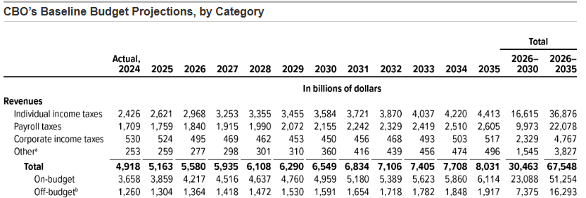

.font80[Source: [Congressional Budget Office](https://www.cbo.gov/publication/61172#_idTextAnchor040)]

<br><br><br>

<a class="weatherwidget-io" href="https://forecast7.com/en/39d47n84d75/45056/" data-label_1="OXFORD" data-label_2="WEATHER" data-theme="original" >OXFORD WEATHER</a>
<script>
!function(d,s,id){var js,fjs=d.getElementsByTagName(s)[0];if(!d.getElementById(id)){js=d.createElement(s);js.id=id;js.src='https://weatherwidget.io/js/widget.min.js';fjs.parentNode.insertBefore(js,fjs);}}(document,'script','weatherwidget-io-js');
</script>
.font80[Source: [Weather Widget's Forecast](https://weatherwidget.io/)]
</center>

]


---

## Microsoft's Missed Opportunity with Mobile Phones

.pull-left-2[

.font90[
> **Q**: People get passionate when Apple comes out with something new—the iPhone; of course ... **Is that something you'd want them to feel about Microsoft?**

<br>

> **A**: It's sort of a funny question. **Would I trade 96% of the market for 4%?** *(Laughter.)*  

> **I want to have products that appeal to everybody.** There's no chance that the iPhone is going to get any significant market share. **No chance.** It's a $500 subsidized item. They may make a lot of money. 

> But if you actually take a look at the 1.3 billion phones that get sold, **I'd prefer to have our software in 60% or 70% or 80% of them**, than I would **2% or 3%, which is what Apple might get**. 

]
]

.pull-right-2[
.center[


.font90[
Steve Ballmer, Former CEO of Microsoft in his infamous interview with [USA Today 2007](https://web.archive.org/web/20070502033654/https://www.usatoday.com/money/companies/management/2007-04-29-ballmer-ceo-forum-usat_N.htm)
]
]
]


---

## Microsoft's Missed Opportunity: Back of a Napkin Calc.

.pull-left[

.font90[

- Since Q1 2009, **Windows' Mobile OS's market share <= 2.5%**, and is now at 0.02% ([StatCounter](https://gs.statcounter.com/os-market-share/mobile/worldwide/#quarterly-200901-202601)).

- **Apple's Mobile iOS market share > 19%**, and is now at **29.12%** ([StatCounter](https://gs.statcounter.com/os-market-share/mobile/worldwide/#quarterly-200901-202601)).

- Apple's **iPhone revenues** from 2007 to 2025 was **$2.246 trillion** (per [statista](https://www.statista.com/statistics/263402/apples-iphone-revenue-since-3rd-quarter-2007/)).

- Assuming Microsoft could have captured just **5%** of Apple's market revenue $\rightarrow$ **$112 billion**.

- This estimate **excludes app store and brand value**, which will make the missed opportunity even larger.
]

]

.pull-right[


```{python market_share, echo=FALSE}
import pandas as pd
import matplotlib.pyplot as plt

mshare = pd.read_csv("https://gs.statcounter.com/os-market-share/mobile/worldwide/chart.php?device=Mobile&device_hidden=mobile&statType_hidden=os_combined&region_hidden=ww&granularity=quarterly&statType=Operating%20System&region=Worldwide&fromInt=200901&toInt=202601&fromQuarterYear=2009-01&toQuarterYear=2026-01&csv=1")

mshare['Date'] = pd.to_datetime(mshare['Date'])

ax = mshare.plot(
    x='Date',
    y=['Windows', 'iOS', 'Android'],
    kind='line',
    figsize=(6, 3.625),
    legend=True,
    linestyle='-',
    color=['red', 'black', 'gray'],
    alpha=0.7,
    linewidth=2,
    title="Mobile OS Market Share for Windows, iOS and Android (2009 - 2026)",
    xlabel="Date (Years)",
    ylabel="Market Share (%)",
    grid=True
)

plt.tight_layout(pad = 2.25)
plt.show()

```


<div style="margin-top:-30px;">

```{python apple_revenue, echo=FALSE}
import pandas as pd
import matplotlib.pyplot as plt
import matplotlib as mpl

apple_rev = pd.read_csv("../../data/statistic_id263402_apple-iphone-sales-revenue-2007-2025.csv")

apple_rev['date'] = pd.to_datetime(apple_rev['date'])
apple_rev['revenue'] = apple_rev['revenue'].str.replace(r',', '').astype(int)

ax = apple_rev.plot(
    x='date',
    y=['revenue'],
    kind='line',
    figsize=(6, 3.625),
    legend=True,
    linestyle='-',
    color=['black'],
    alpha=0.7,
    linewidth=2,
    title="Apple's iPhone Revenues (2007 - 2025)",
    xlabel="Date",
    ylabel="Revenues in Millions",
    grid=True
)

scatter = apple_rev.plot(
    x='date',
    y='revenue',
    kind='scatter',
    ax=ax,
    c='black',
    s=50,
    alpha=0.7,
    ylabel="Revenues in Millions",
    xlabel="Date (Years)",
    legend = False
)

scatter.yaxis.set_major_formatter(mpl.ticker.StrMethodFormatter('{x:,.0f}'))
plt.tight_layout(pad = 2.25)
plt.show()

```

</div>

]


---

## Other Real-World Forecasting Failures in Tech

.pull-left[
  .center[
  
  
  
 .font80[**IBM**: Missed the PC revolution.]  


 

  .font80[**Kodak**: Missed the digital camera revolution.]

]
]

.pull-right[
  .center[
  
  
  
  .font80[**Blockbuster**: Missed the streaming revolution.]
 

 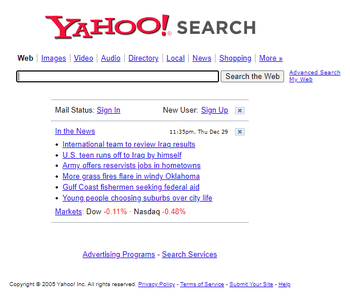
 
  .font80[**Yahoo**: Missed the search engine revolution.]
 
]

]


---

## Non-Tech Failures: Red Lobster's Endless Shrimp

.center[
  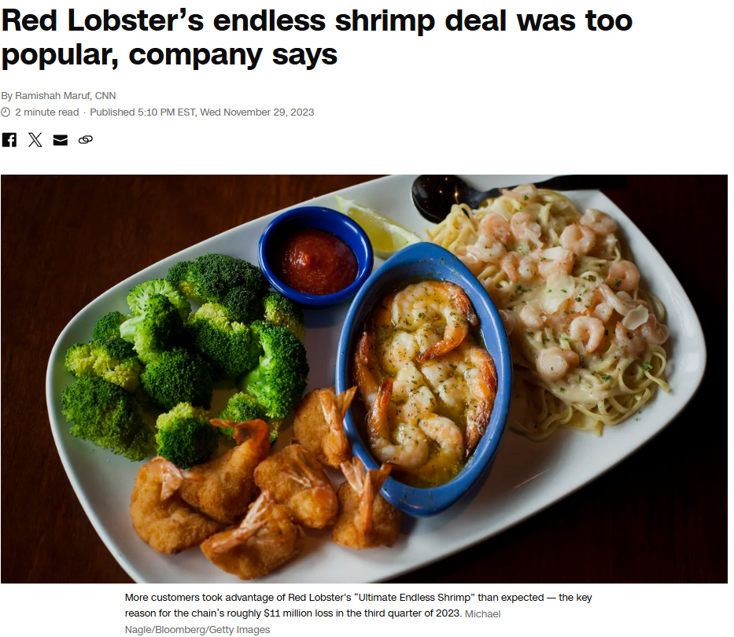
]


---

## Why Do These Stories Matter?

**(1) Forecasting Errors = Real Money Lost**  
  - **Microsoft**: $112 billion in potential mobile phone revenues.
  - **Target:** .bold[Overestimation] leads to unsold stock or overservicing (e.g., [Target's Stock Plunging by 21% due to lower profit and larger inventories](https://www.nytimes.com/2024/11/20/business/target-earnings-holiday-shopping.html?unlocked_article_code=1.sU4.BN7Y.DRvnq7F_52NO&smid=url-share)).
  - **Red Lobster**: $11M in losses due to .bold[underestimating] demand for their endless shrimp deal.

<br>

**(2) Course Relevance:**

This class will teach you how to identify .black[.bold[trends]], .black[.bold[seasonality]], and .black[.bold[cycles]], and .black[.bold[how to apply forecasting tools and models]] so you can **avoid these pitfalls** in your future roles. The goal is to allow you to make **data-driven forecasts**, not just gut-based decisions, and more importantly, be able to **quantify the uncertainty** in your forecasts.


---
class: inverse, center, middle

# Before we formalize forecasting, let’s try it


---

## Can you Avoid Common Forecasting Mistakes?

```{python motivating_example, include=FALSE}
import pandas as pd

import matplotlib.pyplot as plt
import matplotlib.dates as mdates

import numpy as np

np.random.seed(2025)

data = {
    "date": pd.date_range(start="2023-01-01", end="2025-12-01", freq="MS"),
    "hotel_occupancy": [
        350, 375, 400, 425, 475, 500, 525, 500, 475, 450, 425, 400,
        375, 400, 425, 450, 500, 525, 550, 525, 500, 475, 450, 425,
        400, 425, 450, 475, 525, 550, 575, 550, 525, 500, 475, 450,
    ]
}

# Convert to a DataFrame and add randomness
df_hotel = (
    pd.DataFrame(data)
    .assign(
        month=lambda x: x['date'].dt.month,
        month_name=lambda x: x['date'].dt.month_name(),
        hotel_occupancy=lambda x: x['hotel_occupancy']*10 + np.random.randint(-50, 50, size=len(x))
    )
)

# Create the plot with a hue for months
ax = df_hotel.plot(
    x='date',
    y='hotel_occupancy',
    kind='line',
    figsize=(14, 7),
    legend=False,
    linestyle='-',
    color='darkgray',
    alpha=0.7,
    linewidth=2,
    title="Simulated Monthly Room Occupancy Total (2023 - 2025)",
    xlabel="Date (Years)",
    ylabel="Hotel Occupancy (Rooms)",
    grid=True
)

# Overlay scatter plot using hue for each month
scatter = df_hotel.plot(
    x='date',
    y='hotel_occupancy',
    kind='scatter',
    ax=ax,
    c=df_hotel['month'],  # Use numeric month codes for coloring
    cmap=plt.get_cmap('Paired', 12),  # Use a color map with 12 colors
    s=50,
    alpha=0.7,
    legend = True
)


# Format x-axis to show all months and add space for the last dot
ax.set_xlim(
    [df_hotel['date'].min() - pd.DateOffset(months=1),
     df_hotel['date'].max() + pd.DateOffset(months=1)]
)
ax.set_ylim([3000, 6000])


# rename axes
ax.set_xlabel("Date")
ax.set_ylabel("Number of Occupied Hotel Rooms per Month")

plt.tight_layout(pad = 2.25)
plt.show()

df_hotel.to_csv("../../data/01_hotel_occupancy.csv", index=False)


# --------------------------------
# forecasting solution:
# --------------------------------
df_hotel = (
  pd.read_csv("../../data/01_hotel_occupancy.csv")
  .assign(
    date = lambda x: pd.to_datetime(x['date']),
    year = lambda x: x['date'].dt.year
    )
  )

# compute the average occupancy per year
yearly_avg = (
  df_hotel
  .groupby('year')['hotel_occupancy']
  .mean()
  )
  
# compute the year-over-year growth rate
yoy_growth = yearly_avg.pct_change().mean()

# filter the data for 2025
monthly_2025 = (
  df_hotel
  .query("year == 2025")
  )

# forecast the occupancy for 2025
forecast = pd.DataFrame({
    # generate the dates for 2026
    "date": pd.date_range(start="2026-01-01", end="2026-12-01", freq="MS"),
    # forecast the occupancy using the year-over-year growth rate for 2026
    "forecasted_occupancy": monthly_2025['hotel_occupancy'] * (1 + yoy_growth)
})


```

`r countdown(minutes = 7, seconds = 0, top = 0, font_size = "2em")`

.panelset[

.panel[.panel-name[Description]

  - **Scenario**: You are a business analyst at a hotel chain.  

  - **Problem**: You are tasked with forecasting hotel occupancy for the next 11 months.  

  - **Data**: You have access to the hotel's monthly room occupancy data from 2023 to 2025. Download the file from the [Week 01: Intro to Forecasting](https://miamioh.instructure.com/courses/250359/modules/924857) module. 

  - **Task:** .black[.bold[Without the use of any AI tools]], create a forecast for the hotel's occupancy for the next 12 months. The forecast can be made in Excel, R, or Python. .black[.bold[Document the process and the rationale behind your forecasts.]] 

  - **Non-graded Class Activity:** Briefly, input your logic for the 12-month forecast, and your quantitative forecast for **Janaury 2026** in the next 2 tabs, respectively.

]

.panel[.panel-name[Your Logic]

Use the editable text-box below to describe your logic for forecasting the hotel's occupancy for the next 12 months. Use bullet points to list your steps.

.can-edit.key-activity1_logic[

**Steps Taken to Generate the Forecasts:** .font70[(Insert below)]

  - Edit me  
  
  - ... 
  
  - ...
]

]

.panel[.panel-name[Your Sol]

- Input your solution for **January 2026** by using the QR code below.

```{r echo=FALSE, out.width='30%', fig.align='center'}

```

]

.panel[.panel-name[Class Results]

<div style="position: relative; padding-bottom: 400px; height: 0; overflow: hidden;">
  <iframe
    sandbox="allow-scripts allow-same-origin allow-presentation"
    allowfullscreen="true"
    allowtransparency="true"
    frameborder="0"
    src="https://www.mentimeter.com/app/presentation/alrufhucrqefifc266ma7ormoe6xntmw/embed"
    style="position: absolute; top: 0; left: 0; width: 100%; height: 100%;"
    width="800"
    height="375"></iframe>
</div>

]

.panel[.panel-name[Fadel's Logic]

<button type="button"
        onclick="xrToggle('hotel_logic')"
        aria-controls="hotel_logic"
        aria-expanded="false">
  Let us discuss how to approach such a problem
</button>

<div id="hotel_logic" style="display:none; margin-top:0.6rem;">
  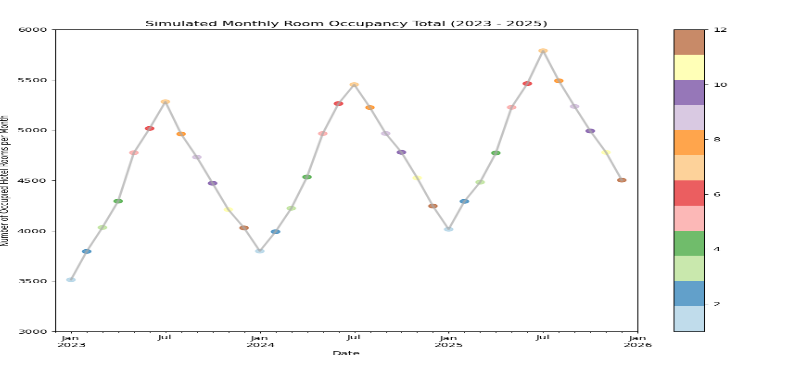
</div>


.can-edit.key-activity1_viz[

**Fadel's approach to this problem:** .font70[(To be discussed in class)]

  - Edit me  
  
  - ... 
  
  - ...
]


]


.panel[.panel-name[Fadel's Sol]

<details>
  <summary>Let us think of a reasonable solution, which assumes no prior time-series knowledge. </summary>

<small>

```{python 
import pandas as pd

df_hotel = (
  pd.read_csv("../../data/01_hotel_occupancy.csv")
  .assign(date = lambda x: pd.to_datetime(x['date']),
    year = lambda x: x['date'].dt.year  )  )

# plotting of the data hidden for brevity

# compute the average occupancy per year and year-over-year growth rate
yearly_avg = df_hotel.groupby('year')['hotel_occupancy'].mean()
yoy_growth = yearly_avg.pct_change().mean()

monthly_2025 = df_hotel.query("year == 2025") # filter the data for 2025

# forecast the occupancy for 2026
forecast = pd.DataFrame({
    "date": pd.date_range(start="2026-01-01", end="2026-12-01", freq="MS"),
    "forecasted_occupancy": (monthly_2025['hotel_occupancy'] * (1 + yoy_growth) ).round(0).astype(int)
})

forecast.iloc[0:2].reset_index(drop=True)


</small> </details>
```

]
]

---

class: inverse, center, middle

# Why was this Harder than it Looked?

---

## Good Forecasts Result from a Rigorous Process

<style>
:root { --miami-red: #C3142D; }

.process-row{
  display:flex;
  align-items:flex-start;
  justify-content:space-between;
  gap:1rem;
  margin-top:1.5rem;
}

.process-icon{
  width:72px;
  height:72px;
  stroke:var(--miami-red);
  fill:none;
  stroke-width:3;
  stroke-linecap:round;
  stroke-linejoin:round;
  margin-bottom:0.5rem;
}

.step-number{
  color:var(--miami-red);
  font-size:1.5rem;
  font-weight:700;
  line-height:1.1;
  margin-bottom:0.25rem;
}

.step-title{
  height: 5rem;      /* increase to 4.2rem if you have long 3-line titles */
  line-height: 1.15;
  margin: 0;           /* remove any default spacing */
  margin-top: 1rem;
}


.process-arrow{
  font-size:2rem;
  margin-top:1rem;
  color:var(--miami-red);
}

.process-step p{
  margin: 0;           /* important for alignment */
  margin-top: 2rem;  /* optional, consistent gap under the title */
  font-size: 1.25rem;
  line-height: 1.3;
}

</style>

<div class="process-row">

  <div class="process-step">
    <!-- 1) Magnifying glass with ? -->
    <svg class="process-icon" viewBox="0 0 64 64" role="img" aria-label="Problem definition icon">
      <circle cx="26" cy="26" r="16"></circle>
      <line x1="38" y1="38" x2="54" y2="54"></line>
      <path d="M23 22c0-3 2.4-5.4 5.4-5.4 2.8 0 5.1 2.1 5.4 4.8 0 3.5-3.2 3.8-4.7 5.6-.5.6-.7 1.2-.7 2.2"></path>
      <circle cx="28.4" cy="36.8" r="1.2" fill="var(--miami-red)" stroke="var(--miami-red)"></circle>
    </svg>

    <div class="step-number">1.<br>Problem Definition</div>
    <p>Understand how the forecasts will be used and who requires them.</p>
  </div>

  <div class="process-arrow" aria-hidden="true">→</div>

  <div class="process-step">
    <!-- 2) Document with plus + user -->
    <svg class="process-icon" viewBox="0 0 64 64" role="img" aria-label="Gathering information icon">
      <path d="M18 10h20l8 8v36H18z"></path>
      <path d="M38 10v8h8"></path>
      <line x1="24" y1="26" x2="38" y2="26"></line>
      <line x1="24" y1="32" x2="38" y2="32"></line>
      <line x1="28" y1="18" x2="28" y2="24"></line>
      <line x1="25" y1="21" x2="31" y2="21"></line>
      <circle cx="46" cy="34" r="4"></circle>
      <path d="M38 48c1.8-5 14.2-5 16 0"></path>
    </svg>

    <div class="step-number">2. Gathering Information</div>
    <p>Collect statistical data and the expertise of people involved.</p>
  </div>

  <div class="process-arrow" aria-hidden="true">→</div>

  <div class="process-step">
    <!-- 3) Chart with axes + line -->
    <svg class="process-icon" viewBox="0 0 64 64" role="img" aria-label="Preliminary analysis icon">
      <line x1="14" y1="50" x2="14" y2="14"></line>
      <line x1="14" y1="50" x2="54" y2="50"></line>
      <polyline points="18,44 28,36 36,40 46,28 54,22"></polyline>
      <circle cx="28" cy="36" r="1.5" fill="var(--miami-red)" stroke="var(--miami-red)"></circle>
      <circle cx="36" cy="40" r="1.5" fill="var(--miami-red)" stroke="var(--miami-red)"></circle>
      <circle cx="46" cy="28" r="1.5" fill="var(--miami-red)" stroke="var(--miami-red)"></circle>
    </svg>

    <div class="step-number">3. Preliminary Analysis</div>
    <p>Graph the data. Look for trends, seasonality, outliers, and patterns.</p>
  </div>

  <div class="process-arrow" aria-hidden="true">→</div>

  <div class="process-step">
    <!-- 4) Two simple gears (stylized) -->
    <svg class="process-icon" viewBox="0 0 64 64" role="img" aria-label="Choosing and fitting models icon">
      <!-- Gear 1 -->
      <circle cx="26" cy="34" r="8"></circle>
      <circle cx="26" cy="34" r="2.5"></circle>
      <line x1="26" y1="22" x2="26" y2="18"></line>
      <line x1="26" y1="50" x2="26" y2="46"></line>
      <line x1="14" y1="34" x2="10" y2="34"></line>
      <line x1="42" y1="34" x2="38" y2="34"></line>
      <line x1="18" y1="26" x2="15" y2="23"></line>
      <line x1="34" y1="42" x2="37" y2="45"></line>
      <line x1="34" y1="26" x2="37" y2="23"></line>
      <line x1="18" y1="42" x2="15" y2="45"></line>

      <!-- Gear 2 -->
      <circle cx="44" cy="20" r="6"></circle>
      <circle cx="44" cy="20" r="2"></circle>
      <line x1="44" y1="12" x2="44" y2="9"></line>
      <line x1="44" y1="31" x2="44" y2="28"></line>
      <line x1="36" y1="20" x2="33" y2="20"></line>
      <line x1="55" y1="20" x2="52" y2="20"></line>
      <line x1="39" y1="15" x2="37" y2="13"></line>
      <line x1="49" y1="25" x2="51" y2="27"></line>
      <line x1="49" y1="15" x2="51" y2="13"></line>
      <line x1="39" y1="25" x2="37" y2="27"></line>
    </svg>

    <div class="step-number">4. Choosing and Fitting Models</div>
    <p>Select and compare potential models based on the data and problem.</p>
  </div>

  <div class="process-arrow" aria-hidden="true">→</div>

  <div class="process-step">
    <!-- 5) Sync arrows with check -->
    <svg class="process-icon" viewBox="0 0 64 64" role="img" aria-label="Using and evaluating the model icon">
      <path d="M48 22a18 18 0 0 0-30-6"></path>
      <polyline points="18,14 18,24 28,24"></polyline>
      <path d="M16 42a18 18 0 0 0 30 6"></path>
      <polyline points="46,50 46,40 36,40"></polyline>
      <path d="M26 34l4 4 10-12"></path>
    </svg>

    <div class="step-number">5. Using and Evaluating the Model</div>
    <p>Generate forecasts and evaluate their accuracy once actual data becomes available.</p>
  </div>

</div>


---

## Before You Touch Data, Ask the Right Questions

### *A deeper look at Step 1: Problem Definition*


**Example scenario:** Forecasting for a manufacturing company. 

**Critical questions include:**

- **Granularity:** Do we need forecasts for every single product line, or for groups of products?

- **Aggregation:** Should we forecast for every sales outlet, for outlets grouped by region, or only for total sales?

- **Frequency:** Are we working with weekly, monthly, or annual data?

- **Horizon:**  Are forecasts needed for one month ahead, six months, or ten years?

.black[.bold[Time spent with the people who will use the forecasts is essential.]]


---

## Choosing the Correct Forecasting Approach 

**Key question:**  
Do you have relevant numerical information about the past?

- **No → Qualitative Forecasting**  
  Uses structured, judgment-based approaches when historical data is unavailable or irrelevant  
  (for example, a new product launch).

- **Yes → Quantitative Forecasting**  
  Appropriate when it is reasonable to assume that patterns from the past will persist into the future.
  

.black[.bold[The Correct Approach Depends on the Context of your Forecasting Problem.]] In this class, we will mainly focus on quantitative forecasting methods.

---

## How Will You Explain the Future?

.bold[Quantitative forecasting uses two main approaches to model the future.]

.pull-left[

**Time Series Models**

Uses past values of a variable to forecast its future values by extrapolating trends and seasonal patterns.

.font80[
$\text{Sales}_{t+1} = f(\text{Sales}_{t}, \ \text{Sales}_{t-1}, \ \text{Sales}_{t-2}, ...)$
]

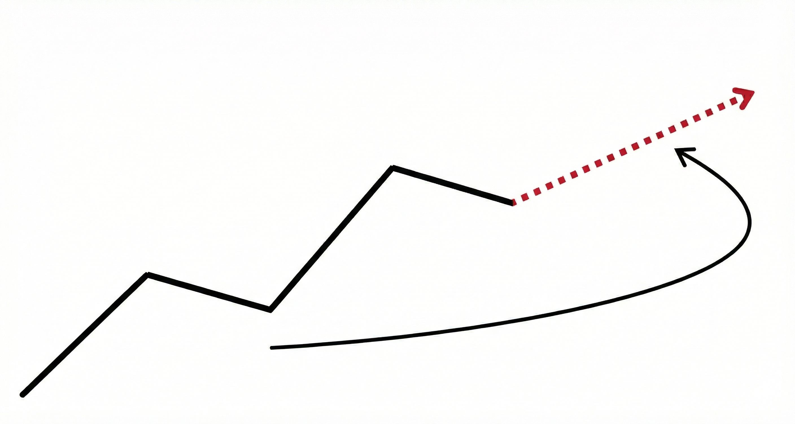

]


.pull-right[

**Explanatory Models**

Uses other related variables to explain and predict the target variable. Typically, we also include the past values of the target.

.font80[
$\text{Sales}_{t+1} = f(\text{Sales}_{t}, \ \text{Price}_{t}, \ \text{Advertising}_{t}, \ \text{CompetitorPrice}_{t}, ...)$
]

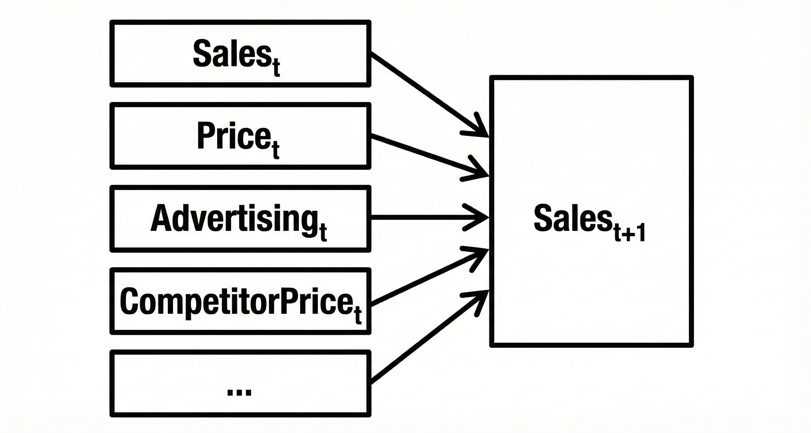

]

---

## The Heart of Forecasting: Data Observed Over Time

```{r annotated_aus_beer, echo=FALSE, out.width="95%", fig.alt="Annotation of the Australian Quarterly Beer Production, showing seasonal patterns and a stable trend"}
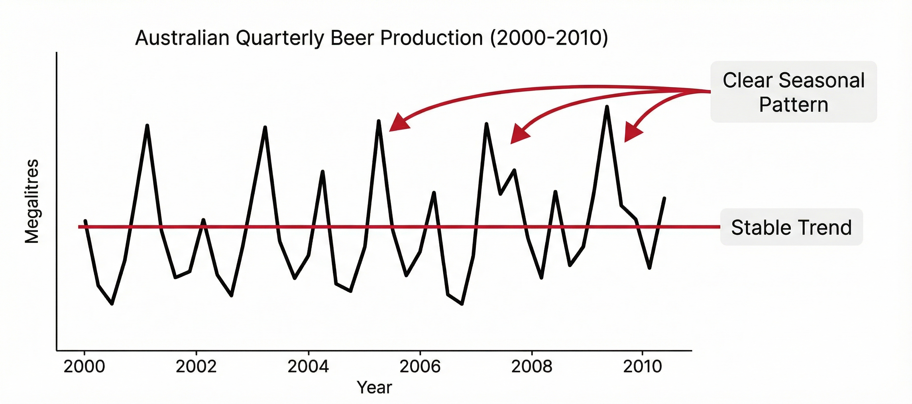
```


.center[.bold[Our goal is to choose a model that can capture these genuine patterns and project them into the future, while ignoring random fluctuations.]]


---

## The Best Forecast Is Not A number. It's A Distribution.

**Core Idea:** The future is inherently uncertain, so we should think of it as a random variable that can take a range of possible values. The set of these values and their associated probabilities form the **forecast distribution**.

```{r forecast_distribution, echo=FALSE, out.width="77%", fig.alt="Forecast distribution"}

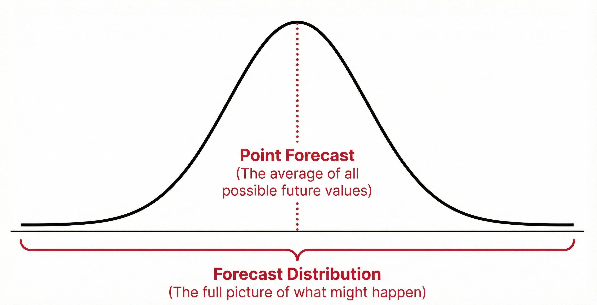

```


**Key Insight:** The further ahead we try to forecast, the wider the distribution becomes, reflecting the more uncertain we are.


---

## Embracing Uncertainty is the Mark of a Great Forecast[er]


```{r forecast_with_uncertainty, echo=FALSE, out.width="85%", fig.alt="Forecast with prediction intervals"}

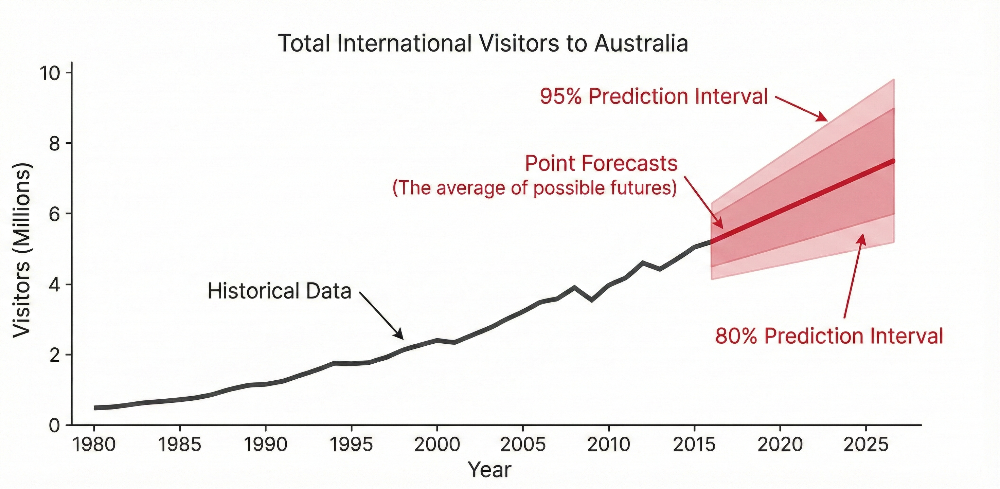

```


.bold[This is clarity. Not just what we think will happen, but a rigorous explanation of how confident we are in that prediction.]


---

## Reality is Complicated!!

.bold[The principles we have discussed are the tools needed to navigate the complexities of real-world forecasting challenges.]


<style>
:root { --miami-red: #C3142D; }

.case-row{
  display:flex;
  align-items:flex-start;
  justify-content:space-between;
  gap:2rem;
  margin-top:1.5rem;
}

.case-step{
  flex: 1 1 0;
  text-align:center;
}

.case-icon{
  width:84px;
  height:84px;
  stroke:var(--miami-red);
  fill:none;
  stroke-width:3;
  stroke-linecap:round;
  stroke-linejoin:round;
  margin-bottom:0.75rem;
}

.case-title{
  margin: 0;
  margin-top: 0.25rem;
  font-size: 1.5rem;
  line-height: 1.15;
  font-weight: 700;
}

.case-subtitle{
  margin: 0;
  margin-top: 0.35rem;
  font-size: 1.25rem;
  line-height: 1.2;
  font-weight: 600;
}

.case-step p{
  margin: 0;
  margin-top: 0.9rem;
  font-size: 1.15rem;
  line-height: 1.35;
}

.case-divider{
  width:1px;
  background: rgba(195, 20, 45, 0.25);
  align-self:stretch;
  margin-top: 0.25rem;
}
</style>

<div class="case-row">

  <div class="case-step">
    <!-- Tableware icon -->
    <svg class="case-icon" viewBox="0 0 64 64" role="img" aria-label="Tableware icon">
      <!-- plate -->
      <circle cx="26" cy="28" r="16"></circle>
      <circle cx="26" cy="28" r="10"></circle>
      <!-- stacked napkins -->
      <rect x="34" y="34" width="18" height="12" rx="2"></rect>
      <rect x="30" y="38" width="18" height="12" rx="2"></rect>
      <rect x="26" y="42" width="18" height="12" rx="2"></rect>
    </svg>

  <div class="case-title">Case 1</div>
  <div class="case-subtitle">Tableware Manufacturer</div>
  <p>Automating monthly forecasts for hundreds of items with diverse patterns (trends, seasonality, neither).</p>
  </div>

  <div class="case-divider" aria-hidden="true"></div>

  <div class="case-step">
    <!-- Rx bottle icon -->
    <svg class="case-icon" viewBox="0 0 64 64" role="img" aria-label="Pharmaceutical icon">
      <!-- bottle -->
      <rect x="20" y="18" width="24" height="36" rx="4"></rect>
      <rect x="18" y="10" width="28" height="10" rx="3"></rect>
      <!-- label band -->
      <line x1="20" y1="30" x2="44" y2="30"></line>
      <line x1="20" y1="38" x2="44" y2="38"></line>
      <!-- Rx -->
      <path d="M26 46v-8h4c3 0 5 2 5 4s-2 4-5 4h-4"></path>
      <line x1="35" y1="38" x2="40" y2="46"></line>
      <line x1="40" y1="38" x2="35" y2="46"></line>
    </svg>

  <div class="case-title">Case 2</div>
  <div class="case-subtitle">Pharmaceutical Benefits</div>
  <p>Models must handle trends and seasonality, but also be robust to sudden structural breaks from drug subsidies and competitor entry.</p>
  </div>

  <div class="case-divider" aria-hidden="true"></div>

  <div class="case-step">
    <!-- Airplane icon -->
    <svg class="case-icon" viewBox="0 0 64 64" role="img" aria-label="Airline icon">
      <!-- fuselage -->
      <path d="M10 34h20l22-10c3-1.4 6 0.6 6 3.6v0.8c0 2.2-1.3 4.2-3.3 5.1L30 44H10z"></path>
      <!-- tail -->
      <path d="M42 22l6-8h6l-4 10"></path>
      <!-- wing -->
      <path d="M24 34l-6-12h6l10 12"></path>
      <!-- rear wing -->
      <path d="M24 34l-8 10h6l10-10"></path>
    </svg>

  <div class="case-title">Case 3</div>
  <div class="case-subtitle">Airline Passenger Traffic</div>
  <p>Accounting for external shocks and irregular events like school holidays, major sporting events, pilot strikes, and competitor actions.</p>
  </div>

</div>


---

## From Chaos to Clarity: You have the Blueprint


<style>
:root { --miami-red: #C3142D; }

.journey-row{
  display:flex;
  align-items:flex-start;
  justify-content:space-between;
  gap:2.5rem;
  margin-top:1.5rem;
}

.journey-step{
  flex:1 1 0;
  position:relative;
}

.journey-title{
  color:var(--miami-red);
  font-size:2rem;
  font-weight:700;
  line-height:1.15;
  margin:0;
}

.journey-text{
  margin-top:0.75rem;
  font-size:1.25rem;
  line-height:1.35;
}

.chaos-box{
  border-left:6px solid var(--miami-red);
  padding-left:1rem;
}

.clarity-box{
  border-left:6px dashed var(--miami-red);
  padding-left:1rem;
}

.insight-box{
  border-left:6px solid var(--miami-red);
  padding-left:1rem;
}

.flow-arrow{
  flex:0 0 80px;
  display:flex;
  align-items:center;
  justify-content:center;
  font-size:3rem;
  color:var(--miami-red);
}

.footer-text{
  margin-top:2.5rem;
  text-align:center;
  font-size:1.5rem;
  font-weight:600;
}
</style>

<div class="journey-row">

  <div class="journey-step chaos-box">
    <div class="journey-title">We started in Chaos…</div>
    <div class="journey-text">
      …with a history of high-stakes guesswork and
      famous failed predictions.
    </div>
  </div>

  <div class="flow-arrow" aria-hidden="true">➜</div>

  <div class="journey-step clarity-box">
    <div class="journey-title">We found a Path to Clarity…</div>
    <div class="journey-text">
      …by defining the problem, understanding predictability,
      and following a rigorous 5-step process.
    </div>
  </div>

  <div class="flow-arrow" aria-hidden="true">➜</div>

  <div class="journey-step insight-box">
    <div class="journey-title">The Destination is Insight.</div>
    <div class="journey-text">
      …moving beyond single numbers to think in forecast
      distributions and embrace uncertainty.
    </div>
  </div>

</div>

<div class="footer-text">
  You now have the foundational framework.<br>
  You’re ready to build the models.
</div>

<br> 

**So, with this conceptual understanding, let us get moving.**


---
class: inverse, center, middle

# What Kind of Data are we Forecasting With? <br><br>(Types of Data Over Time and the Components of a Time Series)


---


## Cross-Sectional Data

**Cross-sectional data** captures multiple variables at a single point in time for each
observation; e.g., .bold[all the variables within a given observation] in the [DoL's LCA Disclosure Data for 2025 Q4](https://www.dol.gov/sites/dolgov/files/ETA/oflc/pdfs/LCA_Disclosure_Data_FY2025_Q4.xlsx) were collected simultaneously.

```{python cross_sectional, echo=FALSE, results='asis'}
import pandas as pd

df = (
  pd.read_excel(
    "../../data/LCA_Disclosure_Data_FY2025_Q3.xlsx",
    usecols=["RECEIVED_DATE", "EMPLOYER_NAME", "WORKSITE_CITY", "WORKSITE_STATE",
    "JOB_TITLE", "WAGE_RATE_OF_PAY_FROM", "WAGE_UNIT_OF_PAY", "WAGE_RATE_OF_PAY_TO"],
    nrows=10000
  )
  .query("WORKSITE_STATE == 'OH' and WAGE_UNIT_OF_PAY == 'Year'")
  .assign(
    RECEIVED_DATE = lambda x: pd.to_datetime(x['RECEIVED_DATE']),
    WAGE_RATE_OF_PAY_TO = lambda x: x['WAGE_RATE_OF_PAY_TO'].fillna(x['WAGE_RATE_OF_PAY_FROM']),
    )
  .drop(columns=["WAGE_RATE_OF_PAY_FROM", "WAGE_UNIT_OF_PAY", 'WORKSITE_CITY'])
  .rename(columns={"RECEIVED_DATE": "Date", "EMPLOYER_NAME": "Employer", "JOB_TITLE": "Job Title", "WAGE_RATE_OF_PAY_TO": "Salary"})
  .sort_values(by = "Date")
  .reset_index(drop=True)
  )
  
df.to_csv("../../data/01_cross_sectional_data.csv", index=False)

```

.font70[

```{r cross_sectional_print, echo=FALSE}
df = readr::read_csv("../../data/01_cross_sectional_data.csv")
DT::datatable(df, rownames = FALSE, options = list(pageLength = 7)) |> 
  DT::formatCurrency(columns = "Salary", currency = "$", digits = 0)
```

]

---

## Time Series Data

**Time series data** captures a single variable at multiple points in time; e.g., the [daily stock prices for Apple](https://finance.yahoo.com/quote/AAPL/history?p=AAPL) or our **simulated monthly hotel room occupancy** dataset.

```{python time_series, echo=FALSE, results='hide', fig.show='last'}
import pandas as pd
import matplotlib.pyplot as plt

df_hotel = (
  pd.read_csv("../../data/01_hotel_occupancy.csv")
  .assign(date = lambda x: pd.to_datetime(x['date']) )
  )

# Create the plot with a hue for months
ax = df_hotel.plot(
    x='date',
    y='hotel_occupancy',
    kind='line',
    figsize=(15,6),
    legend=False,
    linestyle='-',
    color='darkgray',
    alpha=0.7,
    linewidth=2,
    title="Simulated Monthly Room Occupancy Total (2022 - 2025)",
    xlabel="Date (Years)",
    ylabel="Hotel Occupancy (Rooms)",
    grid=True
)

# Overlay scatter plot using hue for each month
scatter = df_hotel.plot(
    x='date',
    y='hotel_occupancy',
    kind='scatter',
    ax=ax,
    c=df_hotel['month'],  # Use numeric month codes for coloring
    cmap=plt.get_cmap('Paired', 12),  # Use a color map with 12 colors
    s=50,
    alpha=0.7,
    legend = True
)


# Format x-axis to show all months and add space for the last dot
ax.set_xlim(
    [df_hotel['date'].min() - pd.DateOffset(months=1),
     df_hotel['date'].max() + pd.DateOffset(months=1)]
)
ax.set_ylim([3000, 6000])


# rename axes
ax.set_xlabel("Date")
ax.set_ylabel("Number of Occupied Hotel Rooms per Month")

plt.tight_layout(pad = 2.25)
plt.show()

```


---

## Panel Data

**Panel data** captures multiple variables at multiple points in time for each observation; e.g., the [Panel Study of Income Dynamics](https://psidonline.isr.umich.edu/) or the [World Bank's World Development Indicators](https://databank.worldbank.org/source/world-development-indicators).

.font80[
```{r wb, results='asis', echo=FALSE}
macroData = wbstats::wb_data(
  country = c('CN','EG','US'),
  indicator = c('NY.GDP.MKTP.KD.ZG', 'SP.DYN.LE00.IN', 
                'SH.DYN.NMRT', 'SH.HIV.INCD.ZS', 'SH.MED.BEDS.ZS', 
                'SH.MED.PHYS.ZS', 'SH.PRV.SMOK', 'SH.STA.TRAF.P5'),
  mrv = 10, return_wide = TRUE, gapfill = TRUE) |> 
  dplyr::select(-c(iso2c, country)) |> 
  dplyr::mutate_at(.vars = 3:10, ~round(., digits = 1))

DT::datatable(macroData,  
              extensions = "FixedColumns",
              options = list(pageLength = 7, dom = 'tip', scrollX='500px',
                             fixedColumns = list(leftColumns = 3)) ) 
```
]

.footnote[
<html>
<hr>
</html>

**Source:** Data queried from the [World Bank Data](https://datacatalog.worldbank.org/) using the [wbstats](https://cran.r-project.org/web/packages/wbstats/wbstats.pdf) `r fontawesome::fa('box', 'gold')` in R. The printed results show a snapshot of 7 variables (out of a much larger panel dataset). You can think of panel data as a cross-sectional dataset with a longitudinal/time component.
]


---

## Components of Time Series Data: Trend

- **Trend**: A long-term increasing or decreasing pattern over time.

- **Example**: The [US GDP](https://fred.stlouisfed.org/series/GDP) has a long-term upward trend.

```{r trend, echo=FALSE, fig.show='last'}
fredr::fredr(
  "GDP", observation_start = as.Date("2022-01-01"),
  observation_end = Sys.Date()
  ) |> 
  dplyr::mutate(
    month= lubridate::month(date, label = T) |> as.character(),
    value = value/1000
    ) -> gdp

color_mapper = c(
  "Jan" = "#1B9E77",  "Apr" = "#D95F02", "Jul" = "#7570B3", "Oct" = "#E7298A"
  )

gdp |> 
  ggplot2::ggplot(ggplot2::aes(x = date, y = value)) +
  ggplot2::geom_line(color = 'black', size = 1) +
  ggplot2::geom_point(ggplot2::aes(color = month), size = 3) +
  ggplot2::labs(title = "US GDP (2022 - 2025)", x = "Date", y = "GDP (Trillions of USD)") +
  ggplot2::theme_bw() +
  ggplot2::scale_y_continuous(labels = scales::dollar, breaks = scales::breaks_pretty(8)) +
  ggplot2::scale_x_date(date_labels = "%Y %b", breaks = scales::breaks_pretty(10)) +
  ggplot2::scale_color_manual(values = color_mapper) +
  ggplot2::theme(legend.position = "none")
```


---

## Components of Time Series Data: Seasonality

**Seasonality** refers to the property of a time series that displays REGULAR patterns that repeat at a constant frequency (*m*). For example, the [number of retail trade workers](https://fred.stlouisfed.org/series/CEU4200000001) has a seasonal pattern (with an upward trend).


```{r ecommerce, echo=FALSE, fig.show='last'}
retail_workers = tidyquant::tq_get(
  "CEU4200000001", from = "2022-01-01", to = Sys.Date(),
  get = 'economic.data') |> 
  dplyr::mutate(
    year = lubridate::year(date),
    month = lubridate::month(date, label = T) |> as.character(),
    price = price/1000
    )

colors = RColorBrewer::brewer.pal(12, "Set3")

# map colors to months
color_mapper = setNames(colors, unique(retail_workers$month))


retail_workers |> 
  ggplot2::ggplot(ggplot2::aes(x = date, y = price, group = year)) +
  ggplot2::geom_line(color = 'black', size = 1) +
  ggplot2::geom_point(ggplot2::aes(color = month), size = 3) +
  ggplot2::labs(title = "Number of Retail Trade Workers in the U.S.", x = "Date", y = "Millions of Workers") +
  ggplot2::theme_bw() +
  ggplot2::scale_y_continuous(breaks = scales::breaks_pretty(8)) +
  ggplot2::scale_x_date(date_labels = "%Y %b", breaks = scales::breaks_pretty(10)) +
  ggplot2::scale_color_manual(values = color_mapper) +
  ggplot2::theme(legend.position = "none")
```


---

## Components of Time Series Data: Multiple Seasonality

**Multiple seasonality** refers to the property of a time series that displays multiple seasonal patterns that repeat at different frequencies. 


```{python multiple_seasonality, echo=FALSE, fig.show='last'}

import pandas as pd
import matplotlib.pyplot as plt

# Define file paths for the three datasets
file_paths = [
    '../../data/Actual_Hourly_Loads_by_Class_2022_20230307.xlsx',
    '../../data/Actual_Hourly_Loads_by_Class_2023_20240507.xlsx',
    '../../data/Actual_Hourly_Loads_by_Class_2024.xlsx',
    "../../data/Actual_Hourly_Loads_by_Class_2025.xlsx"
]

# Function to process each file and extract relevant columns
def process_file(file_path):
    data = pd.read_excel(file_path, sheet_name='Total Usage', header=1)
    selected_data = data[['REPORT DAY', 'HOUR ENDING', 'TOTAL']]
    selected_data.columns = ['Date', 'Hour', 'Total Usage']
    selected_data['Date'] = pd.to_datetime(selected_data['Date'])
    selected_data['Weekday'] = selected_data['Date'].dt.day_name()
    selected_data['Month'] = selected_data['Date'].dt.strftime('%b')
    return selected_data

# Combine all datasets
all_data = pd.concat([process_file(file_path) for file_path in file_paths])

# Aggregate data for plotting
hourly_usage = all_data.groupby('Hour')['Total Usage'].mean()

weekday_order = ['Monday', 'Tuesday', 'Wednesday', 'Thursday', 'Friday', 'Saturday', 'Sunday']
weekday_usage = all_data.groupby('Weekday')['Total Usage'].mean().reindex(weekday_order)

month_order = ['Jan', 'Feb', 'Mar', 'Apr', 'May', 'Jun', 'Jul', 'Aug', 'Sep', 'Oct', 'Nov', 'Dec']
monthly_usage = all_data.groupby('Month')['Total Usage'].mean().reindex(month_order)


# Plot the data
plt.figure(figsize=(15, 6.5))

# Daily seasonality (within day)
plt.subplot(3, 1, 1)
plt.plot(hourly_usage.index, hourly_usage.values, marker='o', color='orange')
plt.title('Hourly Seasonality: Average Total Usage by Hour')
plt.xlabel('Hour of the Day')
plt.ylabel('Average Total Usage')
plt.grid(True)

# Weekly seasonality (day of week)
plt.subplot(3, 1, 2)
plt.plot(weekday_usage.index, weekday_usage.values, marker='o', color='blue')
plt.title('Day-of-Week Seasonality: Average Total Usage by Day of Week')
plt.xlabel('Day of the Week')
plt.ylabel('Average Total Usage')
plt.grid(True)

# Monthly seasonality (month of year)
plt.subplot(3, 1, 3)
plt.plot(monthly_usage.index, monthly_usage.values, marker='o', color='green')
plt.title('Monthly Seasonality: Average Total Usage by Month')
plt.xlabel('Month')
plt.ylabel('Average Total Usage')
plt.grid(True)

# Add a caption
plt.figtext(0.5, 0.01, 'Data Source: Duke Energy, https://www.duke-energyohiocbp.com/Documents/LoadandOtherData.aspx, downloaded and charted on Jan 20, 2026 ', wrap=True, horizontalalignment='center', fontsize=8)

# Show the plots
plt.tight_layout(pad = 4)
plt.suptitle("Multiple Seasonality Patterns (Daily, Weekly & Monthly) in Duke Energy's 2022-2025 Consumption Data")
plt.show()

```


---

## Components of Time Series Data: Cycles

**Cycles** refer to the property of a time series that displays irregular patterns that repeat at irregular frequencies. For example, the [US Total Vehicle Sales](https://fred.stlouisfed.org/series/TOTALSA) has business cycles that are influenced by economic conditions and advancements in vehicle technologies.


```{r cycles, echo=FALSE, fig.show='last'}
fredr::fredr(
  "TOTALSA", observation_start = as.Date("1976-01-01"),
  observation_end = Sys.Date()
  ) |> 
  dplyr::mutate(
    month= lubridate::month(date, label = T) |> as.character(),
    ) -> vehicle_sales

vehicle_sales |> 
  ggplot2::ggplot(ggplot2::aes(x = date, y = value)) +
  ggplot2::geom_line(color = 'black') +
  ggplot2::labs(title = "US Total Vehicle Sales (1976 - 2025)", x = "Date", y = "Number of Vehicles Sold") +
  ggplot2::theme_bw() +
  ggplot2::scale_y_continuous(breaks = scales::breaks_pretty(8)) +
  ggplot2::scale_x_date(date_labels = "%Y %b", breaks = scales::breaks_pretty(10)) +
  # ggplot2::stat_smooth(method = "gam", se = F, color = "red") +
  ggplot2::theme(legend.position = "none")

```


---

## Components of Time Series Data: Cycles

**Cycles** refer to the property of a time series that displays irregular patterns that repeat at irregular frequencies. For example, the [US Total Vehicle Sales](https://fred.stlouisfed.org/series/TOTALSA) has business cycles that are influenced by economic conditions and advancements in vehicle technologies.


```{r cycles2, echo=FALSE, fig.show='last'}
vehicle_sales |> 
  ggplot2::ggplot(ggplot2::aes(x = date, y = value)) +
  ggplot2::geom_line(color = 'black') +
  ggplot2::labs(title = "US Total Vehicle Sales (1976 - 2025)", x = "Date", y = "Number of Vehicles Sold") +
  ggplot2::theme_bw() +
  ggplot2::scale_y_continuous(breaks = scales::breaks_pretty(8)) +
  ggplot2::scale_x_date(date_labels = "%Y %b", breaks = scales::breaks_pretty(10)) +
  ggplot2::stat_smooth(method = "gam", se = F, color = "red") +
  ggplot2::theme(legend.position = "none")

```


---

# Kahoot Competition #01

To assess your understanding and retention of the topics covered so far, you will **compete in a Kahoot competition (consisting of 5 questions)**:  

- Go to <https://kahoot.it/>  

- Enter the game pin, which will be shown during class

- Provide your first (preferred) and last name

- Answer each question within the allocated 20-second window (**fast and correct answers provide more points**)

<br>

**Winning the competition involves having as many correct answers as possible AND taking the shortest duration to answer these questions.** The winner `r fontawesome::fa(name = 'trophy', fill = 'gold')` of the competition will receive a **0.15 bonus on Assignment 01**. Good luck!!!

.footnote[
<html>
<hr>
</html>

**P.S:** The Kahoot competition will have **no impact on your grade**. It is a **fun** way of assessing your knowledge, motivating you to ask questions about topics covered that you do not have a full understanding of it, and providing me with some data that I can use to pace today's class. 
]


---

class: inverse, center, middle

# The Data Generating Process

---

## The Idea of a Data Generating Process (DGP)

- A **time series** is defined as a **sequence of observations** recorded at regular time intervals.

- Any time series is generated by some kind of mechanism, which is often referred to as a **data generating process (GDP)**. For example, the hotel occupancy dataset is impacted by:   
  - .black[.bold[season]], .black[.bold[holidays]], .black[.bold[economic conditions]], and .black[.bold[marketing campaigns]];  
  - .black[.bold[number of rooms]], .black[.bold[room rates]], and .black[.bold[customer satisfaction]];   
  - .black[.bold[weather]], .black[.bold[local events]], and .black[.bold[competition]]; and 
  - .black[.bold[number of rooms already booked]], .black[.bold[room cancellations]], and .black[.bold[no-shows]].

- The **DGP** is the **underlying theoretical mechanism** that generates the data we observe.  
   - Accounts for both systematic patterns (e.g., trend, seasonality) and randomness.    
- **But**: In real-world settings, there is often **no perfectly known** DGP.    
  - Any formula or model we write is an approximation of the **unknowable “truth.”**  

---

## Model vs. Reality — The Map Analogy for DGPs

.pull-left[
- **A map ≠ the territory**:  
  - We use maps to navigate, but they are always simplified.  
  - Similarly, a forecast model ≠ reality—it is a *purposeful* simplification.

- **Different maps for different needs**:  
  - A tourist map highlights landmarks, while a transportation map focuses on roads to inform navigation.  
  - Each addresses *specific* questions, just as we build different forecasting models for different objectives.
]


.pull-right[
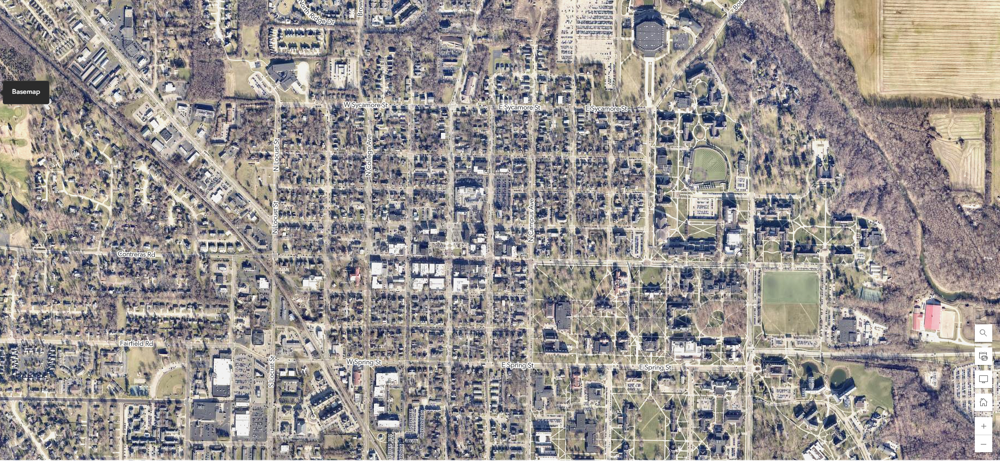

<br>

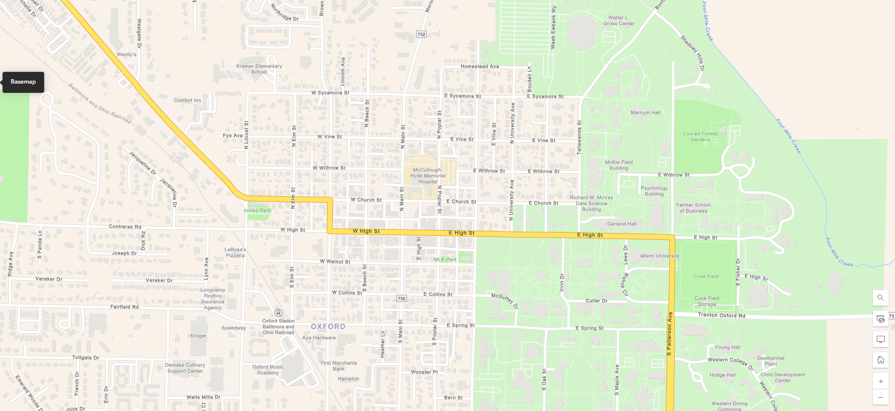
]

---

## Why Use DGPs If They Do not Actually Exist?

**(1) Guiding Principle:**    
   - Thinking in terms of a *hypothetical* DGP helps us design or select reasonable model structures.  
   - E.g., we incorporate domain insights: “Does our hotel occupancy data show strong seasonality?”

**(2) Clarifying Assumptions:**    
   - Even if the DGP is not known, stating assumptions (e.g., no trend, constant variance) makes our models testable and improvable.

**(3) Iterative Refinement:**    
   - As new data contradict our assumptions, we adjust our “map” of reality.  
   - In forecasting, we continually update models to capture changing conditions.


---

## Key DGP Takeaways

- **All Models Are Wrong…**  
  - ...but some are *useful* for forecasting, planning, or decision-making.

- **The DGP Is a Useful Fiction**  
  - We talk about it to structure our thinking.  
  - We never truly “see” it; we only see **data**.

- **Practical Implication**  
  - A good model is *close enough* to guide accurate forecasts.  
  - Remain aware of model limitations and be ready to adapt.


---

class: inverse, center, middle

# "What Can (and Can not) We Forecast?"

---

## Rank these Scenarios in Terms of Forecastability

`r countdown(minutes = 2, seconds = 0, top = 0, font_size = "2em")`

.panelset[

.panel[.panel-name[Description]

- **Rank** each scenario (in the next tab) from **easiest** (1) to **hardest** (6) to predict.   

- **Submit** your ranking by clicking [here](https://www.menti.com/al4qbc8hg3jn)

]

.panel[.panel-name[Scenarios]

- `r fontawesome::fa("money-bill-wave", fill="#2ecc71")` **Lottery winning numbers for next weekend**    

- `r fontawesome::fa("sun", fill="#f1c40f")` **Sunrise time in Oxford, Ohio on January 1, 2026**  

- `r fontawesome::fa("thermometer-half", fill="#e74c3c")` **Maximum temperature in Oxford, Ohio tomorrow**  

- `r fontawesome::fa("bolt", fill="#9b59b6")` **Daily electricity demand in 3 days**  

- `r fontawesome::fa("chart-line", fill="#3498db")` **Google's stock price in 1 week**   

- `r fontawesome::fa("chart-line", fill="#3498db")` **Google's stock price in 1 year**

]

.panel[.panel-name[Class Results]


<div style="position: relative; padding-bottom: 400px; height: 0; overflow: hidden;">
  <iframe
    sandbox="allow-scripts allow-same-origin allow-presentation"
    allowfullscreen="true"
    allowtransparency="true"
    frameborder="0"
    src="https://www.mentimeter.com/app/presentation/alrufhucrqefifc266ma7ormoe6xntmw/embed"
    style="position: absolute; top: 0; left: 0; width: 100%; height: 100%;"
    width="800"
    height="375"></iframe>
</div>


]

]

---

## Relating It Back to the DGP

- **Different Types of DGPs**  
  1. **Deterministic (or nearly so)**: Sunset times, tidal schedules.  
  2. **Complex & Partly Stochastic**: Weather, financial markets.  
  3. **Pure Randomness**: Lottery draws.

- **Key Lesson**  
  - *All* these processes have a DGP—some are more “knowable” than others.  
  - *Forecastability* depends on how much of that DGP is deterministic vs. random and how well we can model it.
  

---

class: inverse, center, middle

# Recap

---

## Summary of Main Points

By now, you should be able to do the following:  

.font90[
- **Explain why forecasting is both valuable and difficult**, using real-world business and policy examples.

- **Recognize the fundamental limits of forecasting**, including uncertainty, randomness, and the difference between prediction and explanation.

- **Distinguish forecasting problems from other analytics tasks**, such as regression and classification, and explain why time ordering matters.

- **Identify what types of phenomena are forecastable and which are not**, based on the presence or absence of systematic structure.

- **Describe the core components of a time series**, including trend, seasonality, and noise.

- **Explain the concept of a data-generating process (DGP)** and why forecasting models aim to approximate processes rather than predict exact outcomes.

- **Interpret forecasts as distributions rather than single-point guesses**, and articulate why this perspective is essential for decision-making.
]


---

## 📝 Review and Clarification 📝

.pull-left[

1. **Class Notes**: Take some time to revisit your class notes for key concepts.  

2. **Zoom Recording**: Recording will be made available on Canvas ~ 3-4 hours after class.  

3. **Reference Textbook**: [Chapter 01 of FPPPy](https://otexts.com/fpppy/nbs/01-intro.html) provides a comprehensive overview of the topics covered today.

3. **Review AI Recaps:** Generated from the reference chapter and are meant to reinforce most of the same core ideas.

4. **Questions**: Do not pile up. Ask in real-time, email or come to office hours.

]

.pull-right[

**📺 Slide Deck Video (click to play)**
<iframe width="100%" height="230"
src="https://www.youtube.com/embed/lfPB8lH7UcE?si=uVeIfJhXq5idJqAi"
title="NotebookLM Slide Deck Review"
frameborder="0"
allow="accelerometer; clipboard-write; encrypted-media; gyroscope; picture-in-picture"
allowfullscreen>
</iframe>

<br>

**🎧 Slide Deck Podcast (click to play)**
<iframe src="https://drive.google.com/file/d/1bASIDZyUQBPa2uZDwB-fWqQJ0-qnQxgu/preview"
width="100%" height="70"
allow="clipboard-write">
</iframe>

]


---

## 📖 Recommended Readings: 🐍 Python Prep 📖


#### 🐍 Optional Python Prep

- [Data Structures](https://docs.python.org/3/tutorial/datastructures.html)


---

## 📖 Recommended Reading: LLM Prep 📖

.pull-left[
.font90[
#### 🤖 LLM Prep (Scan for main concepts)
- [A Very Gentle Introduction to Large Language Models without the Hype](https://mark-riedl.medium.com/a-very-gentle-introduction-to-large-language-models-without-the-hype-5f67941fa59e)
]
]

.pull-right[
.font90[
**📺 Optional Video (LLM Prep)**  
<iframe width="100%" height="260"
src="https://www.youtube.com/embed/F5Gs6-C0DiA?autoplay=0"
title="LLM Prep Review Video"
frameborder="0"
allow="accelerometer; clipboard-write; encrypted-media; gyroscope; picture-in-picture"
allowfullscreen>
</iframe>
]
]

---

## 🎯 Assignment 🎯

- Complete [Assignment 01](https://miamioh.instructure.com/courses/250359/quizzes/776091) on Canvas to reinforce your understanding of today's class.

<div style="background: #fefce8; border-left: 4px solid #facc15; padding: 18px 22px; margin-bottom: 25px; border-radius: 0 8px 8px 0;"><strong>Before You Begin:</strong><p style="margin: 10px 0 0 0; font-size: 14px; color: #451a03;">This assignment has two parts. Make sure you have reviewed the materials below.</p><ul style="margin: 12px 0 0 0; padding-left: 20px; font-size: 14px; color: #451a03;"><li><strong style="color: #000;">Recommended review for Class 01:</strong><ul style="margin: 8px 0 0 0; padding-left: 20px;"><li><strong style="color: #000;">Slide deck</strong></li><li><strong style="color: #000;">Reference Textbook:</strong> <a style="color: #2563eb; text-decoration: underline;" href="https://otexts.com/fpppy/nbs/01-intro.html" target="_blank" rel="noopener">Chapter 01 of FPPPy</a> provides a comprehensive overview of the topics covered today.</li><li><strong style="color: #000;">Zoom recording</strong></li></ul></li><li style="margin-top: 12px;"><strong style="color: #000;">NotebookLM GenAI Summaries</strong> <span style="font-size: 13px; color: #451a03;">(optional, but a different way to engage with the material)</span>:<ul style="margin: 8px 0 0 0; padding-left: 20px;"><li><a style="color: #2563eb; text-decoration: underline;" href="https://youtu.be/lfPB8lH7UcE" target="_blank" rel="noopener">01_BI__Data_to_Decisions.mp4</a> <span style="font-size: 13px; color: #451a03;">(7-minute video highlight)</span></li><li><a style="color: #2563eb; text-decoration: underline;" href="https://drive.google.com/open?id=1bASIDZyUQBPa2uZDwB-fWqQJ0-qnQxgu&usp=drive_fs" target="_blank" rel="noopener">01_From_Sheep_Liver_to_Forecasting_Algorithms.m4a</a> <span style="font-size: 13px; color: #451a03;">(~15-minute explanation in a podcast fashion; you may want to download first)</span></li></ul></li><li style="margin-top: 14px;"><strong style="color: #000;">Recommended Warmup for Class 02:</strong><ul style="margin: 8px 0 0 0; padding-left: 20px;"><li><strong>Python Data Structures:</strong> <a style="color: #2563eb; text-decoration: underline;" href="https://docs.python.org/3/tutorial/datastructures.html" target="_blank" rel="noopener">https://docs.python.org/3/tutorial/datastructures.html</a> <span style="font-size: 13px; color: #451a03;">(a bit dry, but I recommend scanning it)</span></li><li><strong>LLM Usage Prep:</strong><ul style="margin: 8px 0 0 0; padding-left: 20px;"><li>Scanning the <a style="color: #2563eb; text-decoration: underline;" href="https://mark-riedl.medium.com/a-very-gentle-introduction-to-large-language-models-without-the-hype-5f67941fa59e" target="_blank" rel="noopener">A Very Gentle Introduction to Large Language Models without the Hype</a> Medium article</li><li>Watching its <strong>10-minute</strong> NotebookLM GenAI Video Summary that I created based on it: <a style="color: #2563eb; text-decoration: underline;" href="https://youtu.be/F5Gs6-C0DiA" target="_blank" rel="noopener">https://youtu.be/F5Gs6-C0DiA</a></li></ul></li></ul></li></ul></div>