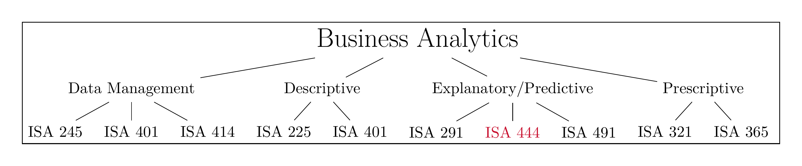
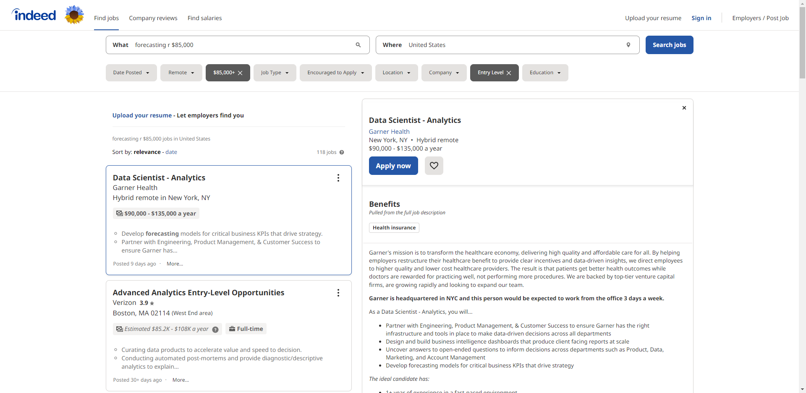
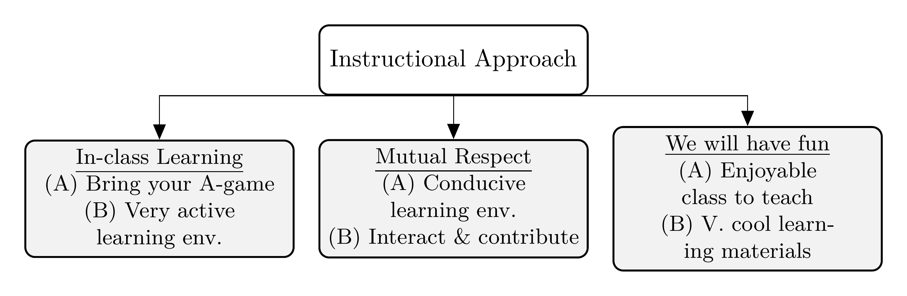
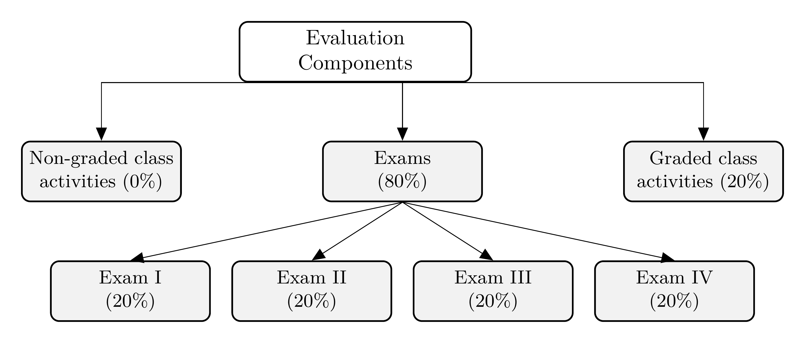
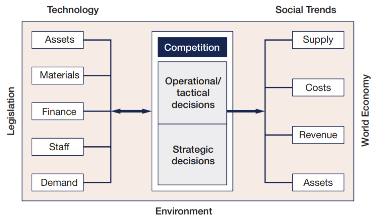

```{r setup, include=FALSE}
knitr::opts_chunk$set(cache = TRUE,
                      echo = TRUE,
                      warning = FALSE,
                      message = FALSE,
                      progress = FALSE, 
                      verbose = FALSE,
                      dev = 'png',
                      fig.height = 2.75,
                      dpi = 300,
                      fig.align = 'center')

options(htmltools.dir.version = FALSE)


miamired = '#C3142D'

if(require(pacman)==FALSE) install.packages("pacman")
if(require(devtools)==FALSE) install.packages("devtools")
if(require(countdown)==FALSE) devtools::install_github("gadenbuie/countdown")
if(require(xaringanExtra)==FALSE) devtools::install_github("gadenbuie/xaringanExtra")
if(require(urbnmapr)==FALSE) devtools::install_github('UrbanInstitute/urbnmapr')
if(require(emo)==FALSE) devtools::install_github("hadley/emo")

pacman::p_load(tidyverse, magrittr, lubridate, janitor, # data analysis pkgs
               DataExplorer, scales, plotly, calendR, pdftools, # plots
               tmap, sf, urbnmapr, tigris, # maps
               bibliometrix, # for bibliometric analysis of my papers
               gifski, av, gganimate, ggtext, glue, extrafont, # for animations
               emojifont, emo, RefManageR, xaringanExtra, countdown) # for slides
```

```{r xaringan-themer, include=FALSE, warning=FALSE}
if(require(xaringanthemer) == FALSE) install.packages("xaringanthemer")
library(xaringanthemer)

style_mono_accent(base_color = "#84d6d3",
                  base_font_size = "20px")

xaringanExtra::use_extra_styles(
  hover_code_line = TRUE,         
  mute_unhighlighted_code = TRUE  
)

xaringanExtra::use_xaringan_extra(c("tile_view", "animate_css", "tachyons", "panelset", "broadcast", "share_again", "search", "fit_screen", "editable", "clipboard"))

```


# Learning Objectives for Today's Class

- Describe **course motivation** and **structure**.  

- Explain the differences between **cross sectional**, **time series** and **panel** datasets.

- Describe the **components of time series** datasets.    

- Explain the **forecasting steps**. 


---
class: inverse, center, middle

# Course Motivation and Structure

---

# The Analytics Journey: Pre-analytics

**Pre-Analytics/Data Management:** where one attempts to **extract** the needed *data* for analysis.

--

```{r clothing_sales_data, echo=FALSE}
if(require(tidyverse)==F) install.packages('tidyverse') # install if needed
if(require(DT)==F) install.packages('DT') # install if needed

# read & print data from https://fred.stlouisfed.org/series/RSCCASN (1992-2022)
clothing_sales = readr::read_csv('https://tinyurl.com/isa444class01') 

DT::datatable(clothing_sales, options = list(pageLength = 6)) |> 
  DT::formatDate(columns = 'DATE',  method =  "toLocaleDateString",
                 params = list(
                   'en-US', 
                   list(
                     year = 'numeric', 
                     month = 'short')
                 )
  ) |> 
  DT::formatCurrency(columns = 'RSCCASN', digits = 0, currency = '')
```


---

# The Analytics Journey: Descriptive

`r countdown(minutes = 3, seconds = 0, top = 0, font_size = "2em")`

**Descriptive Analytics:** where one attempts to **understand** the data through **visualizations**, **descriptive statistics**, and **exploratory statistical models**.

.panelset[

.panel[.panel-name[Activity]

> Over the next 3 minutes, please identify what you have learned from the charts in each tab.

  - Write down your answers in the last tab (it is editable).  
  
  - Discuss your answers with your neighboring classmates.  
  
  - Be prepared to share these answers with class.

]

.panel[.panel-name[Viz 1]
```{r clothing_sales_viz1, echo=FALSE, fig.height = 2.5}
clothing_sales = 
  clothing_sales |> 
  dplyr::mutate(DATE = lubridate::ymd(DATE),
                YEAR = as.factor(lubridate::year(DATE)))

static_plot = 
  clothing_sales |> 
  dplyr::filter(DATE >= lubridate::ymd('2016-01-01')) |> 
  ggplot2::ggplot(
    ggplot2::aes(x = DATE, y = RSCCASN) 
  ) +
  ggplot2::geom_line(color = 'darkgray') +
  ggplot2::scale_x_date(breaks = scales::pretty_breaks(n = 10)) +
  ggplot2::scale_y_continuous(
    breaks = scales::pretty_breaks(n = 8),
    labels = scales::dollar) +
  ggplot2::scale_color_brewer(palette = 'Greys') +
  ggplot2::theme_bw() +
  ggplot2::theme(
    legend.position = 'none',
    panel.grid = ggplot2::element_blank()
    ) +
  ggplot2::labs(
    x = 'Time', y = 'Sales in Millions of Dollars',
    title = 'Advance Retail Sales: Clothing and Clothing Accessory Stores (RSCCASN)',
    caption = "Data Source: FRED's RSCCASN Time Series"
  )

static_plot
  
```
]


.panel[.panel-name[Viz 2]
```{r clothing_sales_viz2, echo=FALSE, out.height='200px', out.width='700px', cache=FALSE}
plotly::ggplotly(
  static_plot,
  tooltip = c("x", "y")
)
  
```
]


.panel[.panel-name[Viz 3]
```{r clothing_sales_viz3, echo=FALSE, out.height='200px', out.width='700px', cache=FALSE}
static_plot = static_plot + ggplot2::geom_point(color = miamired, size = 2)

plotly::ggplotly(
  static_plot,
  tooltip = c("x", "y")
)
  
```
]


.panel[.panel-name[Viz 4]
```{r clothing_sales_viz4, echo=FALSE, out.height='200px', out.width='700px', cache=FALSE}
static_plot = 
  clothing_sales |> 
  dplyr::filter(DATE >= lubridate::ymd('2016-01-01')) |> 
  ggplot2::ggplot(
    ggplot2::aes(x = DATE, y = RSCCASN, group = YEAR) 
  ) +
  ggplot2::geom_point(color = miamired, size = 2) +
  ggplot2::geom_line(color = 'darkgray') +
  ggplot2::scale_x_date(breaks = scales::pretty_breaks(n = 10)) +
  ggplot2::scale_y_continuous(
    breaks = scales::pretty_breaks(n = 8),
    labels = scales::dollar) +
  ggplot2::scale_color_brewer(palette = 'Greys') +
  ggplot2::theme_bw() +
  ggplot2::theme(
    legend.position = 'none',
    panel.grid = ggplot2::element_blank()
    ) +
  ggplot2::labs(
    x = 'Time', y = 'Sales in Millions of Dollars',
    title = 'Advance Retail Sales: Clothing and Clothing Accessory Stores (RSCCASN)',
    caption = "Data Source: FRED's RSCCASN Time Series"
  )

plotly::ggplotly(
  static_plot,
  tooltip = c("x", "y")
)
  
```
]

.panel[.panel-name[Key Points]

.can-edit.key-activity1_viz[

**Main Insight(s):** .font70[(Insert below)]

  - Edit me  
  
  - ... 
  
  - ...
]
]

]


---
count: false

# The Analytics Journey: Descriptive

**Descriptive Analytics:** where one attempts to **understand** the data through **visualizations**, **descriptive statistics**, and **exploratory statistical models**.

```{r clothing_sales, echo=FALSE}
clothing_ts = ts(clothing_sales$RSCCASN, frequency = 12, start = c(1992,1))

decomposed_ts = decompose(clothing_ts)

decomposed_tibble = tibble::tibble(
  Month = lubridate::month(clothing_sales$DATE, label = T) |> unique(),
  `Seasonal Factor` = decomposed_ts$figure
)

DT::datatable(decomposed_tibble, rownames = F, options = list(pageLength = 6)) |> 
  DT::formatRound(columns = 'Seasonal Factor')
```


---

# The Analytics Journey: Predictive

**Predictive Analytics:** where **statistical** and **machine learning** models are used to help us utilize independent variable[s] to predict an outcome variable of choice.  

```{r forecast, out.height='250px', out.width='600px', echo=FALSE, cache=FALSE}
hw_model = forecast::hw(y = clothing_ts, h = 12, level = 95, initial = 'simple')

clothing_df = 
  tibble::tibble(
    date = seq.Date(from = min(clothing_sales$DATE), to = lubridate::ymd('2023-12-01'), by = '1 month'),
    fred = c(clothing_sales$RSCCASN, rep(NA, 12)),
    fred_fitted = c(as.numeric(hw_model$fitted), rep(NA, 12)),
    fred_forecast = c(rep(NA, length(clothing_sales$RSCCASN)), 
                            as.numeric(hw_model$mean, 1)),
    upper = c(rep(NA, length(clothing_sales$RSCCASN)), as.numeric(hw_model$upper)),
    lower = c(rep(NA, length(clothing_sales$RSCCASN)), as.numeric(hw_model$lower))
  )


forecast_plot = 
  clothing_df |> 
  ggplot2::ggplot(
    ggplot2::aes(x = date ) 
  ) +
  # actual case rates
  ggplot2::geom_point(ggplot2::aes(y = fred), color = miamired, size = 2) +
  ggplot2::geom_line(ggplot2::aes(y = fred), color = 'darkgray') +
  # forecasted
  ggplot2::geom_ribbon(
    ggplot2::aes(ymin = lower, ymax = upper), fill = '#D55E00', alpha = 0.2) +
  ggplot2::geom_point(ggplot2::aes(y = fred_forecast),size = 2, color = '#D55E00') +
  ggplot2::scale_x_date(breaks = scales::pretty_breaks(n = 10)) +
  ggplot2::scale_y_continuous(
    breaks = scales::pretty_breaks(n = 8),
    labels = scales::dollar) +
  ggplot2::scale_color_brewer(palette = 'Greys') +
  ggplot2::theme_bw() +
  ggplot2::theme(
    legend.position = 'none',
    panel.grid = ggplot2::element_blank(),
    plot.title = ggtext::element_markdown(lineheight = 1.1)
    ) +
  ggplot2::labs(
    x = 'Time', y = 'Sales in Millions of Dollars',
    title = "Advance Retail Sales (RSCCASN) with <span style='color:#D55E00;'> forecast for 2023 in orange</span>",
    caption = "Data Source: FRED's RSCCASN Time Series"
  )

plotly::ggplotly(forecast_plot,
                 tooltip = c("x", "y"))
```

---

# The Analytics Journey: Prescriptive

 **Prescriptive Analytics:** where **mathematical models** are used to make recommendations for business actions.  

- Our **overarching goal** behind data/business analytics, is to **make informed decisions based on what we have learned from the data**. Hence, this stage is where we build on what we learned during the *descriptive* and *predictive* stages to make more informed decisions.  

- Imagine that you are L Brands or Express Inc.; how would you use the information pertaining to the **U.S. trends in clothing sales for staffing and operational decisions**?  

---

# How does our Curriculum at Miami University Prepare you for this Journey?

```{r run_latex_file, echo=FALSE, cache=TRUE, results='hide'}
tinytex::xelatex('../../figures/ba_flow_chart.tex')
Sys.sleep(5)
pdftools::pdf_convert('../../figures/ba_flow_chart.pdf', dpi = 600,
                      filenames = '../../figures/ba_flow_chart.png')
Sys.sleep(5)
```

```{r read_ba_chart, echo=FALSE, out.width='100%', fig.alt="Fadel's take on our ISA curriculum", fig.align='center', fig.cap='My take on the courses within the business analytics major/minor at Miami University'}

```


---

# Why are time series data different?

.pull-left[

- Time series (TS) data **cannot be** analyzed using standard regression techniques.  

- In regression, you assume that your data are **randomly sampled, resulting in independent observations.**  

- In TS, we want to capitalize on the **structure of the data**, i.e., observations are typically **correlated over time (autocorrelated)** to build our models.

]


.pull-right[

```{r hotel_bookings, echo=FALSE, cache=FALSE, out.height='250px', out.width='80%'}
df_hotel = tibble::tribble(
         ~date, ~rooms_booked,
  "2019-01-01",          250L,
  "2019-02-01",          275L,
  "2019-03-01",          300L,
  "2019-04-01",          325L,
  "2019-05-01",          400L,
  "2019-06-01",          425L,
  "2019-07-01",          450L,
  "2019-08-01",          425L,
  "2019-09-01",          400L,
  "2019-10-01",          375L,
  "2019-11-01",          350L,
  "2019-12-01",          325L,
  "2020-01-01",          300L,
  "2020-02-01",          325L,
  "2020-03-01",          350L,
  "2020-04-01",          375L,
  "2020-05-01",          425L,
  "2020-06-01",          450L,
  "2020-07-01",          475L,
  "2020-08-01",          450L,
  "2020-09-01",          425L,
  "2020-10-01",          400L,
  "2020-11-01",          375L,
  "2020-12-01",          350L,
  "2021-01-01",          325L,
  "2021-02-01",          350L,
  "2021-03-01",          375L,
  "2021-04-01",          400L,
  "2021-05-01",          450L,
  "2021-06-01",          475L,
  "2021-07-01",          500L,
  "2021-08-01",          475L,
  "2021-09-01",          450L,
  "2021-10-01",          425L,
  "2021-11-01",          400L,
  "2021-12-01",          375L,
  "2022-01-01",          350L,
  "2022-02-01",          375L,
  "2022-03-01",          400L,
  "2022-04-01",          425L,
  "2022-05-01",          475L,
  "2022-06-01",          500L,
  "2022-07-01",          525L,
  "2022-08-01",          500L,
  "2022-09-01",          475L,
  "2022-10-01",          450L,
  "2022-11-01",          425L,
  "2022-12-01",          400L,
  "2023-01-01",          375L
  ) |> 
  dplyr::mutate(
    date = lubridate::ymd(date),
    month = lubridate::month(date, label = T) |> factor())

hotel_plot = 
  df_hotel |> 
  ggplot2::ggplot(ggplot2::aes(x = date, y = rooms_booked, color = month)) +
  ggplot2::geom_point(size = 2) +
  ggplot2::geom_line(color = 'darkgray') +
  ggplot2::scale_x_date(breaks = scales::pretty_breaks(n = 5)) +
  ggplot2::scale_y_continuous(
    breaks = scales::pretty_breaks(n = 8)) +
  ggplot2::scale_color_brewer(palette = 'Paired') +
  ggplot2::theme_bw() +
  ggplot2::theme(
    legend.position = 'none',
    panel.grid = ggplot2::element_blank()
    ) +
  ggplot2::labs(
    x = 'Date', y = 'Monthly Rooms Booked',
    title = 'ChatGPT-based data of resort hotel bookings',
    caption = "Data Source: A fictitious dataset generated by chatGPT"
  )

plotly::ggplotly(
  hotel_plot,
  tooltip = c("x", "y", "color")
)
```
]

---

# Course Objectives

By the **end of this course**, you should be able to:  

- Explain the purpose of forecasting in a business setting.  

- Use the basic tools of forecasting including plots, summary measures, transformations, measures of forecast accuracy, and prediction intervals.  

- Use an appropriate smoothing-based method for time series analysis and forecasting.  

- Use an appropriate ARIMA model to forecast a time series.  

- Use simple and multiple linear regression models to forecast a time series.


---

# Why Should You Care?

- **Sales forecasting:** Businesses use time series analysis to forecast future sales based on historical sales data, in order to make informed decisions about inventory management, staffing, and marketing efforts.  

- **Financial forecasting:** Companies use time series analysis to forecast future financial performance, such as revenue, expenses, and profits, in order to make strategic business decisions and plan for future growth.  

- **Demand forecasting:** Manufacturers and retailers use time series analysis to forecast demand for their products, in order to optimize production and inventory levels.  

- **Resource planning:** Businesses use time series analysis to forecast resource usage, such as energy consumption, in order to plan for future infrastructure needs and reduce costs.


---
count: false

# Why Should You Care?

```{r indeed, echo=FALSE, out.height = '500px', out.width='100%', fig.alt="118 Active Entry-Levl Forecasting Jobs that Require the R Programming Language and offers a salary larger than 85000 dollars", fig.align='center', fig.cap='118 Open Entry-Level Jobs that You Should be Applying to Right Now'}

```

---


# Instructional Approach

```{r run_latex_file_2, echo=FALSE, cache=TRUE, results='hide'}
tinytex::xelatex('../../figures/instructional_approach.tex')
Sys.sleep(5)
pdftools::pdf_convert('../../figures/instructional_approach.pdf', dpi = 600,
                      filenames = '../../figures/instructional_approach.png')
Sys.sleep(5)
```


```{r read_course_approach, echo=FALSE, out.width='100%', fig.alt="An overview of the instructional approach for ISA 444.", fig.align='center', fig.cap='An overview of the instructional approach for ISA 444.'}
 
```


---

# How will I Evaluate your Learning?

```{r run_latex_file_3, echo=FALSE, cache=TRUE, results='hide'}
tinytex::xelatex('../../figures/evaluation.tex')
Sys.sleep(4)
pdftools::pdf_convert('../../figures/evaluation.pdf', dpi = 600,
                      filenames = '../../figures/evaluation.png')
Sys.sleep(4)
```


```{r read_evaluation, echo=FALSE, out.width='100%', fig.alt="An overview of the evaluation components for ISA 444.", fig.align='center', fig.cap='An overview of the evaluation components for ISA 444.'}

```


---
class: inverse, center, middle

# Types of Data Over Time 

---

# Cross Sectional Data


**Cross Sectional Data:** Measurements on multiple units, recorded in a single time period.

**Example 1:** H1B 2020-2022 Data for Senior Data Scientists at Netflix

```{r netflixSalaries, results='asis', echo=FALSE}
rvest::read_html("https://h1bdata.info/index.php?em=Netflix+Inc&job=Senior+Data+Scientist&city=LOS+GATOS&year=All+Years") |>
  rvest::html_node("#myTable") |> 
  rvest::html_table() -> netflixSalaries

netflixSalaries = netflixSalaries |> dplyr::select(1:6)
netflixSalaries$`START DATE` = lubridate::mdy(netflixSalaries$`START DATE`)
netflixSalaries = na.omit(netflixSalaries) 

netflixSalaries = 
  netflixSalaries |>  
  dplyr::filter(`START DATE` >= '2020-01-01') |> 
  dplyr::select(`START DATE`, `JOB TITLE`, `BASE SALARY`, LOCATION)
netflixSalaries$`START DATE` = as.character(netflixSalaries$`START DATE`)

DT::datatable(netflixSalaries,  options = list(pageLength = 5, dom = 'tip'))
```

.footnote[
<html>
<hr>
</html>

Data scraped from <https://h1bdata.info/index.php?em=Netflix+Inc&job=Senior+Data+Scientist&city=LOS+GATOS&year=All+Years> on `r Sys.Date() |> format('%B %d, %Y')` using the [rvest](https://cran.r-project.org/web/packages/rvest/rvest.pdf) `r fontawesome::fa('box', 'gold')`. The printing was limited to those individuals who started on/after January 01, 2020, with the filters specified in the URL.
]

---
count:: false
# Cross Sectional Data


**Cross Sectional Data:** Measurements on multiple units, recorded in a single time period.

**Example 2:** NBA 2022-2023 Leaders - Top Players in PTS/Game

```{r nba, eval = FALSE, include=FALSE}
nbaPerGame = 
  rvest::read_html("https://www.basketball-reference.com/leagues/NBA_2023_per_game.html") |> 
  rvest::html_node("#per_game_stats") |> 
  rvest::html_table() |> 
  dplyr::filter(!PTS %in% "PTS")

nbaPerGame$PTS = as.numeric(nbaPerGame$PTS)

nbaPerGame |> dplyr::arrange(dplyr::desc(PTS)) |> 
  dplyr::select(Player, Pos, Age, Tm, G, FG, `FG%`, `eFG%`, PTS)  -> nbaPerGame


readr::write_csv(x = nbaPerGame, file = 'data/nba_per_game23.csv')

DT::datatable(nbaPerGame,
              extensions = "FixedColumns",
              options = list(pageLength = 5, dom = 'tip',
                             scrollX = TRUE,
              fixedColumns = list(leftColumns = 2)),
              )
```

```{r nba2, echo = FALSE}
nbaPerGame = readr::read_csv('../../data/nba_per_game23.csv')

DT::datatable(nbaPerGame,
              extensions = "FixedColumns",
              options = list(pageLength = 5, dom = 'tip',
                             scrollX = TRUE,
              fixedColumns = list(leftColumns = 2)),
              )
```

.footnote[
<html>
<hr>
</html>

**Source:** Data scraped from  <https://www.basketball-reference.com/leagues/NBA_2023_per_game.html}{Basketball-Reference> on `r Sys.Date() |> format('%B %d, %Y')` using the [rvest](https://cran.r-project.org/web/packages/rvest/rvest.pdf) `r fontawesome::fa('box', 'gold')`. The printing was limited to the selected variables.
]

---

# Time Series Data

**Time Series Data:** Comparable measurements recorded on a single (or a few) variables over time (usually a long period of time).

**Example:** Stock prices of U.S. Airlines

```{r timeseries2, out.height='250px', out.width='700px', echo=FALSE, cache=FALSE}
airlines = tidyquant::tq_get(c('DAL', 'UAL', 'AAL', 'LUV'),
              from = "2020-01-01")

airline_plot = 
  airlines |> 
  ggplot2::ggplot(ggplot2::aes(x = date, y = adjusted, group = symbol)) +
  ggplot2::geom_line() + 
  ggplot2::labs(y = "Adjusted Closing Price", x = "Date") +
  ggplot2::facet_wrap(~ symbol, ncol = 2, scale = "free_y") +
  ggplot2::scale_x_date(breaks = scales::pretty_breaks(n=8)) +
  ggplot2::scale_y_continuous(
    breaks = scales::pretty_breaks(n = 5),
    labels = scales::dollar) +
  ggplot2::theme_bw() +
  ggplot2::theme(
    legend.position = 'none',
    panel.grid = ggplot2::element_blank()
    )

plotly::ggplotly(
  airline_plot,
  tooltip = c("x", "y")
)
```

---

# Panel Data


**Panel Data:** Cross sectional measurements (usually many variables) repeated over time (usually over a few time periods).

**Example:** World Bank's Data

```{r wb, results='asis', echo=FALSE}
macroData = wbstats::wb_data(
  country = c('CN','EG','US'),
  indicator = c('NY.GDP.MKTP.KD.ZG', 'SP.DYN.LE00.IN', 
                'SH.DYN.NMRT', 'SH.HIV.INCD.ZS', 'SH.MED.BEDS.ZS', 
                'SH.MED.PHYS.ZS', 'SH.PRV.SMOK', 'SH.STA.TRAF.P5'),
  mrv = 3, return_wide = TRUE, gapfill = TRUE) |> 
  dplyr::select(-c(iso2c, country)) |> 
  dplyr::mutate_at(.vars = 3:10, ~round(., digits = 1))

DT::datatable(macroData,  
              extensions = "FixedColumns",
              options = list(pageLength = 5, dom = 'tip', scrollX='500px',
                             fixedColumns = list(leftColumns = 3)) ) 
```

.footnote[
<html>
<hr>
</html>

**Source:** Data queried from the [World Bank Data](https://datacatalog.worldbank.org/) using the [wbstats](https://cran.r-project.org/web/packages/wbstats/wbstats.pdf) `r fontawesome::fa('box', 'gold')` in R. The printed results show a snapshot of 7 variables (out of a much larger panel dataset). You can think of panel data as a cross-sectional dataset with a longitudinal/time component.
]

---
class: inverse, center, middle

# Components of a Time Series

---

# Trend 

A **trend** is an increasing or decreasing pattern over time.

```{r trendUP, out.height='250px', out.width='700px', echo=FALSE, cache=FALSE}
netflix = tidyquant::tq_get(c('NFLX'), from = "2020-04-01", to = "2021-08-25")

netflix_plot = 
  netflix |> 
  ggplot2::ggplot(ggplot2::aes(x = date, y = adjusted)) +
  ggplot2::geom_line() + 
  ggplot2::labs(y = "Adjusted Closing Price", x = "Date", 
       title = "An increasing trend: rise of $NFLX during the COVID-19 Pandemic", 
       subtitle = "The meteoric rise of $NFLX from 2020-04-01 to 2021-08-25") +
  ggplot2::scale_x_date(breaks = scales::pretty_breaks(n=6)) +
  ggplot2::scale_y_continuous(
    breaks = scales::pretty_breaks(n = 5),
    labels = scales::dollar) +
  ggplot2::theme_bw() +
  ggplot2::theme(
    legend.position = 'none',
    panel.grid = ggplot2::element_blank()
    )

plotly::ggplotly(
  netflix_plot,
  tooltip = c("x", "y")
)
```

---
count:false
# Trend

A **trend** is an increasing or decreasing pattern over time.

```{r trendDown, out.height='250px', out.width='700px', echo=FALSE, cache=FALSE}
delta = tidyquant::tq_get(c('DAL'), from = "2020-02-03", to = "2020-04-30")

delta_plot = 
  delta |> ggplot2::ggplot(ggplot2::aes(x = date, y = adjusted)) +
  ggplot2::geom_line() + 
  ggplot2::labs(y = "Adjusted Closing Price", x = "2020", 
       title = "Decreasing Trend", 
       subtitle = "The decline in $DAL from 2020-02-03 to 2020-04-30") +
  ggplot2::scale_x_date(breaks = scales::pretty_breaks(n=6)) +
  ggplot2::scale_y_continuous(
    breaks = scales::pretty_breaks(n = 5),
    labels = scales::dollar) +
  ggplot2::theme_bw() +
  ggplot2::theme(
    legend.position = 'none',
    panel.grid = ggplot2::element_blank()
    )

plotly::ggplotly(
  delta_plot,
  tooltip = c("x", "y")
)
```

---

# Seasonality

**Seasonality** refers to the property of a time series that displays REGULAR patterns that repeat at a constant frequency (*m*).

```{r hoteplot2, out.height='250px', out.width='700px', echo=FALSE, cache=FALSE}
plotly::ggplotly(
  hotel_plot,
  tooltip = c("x", "y", "color")
)
```

---

# Cycle 

**Cyclical fluctuations** are somewhat irregular (unknown duration).

```{r autoSales, out.height='250px', out.width='700px', echo=FALSE, cache=FALSE}
autoSales = tidyquant::tq_get(x = 'TOTALSA', from = '1960-01-01', get = 'economic.data')

autosales_plot = 
  autoSales |>
  ggplot2::ggplot( ggplot2::aes(x = date, y = price) ) +
  ggplot2::geom_line() + 
  ggplot2::labs(x=NULL,
                title = "The cyclical nature of auto sales",
                caption = paste0('U.S. Bureau of Economic Analysis, Total Vehicle Sales [TOTALSA], retrieved from FRED, Federal Reserve Bank of St. Louis \n https://fred.stlouisfed.org/series/TOTALSA, on ', format(Sys.Date(), '%B %d, %Y') )) +
  ggplot2::scale_x_date(breaks = scales::pretty_breaks(n=10)) +
  ggplot2::scale_y_continuous(
    breaks = scales::pretty_breaks(n = 5),
    labels = scales::dollar) +
  ggplot2::theme_bw() +
  ggplot2::theme(
    legend.position = 'none',
    panel.grid = ggplot2::element_blank()
  )

plotly::ggplotly(
  autosales_plot,
  tooltip = c("x", "y")
)
```


---

# Kahoot Competition #01

To assess your understanding and retention of the topics covered so far, you will **compete in a Kahoot competition (consisting of 5 questions)**:  

- Go to <https://kahoot.it/>  

- Enter the game pin, which will be shown during class

- Provide your first (preferred) and last name

- Answer each question within the allocated 20-second window (**fast and correct answers provide more points**)

<br>

**Winning the competition involves having as many correct answers as possible AND taking the shortest duration to answer these questions.** The winner `r fontawesome::fa(name = 'trophy', fill = 'gold')` of the competition will receive a gift of their choosing ($10 Starbucks gift card or a large chocolate bar). Good luck!!!

.footnote[
<html>
<hr>
</html>

**P.S:** The Kahoot competition will have **no impact on your grade**. It is a **fun** way of assessing your knowledge, motivating you to ask questions about topics covered that you do not have a full understanding of it, and providing me with some data that I can use to pace today's class. 
]


---
class: inverse, center, middle

# Forecasting and Steps

---

# So What is Forecasting?

```{r forecasting_def, echo=FALSE, out.width='60%', fig.alt="The definition of the term forecast as obtained from Bing.", fig.align='center', fig.cap='Forecasting as defined by the Oxford Dictionary.'}
knitr::include_graphics("../../figures/forecast_def.png")
```

---

# Working Definitions

.content-box-grey[
**Forecasting:** .black[.bold[The process of predicting a future event. The objective of most time series analyses is to provide forecasts of future values of the time series.]]
]

.content-box-grey[
**Time Series:** .black[.bold[A time series is a sequence of observations on a variable measured at successive points in time or over successive periods of time. In the simplest cases, observations are evenly spaced at regular intervals such as hourly, daily, weekly, monthly, or yearly, or at any other regular interval]]
]

.footnote[
<html>
<hr>
</html>

Source: Both definitions are based on [Dr. Allison Jones-Farmer’s](https://miamioh.edu/fsb/directory/?up=/directory/farmerl2) lecture notes, Miami University, Spring 2020.
]


---

# Why do we Forecast? (PIVASE)

- **Purpose:** What do we hope to achieve by generating the forecast? That is, what plans are dependent upon the results of the forecasting exercise? How far ahead do we wish to forecast? We refer to this period as the forecasting horizon.  

- **Information:** What do we know that may help us in forecasting. And when will we know it? Detailed data is only useful if it is available in timely fashion.  

- **Value:** How valuable is the forecast? What would you pay for perfect knowledge?  

- **Analysis:** From analyzing the data can we develop a model that captures its
characteristics? And how does it perform on new (hold-out sample) data?  

- **System:** What models and software are needed to meet the needs of the organization?  

- **Evaluation:** How do we know whether a particular forecasting exercise was effective and what the potential is for improvement?  

.footnote[
<html>
<hr>
</html>

From: Ord, K., Fildes, R., & Kourentzes, N. (2017). Principles of Business Forecasting (2nd ed., p. 3-6).
]  

---

# Why do Businessess Forecast?

```{r why_business_forecast, echo=FALSE, out.width='65%', fig.alt="An Organization’s Forecasting Needs", fig.align='center', fig.cap='An Organization’s Forecasting Needs'}

```

.footnote[
<html>
<hr>
</html>

From: Ord, K., Fildes, R., & Kourentzes, N. (2017). Principles of Business Forecasting (2nd ed., p. 7).
]  

---

# Forecasting Step by Step

On the basis of our preliminary discussion of **PIVASE**, we can identify **seven major steps in the forecasting process:**  

1. Define the forecasting and planning problem, the forecast horizon and decide the value of better forecasts.  
1. Determine the resources to be devoted to providing the forecasts.  
1. Collect relevant information, whether from a survey, from company records, or from information generated by other agencies (e.g., government figures).  
1. Conduct an initial analysis of the data.  
1. Select an appropriate forecasting method.  
1. Generate forecasts.  
1. Evaluate the forecasting exercise by checking forecasts against actual outcomes.  


.footnote[
<html>
<hr>
</html>

From: Ord, K., Fildes, R., & Kourentzes, N. (2017). Principles of Business Forecasting (2nd ed., p. 16).
] 


---

class: inverse, center, middle

# Recap

---

# Summary of Main Points

By now, you should be able to do the following:  

- Describe **course motivation** and **structure**.  

- Explain the differences between **cross sectional**, **time series** and **panel** datasets.

- Describe the **components of time series** datasets.    

- Explain the **forecasting steps**.  


---

# 📝 Review and Clarification 📝

1. **Class Notes**: Take some time to revisit your class notes for key insights and concepts.
2. **Zoom Recording**: The recording of today's class will be made available on Canvas approximately 3-4 hours after the session ends.
3. **Questions**: Please don't hesitate to ask for clarification on any topics discussed in class. It's crucial not to let questions accumulate. 


---

# 📖 Required Readings 📖

.font80[

#### 📈 Time-Series Prep
- Read through [Chapter 01 of our reference book](https://cdn.shopify.com/s/files/1/0859/4364/files/Part_I_POBF-_A_First_Course_in_Forecasting_1.pdf?612)

#### `r fontawesome::fa('r-project')` R Prep
- [Workflow: Basics](https://r4ds.had.co.nz/workflow-basics.html)
- [Names and Values](https://adv-r.hadley.nz/names-values.html)
- [Vectors](https://adv-r.hadley.nz/vectors-chap.html)
- [Subsetting](https://adv-r.hadley.nz/subsetting.html)

#### 🐍 Python Prep

- [Getting Started with Conda](https://conda.io/projects/conda/en/latest/user-guide/getting-started.html)
- [Data Structures](https://docs.python.org/3/tutorial/datastructures.html)

#### 🤖 LLM: Prep

- [A Very Gentle Introduction to Large Language Models without the Hype](https://mark-riedl.medium.com/a-very-gentle-introduction-to-large-language-models-without-the-hype-5f67941fa59e)
]

---

# 🎯 Assignment 🎯

- Go over your notes and complete [Assignment 01](https://miamioh.instructure.com/courses/200821/quizzes/580447) on Canvas.  

