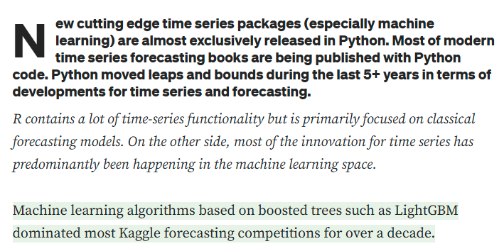
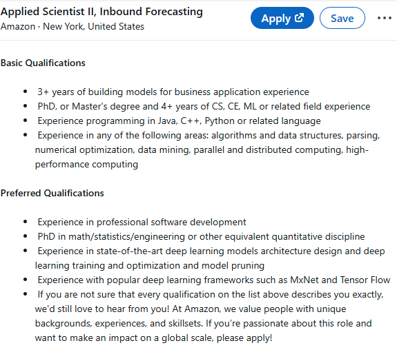
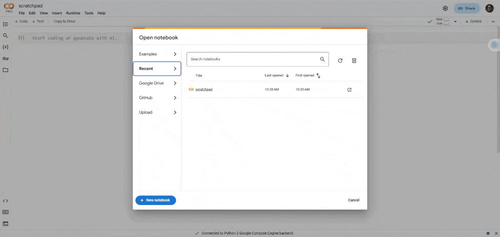
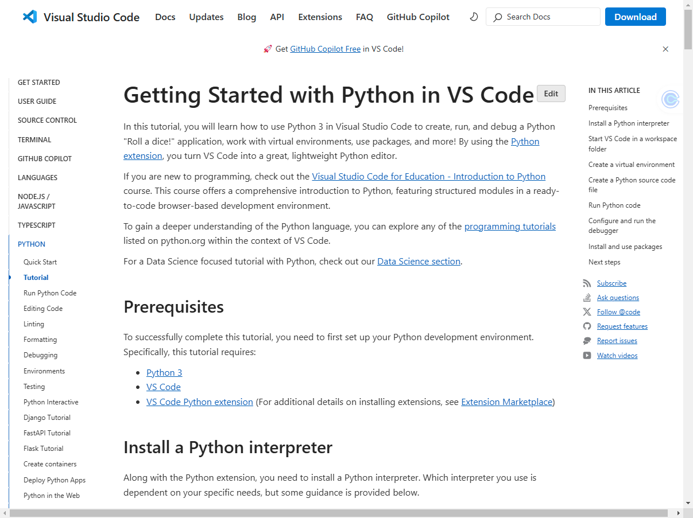

```{r setup, include=FALSE}
knitr::opts_chunk$set(cache = FALSE,
                      echo = TRUE,
                      warning = FALSE,
                      message = FALSE,
                      progress = FALSE, 
                      verbose = FALSE,
                      dev = 'png',
                      fig.height = 2.75,
                      dpi = 300,
                      fig.align = 'center')

options(htmltools.dir.version = FALSE)


miamired = '#C3142D'

if(require(pacman)==FALSE) install.packages("pacman")
if(require(devtools)==FALSE) install.packages("devtools")
if(require(countdown)==FALSE) devtools::install_github("gadenbuie/countdown")
if(require(xaringanExtra)==FALSE) devtools::install_github("gadenbuie/xaringanExtra")
if(require(urbnmapr)==FALSE) devtools::install_github('UrbanInstitute/urbnmapr')
if(require(emo)==FALSE) devtools::install_github("hadley/emo")

pacman::p_load(tidyverse, magrittr, lubridate, janitor, # data analysis pkgs
               DataExplorer, scales, plotly, calendR, pdftools, # plots
               tmap, sf, urbnmapr, tigris, # maps
               bibliometrix, # for bibliometric analysis of my papers
               gifski, av, gganimate, ggtext, glue, extrafont, # for animations
               emojifont, emo, RefManageR, xaringanExtra, countdown) # for slides
```

```{r xaringan-themer, include=FALSE, warning=FALSE}
if(require(xaringanthemer) == FALSE) install.packages("xaringanthemer")
library(xaringanthemer)

style_mono_accent(base_color = "#84d6d3",
                  base_font_size = "20px")

xaringanExtra::use_extra_styles(
  hover_code_line = TRUE,         
  mute_unhighlighted_code = TRUE  
)

xaringanExtra::use_xaringan_extra(c("tile_view", "animate_css", "tachyons", "panelset", "broadcast", "share_again", "search", "fit_screen", "editable", "clipboard"))

```


## Quick Refresher of Last Class

`r emo::ji("check")` Describe the role of forecasting in business.  

`r emo::ji("check")` Describe the key components of a **time-series** (**trend**, **seasonality**, **multiple seasonality**, and **cycles**).

`r emo::ji("check")` Explain the concept of data-generating process (DGP)

`r emo::ji("check")` Discuss limits of forecasting

`r emo::ji("check")` Understand key forecasting terminology


---

## Learning Objectives for Today's Class

- Setting up Python (Colab, Anaconda, and/or VS Code)  

- Practice basic data reading (from CSVs and the Web)  

- Use [panda's](https://pandas.pydata.org/) datatime, indexing, and slicing capabilities  

- (Optional) Discuss generative AI usage in Google Colab

---
class: inverse, center, middle

# Setting Up Python

---

## Why Python? Insights from a LinkedIn Job Search

```{r linkedin, echo=FALSE, out.width="80%"}
knitr::include_graphics("../../figures/linkedIn_forecasting_jobs.gif")
```

.footnote[
<html>
<hr>
</html>

**Note:** The above image is a screenshot from LinkedIn's job search results for "forecasting" jobs from **January 29, 2025**. While LinkedIn may not be the best source for job market trends, it does provide a snapshot of the demand for forecasting skills in the job market. **The results are clearly in favor of Python (112 jobs) over R (9 jobs)**. You can replicate the search by clicking on the following links: [R Forecasting Jobs](https://www.linkedin.com/jobs/search/?currentJobId=4136740121&geoId=103644278&keywords=%22Forecasting%22%20R&origin=JOB_SEARCH_PAGE_SEARCH_BUTTON&refresh=true) and [Python Forecasting Jobs](https://www.linkedin.com/jobs/search/?currentJobId=4063819662&geoId=103644278&keywords=%22Forecasting%22%20Python&origin=JOB_SEARCH_PAGE_SEARCH_BUTTON&refresh=true).  
]


---

## Why Python? Pedagogical Reasons

```{r, echo=FALSE, out.width="90%"}

```

.footnote[
<html>
<hr>
</html>

**Image Source:** An opinionated article by Valeriy Manokhin [Python vs R for time-series forecasting](https://valeman.medium.com/python-vs-r-for-time-series-forecasting-395390432598) on Medium.  While the article is opinionated, it does provide a good overview of the strengths and weaknesses of Python and R for time-series forecasting.   
] 


---

## Why Python? Pedagogical Reasons

```{r, echo=FALSE, out.width="90%"}

```

.footnote[
<html>
<hr>
</html>

**Image Source:** An opinionated article by Valeriy Manokhin [Python vs R for time-series forecasting](https://valeman.medium.com/python-vs-r-for-time-series-forecasting-395390432598) on Medium.  While the article is opinionated, it does provide a good overview of the strengths and weaknesses of Python and R for time-series forecasting.   
] 


---

## Why Python? Pedagogical Reasons

```{r, echo=FALSE, out.width="54%"}

```

.footnote[
<html>
<hr>
</html>

**Image Source:** Amazon's preferred qualifications for a mid-senior PhD preferred [Applied Scientist II, Inbound Forecasting](https://www.linkedin.com/jobs/view/4046266767/?alternateChannel=search&refId=g8pivXC4Dfbrai59ManNNg%3D%3D&trackingId=FRh%2B3YdTJgW%2Bn5YYa4VUrA%3D%3D&trk=d_flagship3_search_srp_jobs) confirming the importance of Python and the transition to ML-DL in forecasting. So to graduate **#BeyondReady graduates, you need to be introduced to the state-of-the-art**, which is readily available in Python but not in R. 
]

---

## Python via Google Colab: Preferred Choice for our Class

- [Google Colab](https://colab.research.google.com/) is a free cloud service for running Python in a Jupyter notebook environment.  

- It offers free access to GPUs and TPUs,  useful in running deep learning models.  

- To get started, you can create a new notebook by clicking on **New Notebook**.

```{r google_colab, echo=FALSE, out.width="70%"}

```

---

## Class Activity: Navigating Colab + Your First Python Code

`r countdown(minutes = 2, seconds = 30, top = 0, font_size = "2em")`

Create a new notebook in [Google Colab](https://colab.research.google.com/), **run the following code**, and observe the output.

```{python intro_colab, eval=FALSE}
import seaborn as sns
import pandas as pd
import matplotlib.pyplot as plt

healthexp = sns.load_dataset('healthexp') # Load the healthexp dataset

# Use the relplot function to plot
ax = sns.relplot(
  data=healthexp, kind='line',
  x='Year', y='Life_Expectancy', hue='Country',  style='Country', palette='Paired'
  )
  
plt.show() # Show the plot
```

.font90[

In **separate cells**, try the following and **observe the output**:

- Now, remove `kind='line'` from the code and rerun the cell. 

- Now, add the following function in a new line before the `plt.show()` function:  
.center[`sns.move_legend(ax, loc = "lower center", bbox_to_anchor=(0.5, 0.85), ncol=3)`]  

]

---

## Python via Anaconda: For Local Use (If you Want)

- [Anaconda](https://www.anaconda.com/) is a free and open-source distribution of Python for scientific computing.  

- It comes with a package manager (`conda`) and a collection of pre-installed packages.  

- To get started, you can **download Anaconda** from [here](https://www.anaconda.com/download/success).  

- You can **create a new environment** by running the following command in the **terminal**:

```{bash, eval=FALSE}
conda create --name isa444 python=3.12
```
- To **activate** the environment, run the following command:

```{bash, eval=FALSE}
conda activate isa444
```

- Then, you can **install any required packages** (done once) by running:

```{bash, eval=FALSE}
conda install statsforecast mlforecast neuralforecast # and any other packages you need
```

---

## Anaconda + VS Code: For Local Use (If you Want)

```{r vscode, echo=FALSE, out.width="60%"}


```
.center[
Please read through the [Getting Started with Python in VS Code](https://code.visualstudio.com/docs/python/python-tutorial) for more details. 
]


---
class: inverse, center, middle

# Importing Data Using Pandas

---

## What is Pandas?   

- Along with [polars](https://pola.rs/), it is one of the most popular data analysis and manipulation libraries in Python, designed to make working with 'relational' or 'labeled' data both easy and intuitive. 

- pandas supports the integration with many file formats or data sources out of the box (`csv`, `excel`, `sql`, `json`, parquet,…). Importing data from each of these data sources is provided by function with the prefix `read_*`. Similarly, the `to_*` methods are used to store data.  

[](https://pandas.pydata.org/)

.footnote[
<html>
<hr>
</html>

**Source:** The content and image are from the *Getting Started with Pandas* description in [pandas.pydata.org](https://pandas.pydata.org/docs/getting_started/index.html). The image can be directly accessed [here](https://pandas.pydata.org/docs/_images/02_io_readwrite.svg).
]

---


## Things to Consider while Importing Data with Pandas

.font90[
- **Check the file extension:** Your <b style='color:black !important;'>choice of function</b> will depend on the file extension.  

- **Check the file path:**   
    + **Local file:**   
        * If the file is in the <b style='color:black !important;'>same directory</b> as your code, you can simply provide the <b style='color:black !important;'>file name</b>.  
        * <b style='color:black !important;'>Otherwise</b>, you will need to provide the <b style='color:black !important;'>path</b> to the file.  
    + **Remote file:** You will need to provide the <b style='color:black !important;'>URL to the file</b>.

- **Inspect the file:** to know which <b style='color:black !important;'>default parameter values must be changed</b>. Things to consider:    
    + Delimiter (in the case of .txt files)  
    + Header (does it exist? if not, what should be used as column names?) 
    + Index Column (if it exists, what is it? if not, what should be used as the index?)  
    + Encoding (to be changed if file is not in English, or has names such as: François, José, Weiß, etc.) 
    + Date Format (if the file has dates, what is the format?) 
    + etc.
]


---

## Importing Data Using Pandas: CSVs

```{r read_csv_api, echo=FALSE}
knitr::include_url('https://pandas.pydata.org/docs/reference/api/pandas.read_csv.html', height = "490px")
```

.footnote[
<html>
<hr>
</html>

**Source:** The content is from the `pandas.read_csv()` documentation available at [pandas.pydata.org](https://pandas.pydata.org/docs/reference/api/pandas.read_csv.html).
]

---

## Importing Data w/ Pandas: CSVs [Example 1: Local]

```{python local_file}
import pandas as pd

# rRead the CSV file (the path will depend on where the file is located)
hotel = pd.read_csv('../../data/01_hotel_occupancy.csv')

# Display the first 5 rows of the dataset
hotel.head()
```


---

## Importing Data w/ Pandas: CSVs [Example 2: Remote]

```{python remote_file}
import pandas as pd

# Read the CSV file from the web
unrate = pd.read_csv('https://fred.stlouisfed.org/graph/fredgraph.csv?bgcolor=%23e1e9f0&chart_type=line&drp=0&fo=open%20sans&graph_bgcolor=%23ffffff&height=450&mode=fred&recession_bars=on&txtcolor=%23444444&ts=12&tts=12&width=1320&nt=0&thu=0&trc=0&show_legend=yes&show_axis_titles=yes&show_tooltip=yes&id=UNRATE&scale=left&cosd=1948-01-01&coed=2024-12-01&line_color=%234572a7&link_values=false&line_style=solid&mark_type=none&mw=3&lw=3&ost=-99999&oet=99999&mma=0&fml=a&fq=Monthly&fam=avg&fgst=lin&fgsnd=2020-02-01&line_index=1&transformation=lin&vintage_date=2025-01-29&revision_date=2025-01-29&nd=1948-01-01')

# Display the first 5 rows of the dataset
unrate.head()
```

---

## Live Demo: Importing Data Using Pandas on Colab


- **For "Local" Files**, Colab allows you to **upload these files** directly to the environment or **mount Google Drive** to access files. For this demo, I will walk you through both methods.  
  + In the future, I will use the **"Upload" method** since it is quicker.  
  
- **For "Remote" Files**, you can use the **URL directly** to read the file.  

- Your environment will be **reset after ~ 12 hours** of inactivity. So, **save your work**. Note that you  **must save your notebook** to Google Drive.  

- Also, **remember to install any required packages** using `!pip install package_name` if they are not already installed.  

- Once your environment is reset, you will need to **reinstall the packages** and re-upload (or remount) the data. **Why does Google do this?** .can-edit.key-activity2_logic[Insert your explanation here.]


---

## Class Activity: Duke Energy Hourly Load Data

`r countdown(minutes = 5, seconds = 00, top = 0, font_size = "2em")`  

- **Download** the *Historical Hourly Loads by Class 2024 data* from [here](https://www.duke-energyohiocbp.com/Documents/LoadandOtherData.aspx).  

- **Inspect** the file to understand its structure; noting that I want you to read the **Total Usage** sheet. **Things to note when inspecting:**
  + What is the file extension?  .can-edit.key-activity3_ext[Edit me. Insert your answer here.]
  + How many sheets are in the file? .can-edit.key-activity3_num_sheets[Edit me. Insert your answer here.]  
  + What is the name of the sheet you want to read? .can-edit.key-activity3_sheet_name[Edit me. Insert your answer here.]
  + Which row should be used as the header?  .can-edit.key-activity3_header_row[Edit me. Insert your answer here.] 

- **Upload** the file to your existing Google Colab notebook for today's class.  

- **Read** the file using Pandas by consulting their [API on Input/Output](https://pandas.pydata.org/docs/reference/io.html).  


---
class: inverse, center, middle

# Using Pandas for Data Manipulation


---

## Dateime Manipulation with Pandas

.pull-left[
- Pandas has a powerful datetime manipulation capability.  

- It allows you to **convert strings to datetime objects**, **extract parts of the date**, **perform arithmetic operations on dates**, and **filter data based on dates**.    

- You can create a `Timestamp` object using the `pd.to_datetime()` function, or by using the `datetime` library in Python.
]


.pull-right[
.font80[
```{python method_chaining}
import pandas as pd

duke = (
  pd.read_excel(
    '../../data/Actual_Hourly_Loads_by_Class_2023_20240507.xlsx',
    sheet_name='Total Usage', header=1
    )
  .assign(
    datetime = lambda x: 
      pd.to_datetime(x['REPORT DAY']) + 
      pd.to_timedelta(x['HOUR ENDING']-1, unit='h') 
      )
  [['datetime', 'TOTAL']]
  )

duke.head(n=1)
```
]

]


---

## Datetime Manipulation with Pandas: Without Chaining

.pull-left[
- Pandas has a powerful datetime manipulation capability.  

- It allows you to **convert strings to datetime objects**, **extract parts of the date**, **perform arithmetic operations on dates**, and **filter data based on dates**.    

- You can create a `Timestamp` object using the `pd.to_datetime()` function, or by using the `datetime` library in Python.
]


.pull-right[
.font80[
```{python without_method_chaining}
import pandas as pd

df = pd.read_excel(
    '../../data/Actual_Hourly_Loads_by_Class_2023_20240507.xlsx',
    sheet_name='Total Usage', header=1
    )

df['datetime'] = pd.to_datetime(df['REPORT DAY']) + pd.to_timedelta(df['HOUR ENDING'] - 1, unit='h')

df = df[['datetime', 'TOTAL']]

df.head(n=1)
```
]

]


---

## 💡 Why Method Chaining? Detailed Interpretation

- The **parentheses** in this code enable .black[.bold[method chaining]], allowing multiple transformations to be applied to the *DataFrame* sequentially without intermediate variables. This improves readability and keeps the workflow structured. 

- The first step reads the data using `pd.read_excel()`, then `.assign()` creates a `datetime` column by combining `REPORT DAY` with `HOUR ENDING`, and finally, column selection (`[['datetime', 'TOTAL']]`) ensures only relevant data is retained. 

- This approach is similar to **piping** (`%>%` or `|>`) in `r icons::fontawesome('r-project')`, where each function operates on the output of the previous step, promoting a clear, left-to-right flow of transformations. 

- Without parentheses, each step would require separate assignments, making the code longer and less efficient.


---

## 💡 Why Method Chaining? Fadel's Perspective

- Improves **readability**  

- Avoids **intermediate variables**  

- Mimics **R’s dplyr piping**

---

## Indexing and Slicing with Pandas

- **Indexing** is the process of selecting specific rows and columns from a DataFrame.

- **Slicing** is the process of selecting a subset of the data based on specific criteria. We can slice data based on row numbers, column names, or conditions.

- **Pandas** provides several methods for indexing and slicing data, including `.loc[]`, `.iloc[]`, and `.query()`.

- **`.loc[]`** is used for label-based indexing, while **`.iloc[]`** is used for positional indexing.   
  + `df.loc[0:5, 'A':'C']` selects rows 0 to 5 and columns A to C, and  
  + `df.iloc[0:5, 0:3]` selects the first 5 rows and first 3 columns.

- **`.query()`** is used to filter data based on specific conditions. We will discuss this in more detail in the next slides.


---

## Filtering/Querying Data with Pandas: Syntax

```{python filtering1}
import pandas as pd

duke = (
  pd.read_excel(
    '../../data/Actual_Hourly_Loads_by_Class_2023_20240507.xlsx',
    sheet_name='Total Usage', header=1
    )
  .assign(
    datetime = lambda x: 
      pd.to_datetime(x['REPORT DAY']) + 
      pd.to_timedelta(x['HOUR ENDING']-1, unit='h') 
      )
  [['datetime', 'TOTAL']]
  .query("TOTAL >= 3055456.7") # use query to filter data #<<
  )

duke.head(n=1)
```


---

## Filtering/Querying Data with Pandas: Syntax w/ Objects

```{python filtering2}
import pandas as pd

total_cutoff= 3055456.7

duke = (
  pd.read_excel(
    '../../data/Actual_Hourly_Loads_by_Class_2023_20240507.xlsx',
    sheet_name='Total Usage', header=1
    )
  .assign(
    datetime = lambda x: 
      pd.to_datetime(x['REPORT DAY']) + 
      pd.to_timedelta(x['HOUR ENDING']-1, unit='h') 
      )
  [['datetime', 'TOTAL']]
  .query("TOTAL >= @total_cutoff") # use query to filter with @ for object #<<
  )

duke.head(n=1)
```

---

## Querying Data w/ Pandas: No Spaces in Col Names

```{python filtering3}
import pandas as pd

duke = (
  pd.read_excel(
    '../../data/Actual_Hourly_Loads_by_Class_2023_20240507.xlsx',
    sheet_name='Total Usage', header=1
    )
  .assign(
    datetime = lambda x: 
      pd.to_datetime(x['REPORT DAY']) + 
      pd.to_timedelta(x['HOUR ENDING']-1, unit='h') 
      )
  [['datetime', 'HOUR ENDING', 'TOTAL']]
  .query("`HOUR ENDING` == 8") # use backticks ` ` for spaces in col names #<<
  )

duke.head(n=1)

```


---

## Filtering/Querying Data with Pandas: Multiple Conditions

```{python filtering4}
import pandas as pd

duke = (
  pd.read_excel(
    '../../data/Actual_Hourly_Loads_by_Class_2023_20240507.xlsx',
    sheet_name='Total Usage', header=1
    )
  .assign(
    datetime = lambda x: 
      pd.to_datetime(x['REPORT DAY']) + 
      pd.to_timedelta(x['HOUR ENDING']-1, unit='h') 
      )
  [['datetime', 'TOTAL']]
  .query("TOTAL >= 3055456 and datetime >= '2023-05-31'") # use and for multiple conditions #<<
  )

duke.head(n=1)

```

---

## How Filtering/Querying is Used in Forecasting?

- **Filtering** and **querying** are essential in forecasting to **select relevant data** for analysis. 

- For example, we can use data prior to 2024 for training a forecasting model, and data from 2024 for testing the model to evaluate its performance.

```{python train_test_split, echo=FALSE}
import pandas as pd
import seaborn as sns
import matplotlib.pyplot as plt
import datetime as dt
import numpy as np

np.random.seed(2025)

# Sample DataFrame
data = {
    "date": pd.date_range(start="2020-01-01", end= '2025-01-30', freq="D"),
    # random walk
    "value": np.cumsum(np.random.randn(1857))
}

df = pd.DataFrame(data)

# Define the split date
split_date = pd.Timestamp("2024-01-01")

# Create the plot
plt.figure(figsize=(12, 4))

# Plot the time series
sns.lineplot(data=df, x="date", y="value", color="black")

# Highlight the training region (left side)
plt.axvspan(df["date"].min(), split_date, color="yellow", alpha=0.15)

# Highlight the test region (right side)
plt.axvspan(split_date, df["date"].max(), color="pink", alpha=0.15)

# Labels and Title
plt.title("The Use of Querying to Split Data for Training and Testing")
plt.xlabel("Date")
plt.ylabel("Value")

# Annotate the plot
plt.annotate("Train", (df["date"].min(), df["value"].max()), xytext=(200, -5), textcoords='offset points', fontsize=14, fontweight='bold')
plt.annotate("Test", (df["date"].max(), df["value"].max()), xytext=(-65, -5), textcoords='offset points', fontsize=14, fontweight='bold')

plt.show()
```


---

# Kahoot Competition #02

To assess your understanding and retention of the topics covered so far, you will **compete in a Kahoot competition (consisting of 5 questions)**:  

- Download and inspect the [01_hotel_occupancy.csv](https://miamioh.instructure.com/courses/230182/modules/items/5759088)

- Go to <https://kahoot.it/>  

- Enter the game pin, which will be shown during class

- Provide your first (preferred) and last name

- Answer each question within the allocated time window (**fast and correct answers provide more points**)


**Winning the competition involves having as many correct answers as possible AND taking the shortest duration to answer these questions.** The winner `r fontawesome::fa(name = 'trophy', fill = 'gold')` of the competition will receive a **0.15 bonus on Assignment 02**. Good luck!!!

.footnote[
<html>
<hr>
</html>

**P.S:** The Kahoot competition will have **no negative impact on your grade**. It is a **fun** way of assessing your knowledge, motivating you to ask questions about topics covered that you do not have a full understanding of it, and providing me with some data that I can use to pace today's class. 
]


---

# Summary of Main Points

By now, you should be able to do the following:  

- Setting up Python (Colab, Anaconda, and/or VS Code)  

- Practice basic data reading (from CSVs and the Web)  

- Use [panda's](https://pandas.pydata.org/) datatime, indexing, and slicing capabilities  

- (Optional) Discuss generative AI usage in Google Colab


---

## 📝 Review and Clarification 📝

1. **Class Notes**: Take some time to revisit your class notes for key insights and concepts.
2. **Zoom Recording**: The recording of today's class will be made available on Canvas approximately 3-4 hours after the session ends.
3. **Questions**: Please don't hesitate to ask for clarification on any topics discussed in class. It's crucial not to let questions accumulate. 


---

## 📖 Required Readings 📖

- **Read** the following sections from the [Pandas Documentation](https://pandas.pydata.org/docs/):
  + [10 Minutes to Pandas](https://pandas.pydata.org/docs/user_guide/10min.html)
  + [Pandas I/O](https://pandas.pydata.org/docs/user_guide/io.html)
  + [Indexing and Selecting Data](https://pandas.pydata.org/docs/user_guide/indexing.html)
  + [Time Series / Date functionality](https://pandas.pydata.org/docs/user_guide/timeseries.html)
  + [Comparison with SQL](https://pandas.pydata.org/docs/getting_started/comparison/comparison_with_sql.html)
  
- Additionally, you should keep a copy of [Pandas Cheat Sheet](https://pandas.pydata.org/Pandas_Cheat_Sheet.pdf) for a quick reference to the most important functions and methods in Pandas.

---

## 🎯 Assignment 🎯

- Go over your notes and complete [Assignment 02](https://miamioh.instructure.com/courses/230182/quizzes/702285) on Canvas.  


