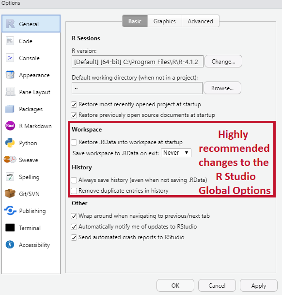
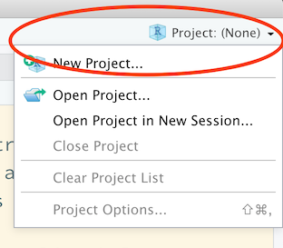

```{r setup, include=FALSE}
knitr::opts_chunk$set(cache = TRUE,
                      echo = TRUE,
                      warning = FALSE,
                      message = FALSE,
                      progress = FALSE, 
                      verbose = FALSE,
                      dev = 'png',
                      dpi = 300,
                      fig.asp = 0.618,
                      fig.align = 'center',
                      out.width = '70%')

options(htmltools.dir.version = FALSE)


miamired = '#C3142D'

if(require(pacman)==FALSE) install.packages("pacman")
if(require(devtools)==FALSE) install.packages("devtools")
if(require(countdown)==FALSE) devtools::install_github("gadenbuie/countdown")
if(require(xaringanExtra)==FALSE) devtools::install_github("gadenbuie/xaringanExtra")
if(require(urbnmapr)==FALSE) devtools::install_github('UrbanInstitute/urbnmapr')
if(require(emo)==FALSE) devtools::install_github("hadley/emo")

pacman::p_load(tidyverse, magrittr, lubridate, janitor, # data analysis pkgs
               DataExplorer, scales, plotly, calendR, pdftools, # plots
               tmap, sf, urbnmapr, tigris, # maps
               bibliometrix, # for bibliometric analysis of my papers
               gifski, av, gganimate, ggtext, glue, extrafont, # for animations
               emojifont, emo, RefManageR, xaringanExtra, countdown) # for slides
```

```{r xaringan-themer, include=FALSE, warning=FALSE}
if(require(xaringanthemer) == FALSE) install.packages("xaringanthemer")
library(xaringanthemer)

style_mono_accent(base_color = "#84d6d3",
                  base_font_size = "20px")

xaringanExtra::use_extra_styles(
  hover_code_line = TRUE,         
  mute_unhighlighted_code = TRUE  
)

xaringanExtra::use_xaringan_extra(c("tile_view", "animate_css", "tachyons", "panelset", "broadcast", "share_again", "search", "fit_screen", "editable", "clipboard"))

```


# Quick Refresher from Last Class

`r emo::ji("check")` Describe **course motivation** and **structure**.  

`r emo::ji("check")` Explain the differences between **cross sectional**, **time series** and **panel** datasets.

`r emo::ji("check")` Describe the **components of time series** datasets.    

`r emo::ji("check")` Explain the **forecasting steps**. 


---

# Learning Objectives for Today's Class

- Describe the syntax, data types, and data structures in `r fontawesome::fa(name = "r-project")`.  

- Access the help for `r fontawesome::fa(name = "r-project")` functions (each help file has the following components: Description, usage, arguments, value, and examples). 

- Utilize the project workflow in `r fontawesome::fa(name = "r-project")` and create `r fontawesome::fa(name = "r-project")` script.  

- Access, subset, and create `ts()` objects in `r fontawesome::fa(name = "r-project")`.

---


# Learning `r fontawesome::fa("r-project")` (Any Programming Language)

<html>
<center>
<iframe src="https://giphy.com/embed/xonOzxf2M8hNu" width="480" height="270" frameBorder="0" class="giphy-embed" allowFullScreen></iframe><p>
</center>
</html>

* `r emo::ji("speaking_head")` **Get hands dirty**`r emo::ji("bangbang")`  

* `r emo::ji("open_book")` Documentation! Documentation! Documentation!  

* `r emo::ji("search")` (Not surprisingly) Learn to Google: what that error message means (I `r fontawesome::fa("google")` a lot `r emo::ji("laugh")`)

.footnote[
<html>

<hr>

</html>

**Source:** Slide is based on [Kia Ora's How I Learn a Technology](https://stats220.earo.me/01-intro.html#7).
]

---

class: inverse center middle

# The RStudio Interface, Setup and a Project-Oriented Workflow for your Analysis

---


## RStudio Interface

.center[]

.footnote[
<html>
<hr>
</html>
image credit: Stuart Lee]

???

live

---

## Setting up RStudio (do this once)

.pull-left[
Go to **Tools** > **Global Options**:
.center[]
]
.pull-right[
<br>
<br>
<br>
<br>
Uncheck `Workspace` and `History`, which helps to keep `r fontawesome::fa("r-project")` working environment fresh and clean every time you switch between projects.
]

---

## What is a Project?

* Each university course is a project, and get your work organised.
* A self-contained project is a folder that contains all relevant files, for example my `ISA 444/` `r emo::ji("folder")` includes:
   + `isa444.Rproj`
   + `lectures/`  
     +  `01_introduction/`  
          *  `01-intro.Rmd`, etc.   
     +  `02_introduction_to_r/`  
          *  `02_intro_r.Rmd`, etc. 
* All working files are **relative** to the **project root** (i.e. `isa444/`).
* The project should just work on a different computer.


---

## Lets Create a `.Rproj` for Our Course

`r countdown(minutes = 2, seconds = 0, top = 0, font_size = "2em")`

.pull-left-2[
1. Click the **Project** icon on the top right corner 
<br>
<br>
<br>
<br>
2. **New Directory**/**Existing Directory** > **New Project** > **Create Project**
<br>
<br>
<br>
3. Open the project
]
.pull-right-2[
.center[]
]

---

class: inverse, center, middle

# `r fontawesome::fa("r-project")` 101: Syntax, Data Types, Data Structures and Functions

---

# Coding Style

> .font150[Good coding style is like correct punctuation: you can manage without it, butitsuremakesthingseasiertoread.
 <br> -- [The tidyverse style guide](https://style.tidyverse.org)]

### `r fontawesome::fa("r-project")` style guide

.pull-left[
 `r emo::ji("check")` `snake_case`

]
.pull-right[
`r emo::ji("x")` `camelCase` (Javascript)

`r emo::ji("x")` `PascalCase` (Python)
]


.footnote[
<html>
<hr>
</html> 

**Source:** Slide is based on [Earo Wang's STAT 220 Slides](https://stats220.earo.me/01-intro.html#34)
]


---

# Data Types: A Visual Introduction

.center[]

- To check the **type of** an object in `r fontawesome::fa("r-project")`, you can use the function `typeof`.

.footnote[
<html>
<hr>
</html>
**Source:** The image is from [Hadley Wickham's Advanced R: Chapter 3 on Vectors](https://adv-r.hadley.nz/vectors-chap.html)
]

---
count: false
# Data Types: A Visual Introduction

```{r legos_viz, fig.align='center', out.width='100%', fig.cap='A visual representation of different types of atomic vectors', fig.alt='A visual representation of different types of atomic vectors', echo=FALSE}

knitr::include_graphics('../../figures/legos-jbryan-types.png')

```


.footnote[
<html>
<hr>
</html>
**Source:** The images are from the excellent [lego-rstats GitHub Repository by Jenny Bryan](https://github.com/jennybc/lego-rstats#readme)
]


---

# Data Types: Formal Definitions

Each of the four primary types has a special syntax to create an individual value:

- Logicals can be written in full (`TRUE` or `FALSE`), or abbreviated (`T` or `F`).

- Doubles can be specified in decimal (`0.1234`), scientific (`1.23e4`), or hexadecimal (`0xcafe`) form.   
    * There are three special values unique to doubles: `Inf`, `-Inf`, and `NaN` (not a number).   
    * These are special values defined by the floating point standard.

- Integers are written similarly to doubles but must be followed by `L`(`1234L`, `1e4L`, or `0xcafeL`), and can not contain fractional values.  

- Strings are surrounded by `"` (e.g., `"hi"`) or `'` (e.g., `'bye'`). Special characters are escaped with `\` see `?Quotes` for full details.

.footnote[
<html>
<hr>
</html>
**Source:** The content of this slide is verbatim from [Hadley Wickham's Advanced R: Chapter 3 on Vectors](https://adv-r.hadley.nz/vectors-chap.html#scalars)
]


---

# Data Structures: Atomic Vector (1D)

```{r legos_viz2, fig.align='center', out.width='100%', fig.cap='Keeping the  visual representation of different types of atomic vectors in your head!!', fig.alt='A visual representation of different types of atomic vectors', echo=FALSE}

knitr::include_graphics('../../figures/legos-jbryan-types.png')

```


.footnote[
<html>
<hr>
</html>
**Source:** The images are from the excellent [lego-rstats GitHub Repository by Jenny Bryan](https://github.com/jennybc/lego-rstats#readme)
]


---

# Data Structures: 1D `r emo::ji("arrow_right")` 2D


.center[]

.footnote[
<html>
<hr>
</html>
**Source:** The images are from the excellent [lego-rstats GitHub Repository by Jenny Bryan](https://github.com/jennybc/lego-rstats#readme)  
]

---


# Data Structures: Lists

An object contains elements of **different data types**.

.center[]

.footnote[
<html>
<hr>
</html>
**Source:** The image is adapted from the excellent [lego-rstats GitHub Repository by Jenny Bryan](https://github.com/jennybc/lego-rstats/blob/master/lego-rstats_014.jpg)
]

---
count: false
# Data Structures: Lists 

.center[]

```{r list1a, results='hide'}
lst <- list( # list constructor/creator
  1:3, # atomic double/numeric vector  of length = 3 #<< 
  "a", # atomic character vector of length = 1 (aka scalar) #<< 
  c(TRUE, FALSE, TRUE), # atomic logical vector of length = 3 #<< 
  c(2.3, 5.9) # atomic double/numeric vector of length =3 #<< 
)
lst # printing the list
```

```{r list1b, echo=FALSE}
paste(lst, sep = "\n")
```

.footnote[
<html>
<hr>
</html>
**Source:** Image is from [Hadley Wickham's Advanced R: Chapter 3 on Vectors](https://adv-r.hadley.nz/vectors-chap.html#lists)
]


---
count: false
# Data Structures: Lists

.pull-left[
Subset by `[]`
```{r lst-sub}
lst[1]
```
]
.pull-right[
Subset by `[[]]`
```{r lst-sub2}
lst[[1]]
```
]

.center[]

.footnote[
<html>
<hr>
</html>
**Sources:** The slide is based on [Earo Wang's STAT 220 slides](https://stats220.earo.me/02-import-export.html#10) and image is from [Hadley Wickham's Tweet on Indexing lists in R](https://twitter.com/hadleywickham/status/643381054758363136?lang=en).
]


---

# Data Structures: Matrices

A matrix is a **2D data structure** made of **one/homogeneous data type.**


.pull-left[

```{r num_matrix1}
x_mat = matrix( sample(1:10, size = 4), nrow = 2, ncol = 2 ) 
str(x_mat) # its structure?
```

```{r num_matrix2, results='hold'}
x_mat # printing it nicely
print('-----------------')
x_mat[1, 2] # subsetting #<< 
```


]

--

.pull-right[
```{r char_matrix1}
x_char = matrix(
  sample(letters, size = 12), nrow = 3, ncol =4)
x_char
```


```{r char_matrix2}
x_char[1:2, 2:3] # subsetting #<< 
```
]


---

# Data Structures: Data Frames

.center[]

> .font150[If you do data analysis in R, you’re going to be using data frames. A data frame is a named list of vectors with attributes for `(column)` `names`, `row.names`, and its class, “data.frame”.  -- [Hadley Wickham](https://adv-r.hadley.nz/vectors-chap.html#list-array)]

.footnote[
<html>
<hr>
</html>
**Source:** Image is from [Hadley Wickham's Advanced R: Chapter 3 on Vectors](https://adv-r.hadley.nz/vectors-chap.html#list-array)
]


---
count: false
# Data Structures: Data Frames

```{r df1}
df1 <- data.frame(x = 1:3, y = letters[1:3])
typeof(df1) # showing that its a special case of a list

attributes(df1) # but also is of class data.frame
```

In contrast to a regular list, a data frame has **an additional constraint: the length of each of its vectors must be the same.** This gives data frames their **rectangular structure.**

.footnote[
<html>
<hr>
</html>
**Source:** Content is from [Hadley Wickham's Advanced R: Chapter 3 on Vectors](https://adv-r.hadley.nz/vectors-chap.html#list-array)
]


---
count: false
# Data Structures: Data Frames

As noted in the creation of `df1`, columns in a data frame can be of different types. Hence, it is more widely used in data analysis than matrices.

.center[]

.footnote[
<html>
<hr>
</html>
**Source:** The image is adapted from the excellent [lego-rstats GitHub Repository by Jenny Bryan](https://github.com/jennybc/lego-rstats/blob/master/lego-rstats_014.jpg)
]


---

# Data Structures: So What is a Tibble Anyway?

> Tibble is a **modern reimagining of the data frame**. Tibbles are designed to be (as much as possible) **drop-in replacements for data frames** that fix those frustrations. A concise, and fun, way to summarise the main differences is that tibbles are **lazy and surly: they do less and complain more**. -- [Hadley Wickham](https://adv-r.hadley.nz/vectors-chap.html#list-array)

.pull-left[[](https://adv-r.hadley.nz)]

To learn more about the basics of tibble, please consult the reference below: 
* [Data frames and tibbles (Click and read from 3.6 up to and including 3.6.5)](https://adv-r.hadley.nz/vectors-chap.html#list-array)

---

# Functions

A function call consists of the **function name** followed by one or more **argument** within parentheses.

```{r function-mean}
temp_high_forecast = c(34, 36, 41, 44, 27, 32, 35)
mean(x = temp_high_forecast)
```

* function name: `mean()`, a built-in R function to compute mean of a vector
* argument: the first argument (LHS `x`) to specify the data (RHS `temp_high_forecast`)

.footnote[
<html>
<hr>
</html> 

**Source:** Slide is based on [Earo Wang's STAT 220 Slides](https://stats220.earo.me/01-intro.html#41)
]


---

# Function Help Page

Check the function's help page with `?mean`

### Class Activity 

> _Please take 2 minutes to investigate the help page for `mean` in R Studio._

```r
mean(x = temp_high_forecast, trim = 0, na.rm = FALSE, ...)
```

* Read **Usage** section
  + What arguments have default values?
* Read **Arguments** section
  + What does `trim` do?
* Run **Example** code

`r countdown::countdown(minutes = 2, font_size = "48px", top = 0)`

.footnote[
<html>
<hr>
</html> 

**Source:** Slide is based on [Earo Wang's STAT 220 Slides](https://stats220.earo.me/01-intro.html#42)
]

---

# Function Arguments

.pull-left[
### Match by **positions**
```{r function-args-pos}
mean(temp_high_forecast, 0.1, TRUE)
```
]

.pull-right[
### Match by **names**
```{r function-args-names}
mean(x = temp_high_forecast, trim = 0.1, na.rm = TRUE)
```
]


.footnote[
<html>
<hr>
</html> 

**Source:** Slide is based on [Earo Wang's STAT 220 Slides](https://stats220.earo.me/01-intro.html#43)
]


---

# Use Functions from Packages

.pull-left[
```{r cummean}
library(dplyr)
dplyr::cummean(temp_high_forecast)

dplyr::first(temp_high_forecast)

dplyr::last(temp_high_forecast)
```
]
.pull-right[
<br>
<br>
<br>
<br>
.center[

]
]


.footnote[
<html>
<hr>
</html> 

**Source:** Slide is based on [Earo Wang's STAT 220 Slides](https://stats220.earo.me/01-intro.html#44)
]


---
class: inverse, center, middle

# `r fontawesome::fa("r-project")` for time series analysis

---

# The *ts* Object

`r fontawesome::fa("r-project")` facilitates the work with time series data by storing it in an aptly named ts object. 


---

# Create a *ts* Object by asking *ChatGPT*

<center>
<iframe width="840" height="473" src="https://www.loom.com/embed/10576168e19845c29110d25559d938cd" frameborder="0" webkitallowfullscreen mozallowfullscreen allowfullscreen></iframe>
</center>

---

# Demo 1: `Nile` & `AirPassengers` Data

In class, we will create our first `r fontawesome::fa("r-project", fill = miamired)` script where we will examine one of these two built-in datasets. In our exploration, we will:  

- Examine the `typeof()` the dataset.  

- Examine the `class()` of the dataset.  

- Examine the `length()` of the dataset.  

- `print()` the data set and examine its `frequency()`.  

- Subset the data using `window()` and non ts-based sub-setting techniques.  
  + Useful for the concept of the entire time series vs a snippet that we discussed in [Class 01]().


---

# A Poll: File Paths in R

<div style='position: relative; padding-bottom: 56.25%; padding-top: 35px; height: 0; overflow: hidden;'><iframe sandbox='allow-scripts allow-same-origin allow-presentation' allowfullscreen='true' allowtransparency='true' frameborder='0' height='400' src='https://www.mentimeter.com/app/presentation/aluy18c8btk2vnfyb9ehkxy351hutsqb/embed' style='position: absolute; top: 0; left: 0; width: 100%; height: 100%;' width='720'></iframe></div>


---

# Demo 2: Loading Time Series Data into R

- Reading CSV Files through either the `read.csv()` or `readr::read_csv()` functions.    

- Reading FRED and Yahoo Finance Data using the `tidyquant` package.  

- Preprocessing and converting the data into a time series object.  


## Bonus Tricks (if time allows)

- `file.choose()` -- not typically introduced by Miami faculty!! 

- The datapasta package `r fontawesome::fa('box', fill = 'gold')` 


---

# Summary of Main Points

By now, you should be able to do the following:  

- Describe the syntax, data types, and data structures in `r fontawesome::fa(name = "r-project")`.  

- Access the help for `r fontawesome::fa(name = "r-project")` functions (each help file has the following components: Description, usage, arguments, value, and examples). 

- Utilize the project workflow in `r fontawesome::fa(name = "r-project")` and create `r fontawesome::fa(name = "r-project")` script.  

- Access, subset, and create `ts()` objects in `r fontawesome::fa(name = "r-project")`.


---

# Things to Do to Prepare for Our Next Class

- Go over your notes, read the **references below**, and **complete** the [self-paced R tutorial](http://rstudio.fsb.miamioh.edu:3838/megahefm/isa444/spring2023/datatypes/). 

- Complete [Assignment 02](https://miamioh.instructure.com/courses/188655/assignments/2368786) on Canvas.  

.pull-left[
.center[[](https://r4ds.had.co.nz)]
]
.pull-right[

* [Data Visualization](https://r4ds.had.co.nz/data-visualisation.html)  

* [Graphics for Communication](https://r4ds.had.co.nz/graphics-for-communication.html)  

* [Dates and Times](https://r4ds.had.co.nz/dates-and-times.html)  

]