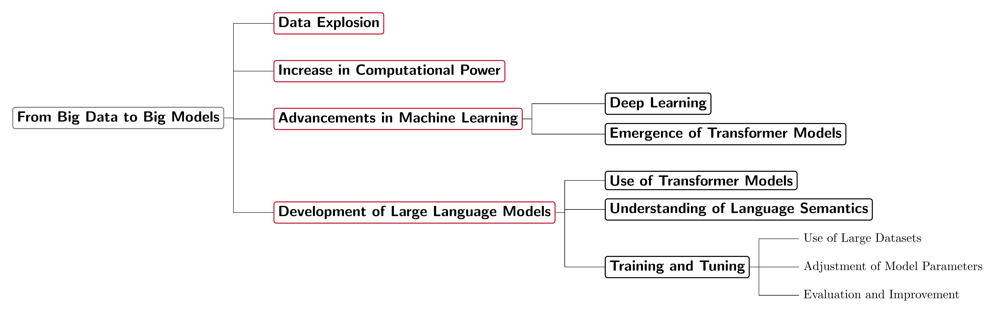

```{r setup, include=FALSE}
knitr::opts_chunk$set(cache = TRUE,
                      echo = TRUE,
                      warning = FALSE,
                      message = FALSE,
                      progress = FALSE, 
                      verbose = FALSE,
                      dev = 'png',
                      fig.height = 2.5,
                      dpi = 300,
                      fig.align = 'center')

options(htmltools.dir.version = FALSE)

miamired = '#C3142D'

if(require(pacman)==FALSE) install.packages("pacman")
if(require(devtools)==FALSE) install.packages("devtools")
if(require(countdown)==FALSE) devtools::install_github("gadenbuie/countdown")
if(require(xaringanExtra)==FALSE) devtools::install_github("gadenbuie/xaringanExtra")
if(require(urbnmapr)==FALSE) devtools::install_github('UrbanInstitute/urbnmapr')
if(require(memer)==FALSE) devtools::install_github("sctyner/memer")

pacman::p_load(tidyverse, magrittr, lubridate, janitor, # data analysis pkgs
               memer, # memes
               scales, # for the comma function
               gifski, av, # for animations
               fontawesome, RefManageR, xaringanExtra, countdown) # for slides

BibOptions(check.entries = FALSE, bib.style = "authoryear", 
           style = "markdown", dashed = TRUE)

bib = ReadBib("refs.bib") 
```

```{r xaringan-themer, include=FALSE, warning=FALSE}
if(require(xaringanthemer) == FALSE) install.packages("xaringanthemer")
library(xaringanthemer)

style_mono_accent(base_color = "#84d6d3",
                  base_font_size = "20px")

xaringanExtra::use_xaringan_extra(c("tile_view", "animate_css", "tachyons", "panelset", "broadcast", "share_again", "search", "fit_screen", "editable", 
                                    "clipable"))

```


# Quick Refresher from Last Class

`r emo::ji("check")` Describe course **objectives** & **structure**.  

`r emo::ji("check")` Explain the differences between **cross sectional**, **time series** and **panel** datasets.  

`r emo::ji("check")` Describe the **components of time series** datasets.   

`r emo::ji("check")` Explain the **forecasting steps**.  


---


# Learning Objectives for Today's Class

- Utilize the project workflow in RStudio (we will try to use that as an IDE for `r fa(name = "r-project", fill = miamired)` and `r fa(name = "python", fill = miamired)`).  

- Understand the syntax, data structures and functions in both `r fa(name = "r-project", fill = miamired)` and `r fa(name = "python", fill = miamired)`. 

- Understand the potential impact of LLMs on businesses and explore how they can be leveraged in the context of this class.   


---

# How to Learn Any Programming Language

<html>
<center>
<iframe src="https://giphy.com/embed/xonOzxf2M8hNu" width="480" height="270" frameBorder="0" class="giphy-embed" allowFullScreen></iframe><p>
</center>
</html>

* `r emo::ji("speaking_head")` **Get hands dirty** `r emo::ji("bangbang")`  

* `r emo::ji("open_book")` Documentation! Documentation! Documentation!  

* `r emo::ji("search")` (Not surprisingly) Learn to Google/ChatGPT: what that error message means (I do that a lot `r emo::ji("laugh")`)

.footnote[
<html>

<hr>

</html>

**Source:** Slide is based on [Kia Ora's How I Learn a Technology](https://stats220.earo.me/01-intro.html#7).
]


---

class: inverse center middle

# The RStudio Interface, Setup and a Project-Oriented Workflow for your Analysis

---


## RStudio Interface

.center[]

.footnote[
<html>
<hr>
</html>
image credit: Stuart Lee]

???

live

---

## Setting up RStudio (do this once for `r fontawesome::fa("r-project", fill = miamired)`)

.pull-left[
Go to **Tools** > **Global Options**:
.center[]
]
.pull-right[
<br>
<br>
<br>
<br>
Uncheck `Workspace` and `History`, which helps to keep `r fontawesome::fa("r-project", fill = miamired)` working environment fresh and clean every time you switch between projects.
]


---

## What is a project?

* Each university course is a project, and get your work organised.
* A self-contained project is a folder that contains all relevant files, for example my `ISA 444/` `r emo::ji("folder")` includes:
   + `isa444.Rproj`
   + `lectures/`  
     +  `01_Introduction/`  
          *  `01_intro.Rmd`, etc.   
     +  `02_llms_r_python/`  
          *  `02_llms_r_python.Rmd`, etc. 
* All working files are **relative** to the **project root** (i.e. `isa444/`).
* The project should just work on a different computer (in most cases).


---

## Setting up RStudio (do this once for `r fontawesome::fa("python", fill = miamired)`)

.pull-left-3[

.font70[

.center[**Installing Python**]

1. (Preferred) Install `r fontawesome::fa("python", fill = miamired)` via `reticulate::install_miniconda()`.  

2. Install `r fontawesome::fa("python", fill = miamired)`  from [python.org](https://www.python.org/downloads/).  

3. Setup virtual environment and install needed `r fontawesome::fa("box", fill = 'gold')`

.center[**Helping R Find the Correct Version of Python**]

1. Edit your RProfile for the project to connect to a specific version of Python,
.font70[`Sys.setenv(RETICULATE_PYTHON = "C:\\tools\\Anaconda3\\envs\\isa444\\python.exe")`]  

2. Configure a default version of Python to be used with RStudio via Tools -> Global Options... -> Python
]
]

.pull-right-3[
```{r rstudio_python, echo=FALSE}
knitr::include_url('python_with_r_studio.html', height = "470px")
```
]

.footnote[
<html>
<hr>
</html>

**Note:** Feel free to use other IDEs of your choice for Python and/or R. During class, I will use RStudio for both to reduce the possible friction from using and/or setting up multiple IDEs.
]


---

## Lets Create a `.Rproj` for Our Course

`r countdown(minutes = 2, seconds = 0, top = 0, font_size = "2em")`

.pull-left-2[
1. Click the **Project** icon on the top right corner 
<br>
<br>
<br>
<br>
2. **New Directory**/**Existing Directory** > **New Project** > **Create Project**
<br>
<br>
<br>
3. Open the project
]
.pull-right-2[
.center[]
]


---
class: inverse, center, middle

# 101: Syntax, Data Types, Data Structures and Functions


---

# Arthimetic Operators

The operators below are good to know.

<html>
<center>

<table border="1">
  <tr>
    <th>R</th>
    <th>Description</th>
    <th>Python</th>
  </tr>
  <tr>
    <td>+</td>
    <td>addition</td>
    <td>+</td>
  </tr>
  <tr>
    <td>-</td>
    <td>subtraction</td>
    <td>-</td>
  </tr>
  <tr>
    <td>*</td>
    <td>multiplication</td>
    <td>*</td>
  </tr>
  <tr>
    <td>/</td>
    <td>division</td>
    <td>/</td>
  </tr>
  <tr>
    <td>^ or **</td>
    <td>exponentiation</td>
    <td>**</td>
  </tr>
  <tr>
    <td>x %% y</td>
    <td>modulus (x mod y)</td>
    <td>x % y</td>
  </tr>
  <tr>
    <td>x %/% y</td>
    <td>integer division</td>
    <td>x // y</td>
  </tr>
</table>


</center>
</html>

---

# Logical Operators

Logical operators are operators that return `TRUE` (`True` `r fontawesome::fa(name = "python", fill =miamired)`) and `FALSE` (`False` in `r fontawesome::fa(name = "python", fill =miamired)`) values.

<table border="1">
  <tr>
    <th>R</th>
    <th>Description</th>
    <th>Python</th>
  </tr>
  <tr>
    <td>&lt;</td>
    <td>less than</td>
    <td>&lt;</td>
  </tr>
  <tr>
    <td>&lt;=</td>
    <td>less than or equal to</td>
    <td>&lt;=</td>
  </tr>
  <tr>
    <td>&gt;</td>
    <td>greater than</td>
    <td>&gt;</td>
  </tr>
  <tr>
    <td>&gt;=</td>
    <td>greater than or equal to</td>
    <td>&gt;=</td>
  </tr>
  <tr>
    <td>==</td>
    <td>exactly equal to</td>
    <td>==</td>
  </tr>
  <tr>
    <td>!=</td>
    <td>not equal to</td>
    <td>!=</td>
  </tr>
  <tr>
    <td>!x</td>
    <td>Not x</td>
    <td>not x</td>
  </tr>
  <tr>
    <td>x &amp; y</td>
    <td>x AND y</td>
    <td>x &amp; y</td>
  </tr>
  <tr>
    <td>isTRUE(x)</td>
    <td>test if X is TRUE</td>
    <td>x is `True`</td>
  </tr>
</table>


---

# Coding Style

> .font150[Good coding style is like correct punctuation: you can manage without it, butitsuremakesthingseasiertoread.
 <br> -- [The tidyverse style guide](https://style.tidyverse.org)]


.pull-left[
### `r fontawesome::fa("r-project", fill = miamired)` style guide

 `r emo::ji("check")` `snake_case`

]
.pull-right[
### `r fontawesome::fa(name = "python", fill =miamired)` style guide

`r emo::ji("check")` `PascalCase` (Python)
]


.footnote[
<html>
<hr>
</html> 

**Source:** Slide is based on [Earo Wang's STAT 220 Slides](https://stats220.earo.me/01-intro.html#34)
]


---

# `r fontawesome::fa("r-project", fill = miamired)` Data Types: A Visual Introduction [1]

.center[]

- To check the **type of** an object in `r fontawesome::fa("r-project", fill = miamired)`, you can use the function `typeof`:

```{r type_of}
x_vec = c(1,5,7)
typeof(x_vec)
```

.footnote[
<html>
<hr>
</html>
**Source:** The image is from [Hadley Wickham's Advanced R: Chapter 3 on Vectors](https://adv-r.hadley.nz/vectors-chap.html)
]

---

# `r fontawesome::fa("r-project", fill = miamired)` Data Types: A Visual Introduction [2]

```{r run_latex_file, echo=FALSE, cache=TRUE, results='hide'}
tinytex::xelatex('../../figures/four_popular_data_types.tex')
pdftools::pdf_convert('../../figures/four_popular_data_types.pdf', dpi = 600,
                      filenames = '../../figures/four_popular_data_types.png')
```

```{r read_types_chart, echo=FALSE, out.width='100%', fig.alt="The four data types that we will utilize the most in our course.", fig.align='center', fig.cap='The four data types that we will utilize the most in our course.'}

```

---

# `r fontawesome::fa("r-project", fill = miamired)` Data Types: A Visual Introduction [3]

```{r legos_viz, fig.align='center', out.width='100%', fig.cap='A visual representation of different types of atomic vectors', fig.alt='A visual representation of different types of atomic vectors', echo=FALSE}

knitr::include_graphics('../../figures/legos-jbryan-types.png')

```


.footnote[
<html>
<hr>
</html>
**Source:** The images are from the excellent [lego-rstats GitHub Repository by Jenny Bryan](https://github.com/jennybc/lego-rstats#readme)
]


---

# `r fontawesome::fa("r-project", fill = miamired)` Data Types: Formal Definitions

Each of the four primary types has a special syntax to create an individual value:

- Logicals can be written in full (`TRUE` or `FALSE`), or abbreviated (`T` or `F`).

- Doubles can be specified in decimal (`0.1234`), scientific (`1.23e4`), or hexadecimal (`0xcafe`) form.   
    * There are three special values unique to doubles: `Inf`, `-Inf`, and `NaN` (not a number).   
    * These are special values defined by the floating point standard.

- Integers are written similarly to doubles but must be followed by `L`(`1234L`, `1e4L`, or `0xcafeL`), and can not contain fractional values.  

- Strings are surrounded by `"` (e.g., `"hi"`) or `'` (e.g., `'bye'`). Special characters are escaped with `\` see `?Quotes` for full details.

.footnote[
<html>
<hr>
</html>
**Source:** The content of this slide is verbatim from [Hadley Wickham's Advanced R: Chapter 3 on Vectors](https://adv-r.hadley.nz/vectors-chap.html#scalars)
]


---

# Translating `r fontawesome::fa("r-project", fill = miamired)` Data Types to `r fontawesome::fa("python", fill = miamired)`

<html>
<center>
<table border="1">
  <tr>
    <th>R Data Type</th>
    <th>Description</th>
    <th>Python Equivalent</th>
  </tr>
  <tr>
    <td>numeric</td>
    <td>Decimal numbers</td>
    <td>float</td>
  </tr>
  <tr>
    <td>integer</td>
    <td>Whole numbers</td>
    <td>int</td>
  </tr>
  <tr>
    <td>character</td>
    <td>Text or strings</td>
    <td>str</td>
  </tr>
  <tr>
    <td>factor</td>
    <td>Categorical data</td>
    <td>pandas.Categorical or str</td>
  </tr>
  <tr>
    <td>Date</td>
    <td>Date values</td>
    <td>datetime.date</td>
  </tr>
  <tr>
    <td>POSIXct</td>
    <td>Date and time</td>
    <td>datetime.datetime</td>
  </tr>
    <tr>
    <td>logical</td>
    <td>Boolean (TRUE/FALSE)</td>
    <td>bool</td>
  </tr>
  <tr>
    <td>complex</td>
    <td>Complex numbers</td>
    <td>complex</td>
  </tr>
</table>
</center>
</html>


---

# `r fontawesome::fa("r-project", fill = miamired)` Data Structures: Atomic Vector (1D)

```{r legos_viz2, fig.align='center', out.width='100%', fig.cap='Keeping the  visual representation of different types of atomic vectors in your head!!', fig.alt='A visual representation of different types of atomic vectors', echo=FALSE}

knitr::include_graphics('../../figures/legos-jbryan-types.png')

```

```{r atomic_departments}
dept = c('ACC', 'ECO', 'FIN', 'ISA', 'MGMT')
nfaculty = c(18L, 19L, 14L, 25L, 22L)

```


.footnote[
<html>
<hr>
</html>
**Source:** The images are from the excellent [lego-rstats GitHub Repository by Jenny Bryan](https://github.com/jennybc/lego-rstats#readme)
]


---

# `r fontawesome::fa("r-project", fill = miamired)` Data Structures: 1D `r emo::ji("arrow_right")` 2D [Visually]


.center[]

.footnote[
<html>
<hr>
</html>
**Source:** The images are from the excellent [lego-rstats GitHub Repository by Jenny Bryan](https://github.com/jennybc/lego-rstats#readme)  
]


---

# `r fontawesome::fa("r-project", fill = miamired)` Data Structures: 1D `r emo::ji("arrow_right")` 2D [In Code]

```{r tibbles}
library(tibble)

fsb_tbl <- tibble(
  department = dept, 
  count = nfaculty, 
  percentage = count / sum(count))
fsb_tbl
```


---


# `r fontawesome::fa("r-project", fill = miamired)` Data Structures: Lists [1]

An object contains elements of **different data types**.

.center[]

.footnote[
<html>
<hr>
</html>
**Source:** The image is adapted from the excellent [lego-rstats GitHub Repository by Jenny Bryan](https://github.com/jennybc/lego-rstats/blob/master/lego-rstats_014.jpg)
]

---

# `r fontawesome::fa("r-project", fill = miamired)` Data Structures: Lists [2]

.center[]

```{r list1a, results='hide'}
lst <- list( # list constructor/creator
  1:3, # atomic double/numeric vector  of length = 3 #<< 
  "a", # atomic character vector of length = 1 (aka scalar) #<< 
  c(TRUE, FALSE, TRUE), # atomic logical vector of length = 3 #<< 
  c(2.3, 5.9) # atomic double/numeric vector of length =3 #<< 
)
lst # printing the list
```

```{r list1b, echo=FALSE}
paste(lst, sep = "\n")
```

.footnote[
<html>
<hr>
</html>
**Source:** Image is from [Hadley Wickham's Advanced R: Chapter 3 on Vectors](https://adv-r.hadley.nz/vectors-chap.html#lists)
]


---

# `r fontawesome::fa("r-project", fill = miamired)` Data Structures: Lists [3]

.pull-left[
### data type
```{r lists-type}
typeof(lst) # primitive type
```
### data class
```{r lists-cls}
class(lst) # type + attributes
```
]
.pull-right[
### data structure
```{r lists-str, results='hold'}
str(lst)
# sublists can be of diff lengths and types
```
]


.footnote[
<html>
<hr>
</html> 

**Source:** Slide is based on [Earo Wang's STAT 220 Slides](https://stats220.earo.me/02-import-export.html#6).
]


---

# `r fontawesome::fa("r-project", fill = miamired)` Data Structures: Lists [3]

A list can contain other lists, i.e. **recursive**

```{r rec_list}
# a named list
str(
  list(first_el = lst, second_el = iris) #<<
  )
```


---

# `r fontawesome::fa("r-project", fill = miamired)` Data Structures: Lists [4]

.pull-left[
Subset by `[]`
```{r lst-sub}
lst[1]
```
]
.pull-right[
Subset by `[[]]`
```{r lst-sub2}
lst[[1]]
```
]

.center[]

.footnote[
<html>
<hr>
</html>
**Sources:** The slide is based on [Earo Wang's STAT 220 slides](https://stats220.earo.me/02-import-export.html#10) and image is from [Hadley Wickham's Tweet on Indexing lists in R](https://twitter.com/hadleywickham/status/643381054758363136?lang=en).
]


---

# `r fontawesome::fa("r-project", fill = miamired)` Data Structures: Matrices

A matrix is a **2D data structure** made of **one/homogeneous data type.**


.pull-left[

```{r num_matrix1}
x_mat = matrix( sample(1:10, size = 4), nrow = 2, ncol = 2 ) 
str(x_mat) # its structure?
```

```{r num_matrix2, results='hold'}
x_mat # printing it nicely
print('-----------------')
x_mat[1, 2] # subsetting #<< 
```


]

--

.pull-right[
```{r char_matrix1}
x_char = matrix(
  sample(letters, size = 12), nrow = 3, ncol =4)
x_char
```


```{r char_matrix2}
x_char[1:2, 2:3] # subsetting #<< 
```
]


---

# `r fontawesome::fa("r-project", fill = miamired)` Data Structures: Data Frames [1]

.center[]

> .font150[If you do data analysis in R, you’re going to be using data frames. A data frame is a named list of vectors with attributes for `(column)` `names`, `row.names`, and its class, “data.frame”.  -- [Hadley Wickham](https://adv-r.hadley.nz/vectors-chap.html#list-array)]

.footnote[
<html>
<hr>
</html>
**Source:** Image is from [Hadley Wickham's Advanced R: Chapter 3 on Vectors](https://adv-r.hadley.nz/vectors-chap.html#list-array)
]


---

# `r fontawesome::fa("r-project", fill = miamired)` Data Structures: Data Frames [2]

```{r df1}
df1 <- data.frame(x = 1:3, y = letters[1:3])
typeof(df1) # showing that its a special case of a list

attributes(df1) # but also is of class data.frame
```

In contrast to a regular list, a data frame has **an additional constraint: the length of each of its vectors must be the same.** This gives data frames their **rectangular structure.**


---

# `r fontawesome::fa("r-project", fill = miamired)` Data Structures: Data Frames [3]

As noted in the creation of `df1`, columns in a data frame can be of different types. Hence, it is more widely used in data analysis than matrices.

.center[]

.footnote[
<html>
<hr>
</html>
**Source:** The image is adapted from the excellent [lego-rstats GitHub Repository by Jenny Bryan](https://github.com/jennybc/lego-rstats/blob/master/lego-rstats_014.jpg)
]


---

# `r fontawesome::fa("r-project", fill = miamired)` Data Structures: So What is a Tibble?

> Tibble is a **modern reimagining of the data frame**. Tibbles are designed to be (as much as possible) **drop-in replacements for data frames** that fix those frustrations. A concise, and fun, way to summarise the main differences is that tibbles are **lazy and surly: they do less and complain more**. -- [Hadley Wickham](https://adv-r.hadley.nz/vectors-chap.html#list-array)

.pull-left[[](https://adv-r.hadley.nz)]

To learn more about the basics of tibble, please consult the reference below: 
* [Data frames and tibbles (Click and read from 3.6 up to and including 3.6.5)](https://adv-r.hadley.nz/vectors-chap.html#list-array)

---

# Translating `r fontawesome::fa("r-project", fill = miamired)` Data Structures to `r fontawesome::fa("python", fill = miamired)`


<html>
<center>
<table border="1" style="font-size: 0.8em;">
  <tr>
    <th>R Data Structure</th>
    <th>Description</th>
    <th>R Subsetting<br>(Multiple Methods)</th>
    <th>Python Equivalent</th>
    <th>Python Subsetting<br>(Multiple Methods)</th>
  </tr>
  <tr>
    <td>Vector</td>
    <td>1D array, single type</td>
    <td>vector[index]<br>vector[c(1,2)]<br>vector[-1]</td>
    <td>List (with single type)<br>or NumPy array</td>
    <td>list[-1]<br>list[1:3]<br>array[1:3]</td>
  </tr>
  <tr>
    <td>Matrix</td>
    <td>2D array, single type</td>
    <td>matrix[row, col]<br>matrix[1,]<br>matrix[,1]</td>
    <td>2D List (with single type)<br>or 2D NumPy array</td>
    <td>list[row][col]<br>array[row, col]<br>array[row,:]<br>array[:,col]</td>
  </tr>
  <tr>
    <td>Data Frame</td>
    <td>2D table,<br>multiple types</td>
    <td>df[row, col]<br>df[1,]<br>df[, "col"]<br>df$col</td>
    <td>Pandas DataFrame</td>
    <td>df.loc[row, col]<br>df.iloc[row, col]</td>
  </tr>
  <tr>
    <td>List</td>
    <td>Ordered collection,<br>multiple types</td>
    <td>list[[index]]<br>list$element_name<br>list[[1]][1]</td>
    <td>List</td>
    <td>list[index]<br>list[index][subindex]</td>
  </tr>
  <tr>
    <td>Dictionary</td>
    <td>Key-value pairs</td>
    <td>list$element_name</td>
    <td>Dictionary</td>
    <td>dict[key]<br>dict.get(key)</td>
  </tr>
</table>

</center>
</html>


---

# `r fontawesome::fa("r-project", fill = miamired)` Functions

A function call consists of the **function name** followed by one or more **argument** within parentheses.

```{r function-mean}
temp_high_forecast = c(86, 84, 85, 89, 89, 84, 81)
mean(x = temp_high_forecast)
```

* function name: `mean()`, a built-in R function to compute mean of a vector
* argument: the first argument (LHS `x`) to specify the data (RHS `temp_high_forecast`)

.footnote[
<html>
<hr>
</html> 

**Source:** Slide is based on [Earo Wang's STAT 220 Slides](https://stats220.earo.me/01-intro.html#41)
]


---

# `r fontawesome::fa("r-project", fill = miamired)` Function Help Page

Check the function's help page with `?mean`

### Class Activity 

> _Please take 2 minutes to investigate the help page for `mean` in R Studio._

```r
mean(x = temp_high_forecast, trim = 0, na.rm = FALSE, ...)
```

* Read **Usage** section
  + What arguments have default values?
* Read **Arguments** section
  + What does `trim` do?
* Run **Example** code

`r countdown::countdown(minutes = 2, font_size = "48px", top = 0)`

.footnote[
<html>
<hr>
</html> 

**Source:** Slide is based on [Earo Wang's STAT 220 Slides](https://stats220.earo.me/01-intro.html#42)
]

---

# `r fontawesome::fa("r-project", fill = miamired)` Function Arguments

.pull-left[
### Match by **positions**
```{r function-args-pos}
mean(temp_high_forecast, 0.1, TRUE)
```
]

.pull-right[
### Match by **names**
```{r function-args-names}
mean(x = temp_high_forecast, trim = 0.1, na.rm = TRUE)
```
]


.footnote[
<html>
<hr>
</html> 

**Source:** Slide is based on [Earo Wang's STAT 220 Slides](https://stats220.earo.me/01-intro.html#43)
]


---

# Use Functions from Packages

.pull-left[
```{r cummean}
library(dplyr)
cummean(temp_high_forecast)

first(temp_high_forecast)

last(temp_high_forecast)
```
]
.pull-right[
<br>
<br>
<br>
<br>
.center[

]
]


.footnote[
<html>
<hr>
</html> 

**Source:** Slide is based on [Earo Wang's STAT 220 Slides](https://stats220.earo.me/01-intro.html#44)
]


---

# Write Your Own `r fontawesome::fa("r-project", fill = miamired)` Functions

```{r own_functions}
# function_name <- function(arguments) {
#   function_body
# }
my_mean <- function(x, na.rm = FALSE) {
  summation <- sum(x, na.rm = na.rm)
  summation / length(x)
}

my_mean(temp_high_forecast)
```

.footnote[
<html>
<hr>
</html> 

**Source:** Slide is based on [Earo Wang's STAT 220 Slides](https://stats220.earo.me/01-intro.html#45)
]


---


# Write Your Own `r fontawesome::fa("python", fill = miamired)` Functions

```{python own_functions_python}
# Translating the R function to Python
def my_mean(x, na_rm=False):
    """
    Calculate the mean of a list, with an option to ignore NaN values.

    Parameters:
    x (list): List of numbers
    na_rm (bool): Whether to remove NaN values before calculating the mean

    Returns:
    float: mean of the list
    """
    if na_rm:
        x = [i for i in x if i is not None]
        
    summation = sum(x)
    return summation / len(x)

# Test the function with a list containing None values
temp_high_forecast = [86, 84, 85, None, 89, 84, 81]
my_mean(temp_high_forecast, na_rm=True)

```


---
class: inverse, center, middle

# `r fontawesome::fa("r-project")` and `r fontawesome::fa("python")` for time series analysis


---

# `r fontawesome::fa("r-project")`: Create a *ts* Object by asking *ChatGPT*

<center>
<iframe width="840" height="473" src="https://www.loom.com/embed/10576168e19845c29110d25559d938cd" frameborder="0" webkitallowfullscreen mozallowfullscreen allowfullscreen></iframe>
</center>

.footnote[
<html>
<hr>
</html>

**Comment:** `r fontawesome::fa("r-project")` facilitates the work with time series data by storing it in an aptly named `ts` object. 
]


---

# Demo: `Nile` & `AirPassengers` Data

In class, we will create our first `r fontawesome::fa("r-project", fill = miamired)` script where we will examine one of these two built-in datasets. In our exploration, we will:  

- Examine the `typeof()` the dataset.  

- Examine the `class()` of the dataset.  

- Examine the `length()` of the dataset.  

- `print()` the data set and examine its `frequency()`.  

- Subset the data using `window()` and non ts-based sub-setting techniques.  
  + Useful for the concept of the entire time series vs a snippet that we discussed in [Class 01](fmegahed.github.io/isa444/fall2023/class01/01_intro.html?panelset1=activity2#27).


---
class: inverse, center, middle

# Generative AI: Large Language Models


---

# Background: Artificial Intelligence

.pull-left[
[A working definition](https://www.brookings.edu/articles/what-is-artificial-intelligence/) for AI

.content-box-gray[
.bold[.red[Artificial Intelligence (AI):]] .bold[A system that acts in a way, where people might denote as "intelligent" if another human were to do something similar.]
]
]


.pull-right[
```{r ai_applications, echo=FALSE, out.width='100%'}
knitr::include_graphics('../../figures/ai_applications.png')
```
]

.footnote[
<html>
<hr>
</html>

**Image Source:** The flowchart's content and its LaTex code were generated using ChatGPT (May 24 Version).
]


---

# Background: The Road to Generative AI

<br>

```{r generative_ai_chart_out, out.width='100%', dpi = 600, fig.alt='From big data to big models, a flow chart documenting how we got to large language models', echo=FALSE}

```

.footnote[
<html>
<hr>
</html>

**Comment:** You have been hearing about **big data** in SPC for over a decade now. We now have models that can digest and generate answers based on more than 45TB of text. 
]


---

# Background: Generative AI

.content-box-gray[
.bold[.red[Generative AI:]] .bold[The objective is to generate new content rather than analyze existing data.]
]

.font90[
-  The generated content is based on a .bold[.red[stochastic behavior embedded in generative AI models such that the same input prompts results in different content]].
- State-of-the-art generative AI models can have up to **540 billion parameters** ([PaLM](https://arxiv.org/abs/2204.02311)).  
- With the increase in model size, researchers have observed the **“emergent abilities”** of LLMs, which were **not explicitly encoded in the training**. [Examples include](https://ai.googleblog.com/2022/11/characterizing-emergent-phenomena-in.html):
  + Multi-step arithmetic,   
  + taking college-level exams, and 
  + identifying the intended meaning of a word.  
- LLMs are **foundation models** (see [Bommasani et al. 2021](https://arxiv.org/abs/2108.07258)), large pre-trained AI systems
that can be **repurposed with minimal effort across numerous domains and diverse tasks.**
]


---

# LLMs: Natural Language Based Coding

Let us break down this prompt with ChatISA.

.font100[
 > For my business forecasting class, I want you to help me use R and Python to get the OHUR data from FRED. Show me how the data can be extracted and plotted using both software. Make each code chunk correspond to one software. Use ggplot2 and plotnine for plotting. 
]

```{r first_gpt_sol, eval=FALSE, include=FALSE}


```


---
class: inverse, center, middle

# Recap

---

# Summary of Main Points

By now, you should be able to do the following:  

- Describe how and why we use scripted languages in this course.  

- Utilize the project workflow in RStudio (we will try to use that as an IDE for `r fa(name = "r-project", fill = miamired)` and `r fa(name = "python", fill = miamired)`).  

- Understand the syntax, data structures and functions in both `r fa(name = "r-project", fill = miamired)` and `r fa(name = "python", fill = miamired)`. 

- Understand the potential impact of LLMs on businesses and explore how they can be leveraged in the context of this class.   


---

# 📝 Review and Clarification 📝

1. **Class Notes**: Take some time to revisit your class notes for key insights and concepts.
2. **Zoom Recording**: The recording of today's class will be made available on Canvas approximately 3-4 hours after the session ends.
3. **Questions**: Please don't hesitate to ask for clarification on any topics discussed in class. It's crucial not to let questions accumulate. 


---

# 📖 Required Readings 📖

#### 🤖 LLM: Prep

- [AI and the Future of Work in Statistical Quality Control: ChatSQC](https://arxiv.org/pdf/2308.13550.pdf).   
  + Read the **abstract**, **Sections 1, 4, and 5**; feel free to skim sections 2-3.   
  + Please feel free to test the app at: <https://chatsqc.fsb.miamioh.edu/>.  


