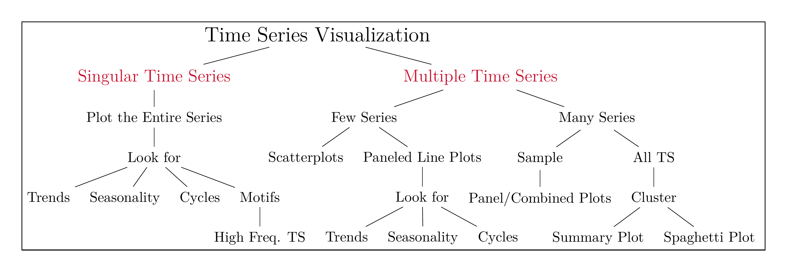

```{r setup, include=FALSE}
knitr::opts_chunk$set(cache = TRUE,
                      echo = TRUE,
                      warning = FALSE,
                      message = FALSE,
                      progress = FALSE, 
                      verbose = FALSE,
                      dev = 'png',
                      dpi = 300,
                      fig.asp = 0.618,
                      fig.align = 'center',
                      out.width = '70%')

options(htmltools.dir.version = FALSE)


miamired = '#C3142D'

if(require(pacman)==FALSE) install.packages("pacman")
if(require(devtools)==FALSE) install.packages("devtools")
if(require(countdown)==FALSE) devtools::install_github("gadenbuie/countdown")
if(require(xaringanExtra)==FALSE) devtools::install_github("gadenbuie/xaringanExtra")
if(require(emo)==FALSE) devtools::install_github("hadley/emo")
if(require(icons)==FALSE) devtools::install_github("mitchelloharawild/icons")

pacman::p_load(gifski, av, gganimate, ggtext, glue, extrafont, # for animations
               emojifont, emo, RefManageR, xaringanExtra, countdown, downlit) # for slides
```

```{r xaringan-themer, include=FALSE, warning=FALSE}
if(require(xaringanthemer) == FALSE) install.packages("xaringanthemer")
library(xaringanthemer)

style_mono_accent(base_color = "#84d6d3",
                  base_font_size = "20px")

xaringanExtra::use_extra_styles(
  hover_code_line = TRUE,         
  mute_unhighlighted_code = TRUE  
)

xaringanExtra::use_xaringan_extra(c("tile_view", "animate_css", "tachyons", "panelset", "share_again", "search", "fit_screen", "editable", "clipboard"))

```


# Quick Refresher from Last Class

`r emo::ji("check")` Describe the syntax, data types, and data structures in `r fontawesome::fa(name = "r-project")`.  

`r emo::ji("check")` Access the help for `r fontawesome::fa(name = "r-project")` functions (each help file has the following components: Description, usage, arguments, value, and examples). 

`r emo::ji("check")` Utilize the project workflow in `r fontawesome::fa(name = "r-project")` and create `r fontawesome::fa(name = "r-project")` script.     

`r emo::ji("x")` Access, subset, and create `ts()` objects in `r fontawesome::fa(name = "r-project")`. 


---

# Learning Objectives for Today's Class

- Examine a line chart for trends, seasonality, and cycles.  

- Explain the grammar of graphics and how it can be used to create time series plots in `r fontawesome::fa('r-project', fill = miamired)`.  

- Create interactive time-series plots by using the [plotly](https://plotly.com/ggplot2/getting-started/) package `r fontawesome::fa('box', fill = 'gold')`.


---
class: inverse, center, middle

# A Taxonomy of Time Series Plots and their Interpretation


---

# A Structured Approach for Time Series Viz

```{r run_latex_file, echo=FALSE, cache=TRUE, results='hide'}
tinytex::xelatex('../../figures/ts_plots.tex')
Sys.sleep(2)
pdftools::pdf_convert('../../figures/ts_plots.pdf', dpi = 600,
                      filenames = '../../figures/ts_plots.png')
Sys.sleep(2)
```

```{r read_ts_taxonomy, echo=FALSE, out.width='100%', fig.alt="A Potential Framework for Time Series Visualization", fig.align='center', fig.cap='A Potential Framework for Time Series Visualization'}

```

.footnote[
<html>
<hr>
</html>

This is my best attempt to improve on the general advice provided in the previous slide. Many of the suggestions, presented in this flow chart, stem from my past and current research/consulting collaborations.

They are by no means a comprehensive list of everything that you can do.
]


---

# The Line Chart

```{r cincy_weather, include=FALSE}
cincy_df = readr::read_csv('../../data/cincy_monthly_weather.csv') |> 
  tidyr::pivot_longer(cols = 2:13, names_to = 'month', values_to = 'temp') |> 
  dplyr::mutate(date = paste(year, month, '01', sep = '-') |> 
                  lubridate::ymd(),
                month = lubridate::month(date, label = T))

cincy_df |> 
  ggplot2::ggplot(ggplot2::aes(x = date, y = temp)) +
  ggplot2::geom_point(ggplot2::aes(color = month)) +
  ggplot2::geom_line() +
  ggplot2::scale_x_date( breaks = scales::pretty_breaks(n=6) ) +
  ggplot2::scale_y_continuous(
    breaks = scales::pretty_breaks(n=5)
  ) +
  ggplot2::scale_color_brewer(palette = 'Paired') +
  ggplot2::labs(
    x = "Date", 
    y = "Monthly Temperature") + 
  ggplot2::theme_bw() +
  ggplot2::theme( panel.grid = ggplot2::element_blank(),
                  legend.position = 'bottom',
                  legend.margin=ggplot2::margin(0,0,0,0),
                  legend.box.margin=ggplot2::margin(-10,-10,-10,-10)) +
  ggplot2::guides(colour = ggplot2::guide_legend(nrow = 2)) -> cincy_plot
```


.pull-left[
```{r cincyplot1, out.width='100%', echo = FALSE, fig.cap='A plot of a long time-series for monthly weather in Cincinnati, with color denoting different months.'}
cincy_plot
```
]

.pull-right[
```{r cincyplot2, out.width='100%', echo=FALSE, fig.cap='A snippet of the time-series (last 5 years) for monthly weather in Cincinnati, with color denoting different months.'}
cincy_plot + 
  tidyquant::coord_x_date(xlim = c(Sys.Date() -lubridate::years(5), Sys.Date()))
```
]


---

# The Line Chart: Practical Considerations

.can-edit.key-activity0_[

**Things to Consider:** .font70[(Insert below)]

  - **Format your data:** ....
  
  - **Entire time-series vs a snippet:** .... 
  
  - **On the Use of Color:** ....
  
  - **On grouping the data:** ....
]


---

# On the Interpretation of Line Charts

`r countdown(minutes = 5, seconds = 0, top = 0, font_size = "2em")`

.panelset[

.panel[.panel-name[Activity]

> Over the next 5 minutes, please identify what you have learned from the charts in each tab.

  - Write down your answers in the last tab (it is editable).  
  
  - Discuss your answers with your neighboring classmates.  
  
  - Be prepared to share these answers with class.

]

.panel[.panel-name[Book Stores]

<center>
<iframe src="https://fred.stlouisfed.org/graph/graph-landing.php?g=ZopX&width=800&height=450" scrolling="no" frameborder="0" style="overflow:hidden; width:800px; height:500px;" allowTransparency="true" loading="lazy"></iframe>
</center>

]


.panel[.panel-name[GDP 1]

<center>
<iframe src="https://fred.stlouisfed.org/graph/graph-landing.php?g=ZorB&width=800&height=450" scrolling="no" frameborder="0" style="overflow:hidden; width:800px; height:500px;" allowTransparency="true" loading="lazy"></iframe>
</center>

]


.panel[.panel-name[GDP 2]

<center>
<iframe src="https://fred.stlouisfed.org/graph/graph-landing.php?g=ZorL&width=800&height=450" scrolling="no" frameborder="0" style="overflow:hidden; width:800px; height:500px;" allowTransparency="true" loading="lazy"></iframe>
</center>
]

.panel[.panel-name[Key Points]

.can-edit.key-activity0b_viz[

**Main Insight(s):** .font70[(Insert below)]

  - **Book Stores:** Trend: ... | Seasonality: ... | Cycle: ...  
  
  - **GDP 1:** Trend: ... | Seasonality: ... | Cycle: ... 
  
  - **GDP 2:** Trend: ... | Seasonality: ... | Cycle: ...
]
]


]


---

# Need Assistance with Trends

```{r trends, echo=FALSE}
retailSales = read.csv('https://fred.stlouisfed.org/graph/fredgraph.csv?bgcolor=%23e1e9f0&chart_type=line&drp=0&fo=open%20sans&graph_bgcolor=%23ffffff&height=450&mode=fred&recession_bars=on&txtcolor=%23444444&ts=12&tts=12&width=1168&nt=0&thu=0&trc=0&show_legend=yes&show_axis_titles=yes&show_tooltip=yes&id=RSCCASN&scale=left&cosd=1992-01-01&coed=2021-12-01&line_color=%234572a7&link_values=false&line_style=solid&mark_type=none&mw=3&lw=2&ost=-99999&oet=99999&mma=0&fml=a&fq=Monthly&fam=avg&fgst=lin&fgsnd=2020-02-01&line_index=1&transformation=lin&vintage_date=2022-01-30&revision_date=2022-01-30&nd=1992-01-01') 

retailSales$DATE = lubridate::ymd(retailSales$DATE)

retailSales |> 
  ggplot2::ggplot(ggplot2::aes(x = DATE, y = RSCCASN)) +
  ggplot2::geom_line() + 
  ggplot2::scale_x_date(breaks = scales::pretty_breaks(n=22)) +
  ggplot2::scale_y_continuous(breaks = scales::pretty_breaks(n=8), labels = scales::comma) +
  ggplot2::labs(x = "Date", y = "Retail Sales", 
       title = "Monthly Retail Sales (RSCCASN) in the U.S.") + 
  ggplot2::theme_bw() +
  ggplot2::geom_smooth(method = "lm") +
  ggplot2::geom_vline(ggplot2::aes(xintercept = as.numeric(as.Date("2001-03-01")), color = 'Recession 1')) +
  ggplot2::geom_vline(ggplot2::aes(xintercept = as.numeric(as.Date("2001-11-01")), color = 'Recession 1')) +
  ggplot2::geom_vline(ggplot2::aes(xintercept = as.numeric(as.Date("2007-12-01")), color = 'Recession 2')) +
  ggplot2::geom_vline(ggplot2::aes(xintercept = as.numeric(as.Date("2009-06-01")), color = 'Recession 2')) +
  ggplot2::geom_vline(ggplot2::aes(xintercept = as.numeric(as.Date("2020-03-01")), color = 'Recession 3')) +
  ggplot2::geom_vline(ggplot2::aes(xintercept = as.numeric(as.Date("2022-01-31")), color = 'Recession 3')) +
  ggplot2::scale_color_manual(name = 'Recessions', 
                     values = c(`Recession 1` = 'darkorange',
                                `Recession 2` = 'deepskyblue',
                                `Recession 3` = 'darkolivegreen')) +
  ggplot2::theme(panel.grid = ggplot2::element_blank(),
                  legend.position = 'bottom',
                  legend.margin=ggplot2::margin(0,0,0,0),
                  legend.box.margin=ggplot2::margin(-10,-10,-10,-10))
```

---

# Need Assistance with Seasonality

In [Section 2.2.1 of our reference book](https://wessexlearning.com/products/principles-of-business-forecasting-2nd-ed-part-i), the authors presented two approaches for considering seasonality. We can replicate them easily in R. Refer to the discussion in the next section for more detail.


---
class: inverse, center, middle

# The Grammar of Graphics and the `ggplot2` package


---

# A Visual Introduction to Graph Layers


```{r gg_layers1, echo=FALSE, out.width='100%', fig.alt="The package ggplot2 is based on the Grammar of Graphics (GG), which is a framework for data visualization that dissects each component of a graph into individual components, creating distinct layers. Using the GG system, we can build graphs step-by-step for flexible, customizable results.", fig.align='center', fig.cap='Schematic of some distinct layers in the Grammar of Graphics.'}
knitr::include_graphics("https://r.qcbs.ca/workshop03/book-en/images/Layers_ggplot.png")
```

.footnote[
<html>
<hr>
</html>

Figure from the QCBS R Workshop Series. It is from [Chapter 05 of their third workshop](https://r.qcbs.ca/workshop03/book-en/grammar-of-graphics-gg-basics.html).
]


---

# The Grammar of Graphics


```{r gg_layers2, echo=FALSE, out.width='57%', fig.alt="An overview of the layers highlighted in the Grammar of Graphics.", fig.align='center', fig.cap='An overview of the layers introduced in the Grammar of Graphics.'}
knitr::include_graphics("https://r.qcbs.ca/workshop03/book-en/images/gglayers.png")
```

.footnote[
<html>
<hr>
</html>

Figure from the QCBS R Workshop Series. It is from [Chapter 05 of their third workshop](https://r.qcbs.ca/workshop03/book-en/grammar-of-graphics-gg-basics.html).
]


---


# Grammar of Graphics Layers: Data

- Data needs to be in a **tidy** format (see next two slides).  

- The [dplyr](https://dplyr.tidyverse.org/reference/dplyr-package.html) and [tidyr](https://tidyr.tidyverse.org/) `r fontawesome::fa('box', fill ='gold')` can help with `tidying` your data. 


---

background-image: url(https://github.com/allisonhorst/stats-illustrations/raw/main/rstats-artwork/tidydata_1.jpg)
background-size: 95% 95%

.footnote[
**Source:** Illustration is from the Openscapes blog [Tidy Data for reproducibility, efficiency, and collaboration](https://www.openscapes.org/blog/2020/10/12/tidy-data/) by Julia Lowndes and Allison Horst
]

???

* In database, this is schema.
* Tidy data principles are a rephrase of third norm in a database schema design.
<https://en.wikipedia.org/wiki/Third_normal_form>, to data scientists.
* tidy data is for human consumption.
* Tabular data is column-oriented format

---

background-image: url(https://github.com/allisonhorst/stats-illustrations/raw/main/rstats-artwork/tidydata_2.jpg)
background-size: contain


.footnote[
**Source:** Illustration is from the Openscapes blog [Tidy Data for reproducibility, efficiency, and collaboration](https://www.openscapes.org/blog/2020/10/12/tidy-data/) by Julia Lowndes and Allison Horst
]


---

# Grammar of Graphics Layers: Aesthetics

**Aesthetics (`ggplot2::aes()`)** are used to make data visible. For example:  

  - `x`, `y`: variable to be plotted along the x and y axes.  
  - `color`: color of geoms (i.e., points, lines, etc) according to the data.
  - `fill`: the inside color of the geom (useful for bar charts).  
  - `group`: what group a geom belongs to (useful in multiple ts).  
  - `shape`: the shape of the plotted point (circle, triangle, filled circle, etc).  
  - `linetype`: the type of line used (solid, dashed, etc).  
  - `size`: size scaling for an extra dimension.  
  - `alpha`: the transparency of the geom
  
  
---

# Identify the Aesthetics Used in the Charts

```{r RSCCASN_data, include=FALSE}
if(require(tidyquant)==F) install.packages('tidyquant')

retail_sales = tidyquant::tq_get(
  x = 'RSCCASN', get = 'economic.data',
  from = '1992-01-01', to = Sys.Date()
  ) |> 
  dplyr::mutate(
    month = lubridate::month(date, label = T),
    year = lubridate::year(date)
  )

```


`r countdown(minutes = 8, seconds = 0, top = 0, font_size = "2em")`

.panelset[

.panel[.panel-name[Activity]

> Over the next 8 minutes, please identify the aesthetics used in each chart.

  - Write down your answers in the right-side of each tab (it is editable).  
  
  - You can discuss your answers with your neighboring classmates.  
  
  - Be prepared to share these answers with class.

]


.panel[.panel-name[Line Chart 1]

.pull-left-2[
```{r retailsales_linechart1, echo = F, out.width='100%'}
retail_sales %>% 
  ggplot2::ggplot(ggplot2::aes(x = date, y = price)) +
  ggplot2::geom_line() + 
  ggplot2::scale_x_date( breaks = scales::pretty_breaks(n=22) ) +
  ggplot2::scale_y_continuous(
    breaks = scales::pretty_breaks(n=8), 
    labels = scales::comma, limits = c(0, 45000)
  ) +
  ggplot2::labs(
    x = "Date", 
    y = "Retail Sales", 
    title = "Monthly Retail Sales (RSCCASN) in the U.S.") + 
  ggplot2::theme_bw() +
  ggplot2::theme( panel.grid = ggplot2::element_blank() )
```
]

.pull-right-2[

.can-edit.key-activity1a_viz[

**Main Aesthetics:** .font70[(Insert below)]

  - `x`: ....  and its class is: .... 
  
  - `y`: .... and its class is: ....
  
  - `group`: ..... 
  
  - `color`: .....
]
]
]


.panel[.panel-name[Line Chart 2]

.pull-left-2[
```{r retailsales_linechart2, echo = F, out.width='100%'}
retail_sales %>% 
  ggplot2::ggplot(ggplot2::aes(x = date, y = price)) +
  ggplot2::geom_line() + 
  ggplot2::geom_point() + 
  ggplot2::scale_x_date( breaks = scales::pretty_breaks(n=8) ) +
  ggplot2::scale_y_continuous(
    breaks = scales::pretty_breaks(n=8), 
    labels = scales::comma, limits = c(0, 45000)
  ) +
  ggplot2::labs(
    x = "Date", 
    y = "Retail Sales", 
    title = "Monthly Retail Sales (RSCCASN) in the U.S.") + 
  ggplot2::theme_bw() +
  ggplot2::theme( panel.grid = ggplot2::element_blank() ) +
  tidyquant::coord_x_date(xlim = c("2021-01-01", "2022-12-31"))
```
]

.pull-right-2[

.can-edit.key-activity1b_viz[

**Main Aesthetics:** .font70[(Insert below)]

  - `x`: ....  and its class is: .... 
  
  - `y`: .... and its class is: ....
  
  - `group`: ..... 
  
  - `color`: .....
]
]
]


.panel[.panel-name[Seasonal Chart 1]

.pull-left-2[
```{r retailsales_linechart3, echo = F, out.width='100%'}
retail_sales %>% 
  dplyr::filter(date >= '2015-01-01' & date <= '2019-12-31') |> 
  dplyr::mutate(year = as.factor(year)) |> 
  ggplot2::ggplot(ggplot2::aes(x = month, y = price, color = year, group = year)) +
  ggplot2::geom_line() + 
  ggplot2::scale_y_continuous(
    breaks = scales::pretty_breaks(n=8), 
    labels = scales::comma, limits = c(15000, 45000)
  ) +
  ggplot2::labs(
    x = "Month", 
    y = "Retail Sales", 
    title = "Monthly Retail Sales (RSCCASN) in the U.S.") + 
  ggplot2::theme_bw() +
  ggplot2::theme( panel.grid = ggplot2::element_blank(),
                  legend.position = 'bottom',
                  legend.margin=ggplot2::margin(0,0,0,0),
                  legend.box.margin=ggplot2::margin(-10,-10,-10,-10))
```
]

.pull-right-2[

.can-edit.key-activity1c_viz[

**Main Aesthetics:** .font70[(Insert below)]

  - `x`: ....  and its class is: .... 
  
  - `y`: .... and its class is: ....
  
  - `group`: ..... 
  
  - `color`: .....
]
]
]


.panel[.panel-name[Seasonal Chart 2]

.pull-left-2[
```{r retailsales_linechart4, echo = F, out.width='100%'}
retail_sales %>% 
  dplyr::filter(date >= '2015-01-01' & date <= '2019-12-31') |> 
  dplyr::mutate(year = as.factor(year)) |> 
  ggplot2::ggplot(ggplot2::aes(x = date, y = price, color = year, group = year)) +
  ggplot2::geom_line() + 
  ggplot2::scale_y_continuous(
    breaks = scales::pretty_breaks(n=8), 
    labels = scales::comma, limits = c(15000, 45000)
  ) +
  ggplot2::labs(
    x = "Date", 
    y = "Retail Sales", 
    title = "Monthly Retail Sales (RSCCASN) in the U.S.") + 
  ggplot2::theme_bw() +
  ggplot2::theme( panel.grid = ggplot2::element_blank(),
                  legend.position = 'bottom',
                  legend.margin=ggplot2::margin(0,0,0,0),
                  legend.box.margin=ggplot2::margin(-10,-10,-10,-10))
```
]

.pull-right-2[

.can-edit.key-activity1d_viz[

**Main Aesthetics:** .font70[(Insert below)]

  - `x`: ....  and its class is: .... 
  
  - `y`: .... and its class is: ....
  
  - `group`: ..... 
  
  - `color`: .....
]
]
]

]

---

# Grammar of Graphics Layers: Aesthetics

- Assigned **globally** to the entire plot via `ggplot2::ggplot(ggplot2::aes())`, or to **specific geoms** (e.g., `ggplot2::geom_point(ggplot2::aes()).` 

.pull-left[
```{r global_aes, echo = F, out.width='100%', fig.cap='The color is passed globally through ggplot(aes(x=date, y=price, color=year)).'}
retail_sales %>% 
  dplyr::filter(date >= '2015-01-01') |> 
  dplyr::mutate(year = as.factor(year)) |> 
  ggplot2::ggplot(ggplot2::aes(x = date, y = price, color = year)) +
  ggplot2::geom_line() + 
  ggplot2::geom_point() + 
  ggplot2::scale_x_date( breaks = scales::pretty_breaks(n=8) ) +
  ggplot2::scale_y_continuous(
    breaks = scales::pretty_breaks(n=8), 
    labels = scales::comma, limits = c(0, 45000)
  ) +
  ggplot2::labs(
    x = "Date", 
    y = "Retail Sales", 
    title = "Monthly Retail Sales (RSCCASN) in the U.S.") + 
  ggplot2::theme_bw() +
  ggplot2::theme( panel.grid = ggplot2::element_blank(),
                  legend.position = 'bottom',
                  legend.margin=ggplot2::margin(0,0,0,0),
                  legend.box.margin=ggplot2::margin(-10,-10,-10,-10)) +
  tidyquant::coord_x_date(xlim = c("2021-01-01", "2022-12-31"))
```
]


.pull-right[
```{r local_aes, echo = F, out.width='100%', fig.cap='The color is passed as an argument within the layer as geom_point(aes(color = year)).'}
retail_sales %>% 
  dplyr::filter(date >= '2015-01-01') |> 
  dplyr::mutate(year = as.factor(year)) |> 
  ggplot2::ggplot(ggplot2::aes(x = date, y = price)) +
  ggplot2::geom_line() + 
  ggplot2::geom_point(ggplot2::aes(color = year)) + 
  ggplot2::scale_x_date( breaks = scales::pretty_breaks(n=8) ) +
  ggplot2::scale_y_continuous(
    breaks = scales::pretty_breaks(n=8), 
    labels = scales::comma, limits = c(0, 45000)
  ) +
  ggplot2::labs(
    x = "Date", 
    y = "Retail Sales", 
    title = "Monthly Retail Sales (RSCCASN) in the U.S.") + 
  ggplot2::theme_bw() +
  ggplot2::theme( panel.grid = ggplot2::element_blank(),
                  legend.position = 'bottom',
                  legend.margin=ggplot2::margin(0,0,0,0),
                  legend.box.margin=ggplot2::margin(-10,-10,-10,-10)) +
  tidyquant::coord_x_date(xlim = c("2021-01-01", "2022-12-31"))
```
]


---

# Grammar of Graphics Layers: Individual Geoms


**Geometric objects** i.e., geoms help determine the type of plot. In this class, we will typically use one or more of the following *geoms*:  

- `ggplot2::geom_point()`: scatterplot or points in a line graph. 

- `ggplot2::geom_line()`: lines connecting points by increasing value of x.  

- `ggplot2::geom_smooth()`: to fit a function line (e.g., linear regression line) based on data.


---

# Grammar of Graphics Layers: Facets

We can use `ggplot2::facet_wrap()` to create small multiples based on a single variable. Arguments for `ggplot2::facet_wrap()` include:   
- `facets` which takes the variable of interest in quotes (i.e., `facets = 'symbol'`);  
- `nrow` and/or `ncol` which take numeric inputs for the number of rows and columns; and  
- `scales`, where we typically use `free_y` to denote that different `ylim` for each panel.

```{r faang, echo=TRUE}
fang_df = tidyquant::tq_get(
  x = c('META', 'AMZN', 'NFLX', 'GOOG'),
  from = '2010-01-01', to = Sys.Date()
)

colnames(fang_df)
```


---
count: false

# Grammar of Graphics Layers: Facets

We can use `ggplot2::facet_wrap()` to create small multiples based on a single variable. Arguments for `ggplot2::facet_wrap()` include:   
- `facets` which takes the variable of interest in quotes (i.e., `facets = 'symbol'`);  
- `nrow` and/or `ncol` which take numeric inputs for the number of rows and columns; and  
- `scales`, where we typically use `free_y` to denote that different `ylim` for each panel.

.pull-left[
```{r faang_linechart, echo = F, out.width='90%', fig.alt='A line chart of the FANG Closing Price Data.'}
fang_df %>% 
  ggplot2::ggplot(ggplot2::aes(x = date, y = adjusted, group = symbol, color = symbol)) +
  ggplot2::geom_line() + 
  ggplot2::geom_point() + 
  ggplot2::scale_x_date( breaks = scales::pretty_breaks(n=8) ) +
  ggplot2::scale_y_continuous(
    breaks = scales::pretty_breaks(n=8), 
    labels = scales::dollar
  ) +
  ggplot2::labs(
    x = "Date", 
    y = "Adjusted Closing Price", 
    title = "A line chart of the adjusted closing price for FANG companies") + 
  ggplot2::theme_bw() +
  ggplot2::theme( panel.grid = ggplot2::element_blank(),
                  legend.position = 'bottom',
                  legend.margin=ggplot2::margin(0,0,0,0),
                  legend.box.margin=ggplot2::margin(-10,-10,-10,-10)) +
  tidyquant::coord_x_date(xlim = c("2021-01-01", Sys.Date()))
```
]


.pull-right[
```{r faang_multiples, echo = F, out.width='90%', fig.alt='A panel chart of the FANG Closing Price Data.'}
fang_df %>% 
  ggplot2::ggplot(ggplot2::aes(x = date, y = adjusted, group = symbol, color = symbol)) +
  ggplot2::geom_line() + 
  ggplot2::geom_point() + 
  ggplot2::scale_x_date( breaks = scales::pretty_breaks(n=4) ) +
  ggplot2::facet_wrap(facets = 'symbol', scales = 'free_y', nrow = 2) +
  ggplot2::scale_y_continuous(
    breaks = scales::pretty_breaks(n=5), 
    labels = scales::dollar
  ) +
  ggplot2::labs(
    x = "Date", 
    y = "Adjusted Closing Price", 
    title = "A panel chart of the adjusted closing price for FANG companies") + 
  ggplot2::theme_bw() +
  ggplot2::theme( panel.grid = ggplot2::element_blank(),
                  legend.position = 'bottom',
                  legend.margin=ggplot2::margin(0,0,0,0),
                  legend.box.margin=ggplot2::margin(-10,-10,-10,-10)) +
  tidyquant::coord_x_date(xlim = c("2021-01-01", Sys.Date()))
```
]


---

# Grammar of Graphics Layers: Coordinates

In class, we will use the following two functions to create **snapshots** of the data:  

- `ggplot2::coord_cartesian()` to set limits. We will specicially use its xlim argument to create a snapshot when the $x$ axis contains a continous variable (e.g., year). See [ggplot2 documentation](https://ggplot2.tidyverse.org/reference/coord_cartesian.html) for more detail.      
- `tidyquant::coord_x_date()` to set limits. We will specicially use its xlim argument to create a snapshot when the $x$ axis contains a date variable (with a `class` of date).  See [tidyquant documentation](https://business-science.github.io/tidyquant/reference/coord_x_date.html) for more detail. 


---

# Grammar of Graphics: Themes

Themes control the overall visual defaults. There are some themes built within the `ggplot2` `r fontawesome::fa('box', 'gold')` (see the [complete themes guide](https://ggplot2.tidyverse.org/reference/ggtheme.html)). For additional themes, please feel free to play with the [ggthemes](https://github.com/jrnold/ggthemes) `r fontawesome::fa('box', 'gold')`.


.pull-left[
```{r fang_theme1, echo=FALSE, out.width='100%', fig.cap='Default ggplot2 theme'}
fang_df %>% 
  ggplot2::ggplot(ggplot2::aes(x = date, y = adjusted, group = symbol, color = symbol)) +
  ggplot2::geom_line() + 
  ggplot2::geom_point() + 
  ggplot2::scale_x_date( breaks = scales::pretty_breaks(n=8) ) +
  ggplot2::scale_y_continuous(
    breaks = scales::pretty_breaks(n=8), 
    labels = scales::dollar
  ) +
  ggplot2::labs(
    x = "Date", 
    y = "Adjusted Closing Price", 
    title = "A line chart of the adjusted closing price for FANG companies") + 
  # ggplot2::theme_bw() +
  # ggplot2::theme( panel.grid = ggplot2::element_blank(),
  #                 legend.position = 'bottom',
  #                 legend.margin=ggplot2::margin(0,0,0,0),
  #                 legend.box.margin=ggplot2::margin(-10,-10,-10,-10)) +
  tidyquant::coord_x_date(xlim = c("2021-01-01", Sys.Date()))
```
]

.pull-right[
```{r fang_theme2, echo=FALSE, out.width='100%', fig.cap='A modified theme (no gridlines, no gray background and caption is place below).'}
fang_df %>% 
  ggplot2::ggplot(ggplot2::aes(x = date, y = adjusted, group = symbol, color = symbol)) +
  ggplot2::geom_line() + 
  ggplot2::geom_point() + 
  ggplot2::scale_x_date( breaks = scales::pretty_breaks(n=8) ) +
  ggplot2::scale_y_continuous(
    breaks = scales::pretty_breaks(n=8), 
    labels = scales::dollar
  ) +
  ggplot2::labs(
    x = "Date", 
    y = "Adjusted Closing Price", 
    title = "A line chart of the adjusted closing price for FANG companies") + 
  ggplot2::theme_bw() +
  ggplot2::theme( panel.grid = ggplot2::element_blank(),
                  legend.position = 'bottom',
                  legend.margin=ggplot2::margin(0,0,0,0),
                  legend.box.margin=ggplot2::margin(-10,-10,-10,-10)) +
  tidyquant::coord_x_date(xlim = c("2021-01-01", Sys.Date()))
```
]


---
class: inverse, center, middle

# Putting it all together


---

# A Singular TS: AAPL's Adj. Close

```{r demo_dataset}
if(require(tidyquant)==F) install.packages("tidyquant") # install if needed
if(require(tidyverse)==F) install.packages('tidyverse') # install if needed

aapl = # get AAPL stock data from 1st trading day after Jan 1, 2020 to now
  tidyquant::tq_get(x = 'AAPL', from = '2020-01-01', to = Sys.Date() ) |> 
  # select (i.e., keep) only the variables below
  dplyr::select( c(date, symbol, adjusted) ) |> 
  # create the following variables: year and month
  dplyr::mutate(
    # date has to be of class Date if not use lubridate::ymd (mdy, dmy, etc)
    # to convert the string variable to date
    year = lubridate::year(date), 
    month = lubridate::month(date, label = T)
  )
tail(aapl, n = 1) # print the last obs  to see what we have 
```


---

# A Singular TS: The GG Layers

.left-code[
.small[
```{r aapl1, eval=FALSE}
# layers are + in ggplot2 #<<
ggplot2::ggplot(aapl) #<<
```
]
]
.right-plot[
```{r aapl1_out, ref.label='aapl1', echo=FALSE, fig.dim=c(4.8, 4), out.width="100%"}

```
]


---
count:false
# A Singular TS: The GG Layers

.left-code[
.small[
```{r aapl2, eval=FALSE}
# layers are + in ggplot2 
ggplot2::ggplot(
  aapl, 
  ggplot2::aes(x = date, y = adjusted) #<<
)
```
]
]
.right-plot[
```{r aapl2_out, ref.label='aapl2', echo=FALSE, fig.dim=c(4.8, 4), out.width="100%"}

```
]


---
count:false
# A Singular TS: The GG Layers

.left-code[
.small[
```{r aapl3, eval=FALSE}
# layers are + in ggplot2 
ggplot2::ggplot(
  aapl, 
  ggplot2::aes(x = date, y = adjusted)
) +
  ggplot2::geom_point() #<<
```
]
]
.right-plot[
```{r aapl3_out, ref.label='aapl3', echo=FALSE, fig.dim=c(4.8, 4), out.width="100%"}

```
]


---
count:false
# A Singular TS: The GG Layers

.left-code[
.small[
```{r aapl4, eval=FALSE}
# layers are + in ggplot2 
ggplot2::ggplot(
  aapl, 
  ggplot2::aes(x = date, y = adjusted)
) +
  ggplot2::geom_point(
    ggplot2::aes(color = month) #<<
  ) 
```
]
]
.right-plot[
```{r aapl4_out, ref.label='aapl4', echo=FALSE, fig.dim=c(4.8, 4), out.width="100%"}

```
]


---
count:false
# A Singular TS: The GG Layers

.left-code[
.small[
```{r aapl5, eval=FALSE}
# layers are + in ggplot2 
ggplot2::ggplot(
  aapl, 
  ggplot2::aes(x = date, y = adjusted)
) +
  ggplot2::geom_point(
    ggplot2::aes(color = month)
  ) +
  ggplot2::geom_line() #<<
```
]
]
.right-plot[
```{r aapl5_out, ref.label='aapl5', echo=FALSE, fig.dim=c(4.8, 4), out.width="100%"}

```
]


---
count:false
# A Singular TS: The GG Layers

.left-code[
.small[
```{r aapl6, eval=FALSE}
# layers are + in ggplot2 
ggplot2::ggplot(
  aapl, 
  ggplot2::aes(x = date, y = adjusted)
) +
  ggplot2::geom_point(
    ggplot2::aes(color = month) 
  ) +
  ggplot2::geom_line() +
  ggplot2::geom_smooth( #<<
    method = lm, formula = 'y ~ x' #<<
    ) #<<
```
]
]
.right-plot[
```{r aapl6_out, ref.label='aapl6', echo=FALSE, fig.dim=c(4.8, 4), out.width="100%"}

```
]


---
count:false
# A Singular TS: The GG Layers

.left-code[
.small[
```{r aapl7, eval=FALSE}
# layers are + in ggplot2 
ggplot2::ggplot(
  aapl, 
  ggplot2::aes(x = date, y = adjusted)
) +
  ggplot2::geom_point(
    ggplot2::aes(color = month) 
  ) +
  ggplot2::geom_line() +
  ggplot2::geom_smooth( 
    method = lm, formula = 'y ~ x'
    )  +
  ggplot2::scale_x_date( #<<
    breaks = scales::pretty_breaks(n=8) #<<
    ) + #<<
  ggplot2::scale_y_continuous( #<<
    breaks = scales::pretty_breaks(n=6), #<<
    labels = scales::dollar) #<<
```
]
]
.right-plot[
```{r aapl7_out, ref.label='aapl7', echo=FALSE, fig.dim=c(4.8, 4), out.width="100%"}

```
]


---
count:false
# A Singular TS: The GG Layers

.left-code[
.small[
```{r aapl8, eval=FALSE}
# layers are + in ggplot2 
ggplot2::ggplot(
  aapl, 
  ggplot2::aes(x = date, y = adjusted)
) +
  ggplot2::geom_point(
    ggplot2::aes(color = month) 
  ) +
  ggplot2::geom_line() +
  ggplot2::geom_smooth( 
    method = lm, formula = 'y ~ x' 
    )  +
  ggplot2::scale_x_date( 
    breaks = scales::pretty_breaks(n=8) 
    ) + 
  ggplot2::scale_y_continuous( 
    breaks = scales::pretty_breaks(n=6), 
    labels = scales::dollar) +
  tidyquant::coord_x_date( #<<
    xlim = c('2023-01-01', '2023-01-31') #<<
    ) #<<
```
]
]
.right-plot[
```{r aapl8_out, ref.label='aapl8', echo=FALSE, fig.dim=c(4.8, 4), out.width="100%"}

```
]


---
count:false
# A Singular TS: The GG Layers

.left-code[
.small[
```{r aapl9, eval=FALSE}
# layers are + in ggplot2 
ggplot2::ggplot(
  aapl, 
  ggplot2::aes(x = date, y = adjusted)
) +
  ggplot2::geom_point(
    ggplot2::aes(color = month) 
  ) +
  ggplot2::geom_line() +
  ggplot2::geom_smooth( 
    method = lm, formula = 'y ~ x' 
    )  +
  ggplot2::scale_x_date( 
    breaks = scales::pretty_breaks(n=8) 
    ) + 
  ggplot2::scale_y_continuous( 
    breaks = scales::pretty_breaks(n=6), 
    labels = scales::dollar) +
  tidyquant::coord_x_date( 
    xlim = c('2023-01-01', '2023-01-31') 
    ) +
  ggplot2::theme_bw(base_size = 14) + #<<
  ggplot2::theme(  #<<
    legend.position = 'bottom' #<<
    ) #<<
```
]
]

.right-plot[
```{r aapl9_out, ref.label='aapl9', echo=FALSE, fig.dim=c(4.8, 4), out.width="100%"}

```
]


---
count:false
# A Singular TS: The GG Layers

.left-code[
.small[
```{r aapl10, eval=FALSE}
# layers are + in ggplot2 
ggplot2::ggplot(
  aapl, 
  ggplot2::aes(x = date, y = adjusted)
) +
  ggplot2::geom_point(
    ggplot2::aes(color = month) 
  ) +
  ggplot2::geom_line() +
  ggplot2::geom_smooth( 
    method = lm, formula = 'y ~ x' 
    )  +
  ggplot2::scale_x_date( 
    breaks = scales::pretty_breaks(n=8) 
    ) + 
  ggplot2::scale_y_continuous( 
    breaks = scales::pretty_breaks(n=6), 
    labels = scales::dollar) +
  tidyquant::coord_x_date( 
    xlim = c('2023-01-01', '2023-01-31') 
    ) +
  ggplot2::theme_bw(base_size = 14) + 
  ggplot2::theme(  
    legend.position = 'bottom' 
    ) -> aapl_plot #<<

plotly::ggplotly(p = aapl_plot) #<<
```
]
]

.right-plot[
```{r aapl10_out, ref.label='aapl10', echo=FALSE, fig.dim=c(4.8, 4), out.height='330px', out.width='350px'}

```
]


---

# So How to Handle `ts()` Objects?

.pull-left[
.small[
```{r jj_forecast_plot}
forecast::autoplot(JohnsonJohnson)
```
]

]

.pull-right[
.small[
```{r jj_ggplot}
jj_df = data.frame(
  date = zoo::as.Date(x = time(JohnsonJohnson)),
  earnings = JohnsonJohnson
)

ggplot2::ggplot(
  jj_df, ggplot2::aes(x = date, y = earnings) ) +
  ggplot2::geom_line()
```
]

]


---

# Multiple TS: A Demo

Let us build a panel seasonal plot of your choice with FRED data. 


---
class: inverse, center, middle

# Recap


---

# Summary of Main Points

By now, you should be able to do the following:  

- Examine a line chart for trends, seasonality, and cycles.  

- Explain the grammar of graphics and how it can be used to create time series plots in `r fontawesome::fa('r-project', fill = miamired)`.  

- Create interactive time-series plots by using the [plotly](https://plotly.com/ggplot2/getting-started/) package `r fontawesome::fa('box', fill = 'gold')`.  


---

# Things to Do to Prepare for Our Next Class

- Go over your notes, read the **references below**, and **complete** the [self-paced R tutorial](http://rstudio.fsb.miamioh.edu:3838/megahefm/isa444/spring2023/datatypes/). 

- Complete [Assignment 02](https://miamioh.instructure.com/courses/188655/assignments/2368786) and [Assignment 03](https://miamioh.instructure.com/courses/188655/quizzes/539069/) on Canvas.  

.pull-left[
.center[[](https://r4ds.had.co.nz)]
]
.pull-right[

* [Data Visualization](https://r4ds.had.co.nz/data-visualisation.html)  

* [Graphics for Communication](https://r4ds.had.co.nz/graphics-for-communication.html)  

* [Dates and Times](https://r4ds.had.co.nz/dates-and-times.html)  

]