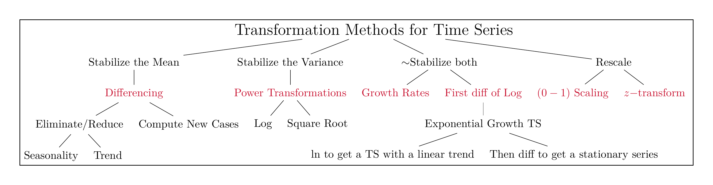

```{r setup, include=FALSE}
knitr::opts_chunk$set(cache = TRUE,
                      echo = TRUE,
                      warning = FALSE,
                      message = FALSE,
                      progress = FALSE, 
                      verbose = FALSE,
                      dev = 'png',
                      dpi = 300,
                      fig.asp = 0.618,
                      fig.align = 'center',
                      out.width = '70%')

options(htmltools.dir.version = FALSE)


miamired = '#C3142D'

if(require(pacman)==FALSE) install.packages("pacman")
if(require(devtools)==FALSE) install.packages("devtools")
if(require(countdown)==FALSE) devtools::install_github("gadenbuie/countdown")
if(require(xaringanExtra)==FALSE) devtools::install_github("gadenbuie/xaringanExtra")
if(require(emo)==FALSE) devtools::install_github("hadley/emo")
if(require(icons)==FALSE) devtools::install_github("mitchelloharawild/icons")

pacman::p_load(gifski, av, gganimate, ggtext, glue, extrafont, # for animations
               emojifont, emo, RefManageR, xaringanExtra, countdown, downlit) # for slides
```

```{r xaringan-themer, include=FALSE, warning=FALSE}
if(require(xaringanthemer) == FALSE) install.packages("xaringanthemer")
library(xaringanthemer)

style_mono_accent(base_color = "#84d6d3",
                  base_font_size = "20px")

xaringanExtra::use_extra_styles(
  hover_code_line = TRUE,         
  mute_unhighlighted_code = TRUE  
)

xaringanExtra::use_xaringan_extra(c("tile_view", "animate_css", "tachyons", "panelset", "share_again", "search", "fit_screen", "editable", "clipboard"))

```


# Quick Refresher from Last Class

`r emo::ji("check")` Examine a line chart for trends, seasonality, and cycles.  

`r emo::ji("check")` Explain the grammar of graphics and how it can be used to create time series plots in `r fontawesome::fa('r-project', fill = miamired)`. 

`r emo::ji("check")` Create interactive time-series plots by using the [plotly](https://plotly.com/ggplot2/getting-started/) package `r fontawesome::fa('box', fill = 'gold')`.


---

# Learning Objectives for Today's Class

- Use numerical summaries to describe a time series.  

- Explain what do we mean by correlation.  

- Apply transformations to a time series.  


---
class: inverse, center, middle

# A Summarizing Time-Series Data


---

# Measures of Average

**Mean:** Given a set of $n$ values $Y_1, \, Y_2, \, \dots, \, Y_n$, the arithmetic mean can be computed as:    
$$\bar{Y} = \frac{Y_1 + Y_2 + \dots + Y_n}{n} = \frac{1}{n}\sum_{i=1}^{i=n}Y_i.$$

<br>


**Order Statistics:**
Given a set of $n$ values $Y_1, \, Y_2, \, \dots, \, Y_n$, we place them in an ascending order to define the order statistics, written as $Y_{(1)}, \, Y_{(2)}, \, \dots, \, Y_{(n)}.$


**Median:**
- If $n$ is odd, $n = 2m + 1$ and the median is $Y_{(m+1)}$.   
- If $n$ is even, $n = 2m$ and the median is the average of the two middle numbers, i.e.,  $\frac{1}{2}[Y_{(m)} + Y_{(m+1)}]$.
  

---

# Measures of Variation

The **range** denotes the difference between the largest and smallest value in a sample:   
$$Range = Y_{(n)} - Y_{(1)}.$$


The **deviation** is defined as the difference between a given observation $Y_i$ and the mean $\bar{Y}$.

The **mean absolute deviation (MAD)** is the average deviations about the mean, irrespective of their sign:
$$
\text{MAD} = \frac{\sum_{i=1}^{i=n}|d_i|}{n}.
$$

The **variance** is the average of the squared deviations around the mean:  
$$
S^2 = \frac{\sum_{i=1}^{i=n}d_i^2}{n-1}.
$$


---

# The GameStop Short Squeeze

.center[
```{r gme_get, echo=FALSE, out.height='300px', out.width='600px', cache=FALSE}
gme_get = tidyquant::tq_get(x = 'GME', from = '2020-01-01') |> 
  dplyr::select(date, adjusted)

gme_get |> 
  ggplot2::ggplot(ggplot2::aes(x = date, y = adjusted)) +
  ggplot2::geom_point() +
  ggplot2::geom_line() +
  ggplot2::scale_x_date(breaks = scales::pretty_breaks(n = 20)) +
  ggplot2::scale_y_continuous(breaks = scales::pretty_breaks(n = 6)) +
  ggplot2::theme_bw() -> static_plot

plotly::ggplotly(
  static_plot,
  tooltip = c("x", "y")
)
  
```
]


---

## Summarizing the GME Short Squeeze: Avg/Var Measures

.pull-left-2[
.font80[
```{r gme_story1, eval=FALSE}
gme_get = 
  tidyquant::tq_get(x = 'GME', from = '2020-01-01') |> 
  dplyr::select(date, adjusted) |> 
  dplyr::mutate(
    year = lubridate::year(date), 
    month = lubridate::month(date, label = T)
  )

gme_get

```
]
]

.pull-right-2[
```{r gme_story1_out, ref.label='gme_story1', echo=FALSE, fig.dim=c(4, 4), out.height='330px', out.width='275px'}

```
]


---
count: false

## Summarizing the GME Short Squeeze: Avg/Var Measures

.pull-left-2[
.font80[
```{r gme_story2, eval=FALSE}
gme_get = 
  tidyquant::tq_get(x = 'GME', from = '2020-01-01') |> 
  dplyr::select(date, symbol, adjusted) |> 
  dplyr::mutate(
    year = lubridate::year(date), 
    month = lubridate::month(date, label = T)
  )

gme_summary = #<<
  gme_get |> #<<
  dplyr::group_by(symbol) #<<

gme_summary

```
]
]

.pull-right-2[
```{r gme_story2_out, ref.label='gme_story2', echo=FALSE, fig.dim=c(4, 4), out.height='330px', out.width='275px'}

```
]


---
count: false

## Summarizing the GME Short Squeeze: Avg/Var Measures

.pull-left-2[
.font80[
```{r gme_story3, eval=FALSE}
gme_get = 
  tidyquant::tq_get(x = 'GME', from = '2020-01-01') |> 
  dplyr::select(date, symbol, adjusted) |> 
  dplyr::mutate(
    year = lubridate::year(date), 
    month = lubridate::month(date, label = T)
  )

gme_summary = 
  gme_get |> 
  dplyr::group_by(symbol) |> 
  dplyr::summarise( #<<
    ajusted_avg = mean(adjusted), #<<
    adjusted_med = median(adjusted), #<<
    adjusted_var = var(adjusted), #<<
    adjusted_sd = sd(adjusted) #<<
  ) #<<

gme_summary |> t() # transposing for printout

```
]
]

.pull-right-2[
```{r gme_story3_out, ref.label='gme_story3', echo=FALSE, fig.dim=c(4, 4), out.height='330px', out.width='275px'}

```
]


---
count: false

## Summarizing the GME Short Squeeze: Avg/Var Measures

.pull-left-2[
.font80[
```{r gme_story4, eval = FALSE}
gme_get = 
  tidyquant::tq_get(x = 'GME', from = '2020-01-01') |> 
  dplyr::select(date, symbol, adjusted) |> 
  dplyr::mutate(
    year = lubridate::year(date), 
    month = lubridate::month(date, label = T)
  )

gme_summary = 
  gme_get |> 
  dplyr::group_by(symbol, year) |> #<<
  dplyr::summarise( 
    ajusted_avg = mean(adjusted), 
    adjusted_med = median(adjusted), 
    adjusted_var = var(adjusted), 
    adjusted_sd = sd(adjusted) 
  )

gme_summary
```

]
]

.pull-right-2[
```{r gme_story4_out, ref.label='gme_story4', echo=FALSE, fig.dim=c(4, 4), out.height='330px', out.width='275px'}

```
]


---
count: false

## Summarizing the GME Short Squeeze: Avg/Var Measures

.pull-left-2[
.font80[
```{r gme_story5, eval=FALSE}
gme_get = 
  tidyquant::tq_get(x = 'GME', from = '2020-01-01') |> 
  dplyr::select(date, symbol, adjusted) |> 
  dplyr::mutate(
    year = lubridate::year(date), 
    month = lubridate::month(date, label = T)
  )

gme_summary = 
  gme_get |> 
  dplyr::group_by(symbol, year, month) |> #<<
  dplyr::summarise( 
    ajusted_avg = mean(adjusted), 
    adjusted_med = median(adjusted), 
    adjusted_var = var(adjusted), 
    adjusted_sd = sd(adjusted) 
  )

print(gme_summary, n=15)
```

]
]

.pull-right-2[
```{r gme_story5_out, ref.label='gme_story5', echo=FALSE, fig.dim=c(4, 4), out.height='330px', out.width='275px'}

```

]


---
class: inverse, center, middle

# Correlation

---

# The Pearson Correlation Coefficient

- **Correlation:** measures the strength of the **linear relationship** between two quantitative variables.

- It can be computed using the `cor()` from base R. Mathematically speaking, the pearson correlation coefficient, $r$, can be computed as
$$r = \frac{\sum_{i=1}^{n} (X_i - \bar{X})(Y_i - \bar{Y})}{\sqrt{\sum_{i=1}^{n}(X_i - \bar{X})^2 \sum_{i=1}^{n}(Y_i - \bar{Y})^2}}$$


- Do **not** use the Pearson Correlation coefficient if both variables are not quantitative. Instead, refer to the `mixed.cor()` from the [psch package](https://personality-project.org/r/psych/help/mixed.cor.html) to compute the correlations for mixtures of continuous, polytomous, and/or dichotomous variables.

- You should supplement **any descriptive summaries with visualizations** to ensure that you are able to interpret the computations correctly.


---

## Supplement Summaries with Viz: Anscombe's Dataset

**In a seminal paper, Anscombe stated:** 

> **Few of us escape being indoctrinated with these notions:** 
>  - numerical **calculations are exact, but graphs are rough**; 
>  - for any particular kind of **statistical data there is just one set of calculations constituting a correct statistical analysis**;  
>  - performing **intricate calculations is virtuous**, whereas **actually looking at the data is cheating**.

He proceeded by stating that 
> a computer should **make both calculations and graphs**. Both sorts of output should be studied; each will contribute to understanding.

Now, let us consider his four datasets, each consisting of eleven (x,y) pairs.

.footnote[
<html>
<hr>
</html>
**Source:** Anscombe, Francis J. 1973. "Graphs in Statistical Analysis." *The American Statistician* 27 (1): 17–21. ([PDF Link](https://www.sjsu.edu/faculty/gerstman/StatPrimer/anscombe1973.pdf)). 

---
count: false

## Supplement Summaries with Viz: Anscombe's Dataset

.font80[
```{r anscombe2, echo=FALSE, out.height='500px'}
DT::datatable(anscombe, rownames = FALSE, options = list(pageLength = 11, dom = 'tip'))
```
]

---
count: false

## Supplement Summaries with Viz: Anscombe's Dataset

.font80[
```{r anscombe3, echo = FALSE, out.height='500px'}
df = 
  Tmisc::quartet |>  
  dplyr::group_by(set) |> 
  dplyr::summarise(
    x.mean = mean(x) |>  round(digits = 2), 
    x.sd = sd(x) |> round(digits = 2),
    y.mean = mean(y) |> round(digits = 2), 
    y.sd = sd(y) |> round(digits = 2),
    corr = cor(x, y) |> round(digits = 2)
    )

DT::datatable(
  df, rownames = FALSE, 
  options = list(pageLength = 5, dom = 'tip')
  )
```
]


---
count: false

## Supplement Summaries with Viz: Anscombe's Dataset

```{r anscombe4, echo=FALSE}
ggplot2::ggplot(Tmisc::quartet, ggplot2::aes(x, y)) + 
  ggplot2::geom_point() + 
  ggplot2::geom_smooth(method = lm, se = FALSE) + 
  ggplot2::facet_wrap(~set) + 
  ggplot2::theme_bw() +
  ggplot2::scale_x_continuous(
    breaks = scales::pretty_breaks(10), limits = c(0, 20)
  ) +
  ggplot2::scale_y_continuous(
    breaks = scales::pretty_breaks(10), limits = c(0,15)
  )
```

---

# Kahoot Competition #02

To assess your understanding and retention of the topics covered so far, you will **compete in a Kahoot competition (consisting of 6 questions)**:  

- Go to <https://kahoot.it/>  

- Enter the game pin, which will be shown during class

- Provide your first (preferred) and last name

- Answer each question within the allocated time window (**fast and correct answers provide more points**)


**Winning the competition involves having as many correct answers as possible AND taking the shortest duration to answer these questions.** The winner `r fontawesome::fa(name = 'trophy', fill = 'gold')` of the competition will receive a $10 Starbucks gift card. Good luck!!!

.footnote[
<html>
<hr>
</html>

**P.S:** The Kahoot competition will have **no impact on your grade**. It is a **fun** way of assessing your knowledge, motivating you to ask questions about topics covered that you do not have a full understanding of it, and providing me with some data to pace class. 
]


---
class: inverse, center, middle

# Transformations

---

# Guidelines for Transforming Time Series Data

```{r run_latex_file, echo=FALSE, cache=TRUE, results='hide'}
tinytex::xelatex('../../figures/transformations.tex')
Sys.sleep(1)
pdftools::pdf_convert('../../figures/transformations.pdf', dpi = 600,
                      filenames = '../../figures/transformations.png')
Sys.sleep(1)
```

```{r read_ts_taxonomy, echo=FALSE, out.width='100%', fig.alt="A classification of common transformation approaches for time series data", fig.align='center', fig.cap='A classification of common transformation approaches for time series data'}

```

.footnote[
<html>
<hr>
</html>

My (incomplete) attempt to provide you with a taxonomy for time series data transformations.
]


---

# Stablize the Mean: Differencing

The plot below shows the number of murdered women per 100,000 people in the U.S. From the plot, we can see that the ts is not stationary. 

```{r murdered_women, echo = F}
women_murdered = 
  readr::read_csv('../../data/murdered_women_per_100000_people.csv') |> 
  dplyr::filter(country == 'United States') |> 
  tidyr::pivot_longer(cols = 2:68, names_to = 'year', values_to = 'murders_per_100000') |> 
  dplyr::mutate(year = as.numeric(year)) |> 
  na.omit()

women_murdered |> 
  ggplot2::ggplot(ggplot2::aes(x = year, y = murders_per_100000)) +
  ggplot2::geom_point(size = 1.25) +
  ggplot2::geom_line() +
  ggplot2::scale_x_continuous(breaks = scales::pretty_breaks(n = 10)) +
  ggplot2::scale_y_continuous(breaks = scales::pretty_breaks(n = 6)) +
  ggplot2::theme_bw()

```

---
count:false

# Stablize the Mean: Differencing

The plot below shows the **first nonseasonal difference**. From the plot, we can see that differencing has reduced the nonstationary nature of the time-series. 

```{r murdered_women2, echo = F}
women_murdered |> 
  dplyr::mutate(diff_murders = murders_per_100000 - dplyr::lag(murders_per_100000)) |> 
  ggplot2::ggplot(ggplot2::aes(x = year, y = diff_murders)) +
  ggplot2::geom_point(size = 1.25) +
  ggplot2::geom_line() +
  ggplot2::scale_x_continuous(breaks = scales::pretty_breaks(n = 10)) +
  ggplot2::scale_y_continuous(breaks = scales::pretty_breaks(n = 6)) +
  ggplot2::theme_bw()
```

---


# Computing the First Nonseasonal Difference

The change in the time series from one period to the next is known as the first nonseasonal difference. It can be computed as follows:  

$$DY_t = Y_t - Y_{t-1}$$

.pull-left-2[
.font80[
```{r murdered_women3, eval=FALSE}
women_murdered_filtered = 
  women_murdered |> # dataset read in previous lines of code
  dplyr::filter(year > 2000)

print(women_murdered_filtered)
```
]
]

.pull-right-2[
```{r murdered_women3_out, ref.label='murdered_women3', echo=FALSE, fig.dim=c(4, 4), out.height='330px', out.width='275px'}

```
]


---
count:false

# Computing the First Nonseasonal Difference

The change in the time series from one period to the next is known as the first nonseasonal difference. It can be computed as follows:  

$$DY_t = Y_t - Y_{t-1}$$

.pull-left-2[
.font80[
```{r murdered_women4, eval=FALSE}
women_murdered_filtered = 
  women_murdered |> # dataset read in previous lines of code
  dplyr::filter(year > 2000)

women_murdered_filtered = #<<
  women_murdered_filtered |> #<<
  dplyr::mutate( #<<
    diff1 = murders_per_100000 - dplyr::lag(murders_per_100000, n = 1), #<<
    diff2 = c(NA, diff(murders_per_100000, lag = 1)) #<<
  ) #<<

print(women_murdered_filtered)
```
]
]

.pull-right-2[
```{r murdered_women4_out, ref.label='murdered_women4', echo=FALSE, fig.dim=c(4.8, 4), out.height='330px', out.width='275px'}

```
]


---

# Computing the First Seasonal Difference

If your data exhibits a seasonal pattern, as illustrated in Slides 6 and 18 in [03_ts_viz.html](https://fmegahed.github.io/isa444/spring2023/class03/03_ts_viz.html), you should employ a **seasonal differencing approach**, you should subtract the difference between an observation and the previous observation from the same season. Let $m$ denote the number of seasons, e.g. $m=4$ for quarterly data. In such a case, the seasonal difference is computed as follows:  

$$DY_{t-m} = Y_t - Y_{t-m}$$


**Note:** In `r fontawesome::fa('r-project', fill = miamired)`, this can be computed by assigning the $x$ argument in the `dplyr::lag()` to $m$, or by setting the $lag$ argument in the `diff()` to $m$.

---

# Stablize the Variance: Power Transformations

.left-code[
.font80[
```{r jj1, eval=FALSE}
# The built-in JohnsonJohnson dataset

forecast::autoplot(JohnsonJohnson) +
  ggplot2::geom_point() + # adding points
  ggplot2::scale_x_continuous(breaks = scales::pretty_breaks(n=6)) +
  ggplot2::scale_y_continuous(breaks = scales::pretty_breaks(n = 6)) +
  ggplot2::theme_bw()
```

]
]

.right-plot[
```{r jj1_out, ref.label='jj1', echo=FALSE}
```
]

---
count: false

# Stablize the Variance: Power Transformations

.left-code[
.font80[
```{r jj2, eval=FALSE}
# The built-in JohnsonJohnson dataset

forecast::autoplot(sqrt(JohnsonJohnson)) + #<<
  ggplot2::geom_point() + # adding points
  ggplot2::scale_x_continuous(breaks = scales::pretty_breaks(n=6)) +
  ggplot2::scale_y_continuous(breaks = scales::pretty_breaks(n = 6)) +
  ggplot2::theme_bw()
```

]
]

.right-plot[
```{r jj2_out, ref.label='jj2', echo=FALSE}
```
]


---
count: false

# Stablize the Variance: Power Transformations

.left-code[
.font80[
```{r jj3, eval=FALSE}
# The built-in JohnsonJohnson dataset

forecast::autoplot(log(JohnsonJohnson)) + #<<
  ggplot2::geom_point() + # adding points
  ggplot2::scale_x_continuous(breaks = scales::pretty_breaks(n=6)) +
  ggplot2::scale_y_continuous(breaks = scales::pretty_breaks(n = 6)) +
  ggplot2::theme_bw()
```

]
]

.right-plot[
```{r jj3_out, ref.label='jj3', echo=FALSE}
```
]


---

# A Note on the Log Transform

The log transformation can be computed as follows:
$$L_t = \ln{(Y_t)}$$

Note that the `log()` in R takes the natural logarithm as its default base, i.e., would transform a variable/statistic based on the above equation.


The reverse transformation using the exponential function is:
$$e^{L_t} = e^{\ln{(Y_t})} = Y_t$$


---
count: false

# The Log Transform

- The primary purpose of the log transform is to **convert exponential growth into linear growth.**

- The transform often has the **secondary purpose of balancing the variance.**  

- Difference in logs and growth rate transformations produce similar results and interpretations (see next slides). 


---

# Stabilizing the Mean and Variance

The **first nonseasonal difference in logarithms** represents the logarithm of the ratio  
$$L_t = \ln{(\frac{Y_t}{Y_{t-1}})} = \ln{(Y_t)} - \ln{(Y_{t-1})}$$


In the absence of seasonality, the **growth rate** for a time series is given by  
$$GY_t = 100 \frac{Y_t - Y_{t-1}}{Y_{t-1}}$$


---
count: false

# Stabilizing the Mean and Variance

.left-code[
.font80[
```{r jj4, eval=FALSE}
# The built-in JohnsonJohnson dataset

forecast::autoplot(
  log(JohnsonJohnson) - log(stats::lag(JohnsonJohnson)) #<<
  ) + 
  ggplot2::geom_point() + # adding points
  ggplot2::scale_x_continuous(breaks = scales::pretty_breaks(n=6)) +
  ggplot2::scale_y_continuous(breaks = scales::pretty_breaks(n = 6)) +
  ggplot2::theme_bw()
```

]
]

.right-plot[
```{r jj4_out, ref.label='jj4', echo=FALSE}
```
]


---
count: false

# Stabilizing the Mean and Variance

.left-code[
.font80[
```{r jj5, eval=FALSE}
# The built-in JohnsonJohnson dataset

forecast::autoplot(
  (JohnsonJohnson - stats::lag(JohnsonJohnson))/ stats::lag(JohnsonJohnson) #<<
  ) + 
  ggplot2::geom_point() + # adding points
  ggplot2::scale_x_continuous(breaks = scales::pretty_breaks(n=6)) +
  ggplot2::scale_y_continuous(breaks = scales::pretty_breaks(n = 6)) +
  ggplot2::theme_bw()
```

]
]

.right-plot[
```{r jj5_out, ref.label='jj5', echo=FALSE}
```
]


---

# A Practical Note about Growth Rates

`r countdown(minutes = 5, seconds = 0, top = 0, font_size = "2em")`

.panelset[

.panel[.panel-name[Activity]

> Over the next 5 minutes, please answer the question in each tab.


]

.panel[.panel-name[Q1]

- **Question 1:** Let us say that an investor purchased 10 stocks of \$GME, on 2021-01-29, at 325/stock. The next trading day, 2021-02-01, the GME stock closed at $225. Compute the growth rate in their portfolio worth (assuming it only has the GME stock) over this time period. 

.can-edit.key-activity4_q1[

**What is their growth rate?** .font70[(Insert below)]

  - Edit me  
  
]
]


.panel[.panel-name[Q2]

- **Question 2:** Let us say that the growth rate, $GY_t = -g$. Now let us assume that the GME stock went up by $g$ (i.e., if it went down 10%, it increased by 10% over the next trading day).  What is the value of the investor's portfolio by stock market closing on 2021-02-02? 

.can-edit.key-activity4_q2[

**What is their growth rate?** .font70[(Insert below)]

  - Edit me  
  
]

]
]


---

# A Live Demo

In this live coding session, we will capitalize on the `mutate()` from [tidyverse](https://www.tidyverse.org/) to create transformations for multiple time series. Specifically, we will use the `tq_get()` from [tidyquant](https://business-science.github.io/tidyquant/) to extract data about the following cryptocurrencies (a) [Cardano](https://cardano.org/) (ADA), (b) [Chainlink](https://chain.link/) (LINK), and (c) [Zilliqa](https://www.zilliqa.com/) (ZIL). We will compute:  

  - Growth Rates  
  - Natural log
  - Log Differences  
  - $[0-1]$ Scaling  
  
Obviously, we will have to ensure that these transformations are computed for each coin separately. For the purpose of this activity, let us extract the data from 2023-01-01 to 2023-02-05. 

```{r demo_transformations, eval = F, include=FALSE}
coins = 
  tidyquant::tq_get(
    c('ADA-USD', 'LINK-USD', 'ZIL-USD'), from = '2023-01-01', to ='2023-02-05'
    )

coins = coins |> 
  dplyr::group_by(symbol) |> 
  dplyr::arrange(symbol, date)

coins =
  coins |> 
  dplyr::mutate(
    growthRate = (adjusted - dplyr::lag(adjusted))/dplyr::lag(adjusted),
    naturalLog = log(adjusted),
    logDiffs = naturalLog - log(dplyr::lag(adjusted)),
    minAdjusted = min(adjusted),
    maxAdjusted = max(adjusted),
    scaledAdjusted = (adjusted - minAdjusted)/(maxAdjusted - minAdjusted)
  ) 
```


---

class: inverse, center, middle

# Recap

---

# Summary of Main Points

By now, you should be able to do the following:  

- Use numerical summaries to describe a time series.  

- Explain what do we mean by correlation. 

- Apply transformations to a time series. 


---

# Things to Do to Prepare for Our Next Class

- Go over your notes and read through [Chapter 2.1-2.5 of our reference book](https://cdn.shopify.com/s/files/1/0859/4364/files/Part_I_POBF-_A_First_Course_in_Forecasting_1.pdf?612).   

- Complete [Assignment 04](https://miamioh.instructure.com/courses/188655/assignments/2377018) on Canvas.

