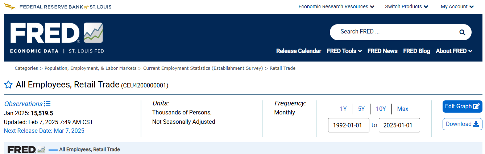

```{r setup, include=FALSE}
knitr::opts_chunk$set(cache = FALSE,
                      echo = TRUE,
                      warning = FALSE,
                      message = FALSE,
                      progress = FALSE, 
                      verbose = FALSE,
                      dev = 'png',
                      fig.height = 2.75,
                      dpi = 300,
                      fig.align = 'center')

options(htmltools.dir.version = FALSE)


miamired = '#C3142D'

if(require(pacman)==FALSE) install.packages("pacman")
if(require(devtools)==FALSE) install.packages("devtools")
if(require(countdown)==FALSE) devtools::install_github("gadenbuie/countdown")
if(require(xaringanExtra)==FALSE) devtools::install_github("gadenbuie/xaringanExtra")
if(require(urbnmapr)==FALSE) devtools::install_github('UrbanInstitute/urbnmapr')
if(require(emo)==FALSE) devtools::install_github("hadley/emo")

pacman::p_load(tidyverse, magrittr, lubridate, janitor, # data analysis pkgs
               DataExplorer, scales, plotly, calendR, pdftools, # plots
               tmap, sf, urbnmapr, tigris, # maps
               bibliometrix, # for bibliometric analysis of my papers
               gifski, av, gganimate, ggtext, glue, extrafont, # for animations
               emojifont, emo, RefManageR, xaringanExtra, countdown) # for slides
```

```{r xaringan-themer, include=FALSE, warning=FALSE}
if(require(xaringanthemer) == FALSE) install.packages("xaringanthemer")
library(xaringanthemer)

style_mono_accent(base_color = "#84d6d3",
                  base_font_size = "20px")

xaringanExtra::use_extra_styles(
  hover_code_line = TRUE,         
  mute_unhighlighted_code = TRUE  
)

xaringanExtra::use_xaringan_extra(c("tile_view", "animate_css", "tachyons", "panelset", "broadcast", "share_again", "search", "fit_screen", "editable", "clipboard"))

```

## Quick Refresher of Last Class

`r emo::ji("check")` Generate and interpret simple line charts

`r emo::ji("check")` Create seasonal plots and subplots

`r emo::ji("check")` Describe a lag and create lag scatter plots  

`r emo::ji("check")` Plot and interpret the autocorrelation function (ACF) for a time-series

---

## Learning Objectives for Today's Class

- Describe and compute centered moving averages  

- Estimate trend-cycle via moving averages  

- Perform classical decomposition (trend-cycle, seasonal, residual/remainder)  

- Understand STL / MSTL as alternatives to classical decomposition


---
class: inverse, center, middle

# Motivation and Context

---

## Recall: Time Series Components

- **Trend**: Long-term increase or decrease in the data  

- **Seasonal**: Regular pattern of up and down fluctuations influenced by calendar or time of day (e.g., quarterly, monthly, day of the week, hourly)  

- **Cyclical**: Repeating up and down movements that are **not of a fixed period** (e.g., business cycles, economic cycles), typically over multiple years


---

## Time Series Decomposition

- **Decomposition** is the process of breaking down a time series into its constituent components: trend-cycle, seasonal, and residual/remainder.  

- **Mathematically**, we can write a time series $y_t$ as a function of these components: $$y_t = f(T_t, \ S_t, \ R_t),$$ where:  
  + $T_t$: Trend-cycle component  
  + $S_t$: Seasonal component    
  + $R_t$: Remainder component
  + $f()$: Some function that combines the components


- The decomposition can be **additive** or **multiplicative**.
  
---

## Seasonality: Additive Models

**Definition:** An additive model is appropriate when the **trend is approximately linear**, and the **seasonal components stays constant over time.**   
It can be written as: $y_t = T_t + S_t + R_t$. 

```{python additive, echo = FALSE, out.width='100%'}
import pandas as pd
import matplotlib.pyplot as plt
import seaborn as sns

retail_sales = (
  pd.read_csv("https://fred.stlouisfed.org/graph/fredgraph.csv?bgcolor=%23ebf3fb&chart_type=line&drp=0&fo=open%20sans&graph_bgcolor=%23ffffff&height=450&mode=fred&recession_bars=on&txtcolor=%23444444&ts=12&tts=12&width=1320&nt=0&thu=0&trc=0&show_legend=yes&show_axis_titles=yes&show_tooltip=yes&id=RSXFSN&scale=left&cosd=2010-01-01&coed=2019-12-01&line_color=%230073e6&link_values=false&line_style=solid&mark_type=none&mw=3&lw=3&ost=-99999&oet=99999&mma=0&fml=a&fq=Monthly&fam=avg&fgst=lin&fgsnd=2020-02-01&line_index=1&transformation=lin&vintage_date=2025-02-12&revision_date=2025-02-12&nd=1992-01-01")
  .rename(columns = {"observation_date": "date", "RSXFSN": "RSXFSN"})
  .assign(
    date = lambda x: pd.to_datetime(x["date"]),
    month = lambda x: x["date"].dt.month_name()
      )
  )

plt.figure(figsize = (10, 3.75))

sns.lineplot(data = retail_sales, x = "date", y = "RSXFSN", color = "black")
sns.scatterplot(data = retail_sales, x = "date", y = "RSXFSN", hue = "month", palette = 'Paired', s=50)

plt.title("Retail Sales (RSXFSN) in the US (2010-2019)")
plt.xlabel("Date")
plt.ylabel("Millions of Dollars")
plt.legend(ncol = 4)

plt.show()
```

---

## Seasonality: Multiplicative Models

**Definition:** A multiplicative model is appropriate when the **trend is nonlinear (e.g., exponential)**, and/or the **seasonal component changes proportionally with the level of the time series.**   
It can be written as: $y_t = T_t \times S_t \times R_t$.


```{python multiplicative, echo = FALSE, out.width='100%'}
import pandas as pd
import matplotlib.pyplot as plt
import seaborn as sns

airpassengers = (
  pd.read_csv("https://raw.githubusercontent.com/jbrownlee/Datasets/master/airline-passengers.csv")
  .rename(columns = {"Month": "date", "Passengers": "passengers"})
  .assign(
    date = lambda x: pd.to_datetime(x["date"]),
    month = lambda x: x["date"].dt.month_name()
      )
  )
  
plt.figure(figsize = (10, 4))
sns.lineplot(data = airpassengers, x = "date", y = "passengers", color = "black")
sns.scatterplot(data = airpassengers, x = "date", y = "passengers", hue = "month", palette = 'Paired', s=50)

plt.title("Airline Passengers (1949-1960)")
plt.xlabel("Date")
plt.ylabel("Passengers in Thousands")
plt.legend(ncol = 4)
plt.show()


```


---

## Motivating Example: US Retail Trade Employment

.panelset[

.panel[.panel-name[Data]
- The [data](https://fred.stlouisfed.org/series/CEU4200000001) contains the **total employment in U.S. retail trade** sector from 1992 to 2025. 

- The [data](https://fred.stlouisfed.org/series/CEU4200000001) is **monthly** and **not seasonally adjusted**.  

```{r fred_capture, echo = FALSE, out.width='90%'}

```


]


.panel[.panel-name[Plot]

```{python retail_emp, echo = FALSE, out.width='100%'}
import pandas as pd
import matplotlib.pyplot as plt
import seaborn as sns

retail_empl = (
  pd.read_csv("https://fred.stlouisfed.org/graph/fredgraph.csv?bgcolor=%23ebf3fb&chart_type=line&drp=0&fo=open%20sans&graph_bgcolor=%23ffffff&height=450&mode=fred&recession_bars=on&txtcolor=%23444444&ts=12&tts=12&width=1320&nt=0&thu=0&trc=0&show_legend=yes&show_axis_titles=yes&show_tooltip=yes&id=CEU4200000001&scale=left&cosd=1992-01-01&coed=2025-01-01&line_color=%230073e6&link_values=false&line_style=solid&mark_type=none&mw=3&lw=3&ost=-99999&oet=99999&mma=0&fml=a&fq=Monthly&fam=avg&fgst=lin&fgsnd=2020-02-01&line_index=1&transformation=lin&vintage_date=2025-02-12&revision_date=2025-02-12&nd=1939-01-01")
  .rename(columns = {"observation_date": "date", "CEU4200000001": "CEU4200000001"})
  .assign(
    date = lambda x: pd.to_datetime(x["date"]),
    month = lambda x: x["date"].dt.month_name()
      )
  )
  
plt.figure(figsize = (10, 4.25))
sns.lineplot(data = retail_empl, x = "date", y = "CEU4200000001", color = "black")
sns.scatterplot(data = retail_empl, x = "date", y = "CEU4200000001", hue = "month", palette = 'Paired', s=50)

plt.title("Retail Trade Employment in the US (1992-2025)")
plt.xlabel("Date")
plt.ylabel("Thousands of Persons")
plt.legend(ncol = 4)
plt.tight_layout()
plt.show()

```

]

.panel[.panel-name[Decomp]

.font80[

.pull-left[
- **Decomposition** is the process of breaking down a time series into its constituent components: trend-cycle, seasonal, and residual/remainder.  

- Here, I am using the **classical decomposition method to decompose** the retail trade employment time series into its components.    

- We will talk about how that is done **later**.  

- What I want you to focus on is **understanding the charts** and the following **concepts**:  
  + Trend-Cycle  
  + DeTrended Series  
  + Seasonally Adjusted Series
]

.pull-right[
```{python decompose_retail_emp, echo = FALSE, include = FALSE, out.width='100%'}
import pandas as pd
import matplotlib.pyplot as plt
import seaborn as sns

from statsmodels.tsa.seasonal import seasonal_decompose
from statsmodels.tsa.seasonal import STL, MSTL

retail_empl = (
  pd.read_csv("https://fred.stlouisfed.org/graph/fredgraph.csv?bgcolor=%23ebf3fb&chart_type=line&drp=0&fo=open%20sans&graph_bgcolor=%23ffffff&height=450&mode=fred&recession_bars=on&txtcolor=%23444444&ts=12&tts=12&width=1320&nt=0&thu=0&trc=0&show_legend=yes&show_axis_titles=yes&show_tooltip=yes&id=CEU4200000001&scale=left&cosd=1992-01-01&coed=2025-01-01&line_color=%230073e6&link_values=false&line_style=solid&mark_type=none&mw=3&lw=3&ost=-99999&oet=99999&mma=0&fml=a&fq=Monthly&fam=avg&fgst=lin&fgsnd=2020-02-01&line_index=1&transformation=lin&vintage_date=2025-02-12&revision_date=2025-02-12&nd=1939-01-01")
  .rename(columns = {"observation_date": "date", "CEU4200000001": "CEU4200000001"})
  .assign(
    date = lambda x: pd.to_datetime(x["date"]),
    month = lambda x: x["date"].dt.month_name()
      )
  )

# Decompose the time series
retail_empl = retail_empl.set_index("date")
retail_empl = retail_empl.asfreq("MS")

res = seasonal_decompose(
  retail_empl["CEU4200000001"], 
  model = "additive"
  )

res_df = pd.DataFrame({
  "observed": res.observed,
  "trend": res.trend,
  "seasonal": res.seasonal,
  "residual": res.resid
  })

res_df.to_csv("../../data/retail_empl_decomp.csv")
```

```{r decompose_retail_emp_out, echo = FALSE}
res_df = read_csv("../../data/retail_empl_decomp.csv")

knitr::kable(
  head(res_df, 11), digits = 1,
  col.names = c("Date", "$y_t$", "$T_t$", "$S_t$", "$R_t$")
  )
```
]
]
]

.panel[.panel-name[Decomp]

```{python decompose_retail_emp2, echo = FALSE, out.width='100%'}
fig = res.plot()
fig.set_size_inches(10, 4.25)
fig.tight_layout()
plt.show()
```
]

.panel[.panel-name[Trend-Cyc]

```{python tc_overlay_retail_emp, echo = FALSE, out.width='100%'}
res_df = pd.DataFrame({
  "observed": res.observed,
  "trend": res.trend,
  "seasonal": res.seasonal,
  "residual": res.resid
  })

# set the date to be a column  
res_df = res_df.reset_index()

plt.figure(figsize = (10, 4.25))
sns.lineplot(data = res_df, x = "date", y = "observed", color = "black", label = "Raw TS", alpha = 0.5)
sns.lineplot(data = res_df, x = "date", y = "trend", color = "blue", label = "Trend-Cycle", alpha = 0.9, linestyle ='-')
plt.title("Retail Trade Employment in the US (1992-2025)")
plt.xlabel("Date")
plt.ylabel("Thousands of Persons")
plt.legend(ncol = 2)
plt.tight_layout()
plt.show()

```
]

.panel[.panel-name[DeTrend]

```{python detrend_retail_emp, echo = FALSE, out.width='100%'}
import pandas as pd
import matplotlib.pyplot as plt
import seaborn as sns

# detrend the time series
res_df = (
  res_df
  .assign(
    detrended = res_df["observed"] - res_df["trend"],
    seasonly_adj = res_df["observed"] - res_df["seasonal"]
    )
)

plt.figure(figsize = (10, 3.75))
sns.lineplot(data = res_df, x = "date", y = "detrended", color = "brown", label = "DeTrended TS")

plt.title("Retail Trade Employment in the US (1992-2025)")
plt.xlabel("Date")
plt.ylabel("Thousands of Persons")
plt.legend(ncol = 1)
plt.tight_layout()
plt.show()
```
.center[.font50[**Note:** The detrended series is obtained by subtracting the trend-cycle component from the observed TS, i.e., $y_t - T_t$.]]
]

.panel[.panel-name[SeasAdj]

```{python deseasonalize_retail_emp, echo = FALSE, out.width='100%'}
plt.figure(figsize = (10, 3.75))
sns.lineplot(data = res_df, x = "date", y = "observed", color = "black", label = "Raw TS", alpha = 0.5)
sns.lineplot(data = res_df, x = "date", y = "seasonly_adj", color = "red", label = "DeSeasonalized TS", alpha = 0.9, linestyle ='-')

plt.title("Retail Trade Employment in the US (1992-2025)")
plt.xlabel("Date")
plt.ylabel("Thousands of Persons")
plt.legend(ncol = 2)
plt.tight_layout()
plt.show()
```
.center[.font50[**Note:** The deasonalized series is obtained by subtracting the seasonal component from the observed TS $y_t - S_t$. It is similar to the seasonally adjusted [USTRADE](https://fred.stlouisfed.org/series/USTRADE) series.]]
]

.panel[.panel-name[Notes]

.can-edit.key-activity5[

- Edit me  
  
- ... 
  
- ...

- ...

- ...  

- ...

- ...

]
]
]


???
From <https://otexts.com/fpp3/components.html>
Seasonally adjusted series contain the remainder component as well as the trend-cycle. Therefore, they are not “smooth”, and “downturns” or “upturns” can be misleading. If the purpose is to look for turning points in a series, and interpret any changes in direction, then it is better to use the trend-cycle component rather than the seasonally adjusted data.


---
class: inverse, center, middle

# Centered Moving Averages


---

## Relation of Moving Averages to Classical Decomposition

- The **classical method of time series decomposition** originated in the 1920s and was widely used until the 1950s. 

- It still **forms the basis of many time series decomposition methods**, so it is important to understand how it works.  

- The **first step in a classical decomposition is to use a moving average method to estimate the trend-cycle**, so we begin by discussing moving averages.


.footnote[
<html>
<hr>
</html>

**Source:** Hyndman, R.J., & Athanasopoulos, G. (2021) Forecasting: principles and practice, 3rd edition, OTexts: Melbourne, Australia. <https://otexts.com/fpp3/>. Accessed on February 12, 2025. [Chapter 3.3](https://otexts.com/fpp3/moving-averages.html) 
]


---

## Moving Average (MA) Smoothing

- **Moving averages** are used to **smooth out short-term fluctuations** and highlight longer-term trends or cycles.  

- In classical decomposition, the **trend-cycle component is estimated using a centered moving average**.

- A **centered moving average** is calculated by taking the average of values on either side of the data point in question.  

- Mathematically,a centered moving average of order $m$ can be written as: $$\hat{T}_{t} = \frac{1}{m} \sum_{j=-k}^k y_{t+j},$$
where $m = 2k + 1$ is the number of values in the moving average.

---

## Activity: Centered Moving Average

`r countdown(minutes = 3, seconds = 0, top = 0, font_size = "2em")`


Let's consider the following series:  $y_t = \{4, 7, 7, 10, 13, 13, 16\}$

Calculate a **centered moving average of order 3**, and **input it in the CMA3 column below.**    
  + Note each **cell** in the table is **editable**, but please **only edit the CMA3 column**.

.font80[
```{r centered_ma, echo = FALSE}
# Define y_t
y_t <- c(4, 7, 7, 10, 13, 13, 16)

# Create a dataframe
time_series_data <- tibble::tibble(
  t = seq_along(y_t),
  y_t = y_t,
  cma3= rep(NA, length(y_t))  # Initialize CMA3 as NA
)

# Render the table with editable cells for CMA3
DT::datatable(
  time_series_data,
  options = list(pageLength = 7, dom ='t', autoWidth = FALSE),
  filter = 'none',
  editable = 'cell',
  rownames = FALSE
)
```
]


---

## Centered Moving Averages in Python

```{python centered_ma_py}
y_t = [4, 7, 7, 10, 13, 13, 16]

df = (
  pd.DataFrame({"t": range(1, len(y_t) + 1), "y_t": y_t})
  .assign(
    cma3 = lambda x: x['y_t'].rolling(window = 3, center = True).mean(),
    cma4r = lambda x: x['y_t'].rolling(window = 4, center = True).mean(),
    cma4l = lambda x: x['cma4r'].shift(-1)
    ) 
  )
df.head(7)
```

**Which of the two CMA4 cols is correct?** .can-edit.key-activity6[Edit me]


---

## Centered Moving Averages as Trend-Cycle Estimators

```{python cma3_plot, echo = FALSE, out.width='100%'}
plt.figure(figsize = (10, 4.25))
sns.lineplot(data = df, x = "t", y = "y_t", color = "black", label = "Raw TS", alpha =0.5)
sns.lineplot(data = df, x = "t", y = "cma3", color = "blue", label = "CMA3", linestyle ='-')
plt.title("Centered Moving Average of Order 3")
plt.xlabel("Time")
plt.ylabel("Value")
plt.legend(ncol = 2)
plt.tight_layout()
plt.show()

```

---

## Moving Average of Moving Averages

When $m$ is even, we often resort to using a **moving average of moving averages** to center the moving average. Let us revisit our previous example:

.font90[
```{python centered_ma_of_ma_py}
df = (
  pd.DataFrame({"t": range(1, len(y_t) + 1), "y_t": y_t})
  .assign(
    cma3 = lambda x: x['y_t'].rolling(window = 3, center = True).mean(),
    cma4r = lambda x: x['y_t'].rolling(window = 4, center = True).mean(),
    cma4l = lambda x: x['cma4r'].shift(-1),
    cma4_2 = lambda x: x['cma4l'].rolling(window = 2, center = True).mean(), #<<
    cma4_2_alt = lambda x: (x['cma4r'] + x['cma4l'])/2 #<<
    ) 
  )
df.head(7)
```
]


---

## Moving Average of Moving Averages (Cont.)

When a 2-MA follows a moving average of an even order (such as 4), it is called a “centered moving average of order 4”. 

This is because the results are now symmetric. 

To see that this is the case, we can write the $2\times 4$-MA (named as `cma4_2` or `cma4_2_alt` in our Python code) as follows:

$$
\begin{align*}
  \hat{T}_{t} &= \frac{1}{2}\Big[
    \frac{1}{4} (y_{t-2}+y_{t-1}+y_{t}+y_{t+1}) +
    \frac{1}{4} (y_{t-1}+y_{t}+y_{t+1}+y_{t+2})\Big] \\
             &= \frac{1}{8}y_{t-2}+\frac14y_{t-1} +
             \frac14y_{t}+\frac14y_{t+1}+\frac18y_{t+2}.
\end{align*}
$$

It is now a **weighted average of observations that is symmetric**.


.footnote[
<html>
<hr>
</html>

**Source:** Hyndman, R.J., & Athanasopoulos, G. (2021) Forecasting: principles and practice, 3rd edition, OTexts: Melbourne, Australia. <https://otexts.com/fpp3/>. Accessed on February 12, 2025. [Chapter 3.3](https://otexts.com/fpp3/moving-averages.html) 
]


---

## Centered Moving Averages for Trend-Cycle Estimation 

📊 **Key Idea:**  
Centered moving averages (CMAs) help estimate the **trend-cycle** by smoothing seasonal fluctuations.

<br>

**Example: 2 × 4 - MA**  

$$\hat{T}_t = \frac{1}{8}y_{t-2} + \frac{1}{4}y_{t-1} + \frac{1}{4}y_t + \frac{1}{4}y_{t+1} + \frac{1}{8}y_{t+2}$$
<br>

✅ **Balances** data across  quarters  
✅ **Averages out seasonal /quarterly variation**  

---

## Choosing the Right Moving Average

| **Seasonal Period (m)** | **Recommended MA** |
|----------------|----------------|
| **Even** (e.g., 12 months, 4 quarters) | **2 × m - MA** |
| **Odd** (e.g., 7 days) | **m-MA** |

<br>

✔ **2 × 12 - MA** for monthly seasonality in annual data  
✔ **2 × 4 - MA** for quarterly seasonality in annual data  
✔ **7-MA** for weekly seasonality in daily data  

<br>

⚠ **Beware!**  
Using the wrong MA order **retains seasonal noise** instead of extracting the trend.

---

## Activity: Trend-Cycle Estimation Using CMAs

`r countdown(minutes = 5, seconds = 0, top = 0, font_size = "2em")`

.panelset[

.panel[.panel-name[Data]

- Download the [CEU4200000001](https://fred.stlouisfed.org/graph/fredgraph.csv?bgcolor=%23ebf3fb&chart_type=line&drp=0&fo=open%20sans&graph_bgcolor=%23ffffff&height=450&mode=fred&recession_bars=on&txtcolor=%23444444&ts=12&tts=12&width=1320&nt=0&thu=0&trc=0&show_legend=yes&show_axis_titles=yes&show_tooltip=yes&id=USTRADE&scale=left&cosd=1992-01-01&coed=2025-01-01&line_color=%230073e6&link_values=false&line_style=solid&mark_type=none&mw=3&lw=3&ost=-99999&oet=99999&mma=0&fml=a&fq=Monthly&fam=avg&fgst=lin&fgsnd=2020-02-01&line_index=1&transformation=lin&vintage_date=2025-02-12&revision_date=2025-02-12&nd=1939-01-01), capturing the **total employment in U.S. retail trade** sector from 1992 to 2025.  

- The data is **monthly** and **not seasonally adjusted**.  

- Use an **appropriate moving average** to estimate the trend-cycle component.  

- Recreate the plot of raw series and the trend-cycle component from the next tab.  

]

.panel[.panel-name[Plot]

```{python retail_empl_cma, echo = FALSE, out.width='100%'}
import pandas as pd
import matplotlib.pyplot as plt
import seaborn as sns

retail_empl = (
  pd.read_csv("https://fred.stlouisfed.org/graph/fredgraph.csv?bgcolor=%23ebf3fb&chart_type=line&drp=0&fo=open%20sans&graph_bgcolor=%23ffffff&height=450&mode=fred&recession_bars=on&txtcolor=%23444444&ts=12&tts=12&width=1320&nt=0&thu=0&trc=0&show_legend=yes&show_axis_titles=yes&show_tooltip=yes&id=CEU4200000001&scale=left&cosd=1992-01-01&coed=2025-01-01&line_color=%230073e6&link_values=false&line_style=solid&mark_type=none&mw=3&lw=3&ost=-99999&oet=99999&mma=0&fml=a&fq=Monthly&fam=avg&fgst=lin&fgsnd=2020-02-01&line_index=1&transformation=lin&vintage_date=2025-02-12&revision_date=2025-02-12&nd=1939-01-01")
  .rename(columns = {"observation_date": "date", "CEU4200000001": "CEU4200000001"})
  .assign(
    date = lambda x: pd.to_datetime(x["date"]),
    month = lambda x: x["date"].dt.month_name(),
    cmar = lambda x: x['CEU4200000001'].rolling(window = 12, center = True).mean().round(1),
    cmal = lambda x: x['cmar'].shift(-1),
    cma_2 = lambda x: (x['cmar'] + x['cmal'])/2
      )
  )
  
plt.figure(figsize = (10, 4.25))
sns.lineplot(data = retail_empl, x = "date", y = "CEU4200000001", color = "black", label = "Raw TS", alpha = 0.5)
sns.lineplot(data = retail_empl, x = "date", y = "cma_2", color = "blue", label = "CMA", linestyle ='-')
plt.title("Retail Trade Employment in the US (1992-2025)")
plt.xlabel("Date")
plt.ylabel("Thousands of Persons")
plt.legend(ncol = 2)
plt.tight_layout()
plt.show()

```
]

.panel[.panel-name[Printout]

.font80[
```{python retail_empl_cma_printout, echo = FALSE}
import numpy as np

dots = pd.DataFrame(
  np.full((1, retail_empl.shape[1]), '...'), 
  columns=retail_empl.columns
  )
dots.index = ['...']

formatted_df = pd.concat(
  [retail_empl.iloc[:10, :], dots, retail_empl.iloc[-10:, :]]
  )

# drop time from date if it exists
formatted_df['date'] = formatted_df['date'].astype(str).str.replace(' 00:00:00', '')
 
print(formatted_df)
```
]
]
]


---
class: inverse, center, middle

# Classical Decomposition

---

## Classical Decomposition

.content-box-grey[
**Additive decomposition:** $y_t = T_t+S_t+R_t = \hat{T}_t + \hat{S}_t + \hat{R}_t$  

**Multiplicative decomposition:** $y_t = T_t\times S_t\times R_t = \hat{T}_t\times \hat{S}_t\times\hat{R}_t$
]


- **Estimate** $\hat{T}$ using $(2\times m)$-MA if $m$ is even. Otherwise, estimate $\hat{T}$ using $m$-MA

- **Compute de-trended series** using: (a) $y_t - \hat{T}_t$ for additive decomposition, and (b) $y_t/\hat{T}_t$ for multiplicative decomposition.

- Once de-trended, **we are left with** the $S_t$ and $R_t$ components. Specifically:  
  * **Additive model:** $y_t-\hat{T}_t  = (\hat{T}_t+\hat{S}_t+\hat{R}_t) - \hat{T}_t = \hat{S}_t+\hat{R}_t$   
  * **Multiplicative model:** $\frac{y_t}{\hat{T}_t} = \frac{\hat{T}_t\times \hat{S}_t\times \hat{R}_t}{\hat{T}_t} = \hat{S}_t\times \hat{R}_t$
  
.footnote[
<html>
<hr>
</html>

**Source:** Hyndman, R.J., & Athanasopoulos, G. (2021) Forecasting: principles and practice, 3rd edition, OTexts: Melbourne, Australia. <https://otexts.com/fpp3/>. Accessed on February 12, 2025. [Chapter 3.4 Slides](https://github.com/robjhyndman/fpp3_slides/blob/main/3-4-classical-decomposition.Rmd) 
]

---

## Estimating Seasonal Component

- The **seasonal component** can be estimated by **averaging** the **detrended series** for that season across all years.  

- For example, if we have monthly data, we can estimate the seasonal index for January by averaging all the January values in the detrended series.  Do this for each month to get the seasonal index.  

- **Adjust** the seasonal indices to ensure that that:  
    * for additive: $S^{(1)}+S^{(2)}+\ldots+S^{(12)}=0$ 
    * for multiplicative: $S^{(1)}+S^{(2)}+\ldots+S^{(12)}=m$  
    
- The **seasonal component** is then obtained by **repeating** the **seasonal indices** for each year in the data.

.footnote[
<html>
<hr>
</html>

**Source:** Hyndman, R.J., & Athanasopoulos, G. (2021) Forecasting: principles and practice, 3rd edition, OTexts: Melbourne, Australia. <https://otexts.com/fpp3/>. Accessed on February 12, 2025. [Chapter 3.4 Slides](https://github.com/robjhyndman/fpp3_slides/blob/main/3-4-classical-decomposition.Rmd) 
]


---

## Estimating the Remainder Component

Additive decomposition: $\hat{R}_t = y_t - \hat{T}_t - \hat{S}_t$

Multiplicative decomposition: $\hat{R}_t = y_t / (\hat{T}_t\hat{S}_t)$


---

## Classical Decomposition in Python (Ref)

```{r classical_decomp_web, echo=FALSE}
knitr::include_url("https://www.statsmodels.org/devel/generated/statsmodels.tsa.seasonal.seasonal_decompose.html", height = "500px")
```

---

## Classical Decomposition in Python (Code-Add)

.font90[
```{python classical_decomp_py_add, results='hide'}
from statsmodels.tsa.seasonal import seasonal_decompose

retail_empl = (
  pd.read_csv("https://fred.stlouisfed.org/graph/fredgraph.csv?bgcolor=%23ebf3fb&chart_type=line&drp=0&fo=open%20sans&graph_bgcolor=%23ffffff&height=450&mode=fred&recession_bars=on&txtcolor=%23444444&ts=12&tts=12&width=1320&nt=0&thu=0&trc=0&show_legend=yes&show_axis_titles=yes&show_tooltip=yes&id=CEU4200000001&scale=left&cosd=1992-01-01&coed=2025-01-01&line_color=%230073e6&link_values=false&line_style=solid&mark_type=none&mw=3&lw=3&ost=-99999&oet=99999&mma=0&fml=a&fq=Monthly&fam=avg&fgst=lin&fgsnd=2020-02-01&line_index=1&transformation=lin&vintage_date=2025-02-12&revision_date=2025-02-12&nd=1939-01-01")
  .rename(columns = {"observation_date": "date", "CEU4200000001": "CEU4200000001"})
  .assign(
    date = lambda x: pd.to_datetime(x["date"]),
      )
  )

# Set the date as index and set the frequency of the data
retail_empl = retail_empl.set_index("date")
retail_empl = retail_empl.asfreq("MS")

# Decompose the time series
res = seasonal_decompose( retail_empl["CEU4200000001"], model = "additive")

# Extract the trend, seasonal, and residual components
res_df = pd.DataFrame({
  "observed": res.observed, "trend": res.trend, "seasonal": res.seasonal, "residual": res.resid
  })

# Plot the decomposed time series
fig = res.plot()
fig.set_size_inches(10, 4.75)
fig.tight_layout()
```
]


---

## Classical Decomposition in Python (Output-Add)

```{python classical_decomp_py_out_add, echo=FALSE, ref.label='classical_decomp_py_add', out.width='100%'}

plt.show()

```

.footnote[
<html>
<hr>
</html>

**Comment:** You can have more control over the plot by plotting the data frame `res_df` directly. See this example from [StackOverflow](https://stackoverflow.com/a/55350230/10156153), while noting that their `decomposition` is equivalent to our `res` object. You can also convert the data into a long format using `pd.melt`, then `.reset_index()` to convert date into a column, and plot it using `sns.relplot`. 
]


---

## Classical Decomposition in Python (Code-Mult)

.font90[
```{python classical_decomp_py_mult, results='hide'}
from statsmodels.tsa.seasonal import seasonal_decompose

retail_empl = (
  pd.read_csv("https://fred.stlouisfed.org/graph/fredgraph.csv?bgcolor=%23ebf3fb&chart_type=line&drp=0&fo=open%20sans&graph_bgcolor=%23ffffff&height=450&mode=fred&recession_bars=on&txtcolor=%23444444&ts=12&tts=12&width=1320&nt=0&thu=0&trc=0&show_legend=yes&show_axis_titles=yes&show_tooltip=yes&id=CEU4200000001&scale=left&cosd=1992-01-01&coed=2025-01-01&line_color=%230073e6&link_values=false&line_style=solid&mark_type=none&mw=3&lw=3&ost=-99999&oet=99999&mma=0&fml=a&fq=Monthly&fam=avg&fgst=lin&fgsnd=2020-02-01&line_index=1&transformation=lin&vintage_date=2025-02-12&revision_date=2025-02-12&nd=1939-01-01")
  .rename(columns = {"observation_date": "date", "CEU4200000001": "CEU4200000001"})
  .assign(
    date = lambda x: pd.to_datetime(x["date"]),
      )
  )

# Set the date as index and set the frequency of the data
retail_empl = retail_empl.set_index("date")
retail_empl = retail_empl.asfreq("MS")

# Decompose the time series
res = seasonal_decompose( retail_empl["CEU4200000001"], model = "multiplicative")

# Extract the trend, seasonal, and residual components
res_df = pd.DataFrame({
  "observed": res.observed, "trend": res.trend, "seasonal": res.seasonal, "residual": res.resid
  })

# Plot the decomposed time series
fig = res.plot()
fig.set_size_inches(10, 4.75)
fig.tight_layout()
```
]


---

## Classical Decomposition in Python (Output-Mult)

```{python classical_decomp_py_out_mult, echo=FALSE, ref.label='classical_decomp_py_mult', out.width='100%'}

plt.show()

```

.footnote[
<html>
<hr>
</html>

**Comment:** You can have more control over the plot by plotting the data frame `res_df` directly. See this example from [StackOverflow](https://stackoverflow.com/a/55350230/10156153), while noting that their `decomposition` is equivalent to our `res` object. You can also convert the data into a long format using `pd.melt`, then `.reset_index()` to convert date into a column, and plot it using `sns.relplot`. 
]


---

## Comments on the Classical Decomposition

- Estimate of trend is **unavailable** for first few and last few observations.  
- The **seasonal component repeats** from year to year, which may not be realistic (especially for long time-series).  

- Since the trend-cycle is estimated using an average-based method, it is **not robust to outliers**.  

- **Newer methods** are designed to overcome these problems.

.footnote[
<html>
<hr>
</html>

**Source:** Hyndman, R.J., & Athanasopoulos, G. (2021) Forecasting: principles and practice, 3rd edition, OTexts: Melbourne, Australia. <https://otexts.com/fpp3/>. Accessed on February 12, 2025. [Chapter 3.4 Slides](https://github.com/robjhyndman/fpp3_slides/blob/main/3-4-classical-decomposition.Rmd) 
]


---
class: inverse, center, middle

# STL Decomposition


---

## Seasonal-Trend Decomposition using LOESS (STL)

- **STL** is a very flexible method for decomposing time series.  

- It can handle **any type of seasonality**, and allows for **non-constant** seasonal patterns.  

- It is robust to **outliers**.  

- However, it:   
  - **cannot** handle trading day or calendar adjustments, and  
  - it is only **additive** (take logs to get multiplicative decomposition).

---

## STL Decomposition in Python (Ref)

```{r stl_decomp_web, echo=FALSE}

knitr::include_url("https://www.statsmodels.org/devel/generated/statsmodels.tsa.seasonal.STL.html", height = "500px")

```


---

## STL Decomposition in Python (Code)

.font90[
```{python stl_decomp_py, results='hide'}
from statsmodels.tsa.seasonal import STL

retail_empl = (
  pd.read_csv("https://fred.stlouisfed.org/graph/fredgraph.csv?bgcolor=%23ebf3fb&chart_type=line&drp=0&fo=open%20sans&graph_bgcolor=%23ffffff&height=450&mode=fred&recession_bars=on&txtcolor=%23444444&ts=12&tts=12&width=1320&nt=0&thu=0&trc=0&show_legend=yes&show_axis_titles=yes&show_tooltip=yes&id=CEU4200000001&scale=left&cosd=1992-01-01&coed=2025-01-01&line_color=%230073e6&link_values=false&line_style=solid&mark_type=none&mw=3&lw=3&ost=-99999&oet=99999&mma=0&fml=a&fq=Monthly&fam=avg&fgst=lin&fgsnd=2020-02-01&line_index=1&transformation=lin&vintage_date=2025-02-12&revision_date=2025-02-12&nd=1939-01-01")
  .rename(columns = {"observation_date": "date", "CEU4200000001": "CEU4200000001"})
  .assign(
    date = lambda x: pd.to_datetime(x["date"]),
      )
  )

retail_empl = retail_empl.set_index("date")
retail_empl = retail_empl.asfreq("MS")

# Decompose the time series
stl = STL(retail_empl["CEU4200000001"], seasonal = 13, robust = True) #<<
res = stl.fit() #<<

# Extract the trend, seasonal, and residual components
res_df = pd.DataFrame({
  "observed": res.observed, "trend": res.trend, "seasonal": res.seasonal, "residual": res.resid
  })

# Plot the decomposed time series
fig = res.plot()
fig.set_size_inches(10, 4.75)
fig.tight_layout()
```
]


---

## STL Decomposition in Python (Out)

```{python stl_decomp_py_out, echo=FALSE, ref.label='stl_decomp_py', out.width='100%'}

plt.show()

```


---

## STL Decomposition vs Classical Decomposition

`r countdown(minutes = 2, seconds = 0, top = 0, font_size = "2em")`

.black[.bold[In two minutes, examine the differences between the output figures from the classical decomposition (additive) and the STL decomposition.]]

.can-edit.key-activity7[

- Edit me  
  
- ... 
  
- ...

- ...

- ...  

- ...

]


---

class: inverse, center, middle

# Recap

---

## Summary of Main Points

By now, you should be able to do the following:  

- Describe and compute centered moving averages  

- Estimate trend-cycle via moving averages  

- Perform classical decomposition (trend-cycle, seasonal, residual/remainder)  

- Understand STL / MSTL as alternatives to classical decomposition

---

## 📝 Review and Clarification 📝

1. **Class Notes**: Take some time to revisit your class notes for key insights and concepts.
2. **Zoom Recording**: The recording of today's class will be made available on Canvas approximately 3-4 hours after the session ends.
3. **Questions**: Please don't hesitate to ask for clarification on any topics discussed in class. It's crucial not to let questions accumulate. 

---

## 🎯 Assignment 🎯

- In preparation for the assignment, you are encouraged to thoroughly read the following:  
  - [MSTL API Reference](https://www.statsmodels.org/devel/generated/statsmodels.tsa.seasonal.MSTL.html) from the statsmodels package.  
  - [Multi-Seasonal Time Series Decomposition using MSTL in Python](https://towardsdatascience.com/multi-seasonal-time-series-decomposition-using-mstl-in-python-136630e67530/), a Towards Data Science Blog, which demonstrates how the MSTL method works and can be implemented on a similar dataset.  

- Skim through the [MSTL Research Paper](https://arxiv.org/pdf/2107.13462).  

- Once you read the references and went over our class notes, you are now ready to examine and complete [Assignment 04](https://miamioh.instructure.com/courses/230182/assignments/3067706).  


```{python assign_data_clean, echo=FALSE, eval=FALSE, include=FALSE}
import pandas as pd
import matplotlib.pyplot as plt

# Define file paths for the three datasets
file_paths = [
    '../../data/Actual_Hourly_Loads_by_Class_2024.xlsx'
]

# Function to process each file and extract relevant columns
def process_file(file_path):
    data = pd.read_excel(file_path, sheet_name='Total Usage', header=1)
    selected_data = data[['REPORT DAY', 'HOUR ENDING', 'TOTAL']]
    selected_data.columns = ['Date', 'Hour', 'Total Usage']
    selected_data['Date'] = pd.to_datetime(selected_data['Date'])
    selected_data['Weekday'] = selected_data['Date'].dt.day_name()
    selected_data['Month'] = selected_data['Date'].dt.strftime('%b')
    return selected_data

# Combine all datasets
all_data = pd.concat([process_file(file_path) for file_path in file_paths])

# Create datetime column by leveraging Date and Hour columns
all_data['Datetime'] = all_data['Date'] + pd.to_timedelta(all_data['Hour'], unit='h') + pd.to_timedelta(-1, unit='h')

# if datetime column is not unique, drop duplicates
all_data = all_data.drop_duplicates(subset='Datetime')
all_data = all_data[['Datetime', 'Month', 'Weekday', 'Hour', 'Total Usage']]
all_data.to_csv('../../data/processed_duke_data.csv', index=False)

```

```{python assign_sol, echo=FALSE, eval=FALSE, include=FALSE}
from statsmodels.tsa.seasonal import MSTL

# Load the processed data
duke_data = (
  pd.read_csv('../../data/processed_duke_data.csv')
  .assign(
    Datetime = lambda x: pd.to_datetime(x['Datetime'])
    )
  .set_index('Datetime')
  [['Total Usage']]
  )

res = MSTL(duke_data['Total Usage'], periods = (24, 24*7)).fit()  

res_df = (
  pd.DataFrame({
  "observed": res.observed, 
  "trend": res.trend, 
  "hourly_seasonal": res.seasonal['seasonal_24'], 
  "daily_seasonal": res.seasonal['seasonal_168'],
  "residual": res.resid
  })
  .reset_index()
  .assign(
    Date = lambda x: x['Datetime'].dt.date,
    Month = lambda x: x['Datetime'].dt.month_name(),
    Day = lambda x: x['Datetime'].dt.day_name(),
    Hour = lambda x: x['Datetime'].dt.hour
    )
  )

res_df_tall = pd.melt(
  res_df, 
  id_vars = ['Datetime', 'Date', 'Month', 'Day', 'Hour'], 
  value_vars = ['observed', 'trend', 'hourly_seasonal', 'daily_seasonal', 'residual'],
  var_name = 'Component', value_name = 'Usage'
  )


plt.figure(figsize = (10, 4.75))
g = sns.relplot(
  data = res_df_tall.query('Datetime >= "2024-06-01" & Datetime < "2024-06-30"'), 
  x = 'Datetime', y = 'Usage', hue = 'Day', style = 'Date',
  kind = 'line', row = 'Component', aspect = 2,
  facet_kws = {'sharey': False},
  palette = 'Dark2', legend = False
  )

for key, ax in g.axes_dict.items():
    ax.set_ylabel(key.replace("_", " ").title())
    ax.set_title("")

plt.tight_layout()
plt.show()

```

  
