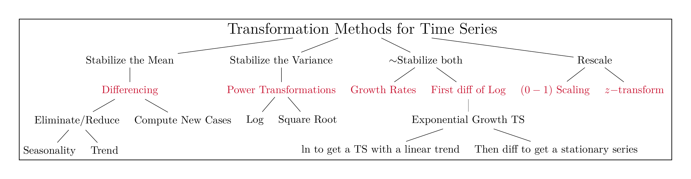
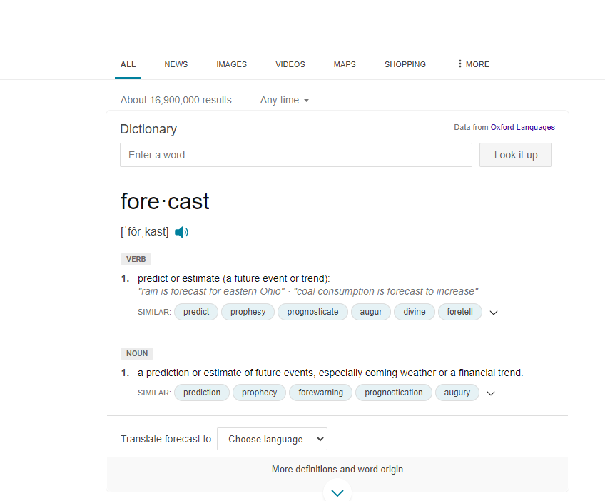

```{r setup, include=FALSE}
knitr::opts_chunk$set(cache = TRUE,
                      echo = TRUE,
                      warning = FALSE,
                      message = FALSE,
                      progress = FALSE, 
                      verbose = FALSE,
                      dev = 'png',
                      dpi = 300,
                      fig.asp = 0.618,
                      fig.align = 'center',
                      out.width = '70%')

options(htmltools.dir.version = FALSE)


miamired = '#C3142D'

if(require(pacman)==FALSE) install.packages("pacman")
if(require(devtools)==FALSE) install.packages("devtools")
if(require(countdown)==FALSE) devtools::install_github("gadenbuie/countdown")
if(require(xaringanExtra)==FALSE) devtools::install_github("gadenbuie/xaringanExtra")
if(require(emo)==FALSE) devtools::install_github("hadley/emo")
if(require(icons)==FALSE) devtools::install_github("mitchelloharawild/icons")

pacman::p_load(gifski, av, gganimate, ggtext, glue, extrafont, # for animations
               emojifont, emo, RefManageR, xaringanExtra, countdown, downlit) # for slides
```

```{r xaringan-themer, include=FALSE, warning=FALSE}
if(require(xaringanthemer) == FALSE) install.packages("xaringanthemer")
library(xaringanthemer)

style_mono_accent(base_color = "#84d6d3",
                  base_font_size = "20px")

xaringanExtra::use_extra_styles(
  hover_code_line = TRUE,         
  mute_unhighlighted_code = TRUE  
)

xaringanExtra::use_xaringan_extra(c("tile_view", "animate_css", "tachyons", "panelset", "share_again", "search", "fit_screen", "editable", "clipboard"))

```


# Quick Refresher from Last Class

`r emo::ji("check")` Use numerical summaries to describe a time series.  

`r emo::ji("check")` Explain what do we mean by correlation.     

`r emo::ji("check")` Apply transformations to a time series.


---

# Recap: Viz + Numerical Summary = Big Picture

.pull-left[
.font80[
```{r anscombe1, echo = FALSE, out.height='600px'}
df = 
  Tmisc::quartet |>  
  dplyr::group_by(set) |> 
  dplyr::summarise(
    x.mean = mean(x) |>  round(digits = 2), 
    x.sd = sd(x) |> round(digits = 2),
    y.mean = mean(y) |> round(digits = 2), 
    y.sd = sd(y) |> round(digits = 2),
    corr = cor(x, y) |> round(digits = 2)
    )

DT::datatable(
  df, rownames = FALSE, 
  options = list(pageLength = 5, dom = 'tip')
  )
```
]
]

.pull-right[

```{r anscombe2, echo=FALSE, out.width='100%'}
ggplot2::ggplot(Tmisc::quartet, ggplot2::aes(x, y)) + 
  ggplot2::geom_point() + 
  ggplot2::geom_smooth(method = lm, se = FALSE) + 
  ggplot2::facet_wrap(~set) + 
  ggplot2::theme_bw() +
  ggplot2::scale_x_continuous(
    breaks = scales::pretty_breaks(10), limits = c(0, 20)
  ) +
  ggplot2::scale_y_continuous(
    breaks = scales::pretty_breaks(10), limits = c(0,15)
  )
```

]


---

# Recap: Guidelines for Transforming TS Data

```{r read_ts_taxonomy, echo=FALSE, out.width='100%', fig.alt="A classification of common transformation approaches for time series data", fig.align='center', fig.cap='A classification of common transformation approaches for time series data'}

```

.footnote[
<html>
<hr>
</html>

My (incomplete) attempt to provide you with a taxonomy for time series data transformations.
]

---

# A Quick Recap of Assignment 04

## Question 01

.pull-left-2[

.font80[

```{r q01a, eval=FALSE}
tsla = tidyquant::tq_get(
  x = 'tsla', from = '2020-01-01', to = Sys.Date(),
  periodicity = 'monthly' #<<
  ) |> 
  dplyr::mutate(
    year = lubridate::year(date) |> as.factor(), #<<
    month = lubridate::month(date, label = T)
    )

tsla
```
]
]


.pull-right-2[

.font80[

```{r q01a_out, ref.label='q01a', echo=FALSE, fig.dim=c(4.8, 4), out.width="100%"}

```
]
]


---
count: false

# A Quick Recap of Assignment 04

## Question 01 `r emo::ji("x")` 

.pull-left-2[

.font80[
```{r q01b, eval=FALSE}
tsla |> 
  ggplot2::ggplot(
    ggplot2::aes(x = month, y = adjusted, color = year)
      ) + # aesthetics
  ggplot2::geom_point() + # adding the points
  ggplot2::geom_line() + # adding a line for each year
  ggplot2::scale_y_continuous(breaks = scales::pretty_breaks(n = 6)) +
  ggplot2::scale_color_brewer(palette = 'Dark2') + # color blind friendly
  ggplot2::labs(
    x = 'Month', 
    y = 'Adjusted Closing Price',
    title = 'The adjusted closing price of TSLA'
  ) + 
  ggplot2::theme_bw() + # black and white theme
  ggplot2::theme(legend.position = 'bottom') # put legend below chart
```
]
]

.pull-right-2[
.font80[
```{r q01b_out, ref.label='q01b', echo=FALSE, fig.dim=c(4.4, 4), out.width="100%"}

```

]
]

---
count: false

# A Quick Recap of Assignment 04

## Question 01 `r emo::ji("check")` 

.pull-left-2[

.font80[
```{r q01c, eval=FALSE}
tsla |> 
  ggplot2::ggplot(
    ggplot2::aes(x = month, y = adjusted, color = year, group = year) #<<
      ) + # aesthetics
  ggplot2::geom_point() + # adding the points
  ggplot2::geom_line() + # adding a line for each year
  ggplot2::scale_y_continuous(breaks = scales::pretty_breaks(n = 6)) +
  ggplot2::scale_color_brewer(palette = 'Dark2') + # color blind friendly
  ggplot2::labs(
    x = 'Month', 
    y = 'Adjusted Closing Price',
    title = 'The adjusted closing price of TSLA'
  ) + 
  ggplot2::theme_bw() + # black and white theme
  ggplot2::theme(legend.position = 'bottom') # put legend below chart
```
]
]

.pull-right-2[
.font80[
```{r q01c_out, ref.label='q01c', echo=FALSE, fig.dim=c(4.4, 4), out.width="100%"}

```

]
]


---
count: false
# A Quick Recap of Assignment 04

## Question 02 `r emo::ji("check")` 

.pull-left-2[

.font80[
```{r q02a, eval=FALSE}
tsla |> 
  ggplot2::ggplot(
    ggplot2::aes(x = date, y = adjusted, color = year, group = year) #<<
      ) + # aesthetics
  ggplot2::geom_point() + # adding the points
  ggplot2::geom_line() + # adding a line for each year
  ggplot2::scale_y_continuous(breaks = scales::pretty_breaks(n = 6)) +
  ggplot2::scale_color_brewer(palette = 'Dark2') + # color blind friendly
  ggplot2::labs(
    x = 'Month', 
    y = 'Adjusted Closing Price',
    title = 'The adjusted closing price of TSLA'
  ) + 
  ggplot2::theme_bw() + # black and white theme
  ggplot2::theme(legend.position = 'bottom') # put legend below chart
```
]
]

.pull-right-2[
.font80[
```{r q02a_out, ref.label='q02a', echo=FALSE, fig.dim=c(4.4, 4), out.width="100%"}

```

]
]


---
count: false
# A Quick Recap of Assignment 04

## Question 03 `r emo::ji("check")` 

This will obviously depend on your stock. In my case, there is no evidence for a consistent seasonal pattern. 


---
count: false
# A Quick Recap of Assignment 04

## Question 04 `r emo::ji("check")` 

In question 4, the mean makes sense to compute. The standard deviation does not since you only have one observation per month.

.pull-left-2[

.font80[
```{r q04a, eval=FALSE}
tsla_summary = 
  tsla |> 
  dplyr::group_by(symbol, year, month) |> 
  dplyr::summarise(
    adj_avg = mean(adjusted),
    adj_sd = sd(adjusted)
  )

print(tsla_summary, n = 10) 
```
]
]

.pull-right-2[
.font80[
```{r q04a_out, ref.label='q04a', echo=FALSE, fig.dim=c(4.4, 4), out.width="100%"}

```

]
]

---
count: false
# A Quick Recap of Assignment 04

## Question 05 `r emo::ji("check")` 

.pull-left-2[

.font80[
```{r q05a, eval=FALSE}
nasdaq = 
  tidyquant::tq_get(x = '^IXIC', from = '2020-01-01', to = Sys.Date(),
  periodicity = 'monthly') |> 
  dplyr::mutate(
    year = lubridate::year(date) |> as.factor(),
    month = lubridate::month(date, label = T)
    )

# putting them next to each other (note the adjusted column name change)
both_stocks = dplyr::left_join( #<<
  x = tsla |> dplyr::select(date, year, month, adjusted), #<<
  y = nasdaq |> dplyr::select(date, adjusted), #<<
  by = 'date' #<<
) #<<

both_stocks #<<
```
]
]

.pull-right-2[
.font80[
```{r q05a_out, ref.label='q05a', echo=FALSE, fig.dim=c(4.4, 4), out.width="100%"}

```

]
]


---
count: false

# A Quick Recap of Assignment 04

## Question 05 `r emo::ji("check")` 


.pull-left-2[

.font80[
```{r q05b, eval=FALSE}
nasdaq = 
  tidyquant::tq_get(x = '^IXIC', from = '2020-01-01', to = Sys.Date(),
  periodicity = 'monthly') |> 
  dplyr::mutate(
    year = lubridate::year(date) |> as.factor(),
    month = lubridate::month(date, label = T)
    )

# putting them next to each other (note the adjusted column name change)
both_stocks = dplyr::left_join(
  x = tsla |> dplyr::select(date, year, month, adjusted),
  y = nasdaq |> dplyr::select(date, adjusted),
  by = 'date'
) 

both_stocks |>  #<<
  dplyr::group_by(year) |> #<<
  dplyr::summarise(corr = cor(adjusted.x, adjusted.y)) #<<
```
]
]

.pull-right-2[
.font80[
```{r q05b_out, ref.label='q05b', echo=FALSE, fig.dim=c(4.4, 4), out.width="100%"}

```

]
]

---

# Learning Objectives for Today's Class

- Compute the nonseasonal naive forecast.  

- Apply and interpret measures of forecast accuracy.   

- Interpret prediction intervals for a simple forecast.


---
class: inverse, center, middle

# The Naive Forecast


---

# Recap: What is Forecasting?

```{r forecasting_def, echo=FALSE, out.width='60%', fig.alt="The definition of the term forecast as obtained from Bing.", fig.align='center', fig.cap='Forecasting as defined by the Oxford Dictionary.'}

```


---

# A Naïve Forecast

- A naïve forecast for an observation, $Y_t$ , is the observation prior, $Y_{t-1}$.  

- For some types of time series (e.g. **Random Walks**), a naïve forecast is
the **best possible forecast one can make**.   

- For almost any time series, the naive forecast should be included as a **benchmark/baseline.** How much is your forecast better than the naïve forecast? Is it worth it?

- In the case of seasonal data, a naïve forecast could be the observation
from the prior period.     
    + For example, in the case of monthly data, the naïve forecast for the observation $Y_{Jan 2024}$ could be $Y_{Jan 2023}$. In this case, we would denote the frequency, m=12, and the naïve forecast for $Y_t$ is the observation $m$ periods prior, or $Y_{t-m}$.


---

# Intuition and Code Behind the Naïve Forecast

.pull-left-2[
```{r naive_intro, eval=FALSE}
# printing a few columns and observations from TSLA

tsla |> 
  # selecting the two columns of interest
  dplyr::select(date, adjusted) |> 
  # printing the last 5 observations for demo
  dplyr::slice_tail(n = 5) |>  
  # printing empty space under a naive_f column
  dplyr::mutate(naive_f = '---') 
  
```
]

.pull-right-2[
```{r naive_intro_out, ref.label='naive_intro', echo=FALSE, fig.dim=c(4.4, 4), out.width="100%"}

```
]

---
count: false

# Intuition and Code Behind the Naïve Forecast

<div style='position: relative; padding-bottom: 56.25%; padding-top: 35px; height: 0; overflow: hidden;'><iframe sandbox='allow-scripts allow-same-origin allow-presentation' allowfullscreen='true' allowtransparency='true' frameborder='0' height='315' src='https://www.mentimeter.com/app/presentation/alqn5mxx667ria6vwmfc5c349qxjm1c9/embed' style='position: absolute; top: 0; left: 0; width: 100%; height: 100%;' width='420'></iframe></div>


---

## Measures of Forecast Accuracy

- The measures of accuracy we will discuss all deal with the difference
between the **actual observed value** $(Y_t)$ and the **forecasted value** $(F_t)$ for
time $t$.   

- In order to measure forecast accuracy, we assume we have $m$ actual
values available, thus we have $Y_{t+1}, \, Y_{t+2}, \, \dots, \, Y_{t+m}$ and forecasts $F_{t+1}, \, F_{t+2}, \, \dots, \, F_{t+m}$. 

- This is important because we will be averaging the forecast errors over $m$.  

- **Forecast Error:** $e_{t+i} = Y_{t+i} - F_{t+i}.$  

---

## Measures of "Average" Forecast Performance

- A positive average error measure indicates that: for your $m$ forecasts, on average your **actuals** $(Y_{t+i})$ are **larger than** their corresponding **forecasted values** $(F_{t+i})$, i.e., you are underestimating.  

- A negative average error measure indicates that you are overestimating on average.  

- If your average error **(percent)** measure is ~0; you have an **unbiased** forecast.   
    * An unbiased average measure on its own is meaningless; look at its variability. 

- **Mean Error:** $$ME = \frac{\sum_{i=1}^{m} e_{t+i}}{m}.$$  

- **Mean Percentage Error:** $$MPE = \frac{100}{m}\sum_{i=1}^{m}\frac{ e_{t+i}}{Y_{t+i}}.$$


---

## Measures of "Variability" in Forecast Performance

- **Absolute Forecast Error:** $$|e_{t+i}| = |Y_{t+i} - F_{t+i}|.$$  

- **Squared Forecast Error:** $$(e_{t+i})^2 = (Y_{t+i} - F_{t+i})^2.$$  

- **Mean Absolute Error:** $$MAE = \frac{\sum_{i=1}^{m}|e_{t+i}|}{m}.$$  

- **Root Mean Squared Error:** $$RMSE = \sqrt{\frac{\sum_{i=1}^{m}(e_{t+i})^2}{m}}.$$


---

## Measures of "Relative" Forecast Performance

- **Mean Absolute Percentage Error:** $$MAPE = \frac{100}{m} \sum_{i=1}^{m} \frac{|e_{t+i}|}{m}.$$  

- **Relative Mean Absolute Error:** $$RelMAE = \frac{\sum_{i=1}^{m}|e_{t+i}|}{\sum_{i=1}^{m} |Y_{t+i} - Y_{t+i-1}|}.$$  

- **Thiel's U:** $$U = \sqrt{ \frac{\sum_{i=1}^{m}(e_{t+i})^2}{\sum_{i=1}^{m} (Y_{t+i} - Y_{t+i-1})^2} }.$$


---

## Computing these Measures in `r fontawesome::fa('r-project')` via the `forecast` `r fontawesome::fa('box', 'gold')`

.font80[
```{r fct_acc_metrics1}
tsla_df =
  tsla |> 
  # keeping relevant columns so df prints nicely
  dplyr::select( symbol, date, year, month, adjusted) |> 
  # the naive forecast = Y_{t-1} = lag(Y_t, 1)
  dplyr::mutate( naive_f = dplyr::lag(adjusted, n =1) ) 

# printing the first 3 rows
tsla_df |> dplyr::slice_head(n = 3)

# computing the accuracy metrics via the forecast pkg
forecast::accuracy(
  # we start at row 2 since first fct is NA
  object = tsla_df$naive_f[2:nrow(tsla_df)],
  x = tsla_df$adjusted[2:nrow(tsla_df)]
)
```
]


---
count: false

## Computing these Measures in `r fontawesome::fa('r-project')` with `dplyr` `r fontawesome::fa('box', 'gold')`

```{r fct_acc_metrics2}
tsla_df |> 
  dplyr::mutate(
    error = adjusted - naive_f, # actual - forecast
    perc_error = error / adjusted # error/actual
  ) |> 
  dplyr::group_by(symbol) |> # not needed but it would allow you to compute for multiple TS
  dplyr::summarise(
    # measures of "average" forecast performance
    me = mean( error, na.rm = T ),
    mpe = 100* mean( perc_error, na.rm = T ),
    # measures of "variability" in forecast performance
    mae = mean( abs(error), na.rm = T ),
    mape = 100* mean( abs(perc_error), na.rm = T),
    rmse = mean( error^2, na.rm = T ) |> sqrt()
  )

```


---

# Some Practical Insights

.can-edit.key-activity5[

**Main Insight(s):** .font70[(Edit below)]

  - The **naive forecast** is .... of the series; thus, the forecast error is the ...  
  
  - In general, if the $MAE \approx |ME|$, then we conclude that ... . If we were using a naive forecast in such a case, then we can also conclude that ...   
  
  - Irrespective of the forecasting method, the MPE and MAPE are useful/valid if and only if ....
]


---
class: inverse, center, middle

# The Prediction Interval


---

# Prediction Intervals $\neq$ Confidence Intervals

- Prediction intervals and confidence intervals are **not** the same.   

- A **prediction interval** is an interval associated with a **random variable yet to be observed, with a specified probability of the random variable lying within the interval**.   
    + For example, I might give an 80% interval for the forecast of GDP in 2024. The actual GDP in 2024 should lie within the interval with probability 0.8.  
    
- A **confidence interval** is an interval associated with **a parameter** (e.g., the mean of a random variable) ... The parameter is assumed to be non-random but unknown, and the confidence interval is computed from data. Because the data are random, the interval is random ... That is, with a large number of repeated samples, 95% of the intervals would contain the true parameter if you built a 95%.  

- **Prediction intervals** are wider than confidence intervals since it includes the variance of $\epsilon$ (the error in our predictions).  

.footnote[
<html>
<hr>
</html>

**Adapted from** [Rob Hyndman: The difference between prediction intervals and confidence intervals](https://robjhyndman.com/hyndsight/intervals/)
]


---

# Point vs Interval Forecasts

- **Point Forecasts:** future observations for which we report a single forecast observation.  

- **Interval Forecast:** a range of values that are reported to forecast an outcome.


If we assume the forecast errors follow a Normal Distribution, an approximate $100(1-\alpha)$ prediction interval can be computed as follows:  $$\hat{F}_t \pm Z^**SD,$$
where:  

- $\hat{F}_t$ forecast at time $t$.  
- The RMSE can be used as an estimate of the standard deviation of the forecast errors.  
- $Z^*$ is the quantile corresponding to $100(1-\frac{\alpha}{2})$.


---

# Recall: Standard Normal Distribution 

```{r normPlot, echo=FALSE}
prob = 0.95

mean = 0
sd = 1

ll = qnorm((1-prob)/2)
ul = qnorm(prob + ((1-prob)/2))

normal_data = data.frame(
  `z_score`= mean + seq(-4,4,length=100)*sd,
  Density = dnorm(x = seq(-4,4,length=100), mean, sd)
)

# Polygon and its calculations are based on 
# https://rstudio-pubs-static.s3.amazonaws.com/198507_702e146703914ebab1e5bf8e48a323aa.html

color_data_seq = seq(from = ll, to = ul, by = .01)
color_data = data.frame(x = color_data_seq, y = dnorm(color_data_seq))
color_data = rbind(c(min(color_data$x),0),
                   color_data,
                   c(max(color_data$x),0))

left_tail_seq = seq(from = -4, to = ll, by = .01)
left_tail = data.frame(x = left_tail_seq, y = dnorm(left_tail_seq))
left_tail = rbind(c(min(left_tail$x),0),
                  left_tail,
                  c(max(left_tail$x),0))

normal_data |>  
  ggplot2::ggplot(ggplot2::aes(x = `z_score`, y = Density)) +
  ggplot2::geom_line() +
  # middle area
  ggplot2::geom_segment(ggplot2::aes(x = ll, xend = ll, y=0, yend = dnorm(ll,0,1)), color = 'red', size = 2) +
  ggplot2::geom_segment(ggplot2::aes(x = ul, xend = ul, y=0, yend = dnorm(ul,0,1)), color = 'red', size = 2) +
  ggplot2::geom_polygon(data = color_data, ggplot2::aes(x, y), fill = 'red', alpha = 0.2) +
  ggplot2::geom_text(x = 0, y = 0.2, size = 3, fontface = "bold",
            label = paste0(prob, '\n between both \n red lines'), color = 'red') +
  ggplot2::geom_text(x = ul+ 0.5, y = dnorm(ul)+0.05, size = 3, fontface = "bold", 
            label = paste0('Z* = ', round(qnorm(prob + (1-prob)/2), 2)), 
            color = 'red') +
  ggplot2::geom_text(x = 0.25, y = 0.05+(dnorm(ul)/2), size = 3, fontface = 'bold',
            label = paste0('Z* computed as', 
                           '\n = qnorm(', prob, '+', (1-prob)/2, ')'),
            color = 'black') +
  # arrows
  ggplot2::geom_segment(ggplot2::aes(x = ul + 0.25, xend = ul, y=dnorm(ul)+0.03, 
                   yend = dnorm(ul,0,1)), color = 'red', 
               size = 1, arrow = ggplot2::arrow(length = ggplot2::unit(0.3,"cm"))) +
  ggplot2::geom_segment(ggplot2::aes(x = 0.25, xend = ul, y=dnorm(ul)/2, 
                   yend = dnorm(ul)/2), color = 'black', 
               size = 1, arrow = ggplot2::arrow(length = ggplot2::unit(0.3,"cm"))) +
  # left_tail_area
  ggplot2::geom_polygon(data = left_tail, ggplot2::aes(x, y), fill = 'yellow', alpha = 0.3) +
  ggplot2::geom_text(x = (-4 - ll/2), y = 0.025, size = 3, fontface = "bold",
            label = paste0(((1-prob)/2)), color = 'black') +
  ggplot2::scale_y_continuous(limits = c(0,0.42)) +
  ggplot2::theme_bw(base_size = 11)
```

.footnote[

<html>
<hr>
<html>

See the interactive version of this chart at [Interactive Standard Normal Dist](http://rstudio.fsb.miamioh.edu:3838/megahefm/isa444/spring2023/prediction_intervals/).

]


---

# Prediction Intervals for TSLA: "By Hand"

.font80[
```{r tsla_pi01}
tsla_df 
```
]


---
count: false

# Prediction Intervals for TSLA: "By Hand"

.font80[
```{r tsla_pi02}
# 95% prediction_interval 
alpha = 0.95
curve_prob = 1 - ((1-alpha)/2)

# adding the error since it was not saved to tsla_df
tsla_df = tsla_df |> dplyr::mutate( error = adjusted - naive_f   )

# recomputing the rmse and saving it to an object titled rmse
tsla_df |> 
  dplyr::group_by(symbol) |> 
  dplyr::summarise(rmse = error^2 |> mean(na.rm = T) |> sqrt() ) |> 
  dplyr::pull(rmse)  -> # pull rmse value from tibble (i.e., convert to tibble/vec)
  rmse

# computing the prediction intervals for our data
tsla_df = 
  tsla_df |> 
  dplyr::mutate(
    pi_l = naive_f - (abs(qnorm(curve_prob))*rmse),
    pi_u = naive_f + (abs(qnorm(curve_prob))*rmse)
  )
```
]


---
count:false

# Prediction Intervals for TSLA: "By Hand"

.pull-left-2[
```{r tsla_pi03, eval = F}
tsla_df |> 
  ggplot2::ggplot(ggplot2::aes(x = date)) +
  # Plotting the actual in black
  ggplot2::geom_point(ggplot2::aes(y = adjusted)) + 
  ggplot2::geom_line(ggplot2::aes(y = adjusted)) +
  # Plotting the forecast in darkgray
  ggplot2::geom_line(ggplot2::aes(y = naive_f), color = 'darkgray', size = 1) +
  # Plotting the PI in red
  ggplot2::geom_ribbon(
    ggplot2::aes(ymin = pi_l, ymax = pi_u, fill = '95% PI'), alpha = 0.2, color = 'red'
  ) +
  ggplot2::theme_bw() +
  ggplot2::theme(legend.position = 'none')
```
]

.pull-right-2[
```{r tsla_pi03_out, echo=FALSE, ref.label='tsla_pi03', fig.dim=c(4.8, 4), out.width="100%"}

```

]


---

class: inverse, center, middle

# Recap

---

# Summary of Main Points

By now, you should be able to do the following:  

- Compute the nonseasonal naive forecast.  

- Apply and interpret measures of forecast accuracy.   

- Interpret prediction intervals for a simple forecast.


---

# Things to Do to Prepare for Our Next Class

- Go over your notes and read through [Chapter 2 of our reference book](https://cdn.shopify.com/s/files/1/0859/4364/files/Part_I_POBF-_A_First_Course_in_Forecasting_1.pdf?612).   

- **Potential Practice Problems:**  
    + Extract data using either the `tq_get()` ([tidyquant package](https://business-science.github.io/tidyquant/)) or the `covid19()` ([COVID19 package](https://covid19datahub.io/)), and compute the transformations using a manual (i.e., Excel) approach and R.   
    + **Reference Book Example:** For the Means approaches in Example 2.7 (P.49), use R to compute the 7 error forecasting metrics (data available [here](https://www.wessexlearning.org/pobf2e/index.html)).   
    + **Reference Book Exercise 2.12:** Compute the forecast errors for the naive forecast.

- Complete [Assignment 05](https://miamioh.instructure.com/courses/188655/quizzes/540148) on Canvas.

