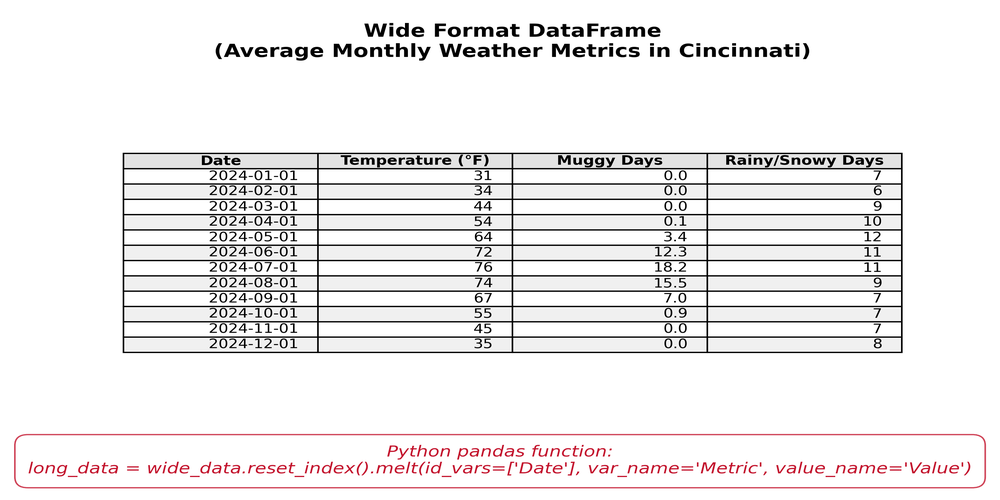
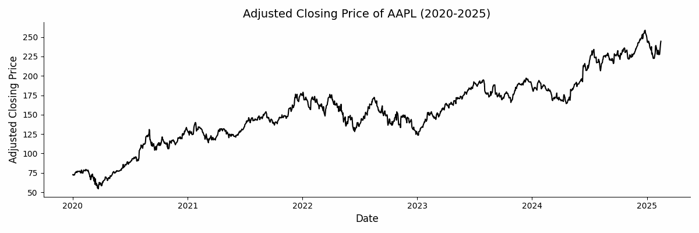

```{r setup, include=FALSE}
knitr::opts_chunk$set(cache = FALSE,
                      echo = TRUE,
                      warning = FALSE,
                      message = FALSE,
                      progress = FALSE, 
                      verbose = FALSE,
                      dev = 'png',
                      fig.height = 2.75,
                      dpi = 300,
                      fig.align = 'center')

options(htmltools.dir.version = FALSE)


miamired = '#C3142D'

if(require(pacman)==FALSE) install.packages("pacman")
if(require(devtools)==FALSE) install.packages("devtools")
if(require(countdown)==FALSE) devtools::install_github("gadenbuie/countdown")
if(require(xaringanExtra)==FALSE) devtools::install_github("gadenbuie/xaringanExtra")
if(require(urbnmapr)==FALSE) devtools::install_github('UrbanInstitute/urbnmapr')
if(require(emo)==FALSE) devtools::install_github("hadley/emo")

pacman::p_load(tidyverse, magrittr, lubridate, janitor, # data analysis pkgs
               DataExplorer, scales, plotly, calendR, pdftools, # plots
               tmap, sf, urbnmapr, tigris, # maps
               bibliometrix, # for bibliometric analysis of my papers
               gifski, av, gganimate, ggtext, glue, extrafont, # for animations
               emojifont, emo, RefManageR, xaringanExtra, countdown) # for slides
```

```{r xaringan-themer, include=FALSE, warning=FALSE}
if(require(xaringanthemer) == FALSE) install.packages("xaringanthemer")
library(xaringanthemer)

style_mono_accent(base_color = "#84d6d3",
                  base_font_size = "20px")

xaringanExtra::use_extra_styles(
  hover_code_line = TRUE,         
  mute_unhighlighted_code = TRUE  
)

xaringanExtra::use_xaringan_extra(c("tile_view", "animate_css", "tachyons", "panelset", "broadcast", "share_again", "search", "fit_screen", "editable", "clipboard"))

```

## Quick Refresher of Last Class

`r emo::ji("check")` Describe and compute centered moving averages  

`r emo::ji("check")` Estimate trend-cycle via moving averages  

`r emo::ji("check")` Perform classical decomposition (trend-cycle, seasonal, residual/remainder)   

`r emo::ji("check")` Understand STL / MSTL as alternatives to classical decomposition  

---

## Learning Objectives for Today's Class

- Explain the differences between wide vs. long format   

- Use [seaborn](https://seaborn.pydata.org/generated/seaborn.relplot.html) to plot multiple time-series 

- Convert a data set to Nixtla's long format (`unique_id`, `ds`, `y`)  

- Use [UtilsForecast](https://nixtlaverse.nixtla.io/utilsforecast/index.html) to visualize multiple series


---
class: inverse, center, middle

# Wide Vs. Long Format

---

## Wide Format

```{python wide_data, echo=FALSE}
from datetime import datetime
import pandas as pd

current_year = datetime.now().year

dates = pd.date_range(start=f"{current_year - 1}-01-01", periods=12, freq='MS')

wide_data = pd.DataFrame({
    'Date': dates,
    'Temperature (°F)': [31, 34, 44, 54, 64, 72, 76, 74, 67, 55, 45, 35],
    'Muggy Days': [0, 0, 0, 0.1, 3.4, 12.3, 18.2, 15.5, 7, 0.9, 0, 0],
    'Rainy/Snowy Days': [7, 6, 9, 10, 12, 11, 11, 9, 7, 7, 7, 8]
})

wide_data.to_csv('../../data/wide_data_example.csv', index=False)
```
 
```{r wide_data_out, echo=FALSE}
wide_data <- readr::read_csv('../../data/wide_data_example.csv')
knitr::kable(wide_data)
```

---

## Characteristics of Wide TS Data

- Each row represents a single observation  

- Each column represents a different time series  

- Easy to read and understand  (but not appropriate for analysis if you are using the [nixtlaverse](http://nixtlaverse.nixtla.io/statsforecast/docs/getting-started/getting_started_complete.html) group of Python packages)


---

## Long Format

```{python long_data, echo=FALSE}
long_data = wide_data.melt(id_vars='Date', var_name='Variable', value_name='Value')
long_data.to_csv('../../data/long_data_example.csv', index=False)
```

```{r long_data_out, echo=FALSE}
long_data <- 
  readr::read_csv('../../data/long_data_example.csv') |> 
  dplyr::arrange(Date, Variable)
knitr::kable( head(long_data, 12) )
```

---

## Characteristics of Long TS Data

- Observations are now split into multiple rows  

- Variable ids/labels are stored in a single column, and their corresponding values are stored in another column

- Easy to analyze and visualize (especially with the [nixtlaverse](http://nixtlaverse.nixtla.io/statsforecast/docs/getting-started/getting_started_complete.html) group of Python packages)  


---

## A Visual Comparison  

```{python wide_long_tables, echo=FALSE}
from datetime import datetime
import pandas as pd
import imageio.v2 as imageio
import io
import numpy as np
import matplotlib.pyplot as plt
from PIL import Image

# Define theme colors
row_color_light_gray = "#f0f0f0"
function_text_color = "#C3142D"
header_box_color = "#e3e3e3"
function_box_border = "#C3142D"

# Create sample data (Average Temperatures for Cincinnati)
current_year = datetime.now().year
dates = pd.date_range(start=f"{current_year - 1}-01-01", periods=12, freq='MS')
wide_data = pd.DataFrame({
    'Date': dates,
    'Temperature (°F)': [31, 34, 44, 54, 64, 72, 76, 74, 67, 55, 45, 35],
    'Muggy Days': [0, 0, 0, 0.1, 3.4, 12.3, 18.2, 15.5, 7, 0.9, 0, 0],
    'Rainy/Snowy Days': [7, 6, 9, 10, 12, 11, 11, 9, 7, 7, 7, 8]
})
wide_data.set_index('Date', inplace=True)

# Convert to long format
long_data = wide_data.reset_index().melt(id_vars=['Date'], var_name='Metric', value_name='Value')
long_data = long_data.sort_values(by=['Date', 'Metric'])

# Function to create a polished table image
# Function to create a polished table image with alternating row colors
def create_frame(data, title, code_snippet=None, show_table=True, center_code_snippet=False, image_size=(1000, 500)):
    fig, ax = plt.subplots(figsize=(9, 5), dpi=300)
    ax.axis('tight')
    ax.axis('off')

    if show_table:
        if 'Date' in data.columns:
            data['Date'] = data['Date'].dt.strftime('%Y-%m-%d')
        table_data = data.head(14).values.tolist()
        col_labels = data.columns.tolist()
        
        # Alternate row colors
        row_colors = [row_color_light_gray if i % 2 else "white" for i in range(len(table_data))]

        table = ax.table(
            cellText=table_data,
            colLabels=col_labels,
            cellLoc='right',
            loc='center',
            colColours=[header_box_color] * len(col_labels),
            cellColours=[[row_colors[i] for _ in col_labels] for i in range(len(table_data))]
        )

        for key, cell in table.get_celld().items():
            if key[0] == 0:  # Header row
                cell.set_fontsize(11)
                cell.set_text_props(weight='bold')

    plt.title(title, fontsize=14, fontweight='bold', pad=15, color='black')

    if code_snippet:
        vertical_position = 0.02 if not center_code_snippet else 0.5
        plt.figtext(0.5, vertical_position, code_snippet, wrap=True, horizontalalignment='center',
                    fontsize=12, color=function_text_color, fontstyle='italic',
                    bbox=dict(facecolor='white', alpha=0.8, edgecolor=function_box_border, boxstyle='round,pad=0.7'))

    buf = io.BytesIO()
    plt.savefig(buf, format='png', bbox_inches='tight', dpi=300, pad_inches=0.25)
    buf.seek(0)
    plt.close(fig)
    img = Image.open(buf).convert("RGB")
    img_resized = img.resize(image_size, Image.LANCZOS)
    return img_resized


frames = []

frames.append(create_frame(
    wide_data.reset_index(),
    "Wide Format DataFrame\n(Average Monthly Weather Metrics in Cincinnati)",
    "Python pandas function:\nlong_data = wide_data.reset_index().melt(id_vars=['Date'], var_name='Metric', value_name='Value')"
))

frames.append(create_frame(
    long_data,
    "Long Format DataFrame\n(Average Monthly Weather Metrics in Cincinnati)",
    "Python pandas function:\nwide_data = long_data.pivot(index='Date', columns='Metric', values='Value')"
))

summary_text = (
    "Python Pandas Functions:\n"
    "Use 'melt()' for wide-to-long transformation\n"
    "Use 'pivot()' for long-to-wide transformation"
)
frames.append(create_frame(pd.DataFrame(), "Summary of Wide vs. Long Formats", summary_text, show_table=False, center_code_snippet=True))

imageio.mimsave('../../figures/data_format_comparison.gif', frames, fps=0.1, loop=0)
```

```{r wide_long_gif, echo=FALSE, out.width='100%'}

```

---

## Class Activity: From Wide to Long Format

`r countdown(minutes = 5, seconds = 0, top = 0, font_size = "2em")`

.panelset[

.panel[.panel-name[Description]

In this activity, you will extract the adjusted closing prices of five stocks (AAPL, MSFT, GOOGL, AMZN, TSLA) from Yahoo Finance. Once you extract the data, you should **report** the following:  
  - **Summary statistics** of the **adjusted closing prices for each stock**.  
  - **Convert the data** from wide **to long format**, and **report the shape** of the long format data.  
  - **Save** the long format data to a CSV file.

**Hint:** Read and convert the column names prior to converting the data to long format.  
]

.panel[.panel-name[Starter Code]
```{python, eval=FALSE}
import datetime as dt
import yfinance as yf
import pandas as pd

# Download the stock data for the following companies
stock_data = (
  yf.download(
    ['AAPL', 'MSFT', 'GOOGL', 'AMZN', 'TSLA'], 
    start='2020-01-01', end= (dt.datetime.now().date() - dt.timedelta(days=1))
  )
  [['Adj Close']].reset_index() # Keep only the adjusted closing price
)
```
]

.panel[.panel-name[Notes]

```{python act_solution, include=FALSE}
import datetime as dt
import yfinance as yf
import pandas as pd

# Download the stock data for the following companies
stock_data = (
  yf.download(
    ['AAPL', 'MSFT', 'GOOGL', 'AMZN', 'TSLA'], 
    start='2020-01-01', end= (dt.datetime.now().date() - dt.timedelta(days=1))
  )
  [['Adj Close']].reset_index() # Keep only the adjusted closing price
)

# Summary statistics
stock_data.describe()

# Convert to long format
stock_data.columns = ['Date', 'AAPL', 'MSFT', 'GOOGL', 'AMZN', 'TSLA']
long_stock_data = (
  stock_data
  .melt(id_vars='Date', var_name='Stock', value_name='Adj Close') 
  )

## Shape
long_stock_data.shape

## Save
long_stock_data.to_csv('../../data/long_stock_data_example.csv', index=False)
```

.can-edit.key-activity8_logic[

**Please feel free to take any notes here from our in-class discussion and solution:** .font70[(Insert below)]

  - Edit me  
  
  - ... 
  
  - ...  
  
  - ...
]
]
]


---
class: inverse, center, middle

# Visualizing Multiple Time-Series Using Seaborn

---

## Recall: Seaborn's `relplot` Function

```{r seaborn_relplot, echo=FALSE}
knitr::include_url("https://seaborn.pydata.org/generated/seaborn.relplot.html", height = "450px")
```

---

## Seaborn's `relplot` Function with Wide Data

.pull-left-2[

.font90[

```{python seaborn_wide_data, eval=FALSE}
import datetime as dt
import yfinance as yf
import pandas as pd
import seaborn as sns

# Download the stock data for the following companies
stock_data = (
  yf.download(
    ['AAPL', 'MSFT', 'GOOGL', 'AMZN', 'TSLA'], 
    start='2020-01-01', 
    end= (dt.datetime.now().date() - dt.timedelta(days=1))
  )
  # Keep only the adjusted closing price
  [['Adj Close']].reset_index()
)
  
# Overwrite the multi-index column names w/ single level
stock_data.columns = (
  ['Date', 'AAPL', 'MSFT', 'GOOGL', 'AMZN', 'TSLA'] )

# Plot the closing prices
sns.relplot(
  data=stock_data, kind='line', palette ='Paired'
)
```
]
]

.pull-right-2[

<br>
<br>

```{python seaborn_wide_data_out, echo=FALSE, out.width='100%', fig.keep=1, fig.show='hold'}
import seaborn as sns
import matplotlib.pyplot as plt

fig = sns.relplot(data=stock_data, kind='line', palette ='Paired')
plt.xlabel("Date Index")
plt.ylabel("Adjusted Closing Price")
plt.show(fig)
```
]


---

## Seaborn's `relplot` Function with Long Data

.font90[

```{python seaborn_long_data1, eval=FALSE}
import datetime as dt
import yfinance as yf
import pandas as pd
import seaborn as sns

stock_data = (
  yf.download(
    ['AAPL', 'MSFT', 'GOOGL', 'AMZN', 'TSLA'],  
    start='2020-01-01', end= (dt.datetime.now().date() - dt.timedelta(days=1))
  )
  # Keep only the adjusted closing price
  [['Adj Close']].reset_index()
  # Rename the column axis within the method chaining (adv)
  .pipe( lambda df: df.set_axis(['Date', 'AAPL', 'MSFT', 'GOOGL', 'AMZN', 'TSLA'], axis=1) )
  # Convert to long format
  .melt(id_vars='Date', var_name='Stock', value_name='Close')
)

# Plot the adjusted closing prices
fig = sns.relplot(
  data=stock_data, x='Date', y='Close', kind='line', legend=False, hue='Stock', 
  palette='Paired',
)
plt.tight_layout() # improves title visibility
```
]


```{python seaborn_long_data_intermediate, include=FALSE}
import datetime as dt
import yfinance as yf
import pandas as pd
import seaborn as sns

stock_data = (
  yf.download(
    ['AAPL', 'MSFT', 'GOOGL', 'AMZN', 'TSLA'], 
    start='2020-01-01', 
    end= (dt.datetime.now().date() - dt.timedelta(days=1))
  )
  # Keep only the adjusted closing price
  [['Adj Close']].reset_index()
  
  # Rename the column axis within the method chaining (adv)
  .pipe(
    lambda df: df.set_axis(
      ['Date', 'AAPL', 'MSFT', 'GOOGL', 'AMZN', 'TSLA'], axis=1)
  )
  
  # Convert to long format
  .melt(id_vars='Date', var_name='Stock', value_name='Close')
)

stock_data.to_csv('../../data/long_stock_data_example.csv', index=False)

```


---
count: false

## Seaborn's `relplot` Function with Long Data

```{python seaborn_long_data_out1, echo=FALSE, fig.keep='last', fig.show='hold', out.width="100%"}
import pandas as pd
import matplotlib.pyplot as plt
import seaborn as sns

stock_data = (
  pd.read_csv('../../data/long_stock_data_example.csv')
  .assign(Date = lambda df: pd.to_datetime(df['Date']))
  )

# Plot the adjusted closing prices
fig = sns.relplot(
  data=stock_data, x = 'Date', y = 'Close', kind = 'line', 
  hue = 'Stock', palette ='Paired', legend = False,
  height = 4, aspect = 3, 
)
plt.tight_layout() # improves title visibility
```


---

## Seaborn's `relplot` Function with Long Data (Facets)

.font90[

```{python seaborn_long_data2, eval=FALSE}
import datetime as dt
import yfinance as yf
import pandas as pd
import seaborn as sns

stock_data = (
  yf.download(
    ['AAPL', 'MSFT', 'GOOGL', 'AMZN', 'TSLA'],  
    start='2020-01-01', end= (dt.datetime.now().date() - dt.timedelta(days=1))
  )
  # Keep only the adjusted closing price
  [['Adj Close']].reset_index()
  # Rename the column axis within the method chaining (adv)
  .pipe( lambda df: df.set_axis(['Date', 'AAPL', 'MSFT', 'GOOGL', 'AMZN', 'TSLA'], axis=1) )
  # Convert to long format
  .melt(id_vars='Date', var_name='Stock', value_name='Close')
)

# Plot the adjusted closing prices
fig = sns.relplot(
  data=stock_data, x='Date', y='Close', kind='line', legend=False, hue='Stock', col='Stock',
  palette='Paired', col_wrap=2,  facet_kws={'sharey': False, 'sharex': False}
)
plt.tight_layout() # improves title visibility
```
]


---
count: false

## Seaborn's `relplot` Function with Long Data (Facets)

```{python seaborn_long_data_out2, echo=FALSE, fig.keep='last', fig.show='hold', out.width="100%"}
import pandas as pd
import matplotlib.pyplot as plt
import seaborn as sns

stock_data = (
  pd.read_csv('../../data/long_stock_data_example.csv')
  .assign(Date = lambda df: pd.to_datetime(df['Date']))
  )

# Plot the adjusted closing prices
fig = sns.relplot(
  data=stock_data, x = 'Date', y = 'Close', kind = 'line', 
  hue = 'Stock', col='Stock', palette ='Paired', legend = False,
  col_wrap=2, height = 4, aspect = 3, facet_kws={'sharey': False, 'sharex': False}
)
plt.tight_layout() # improves title visibility
```


---

## Activity: Reflect on the Previous Seaborn Plots

`r countdown(minutes = 3, seconds = 0, top = 0, font_size = "2em")`

- Whether you are plotting multiple lines in a single plot or using facets, the `relplot` function is quite versatile. However, this approach is only suitable for a few (in my opinion $\le 9$ time series). **So what options, do we have if we have more than 9 time series?** 

- I think there are **three alternative charting approaches** (I am not talking about specific libraries). **Can you guess what they are?**

.can-edit.key-activity9_logic[  
  + In the next three minutes, edit the bullet points below to reflect the three alternative charting approaches.

  + ...  

  + ...  
  
  + ...
]


---
class: inverse, center, middle

# Advanced Visualizations with Seaborn

---

## Approach 1: Sample

- **Sample** a subset of the time series to plot. This approach is useful when you have a large number of time series and you want to visualize a **representative sample**.   

- **Key Point:**  The sample should be **representative** of the entire data set.  


---

## Approach 1: Sample (Code Example)

.font90[
```{python seaborn_sample, eval=FALSE}
import pandas as pd
import seaborn as sns
import random

random.seed(2025) # for reproducibility #<< 

# Start with the long format data and sample two stocks
sampled_stocks = stock_data['Stock'].unique().tolist() #<<
sampled_stocks = random.sample(sampled_stocks, 2) #<<

# Plot the adjusted closing prices
fig = sns.relplot(
  data=stock_data.query('Stock in @sampled_stocks'), #<<
  x='Date', y='Close', kind='line', legend=False, hue='Stock', col='Stock',
  palette='Paired', col_wrap=2,  facet_kws={'sharey': False, 'sharex': False}
)
plt.tight_layout() # improves title visibility
```
]

---

## Appraoch 1: Sample (Result)

```{python seaborn_sample_out, echo=FALSE, fig.keep='last', fig.show='hold', out.width="100%"}
import random

random.seed(2025) # for reproducibility #<<
sampled_stocks = stock_data['Stock'].unique().tolist() #<<
sampled_stocks = random.sample(sampled_stocks, 2) #<<

# Plot the adjusted closing prices
fig = sns.relplot(
  data=stock_data.query('Stock in @sampled_stocks'), #<<
  x='Date', y='Close', kind='line', legend=False, hue='Stock', col='Stock',
  palette='Paired', col_wrap=2,  facet_kws={'sharey': False, 'sharex': False}
)
plt.tight_layout() # improves title visibility

```

---

## Approach 2: Animated Plots

- **Animate** the time series data. This approach is useful when you have a large number of time series and you want to visualize all of them.  

- **Key Point:**  Animated plots can be **interactive** and **engaging**.  

---

## Approach 2: Animated Plots (Code Example)

.font90[
```{python seaborn_animated, results='hide'}
import matplotlib.pyplot as plt
import pandas as pd
import seaborn as sns
import imageio.v2 as imageio 

# Start with long format data
stocks = stock_data['Stock'].unique().tolist()

image_paths = []

for stock in stocks:
    sns.relplot(
      data=stock_data.query('Stock == @stock'), kind ='line',
      x='Date', y='Close', color ='black',
      height = 4, aspect = 3
    )
    plt.title(f"Adjusted Closing Price of {stock} (2020-2025)", fontsize=14)
    plt.xlabel("Date", fontsize=12)
    plt.ylabel("Adjusted Closing Price", fontsize=12)
    plt.tight_layout()
    plt.savefig(f'../../figures/{stock}_animated_plot.png')
    image_paths.append(f'../../figures/{stock}_animated_plot.png')
    
# Create a GIF from the images
images = [imageio.imread(path) for path in image_paths]
imageio.mimsave('../../figures/animated_stock_lineplot.gif', images, fps=0.25)
```
]

---

## Approach 2: Animated Plots (Result)



---

## Approach 3: Spaghetti Plot

- **Plot all time series** on a single plot. This approach is useful when you have a large number of time series and you want to visualize all of them.  

- **Key Points:**   
  + Use **light gray** for the lines to **de-emphasize** individual time series.  
  + Use **bold colors** for the lines of **specific time series (or summary statistics across all time series)** to **emphasize** them.
  

---

## Approach 3: Spaghetti Plot (Code Example)

.font90[
```{python seaborn_spaghetti, eval=FALSE}
import pandas as pd
import matplotlib.pyplot as plt
import seaborn as sns

# for each stock, plot the closing price over time as a light gray line
for stock, group in stock_data.groupby("Stock"):
  ax = sns.lineplot(data=group, x='Date', y='Close', color='lightgray', alpha=0.5)

# Calculate and overlay percentiles across all time series for each date
quantiles = stock_data.groupby('Date')['Close'].quantile([0.05, 0.5, 0.95]).unstack()

# Plot the median, 5th, and 95th percentiles
sns.lineplot(data=quantiles, x=quantiles.index, y=0.5, color='black', label='Median', ax = ax)
sns.lineplot(data=quantiles, x=quantiles.index, y=0.05, color='blue', label='5%', ax=ax)
sns.lineplot(data=quantiles, x=quantiles.index, y=0.95, color='red', label='95%', ax=ax)

```
]


---

## Approach 3: Spaghetti Plot (Result)

```{python seaborn_spaghetti_out, echo=FALSE, fig.keep='last', fig.show='hold', out.width="100%"}
import matplotlib.pyplot as plt

# for each stock, plot the closing price over time as a light gray line
for stock, group in stock_data.groupby("Stock"):
  ax = sns.lineplot(data=group, x='Date', y='Close', color='lightgray', alpha=0.5)

# Calculate and overlay percentiles across all time series for each date
quantiles = stock_data.groupby('Date')['Close'].quantile([0.05, 0.5, 0.95]).unstack()

# Plot the median, 5th, and 95th percentiles
sns.lineplot(data=quantiles, x=quantiles.index, y=0.5, color='black', label='Median', ax=ax)
sns.lineplot(data=quantiles, x=quantiles.index, y=0.05, color='blue', label='5%', ax=ax)
sns.lineplot(data=quantiles, x=quantiles.index, y=0.95, color='red', label='95%', ax=ax)

```


---
class: inverse, center, middle

# Nixtla's Long Format

---

## Class Activity: Convert Data to Nixtla's Format

`r countdown(minutes = 8, seconds = 0, top = 0, font_size = "2em")`

- **Data:** [This COVID-19 data set](https://miamioh.instructure.com/courses/230182/files/34803594?module_item_id=5803158) contains the daily cumulative number of confirmed cases for each county.  

- **Objectives:**   
  + Read the data set.  
  + Filter the data to include only the 88 counties in Ohio, and dates from 2020-04-01 to 2022-12-31.  
  + Convert the data to Nixtla's long format (`unique_id`, `ds`, `y`), where the:  
      + `unique_id` column is used to identify each county.  
      + `ds` column is used to represent the date.  
      + `y` column is used to represent the cumulative number of confirmed cases.
  + Use the `plot_series` method from the [UtilsForecast](https://nixtlaverse.nixtla.io/utilsforecast/index.html) to visualize the data. See [here](https://nixtlaverse.nixtla.io/utilsforecast/index.html) to learn about how to import and [here](https://nixtlaverse.nixtla.io/utilsforecast/plotting.html) to see the arguments of the `plot_series` method.
  
```{python activity_sol, include=FALSE}
import pandas as pd
from utilsforecast.plotting import plot_series

df = (
  pd.read_csv('../../data/covid_confirmed_usafacts.csv')
  .query("State == 'OH' and `County Name` != 'Statewide Unallocated'")
  .drop(columns=['countyFIPS', 'State', 'countyFIPS', 'StateFIPS'])
  .melt(id_vars=['County Name'], var_name='Date', value_name='Cases')
  .rename(columns={'County Name': 'unique_id', 'Date': 'ds', 'Cases': 'y'})
  .assign(ds = lambda df: pd.to_datetime(df['ds']))
  .query("ds >= '2020-04-01' and ds <= '2022-12-31'")
  )
  
plot_series(df, plot_random=True, max_ids=9)
 
```


---

class: inverse, center, middle

# Recap

---

## Summary of Main Points

By now, you should be able to do the following:  

- Explain the differences between wide vs. long format   

- Use [seaborn](https://seaborn.pydata.org/generated/seaborn.relplot.html) to plot multiple time-series 

- Convert a data set to Nixtla's long format (`unique_id`, `ds`, `y`)  

- Use [UtilsForecast](https://nixtlaverse.nixtla.io/utilsforecast/index.html) to visualize multiple series


---

## 📝 Review and Clarification 📝

1. **Class Notes**: Take some time to revisit your class notes for key insights and concepts.
2. **Zoom Recording**: The recording of today's class will be made available on Canvas approximately 3-4 hours after the session ends.
3. **Questions**: Please don't hesitate to ask for clarification on any topics discussed in class. It's crucial not to let questions accumulate. 

