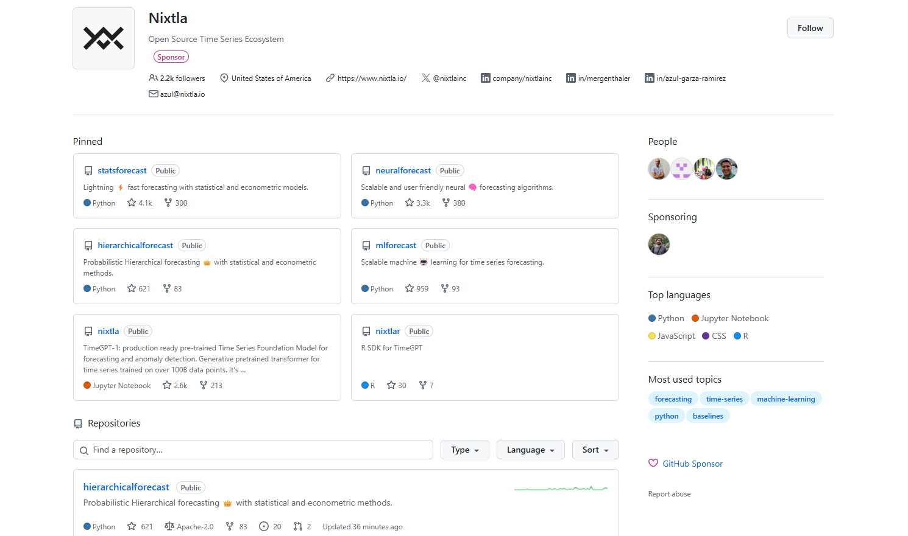
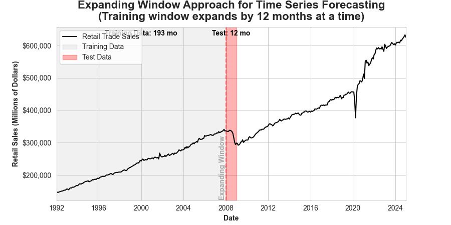
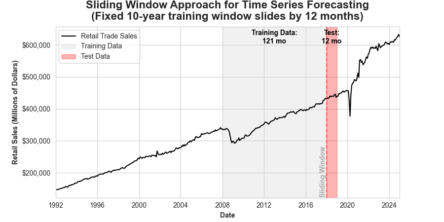
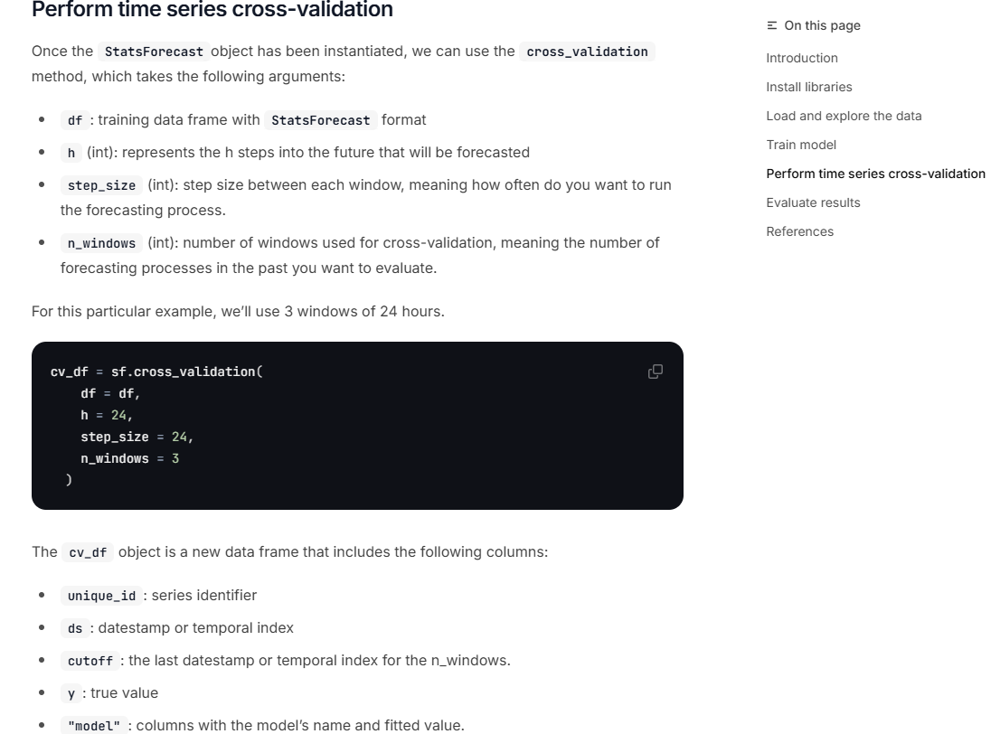

```{r setup, include=FALSE}
knitr::opts_chunk$set(cache = FALSE,
                      echo = TRUE,
                      warning = FALSE,
                      message = FALSE,
                      progress = FALSE, 
                      verbose = FALSE,
                      dev = 'png',
                      fig.height = 2.75,
                      dpi = 300,
                      fig.align = 'center')

options(htmltools.dir.version = FALSE)


miamired = '#C3142D'

if(require(pacman)==FALSE) install.packages("pacman")
if(require(devtools)==FALSE) install.packages("devtools")
if(require(countdown)==FALSE) devtools::install_github("gadenbuie/countdown")
if(require(xaringanExtra)==FALSE) devtools::install_github("gadenbuie/xaringanExtra")
if(require(urbnmapr)==FALSE) devtools::install_github('UrbanInstitute/urbnmapr')
if(require(emo)==FALSE) devtools::install_github("hadley/emo")

pacman::p_load(tidyverse, magrittr, lubridate, janitor, # data analysis pkgs
               DataExplorer, scales, plotly, calendR, pdftools, # plots
               tmap, sf, urbnmapr, tigris, # maps
               bibliometrix, # for bibliometric analysis of my papers
               gifski, av, gganimate, ggtext, glue, extrafont, # for animations
               emojifont, emo, RefManageR, xaringanExtra, countdown) # for slides
```

```{r xaringan-themer, include=FALSE, warning=FALSE}
if(require(xaringanthemer) == FALSE) install.packages("xaringanthemer")
library(xaringanthemer)

style_mono_accent(base_color = "#84d6d3",
                  base_font_size = "20px")

xaringanExtra::use_extra_styles(
  hover_code_line = TRUE,         
  mute_unhighlighted_code = TRUE  
)

xaringanExtra::use_xaringan_extra(c("tile_view", "animate_css", "tachyons", "panelset", "broadcast", "share_again", "search", "fit_screen", "editable", "clipboard"))

```

## Quick Refresher of Last Class

`r emo::ji("check")` Explain the differences between wide vs. long format   

`r emo::ji("check")` Use [seaborn](https://seaborn.pydata.org/generated/seaborn.relplot.html) to plot multiple time-series 

`r emo::ji("check")` Convert a data set to Nixtla's long format (`unique_id`, `ds`, `y`)  

`r emo::ji("check")` Use [UtilsForecast](https://nixtlaverse.nixtla.io/utilsforecast/index.html) to visualize multiple series 

---

## Learning Objectives for Today's Class

- Install and import Nixtla's libraries ([StatsForecast](https://nixtlaverse.nixtla.io/statsforecast/index.html), [MLForecast](https://nixtlaverse.nixtla.io/mlforecast/index.html), [NeuralForecast](https://nixtlaverse.nixtla.io/neuralforecast/docs/getting-started/introduction.html), [UtilsForecast](https://nixtlaverse.nixtla.io/utilsforecast/index.html), and [TimeGPT](https://nixtlaverse.nixtla.io/nixtla/docs/getting-started/introduction.html)) for forecasting  

- Distinguish fixed window from rolling-origin  

- Introduce forecast accuracy metrics (MAE, MAPE, RMSE)  


---
class: inverse, center, middle

# The Nixtlaverse Open-Source Forecasting Libraries

---

## Nixtla's Forecasting Libraries

```{r nixtlaverse, echo=FALSE, out.width='87%'}

```


---

## Nixtla's Forecasting Libraries

Nixtla provides **several open-source Python libraries** (and a closed source **TimeGPT** tool accessible via API calls) for **scalable forecasting tasks**. These libraries are **relatively** easy to use and can be integrated into your future forecasting workflows:

- **[StatsForecast](https://nixtlaverse.nixtla.io/statsforecast/index.html)** – Fast & scalable statistical models (`ARIMA`, `ETS`, etc.).
- **[MLForecast](https://nixtlaverse.nixtla.io/mlforecast/index.html)** – Machine learning-based forecasting (e.g., `XGBoost`, `LightGBM`).
- **[NeuralForecast](https://nixtlaverse.nixtla.io/neuralforecast/docs/getting-started/introduction.html)** – Deep learning models for time series (e.g., `NBEATS`, `NHITS`, and `TFT`).
- **[UtilsForecast](https://nixtlaverse.nixtla.io/utilsforecast/index.html)** – Utility functions for plotting, evaluation, etc.
- **[TimeGPT](https://nixtlaverse.nixtla.io/nixtla/docs/getting-started/introduction.html)** – an AI transformer-powered forecasting API that requires minimal tuning.

These libraries enable **forecasting at scale, which you will need in practice**.

.footnote[
<html>
<hr>
</html>

**Note:** These libraries can be installed via `pip` and are described in detail in [nixtlaverse.nixtla.io](https://nixtlaverse.nixtla.io/). Use the left-hand navigation bar to explore the documentation for each library.
]

---
class: inverse, center, middle

# Fixed Window vs. Rolling-Origin

---

## The Fixed Window Evaluation Approach

- **Fixed Window** is the simplest approach to splitting your time series data into a training and a testing/holdout set.

- The **goal** is to **train your model on the training set** and **evaluate its performance on the testing set (the last `k` observations in the data)**.  
  + .black[.bold[Note that this is quite different than traditional machine learning applications for cross sectional data.]]

- The evaluation on the **testing/holdout** set can serve two purposes:  
  + **Model Evaluation**: Assess the model's **performance on unseen data** (since it is not used during training, and hence acts as a proxy for the model's performance on future data).  
  + **Model Selection**: Compare the **performance of different models** to select the **best one**.   
     - Note that using this approach for model selection is **reasonable if your models do not involve hyperparameter tuning** (otherwise, you may overfit to the testing set).
  

---

## The Fixed Window Evaluation Approach

```{python fixed_window, echo=FALSE, out.width='100%', results='hide', fig.show='hold'}
import pandas as pd
import seaborn as sns
import matplotlib.pyplot as plt

# Read and process the data
retail_trade = (
    pd.read_csv("https://fred.stlouisfed.org/graph/fredgraph.csv?bgcolor=%23ebf3fb&chart_type=line&drp=0&fo=open%20sans&graph_bgcolor=%23ffffff&height=450&mode=fred&recession_bars=on&txtcolor=%23444444&ts=12&tts=12&width=1320&nt=0&thu=0&trc=0&show_legend=yes&show_axis_titles=yes&show_tooltip=yes&id=RSXFS&scale=left&cosd=1992-01-01&coed=2025-01-01&line_color=%230073e6&link_values=false&line_style=solid&mark_type=none&mw=3&lw=3&ost=-99999&oet=99999&mma=0&fml=a&fq=Monthly&fam=avg&fgst=lin&fgsnd=2020-02-01&line_index=1&transformation=lin&vintage_date=2025-02-19&revision_date=2025-02-19&nd=1992-01-01")
    .rename(columns={"observation_date": "ds", "RSXFS": "y"})
    .assign(ds = lambda x: pd.to_datetime(x["ds"]))
)

# Calculate the train-test split date (24 months before the last date)
dates = retail_trade["ds"]
last_train_date = dates[dates == dates.max() - pd.DateOffset(months=36)].iloc[0]

# Set up the plot style
plt.figure(figsize=(9, 4.5))
sns.set_style("whitegrid")

# Plot the main time series
sns.lineplot(data=retail_trade, x="ds", y="y", label="Retail Trade Sales", color = 'black')

# Add background colors for train/test split
plt.axvspan(retail_trade['ds'].min(), last_train_date, 
            color='lightgray', alpha=0.3, label='Training Data')
            
plt.axvspan(last_train_date, retail_trade['ds'].max(), 
            color='red', alpha=0.3, label='Test Data')

# Add a vertical line at the split point
plt.axvline(x=last_train_date, color='red', linestyle='--', alpha=0.5)

# Customize the plot
plt.title('Retail Trade Sales (RSXFS): Train-Test Split \n (Test set is often set to a multiple of the period)', pad=10, fontsize=16, fontweight='bold')
plt.xlabel('Date', fontweight='bold')
plt.ylabel('Retail Sales (Millions of Dollars)', fontweight='bold')
plt.legend(loc='upper left')

plt.xlim(dates.min(), dates.max())

# Add $ sign and commas to the y-axis labels
plt.gca().yaxis.set_major_formatter('${x:,.0f}')

# Add text annotation for the split point
plt.text(
  last_train_date, (plt.ylim()[0]+plt.ylim()[1])/2, 'Train-Test Split', 
  rotation=90, va='top', ha='right', color='black', fontsize=10, fontweight='bold'
  )

# Add annotation for the number of training and test data points (placed in the top middle of each region)
plt.text(
  retail_trade['ds'].min() + (last_train_date - retail_trade['ds'].min()) / 2,
  plt.ylim()[1]-10000,
  f"Train Data: {len(retail_trade[retail_trade['ds'] <= last_train_date])} mo", 
  va='top', ha='center', color='black', fontsize=10, fontweight='bold')
plt.text(
  last_train_date + (retail_trade['ds'].max() - last_train_date) / 2,
  plt.ylim()[1]-10000,
  f"Test: {len(retail_trade[retail_trade['ds'] > last_train_date])} mo", 
  va='top', ha='center', color='black', fontsize=10, fontweight='bold')


# Display the plot
plt.tight_layout(pad=2.5)
plt.show()

# Print the split date for reference
print(f"Train-test split date: {last_train_date:%Y-%m-%d}")
```


---

## The Rolling-Origin Evaluation Approach

- **Rolling-Origin Evaluation** is a method for splitting time series data into training and testing sets where the testing sets move forward over time.

- The **goal** is to **train the model on a subset of past observations** and evaluate its **performance on a future testing set at multiple time steps**.

- The key difference from a fixed window approach is that the **testing set shifts forward, allowing for multiple evaluations**:  
  + The **training set may expand (expanding window)** or **remain fixed (rolling window)**.  
  + This ensures that model performance is assessed across **different points in time**.  
  + It **reduces sensitivity to the initial split point** and provides a more **robust evaluation** of model performance over time.


---

## Expanding Window Evaluation (By 1 Month)

```{python rolling_origin_expanding1mo, echo=FALSE, out.width='100%', results='hide', fig.show='hold'}
import pandas as pd
import seaborn as sns
import matplotlib.pyplot as plt
import numpy as np
from matplotlib.animation import FuncAnimation, PillowWriter

# Set initial training window to end at 2008
initial_train_date = pd.to_datetime('2008-01-01')
final_train_date = dates[dates == dates.max() - pd.DateOffset(months=12)].iloc[0]

# Set up the figure
fig, ax = plt.subplots(figsize=(9, 4.5))

def update(frame):
    ax.clear()
    
    # Calculate current training window end date
    current_train_date = initial_train_date + pd.DateOffset(months=frame)
    if current_train_date > final_train_date:
        current_train_date = final_train_date
    
    # Plot the main time series
    sns.lineplot(data=retail_trade, x="ds", y="y", label="Retail Trade Sales", 
                color='black', ax=ax)
    
    # Add background colors
    ax.axvspan(retail_trade['ds'].min(), current_train_date,
               color='lightgray', alpha=0.3, label='Training Data')
    ax.axvspan(current_train_date, current_train_date + pd.DateOffset(months=12),
               color='red', alpha=0.3, label='Test Data')
    
    # Add vertical line at the current split point
    ax.axvline(x=current_train_date, color='red', linestyle='--', alpha=0.5)
    
    # Customize the plot
    ax.set_title('Expanding Window Approach for Time Series Forecasting\n(Training window expands by 1 month at a time)', 
                pad=10, fontsize=16, fontweight='bold')
    ax.set_xlabel('Date', fontweight='bold')
    ax.set_ylabel('Retail Sales (Millions of Dollars)', fontweight='bold')
    ax.legend(loc='upper left')
    ax.set_xlim(dates.min(), dates.max())
    
    # Add $ sign and commas to the y-axis labels
    ax.yaxis.set_major_formatter('${x:,.0f}')
    
    # Add text annotations
    train_size = len(retail_trade[retail_trade['ds'] <= current_train_date])
    test_size = len(retail_trade[(retail_trade['ds'] > current_train_date) & 
                                    (retail_trade['ds'] <= current_train_date + pd.DateOffset(months=12))])
    
    plt.text(
        retail_trade['ds'].min() + (current_train_date - retail_trade['ds'].min()) / 2,
        plt.ylim()[1]-10000,
        f"Training Data: {train_size} mo",
        va='top', ha='center', color='black', fontsize=10, fontweight='bold'
    )
    plt.text(
        current_train_date + pd.DateOffset(months=6),
        plt.ylim()[1]-10000,
        f"Test: {test_size} mo",
        va='top', ha='center', color='black', fontsize=10, fontweight='bold'
    )
    
    # Add expanding window annotation
    plt.text(
        current_train_date, plt.ylim()[0],
        'Expanding Window',
        rotation=90, va='bottom', ha='right',
        color='darkgray', fontsize=10, fontweight='bold'
    )

# Create the animation
n_frames = len(pd.date_range(initial_train_date, final_train_date, freq='MS'))
anim = FuncAnimation(fig, update, frames=n_frames, 
                    interval=500, repeat=True)

# Save as GIF
writer = PillowWriter(fps=1)
anim.save('../../figures/expanding_window_evaluation1mo.gif', writer=writer)

plt.close()
```

```{r expanding_window1mo_gif, echo=FALSE, out.width='100%'}

```

---

## Expanding Window Evaluation (By 12 Month)

```{python rolling_origin_expanding12mo, echo=FALSE, out.width='100%', results='hide', fig.show='hold'}
initial_train_date = pd.to_datetime('2008-01-01')
final_train_date = dates[dates == dates.max() - pd.DateOffset(months=12)].iloc[0]

# Set up the figure
fig, ax = plt.subplots(figsize=(9, 4.5))

def update(frame):
    ax.clear()
    
    # Calculate current training window end date
    current_train_date = initial_train_date + pd.DateOffset(months=frame*12)
    if current_train_date > final_train_date:
        current_train_date = final_train_date
    
    # Plot the main time series
    sns.lineplot(data=retail_trade, x="ds", y="y", label="Retail Trade Sales", 
                color='black', ax=ax)
    
    # Add background colors
    ax.axvspan(retail_trade['ds'].min(), current_train_date,
               color='lightgray', alpha=0.3, label='Training Data')
    ax.axvspan(current_train_date, current_train_date + pd.DateOffset(months=12),
               color='red', alpha=0.3, label='Test Data')
    
    # Add vertical line at the current split point
    ax.axvline(x=current_train_date, color='red', linestyle='--', alpha=0.5)
    
    # Customize the plot
    ax.set_title('Expanding Window Approach for Time Series Forecasting\n(Training window expands by 12 months at a time)', 
                pad=10, fontsize=16, fontweight='bold')
    ax.set_xlabel('Date', fontweight='bold')
    ax.set_ylabel('Retail Sales (Millions of Dollars)', fontweight='bold')
    ax.legend(loc='upper left')
    ax.set_xlim(dates.min(), dates.max())
    
    # Add $ sign and commas to the y-axis labels
    ax.yaxis.set_major_formatter('${x:,.0f}')
    
    # Add text annotations
    train_size = len(retail_trade[retail_trade['ds'] <= current_train_date])
    test_size = len(retail_trade[(retail_trade['ds'] > current_train_date) & 
                                    (retail_trade['ds'] <= current_train_date + pd.DateOffset(months=12))])
    
    plt.text(
        retail_trade['ds'].min() + (current_train_date - retail_trade['ds'].min()) / 2,
        plt.ylim()[1]-10000,
        f"Training Data: {train_size} mo",
        va='top', ha='center', color='black', fontsize=10, fontweight='bold'
    )
    plt.text(
        current_train_date + pd.DateOffset(months=6),
        plt.ylim()[1]-10000,
        f"Test: {test_size} mo",
        va='top', ha='center', color='black', fontsize=10, fontweight='bold'
    )
    
    # Add expanding window annotation
    plt.text(
        current_train_date, plt.ylim()[0],
        'Expanding Window',
        rotation=90, va='bottom', ha='right',
        color='darkgray', fontsize=10, fontweight='bold'
    )

# Create the animation
n_frames = len(pd.date_range(initial_train_date, final_train_date, freq='12MS'))
anim = FuncAnimation(fig, update, frames=n_frames, 
                    interval=500, repeat=True)

# Save as GIF
writer = PillowWriter(fps=1)
anim.save('../../figures/expanding_window_evaluation12mo.gif', writer=writer)
plt.close()

```

```{r expanding_window12mo_gif, echo=FALSE, out.width='100%'}

```

---

## Rolling Non-Expanding Window Evaluation

```{python rolling_origin_rolling, echo=FALSE, out.width='100%', results='hide', fig.show='hold'}
initial_start_date = pd.to_datetime('2008-01-01')
final_end_date = dates[dates == dates.max() - pd.DateOffset(months=12)].iloc[0]

# Set the fixed window size (in months)
window_size = 120  # 10 years of training data

# Set up the figure
fig, ax = plt.subplots(figsize=(9, 4.5))

def update(frame):
    ax.clear()
    
    # Calculate current training window start and end dates
    window_start = initial_start_date + pd.DateOffset(months=frame*12)
    window_end = window_start + pd.DateOffset(months=window_size)
    
    if window_end > final_end_date:
        window_end = final_end_date
        window_start = window_end - pd.DateOffset(months=window_size)
    
    # Plot the main time series
    sns.lineplot(data=retail_trade, x="ds", y="y", label="Retail Trade Sales", 
                color='black', ax=ax)
    
    # Add background colors
    ax.axvspan(window_start, window_end,
               color='lightgray', alpha=0.3, label='Training Data')
    ax.axvspan(window_end, window_end + pd.DateOffset(months=12),
               color='red', alpha=0.3, label='Test Data')
    
    # Add vertical line at the split point
    ax.axvline(x=window_end, color='red', linestyle='--', alpha=0.5)
    
    # Customize the plot
    ax.set_title('Sliding Window Approach for Time Series Forecasting\n(Fixed 10-year training window slides by 12 months)', 
                pad=10, fontsize=16, fontweight='bold')
    ax.set_xlabel('Date', fontweight='bold')
    ax.set_ylabel('Retail Sales (Millions of Dollars)', fontweight='bold')
    ax.legend(loc='upper left')
    ax.set_xlim(dates.min(), dates.max())
    
    # Add $ sign and commas to the y-axis labels
    ax.yaxis.set_major_formatter('${x:,.0f}')
    
    # Add text annotations
    train_size = len(retail_trade[(retail_trade['ds'] >= window_start) & 
                                 (retail_trade['ds'] <= window_end)])
    test_size = len(retail_trade[(retail_trade['ds'] > window_end) & 
                                (retail_trade['ds'] <= window_end + pd.DateOffset(months=12))])
    
    plt.text(
        window_start + (window_end - window_start) / 2,
        plt.ylim()[1]-10000,
        f"Training Data:\n{train_size} mo",
        va='top', ha='center', color='black', fontsize=10, fontweight='bold'
    )
    plt.text(
        window_end + pd.DateOffset(months=6),
        plt.ylim()[1]-10000,
        f"Test:\n{test_size} mo",
        va='top', ha='center', color='black', fontsize=10, fontweight='bold'
    )
    
    # Add sliding window annotation
    plt.text(
        window_end, plt.ylim()[0],
        'Sliding Window',
        rotation=90, va='bottom', ha='right',
        color='darkgray', fontsize=10, fontweight='bold'
    )

# Create the animation
n_frames = len(pd.date_range(initial_start_date, final_end_date - pd.DateOffset(months=window_size), freq='12MS'))
anim = FuncAnimation(fig, update, frames=n_frames, 
                    interval=500, repeat=True)

# Save as GIF
writer = PillowWriter(fps=1)
anim.save('../../figures/nonexpanding_window_evaluation.gif', writer=writer)
plt.close()

```

```{r rolling_window_gif, echo=FALSE, out.width='100%'}

```


---

## Cross Validation within the Nixtlaverse

```{r cross_validation_page, echo=FALSE, out.width='63%'}

```

.footnote[
<html>
<hr>
</html>

**Note:** The `cross_validation` method can also be applied to other NixtlaForecast objects (e.g., `MLForecast`, `NeuralForecast`) to perform cross-validation for machine learning and deep learning models. See the [StatsForecast Cross Validation Tutorial](https://nixtlaverse.nixtla.io/statsforecast/docs/tutorials/crossvalidation.html) to access the page shown above.
]


---

## Activity: The `cross_validation` Method

<div style='position: relative; padding-bottom: 56.25%; padding-top: 35px; height: 0; overflow: hidden;'><iframe sandbox='allow-scripts allow-same-origin allow-presentation' allowfullscreen='true' allowtransparency='true' frameborder='0' height='315' src='https://www.mentimeter.com/app/presentation/alph1gvzvcf291iyb9typ19e28i46ptv/embed' style='position: absolute; top: 0; left: 0; width: 100%; height: 100%;' width='420'></iframe></div>


---

## Recap of Fixed vs. Rolling-Origin

- **Fixed Window**:  
  + **Simplest approach** to splitting data into training and testing sets.  
  + **Testing set is fixed** and **does not move forward** over time.  
  + **Provides a single evaluation** of model performance.
  
- **Rolling-Origin**:
  + **Testing set moves forward** over time.  
  + **Training set may expand or remain fixed**.  
  + **Provides multiple evaluations** of model performance.  
  + **Reduces sensitivity to the initial split point**.  
  + **More robust evaluation** of model performance over time.


---

## Recap of Fixed vs. Rolling-Origin

- In practice, the **rolling-origin approach is preferred** for time series forecasting tasks since it mimics the real-world scenario of forecasting future data points. The choice of:  
  + **Expanding vs. Rolling Window**,
  + **Window Size**, and
  + **Step Size**
depends on the specific forecasting task and the data at hand. 


---

class: inverse, center, middle

# Forecast Accuracy Metrics

---

## Model Performance Evaluation in the Nixtlaverse

```{python evaluate0, eval=FALSE}
from utilsforecast.losses import *
```

### `evaluate` 

```{python evaluate, eval=FALSE}
evaluate (df:~AnyDFType, metrics:List[Callable],
           models:Optional[List[str]]=None,
           train_df:Optional[~AnyDFType]=None,
           level:Optional[List[int]]=None, id_col:str='unique_id',
           time_col:str='ds', target_col:str='y',
           agg_fn:Optional[str]=None)
```

.footnote[
<html>
<hr>
</html>

**Source:** [Nixtla's UtilsForecast Evaluation Documentation](https://nixtlaverse.nixtla.io/utilsforecast/evaluation.html)
]

---

## Model Performance Evaluation in the Nixtlaverse (Cont.)

.font80[
<table><thead><tr><th></th><th><strong>Type</strong></th><th><strong>Default</strong></th><th><strong>Details</strong></th></tr></thead><tbody><tr><td>df</td><td>AnyDFType</td><td></td><td>Forecasts to evaluate.<br/>Must have <code>id_col</code>, <code>time_col</code>, <code>target_col</code> and models’ predictions.</td></tr><tr><td>metrics</td><td>List</td><td></td><td>Functions with arguments <code>df</code>, <code>models</code>, <code>id_col</code>, <code>target_col</code> and optionally <code>train_df</code>.</td></tr><tr><td>models</td><td>Optional</td><td>None</td><td>Names of the models to evaluate.<br/>If <code>None</code> will use every column in the dataframe after removing id, time and target.</td></tr><tr><td>train_df</td><td>Optional</td><td>None</td><td>Training set. Used to evaluate metrics such as <a href="https://Nixtla.github.io/utilsforecast/losses.html#mase" target="_blank" rel="noreferrer"><code>mase</code></a>.</td></tr><tr><td>level</td><td>Optional</td><td>None</td><td>Prediction interval levels. Used to compute losses that rely on quantiles.</td></tr><tr><td>id_col</td><td>str</td><td>unique_id</td><td>Column that identifies each serie.</td></tr><tr><td>time_col</td><td>str</td><td>ds</td><td>Column that identifies each timestep, its values can be timestamps or integers.</td></tr><tr><td>target_col</td><td>str</td><td>y</td><td>Column that contains the target.</td></tr><tr><td>agg_fn</td><td>Optional</td><td>None</td><td>Statistic to compute on the scores by id to reduce them to a single number.</td></tr><tr><td><strong>Returns</strong></td><td><strong>AnyDFType</strong></td><td></td><td><strong>Metrics with one row per (id, metric) combination and one column per model.<br/>If <code>agg_fn</code> is not <code>None</code>, there is only one row per metric.</strong></td></tr></tbody></table>
]

.footnote[
<html>
<hr>
</html>

**Source:** [Nixtla's UtilsForecast Evaluation Documentation](https://nixtlaverse.nixtla.io/utilsforecast/evaluation.html)
]

---

## Losses

The most important train signal is the forecast error, which is the difference between the observed value $y_{\tau}$ and the prediction $\hat{y}_{\tau}$, at time $y_{\tau}$:

$$e_{\tau} = y_{\tau} - \hat{y}_{\tau} \quad \quad \tau \in \{t+1, \dots, t+H\}$$

The train loss summarizes the forecast errors in different evaluation metrics.


.footnote[
<html>
<hr>
</html>

**Source:** [Nixtla's UtilsForecast Losses Documentation](https://nixtlaverse.nixtla.io/utilsforecast/losses.html)
]

---

## Scale-Dependent Errors: `mae` 


**MAE** measures the relative prediction accuracy by averaging the absolute deviations between forecasts and actual values.

$$\text{MAE}(y_{\tau}, \hat{y}_{\tau}) = \frac{1}{H} \sum_{\tau = t+1}^{t+H} |y_{\tau} - \hat{y}_{\tau}|$$
- **Interpretation**: Provides a straightforward measure of forecast accuracy; lower MAE indicates better performance.  

- **Characteristic:** Does not penalize larger errors more than smaller ones; treats all errors equally.


.footnote[
<html>
<hr>
</html>

**Source:** [Nixtla's UtilsForecast Losses Documentation](https://nixtlaverse.nixtla.io/utilsforecast/losses.html)
]


---

## Scale-Dependent Errors: `rmse`


**RMSE** is the square root of the average of the squared differences between forecasts and actual values.

$$\text{RMSE}(y_{\tau}, \hat{y}_{\tau}) = \sqrt{\frac{1}{H} \sum_{\tau = t+1}^{t+H} (y_{\tau} - \hat{y}_{\tau})^2}$$

- **Interpretation**: Emphasizes larger errors due to squaring; useful when large errors are particularly undesirable.  

- **Characteristic:**  Penalizes large errors more than MAE (i.e., more sensitive to ourliers compared to MAE).


.footnote[
<html>
<hr>
</html>

**Source:** [Nixtla's UtilsForecast Losses Documentation](https://nixtlaverse.nixtla.io/utilsforecast/losses.html)
]


---

## Percentage Errors: `mape`


**MAPE** calculates the average absolute error as a percentage of actual values.  

$$\text{MAPE}(y_{\tau}, \hat{y}_{\tau}) = \frac{1}{H} \sum_{\tau = t+1}^{t+H} \left| \frac{y_{\tau} - \hat{y}_{\tau}}{y_{\tau}} \right|$$
**Interpretation**: Expresses forecast accuracy as a percentage; lower MAPE indicates better performance.

**Characteristic:** Can be misleading if actual values are close to zero, leading to extremely high MAPE values.


.footnote[
<html>
<hr>
</html>

**Source:** [Nixtla's UtilsForecast Losses Documentation](https://nixtlaverse.nixtla.io/utilsforecast/losses.html)
]


---

class: inverse, center, middle

# Recap

---

## Summary of Main Points

By now, you should be able to do the following:  

- Install and import Nixtla's libraries ([StatsForecast](https://nixtlaverse.nixtla.io/statsforecast/index.html), [MLForecast](https://nixtlaverse.nixtla.io/mlforecast/index.html), [NeuralForecast](https://nixtlaverse.nixtla.io/neuralforecast/docs/getting-started/introduction.html), [UtilsForecast](https://nixtlaverse.nixtla.io/utilsforecast/index.html), and [TimeGPT](https://nixtlaverse.nixtla.io/nixtla/docs/getting-started/introduction.html)) for forecasting  

- Distinguish fixed window from rolling-origin  

- Introduce forecast accuracy metrics (MAE, MAPE, RMSE)

---

## 📝 Review and Clarification 📝

1. **Class Notes**: Take some time to revisit your class notes for key insights and concepts.
2. **Zoom Recording**: The recording of today's class will be made available on Canvas approximately 3-4 hours after the session ends.
3. **Questions**: Please don't hesitate to ask for clarification on any topics discussed in class. It's crucial not to let questions accumulate. 

