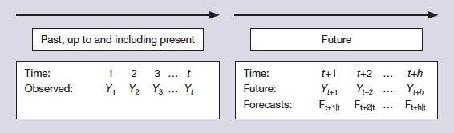

```{r setup, include=FALSE}
knitr::opts_chunk$set(cache = TRUE,
                      echo = TRUE,
                      warning = FALSE,
                      message = FALSE,
                      progress = FALSE, 
                      verbose = FALSE,
                      dev = 'png',
                      dpi = 300,
                      fig.asp = 0.618,
                      fig.align = 'center',
                      out.width = '70%')

options(htmltools.dir.version = FALSE)


miamired = '#C3142D'

if(require(pacman)==FALSE) install.packages("pacman")
if(require(devtools)==FALSE) install.packages("devtools")
if(require(countdown)==FALSE) devtools::install_github("gadenbuie/countdown")
if(require(xaringanExtra)==FALSE) devtools::install_github("gadenbuie/xaringanExtra")
if(require(emo)==FALSE) devtools::install_github("hadley/emo")
if(require(icons)==FALSE) devtools::install_github("mitchelloharawild/icons")

pacman::p_load(gifski, av, gganimate, ggtext, glue, extrafont, # for animations
               emojifont, emo, RefManageR, xaringanExtra, countdown, downlit) # for slides
```

```{r xaringan-themer, include=FALSE, warning=FALSE}
if(require(xaringanthemer) == FALSE) install.packages("xaringanthemer")
library(xaringanthemer)

style_mono_accent(base_color = "#84d6d3",
                  base_font_size = "20px")

xaringanExtra::use_extra_styles(
  hover_code_line = TRUE,         
  mute_unhighlighted_code = TRUE  
)

xaringanExtra::use_xaringan_extra(c("tile_view", "animate_css", "tachyons", "panelset", "share_again", "search", "fit_screen", "editable", "clipboard"))

```


# Recap: Lab 01 - Tidying the Data

.pull-left[
.font80[
```{r get_data}
macro = tidyquant::tq_get(
  # macro indicators of interest
  x = c('UNRATE', 'GNP', 'RHORUSQ156N'),
  from = '2018-01-01', to = '2023-02-12',
  # FRED Data --> set get to 'economic.data'
  get = 'economic.data'
)

stocks_crypto = tidyquant::tq_get(
  # you can pull stocks and crypto from 
  # the Yahoo Finance API with a single call
  x = c("PM", "UPS",  "SYK",  "PCAR", 
        'BTC-USD', 'ETH-USD'),
  from = '2018-01-01', to = '2023-02-12'
) |> # three columns with same col names as macro
  dplyr::select(symbol, date, adjusted) |> 
  # rename adjusted to price to match macro tibble
  dplyr::rename(price = adjusted) 
  
# stacking/putting both tibbles on top of each other
all_data = dplyr::bind_rows(stocks_crypto, macro)
```
]
]


.pull-right[
.font80[
```{r data_head}
tail(all_data, n = 12)
```
]
]


---
count: false

# Recap: Lab 01 - Naive Forecasting and Errors

.pull-left[
.font80[
```{r naive1, eval=FALSE}
# grouping by symbol to ensure calculations 
# are done for each symbol separately
all_data = all_data |> 
  dplyr::group_by(symbol)

all_data = 
  all_data |> # now grouped
  # mutate creates new columns
  dplyr::mutate( 
    # dplyr::lag since input is num vec
    naive_o = dplyr::lag(price), 
    # forecasting error: actual - forecast
    error_o = price - naive_o, 
    # percent error = 100*error/actual
    pe_o = 100*error_o/price
  )

all_data |> 
  # summarise used --> each calc per group
  dplyr::summarise(
    # mean error per symbol
    me_o = mean(error_o, na.rm = T),
    # mean absolute percent error per symbol
    mape_o = mean(abs(pe_o), na.rm = T)
  )
```
]
]

.pull-right[
.font80[

From the printout below, **note the following:**   
 - Number of rows = number of symbols   
 - Number of columns = 1 col per each grouping variable + 1 col per each calc in summarise

```{r naive1_out, ref.label='naive1', echo=FALSE}

```
]
]

---

# Extension: Lab 01 - Let Us Talk about Nesting

.pull-left-2[
.font80[
```{r nest1, eval=FALSE}
# the nest function creates column-lists
# and 1 row per group
tidyr::nest(all_data |> dplyr::select(symbol, date, price) ) #<<
```
]
]

.pull-right-2[
.font80[
```{r nest1_out, ref.label='nest1', echo=FALSE}

```
]
]


---
count: false
# Extension: Lab 01 - Let Us Talk about Nesting

.pull-left-2[
.font80[
```{r nest2, eval=FALSE}
# the nest function creates column-lists
# and 1 row per group
tidyr::nest(all_data |> dplyr::select(symbol, date, price) ) |> 
  # combine mutate with purrr::map
  # map transform their input by applying a function to each list
  # returning an object of the same length as the input. 
  # map() always returns a list.
  dplyr::mutate(
    # create a date column-list
    date = purrr::map(.x = data, .f = magrittr::extract2, 'date'),
    # create a price column-list
    price = purrr::map(.x = data, .f = magrittr::extract2, 'price'),
    # create a column list of naive forecasts
    naive_fit = purrr::map(
      .x = price, .f = dplyr::lag
    ),
    # create a column list of accuracy metrics
    # we used map2 since we wanted to apply the function to two lists
    acc_metrics = purrr::map2(
      .x = naive_fit, .y = price,
      .f = forecast::accuracy
    ),
    # using map_dbl to have a singular value in each column
    me = purrr::map_dbl(.x = acc_metrics, .f = magrittr::extract2, c(1)),
    mae = purrr::map_dbl(.x = acc_metrics, .f = magrittr::extract2, c(3)),
    mape = purrr::map_dbl(.x = acc_metrics, .f = magrittr::extract2, c(5))
  )
```
]
]

.pull-right-2[
.font80[
```{r nest2_out, ref.label='nest2', echo=FALSE}

```
]
]


---

# Learning Objectives for Today's Class

- Describe the benefits and drawbacks of judgmental and quantitative forecasing methods.  

- Explain the difference between causal and extrapolative forecasting.  

- Describe and apply smoothing with a cumulative average.  

- Describe and apply forecasting with a moving average.


---
class: inverse, center, middle

# Extrapolative vs Causal Forecasts

---

# Key Terms

**Smoothing** is usually done to help us better see patterns/trends, e.g., in time series.    
  - Generally smooth out the irregular roughness to see a clearer signal.
  - For seasonal data, we can smooth out the seasonality so that we can identify the trend.  
  - Smoothing **does not provide us with a model**, but it can be a good first step in describing various components of the series.  

A **filter** is sometimes used to describe a smoothing procedure. For example, [we have applied a median filter of window size 21 to smooth wearable sensors' data.](https://fmegahed.github.io/fatigue_case_jqt.html).    

A **forecast** is a prediction or estimate of an actual outcome expected in a future time period or for another situation

.footnote[
<html>
<hr>
</html>

The smoothing definition and bullet points are based on [STAT 510: Applied Time Series Analysis | Penn State](https://online.stat.psu.edu/stat510/lesson/5/5.2). On the other hand, the forecast definition is from Ord, K., Fildes, R., & Kourentzes, N. (2017). *Principles of Business Forecasting* (2nd ed., p. 3).
]

---

# Overview of Univariate Forecasting Methods

```{r run_latex_file, echo=FALSE, cache=TRUE, results='hide'}
tinytex::xelatex('../../figures/forecasting_methods1.tex')
Sys.sleep(1)
pdftools::pdf_convert('../../figures/forecasting_methods1.pdf', dpi = 600,
                      filenames = '../../figures/forecasting_methods1.png')
Sys.sleep(1)
```

```{r read_ts_taxonomy, echo=FALSE, out.width='100%', fig.alt="A 10,000 foot view of univariate forecasting techniques", fig.align='center', fig.cap='A 10,000 foot view of forecasting techniques'}
knitr::include_graphics("../../figures/forecasting_methods1.png")
```

.footnote[
<html>
<hr>
</html>

**Notes:** My (incomplete) classification of **univariate**forecasting techniques, i.e., they exclude popular approaches used in multivariate time series forecasting.  
]

---

# Judgemental Vs Quantitative Forecasts

**Judgmental Forecasting:** The process of producing forecasts based on purely subjective information. The integration of subjective information may be made informally or through a structured process. The forecasts may also be obtained by aggregating the subjective forecasts of a number of individuals.  

**Quantitative Forecasting:** Forecasting based on the application of an explicit analysis of numerical data. This kind of forecasting may be extrapolative, causal, or a blend of both.   
  - **Causal Forecast**: a dependent variable is forecast using explanatory variables.  
  - **Extrapolative:** a dependent variable is forecast using only the past values of the dependent variables. The future is "extrapolated" from the past.

.footnote[
<html>
<hr>
</html>

Definitions are based on [Dr. Allison Jones-Farmer’s](https://miamioh.edu/fsb/directory/?up=/directory/farmerl2) lecture notes, Miami University, Spring 2020.
]


---

# Potential Drawbacks for Judgmental Forecasts

When using judgmental forecasts, forecasters may succumb to:    

- An **availability bias**, when the forecaster relies too heavily on easily available and
memorable information.  

- The **representativeness heuristic**, when the forecaster matches a situation to a similar earlier event without taking into account its frequency of occurrence.  

- The **anchoring** and **adjustment heuristic**, when the forecaster uses (anchors onto) an initial value such as the last observation and then adjusts the value to give a revised forecast.  

- Over-optimism or **motivational bias** when the forecaster is motivated to bias the
forecast towards a preferred state.  

*These biases can lead to invalid forecasts; they may lead to poor decision making,
particularly when combined with overconfidence in their beliefs as to the accuracy of their
forecasts.*


.footnote[
<html>
<hr>
</html>

Slide adapted from [Dr. Allison Jones-Farmer’s](https://miamioh.edu/fsb/directory/?up=/directory/farmerl2) lecture notes, Miami University, Spring 2020.
]


---
class: inverse, center, middle

# Causal Vs Extrapolative Forecasts

---

# Causal Forecasts

- Causal methods use data from **sources other than the series being predicted**.

- If $Y$ is the phenomenon to forecast and $X_1, \, X_2, \, \dots, \, X_n$ are the $n$ variables we believe to be related to $Y$, then a causal model is one in which the forecast for $Y$ is some function of these variables:  $Y = f(X_1, \, X_2, \, \dots, \, X_n)$.  

- Econometric models are causal models in which the relationship between $Y$ and $X_1, \, X_2, \, \dots, \, X_n$ is linear.  That is: $$Y = a_o + a_1X_1 + a_2X_2 + \dots +  a_nX_n$$
for some constants $a_1, \, a_2, \, \dots, \, a_n$


---
count: false

# Causal Forecasts

.pull-left-2[
<iframe width="560" height="315" src="https://www.youtube.com/embed/0i_M3Bd_7Ao" title="YouTube video player" frameborder="0" allow="accelerometer; autoplay; clipboard-write; encrypted-media; gyroscope; picture-in-picture; web-share" allowfullscreen></iframe>
]

.pull-right-2[
- After watching the video, please go to [TED Ed](https://ed.ted.com/on/HTDYPiuQ).  

- Answer the [five questions in the think tab](https://ed.ted.com/on/HTDYPiuQ#review).
]

---

# Extrapolative Methods: A General Framework

Some **forecasting methods** we will discuss use the values of the series to extrapolate
into the future. These **extrapolative methods** often work well for short term forecasts.

```{r read_forecast, echo=FALSE, out.width='100%', fig.alt="General Framework for Forecasting with a Single Series", fig.align='center', fig.cap='General Framework for Forecasting with a Single Series'}

```

---
class: inverse, center, middle

# Mean-Based Smoothing/Forecasting Techniques

---

# Key Point: "Weak” Stationarity

Today, you are being introduced to methodologies where the time series exhibits **NO** trends and no seasonal patterns.    
  
  - *A stationary time series is one whose properties do not depend on the time at which the series is observed*.
  
  - *Some cases can be confusing — a time series with cyclic behavior (but with no trend or seasonality) is stationary. This is because the cycles are not of a fixed length, so before we observe the series we cannot be sure where the peaks and troughs of the cycles will be*.  
  
  - *In general, a stationary time series will have no predictable patterns in the long-term. Time plots will show the series to be roughly horizontal (although some cyclic behavior is possible), with constant variance*.

.footnote[
<html>
<hr>
</html>

**Source:** The text presented here is from Hyndman, R.J., & Athanasopoulos, G. (2018). *Forecasting: Principles and Practice*, 2nd Edition, [OTexts.com/fpp2](https://otexts.com/fpp2/stationarity.html).
]


---

# Weak Stationarity: A Visual

```{r weark_stationarity, echo=FALSE, out.width='100%', fig.alt="Constancy in mean and variance", fig.align='center', fig.cap='Constancy in mean and variance'}

```

.footnote[
<html>
<hr>
</html>

**Image Source:** Palachy, S. (2019). Stationarity in time series analysis,  [towardsdatascience.com](https://towardsdatascience.com/stationarity-in-time-series-analysis-90c94f27322).
]


---

# Overall Average: Almost Never Used in Practice

If you have a series that stays pretty constant over time, you could just use the overall average for smoothing. In `r fontawesome::fa('r-project', fill = miamired)`, we can use the `forecast::meanf()` to smooth using the overall mean.

.pull-left-2[
.font80[
```{r usdc1, eval=FALSE}
usdc = tidyquant::tq_get( #<<
  x = 'usdc-USD', from = '2019-01-01', to = '2023-02-01', #<<
  periodicity = 'monthly' #<<
)#<<

# recommendation create a ts_object of your data
u_ts = ts(data = usdc$adjusted, start = c(2019,01), frequency = 12) #<<

u_ts #<<
```
]
]

.pull-right-2[
.font80[
```{r usdc1_out, ref.label='usdc1', echo=FALSE}
 
```
]
]


---
count: false

# Overall Average: Almost Never Used in Practice

If you have a series that stays pretty constant over time, you could just use the overall average for smoothing. In `r fontawesome::fa('r-project', fill = miamired)`, we can use the `forecast::meanf()` to smooth using the overall mean.

.pull-left-2[
.font80[
```{r usdc2, eval=FALSE}
# recommendation create a ts_object of your data
u_ts = ts(data = usdc$adjusted, start = c(2019,01), frequency = 12) 

# using the meanf function from the forecast package
fit_overall_mean = forecast::meanf( #<<
  y = u_ts, # time series object of interest #<<
  h = 5, # forecast five months ahead #<<
  level = 95 # 95% prediction interval #<<
) #<<

# exploring the fit_overall_mean object
class(fit_overall_mean) #<<
names(fit_overall_mean) #<<
```
]
]

.pull-right-2[
.font80[
```{r usdc2_out, ref.label='usdc2', echo=FALSE}
 
```

**Some Definitions:**

- *x:* 	The original time series

- *fitted:* Fitted values

- *residuals:* Residuals from the fitted model. That is $x$ - fitted values

- *mean:* Point forecasts as a time series
]
]


---
count:false

# Overall Average: Almost Never Used in Practice

If you have a series that stays pretty constant over time, you could just use the overall average for smoothing. In `r fontawesome::fa('r-project', fill = miamired)`, we can use the `forecast::meanf()` to smooth using the overall mean.

.pull-left-2[
.font80[
```{r usdc3, eval=FALSE}
# recommendation create a ts_object of your data
u_ts = ts(data = usdc$adjusted, start = c(2019,01), frequency = 12) 

# using the meanf function from the forecast package
fit_overall_mean = forecast::meanf( #
  y = u_ts, # time series object of interest #
  h = 5, # forecast five months ahead #
  level = 95 # 95% prediction interval #
)

# what does the model object return when printed
fit_overall_mean #<<
```
]
]

.pull-right-2[
.font80[
```{r usdc3_out, ref.label='usdc3', echo=FALSE}
 
```
]
]


---
count: false
# Overall Average: Almost Never Used in Practice

If you have a series that stays pretty constant over time, you could just use the overall average for smoothing. In `r fontawesome::fa('r-project', fill = miamired)`, we can use the `forecast::meanf()` to smooth using the overall mean.

.pull-left-2[
.font80[
```{r usdc4, eval=FALSE}
# recommendation create a ts_object of your data
u_ts = ts(data = usdc$adjusted, start = c(2019,01), frequency = 12) 

# using the meanf function from the forecast package
fit_overall_mean = forecast::meanf( #
  y = u_ts, # time series object of interest #
  h = 5, # forecast five months ahead #
  level = 95 # 95% prediction interval #
)

# let us print fit_overall_mean$mean
fit_overall_mean$mean #<<
```
]
]

.pull-right-2[
.font80[
```{r usdc4_out, ref.label='usdc4', echo=FALSE}
 
```
]
]


---
count: false
# Overall Average: Almost Never Used in Practice

If you have a series that stays pretty constant over time, you could just use the overall average for smoothing. In `r fontawesome::fa('r-project', fill = miamired)`, we can use the `forecast::meanf()` to smooth using the overall mean.

.pull-left-2[
.font80[
```{r usdc5, eval=FALSE}
# recommendation create a ts_object of your data
u_ts = ts(data = usdc$adjusted, start = c(2019,01), frequency = 12) 

# using the meanf function from the forecast package
fit_overall_mean = forecast::meanf( #
  y = u_ts, # time series object of interest #
  h = 5, # forecast five months ahead #
  level = 95 # 95% prediction interval #
)

# let us plot what we have
forecast::autoplot(fit_overall_mean) #<<
```
]
]

.pull-right-2[
.font80[
```{r usdc5_out, ref.label='usdc5', echo=FALSE, fig.dim=c(5.4,4), out.width='100%'}
 
```
]
]


---
count: false
# Overall Average: Almost Never Used in Practice

If you have a series that stays pretty constant over time, you could just use the overall average for smoothing. In `r fontawesome::fa('r-project', fill = miamired)`, we can use the `forecast::meanf()` to smooth using the overall mean.

.pull-left-2[
.font80[
```{r usdc6, eval=FALSE}
# recommendation create a ts_object of your data
u_ts = ts(data = usdc$adjusted, start = c(2019,01), frequency = 12) 

# using the meanf function from the forecast package
fit_overall_mean = forecast::meanf( #
  y = u_ts, # time series object of interest #
  h = 5, # forecast five months ahead #
  level = 95 # 95% prediction interval #
)

# let us plot what we have
forecast::autoplot(fit_overall_mean) +
  forecast::autolayer( fit_overall_mean$fitted ) #<<
```
]
]

.pull-right-2[
.font80[
```{r usdc6_out, ref.label='usdc6', echo=FALSE, fig.dim=c(5.4,4), out.width='100%'}
 
```
]
]


---
count: false
# Overall Average: Almost Never Used in Practice

If you have a series that stays pretty constant over time, you could just use the overall average for smoothing. In `r fontawesome::fa('r-project', fill = miamired)`, we can use the `forecast::meanf()` to smooth using the overall mean.

.pull-left-2[
.font80[
```{r usdc7, eval=FALSE}
# recommendation create a ts_object of your data
u_ts = ts(data = usdc$adjusted, start = c(2019,01), frequency = 12) 

# using the meanf function from the forecast package
fit_overall_mean = forecast::meanf( #
  y = u_ts, # time series object of interest #
  h = 5, # forecast five months ahead #
  level = 95 # 95% prediction interval #
)

# let us plot what we have
forecast::autoplot(fit_overall_mean) +
  forecast::autolayer( fit_overall_mean$fitted ) +
  ggplot2::theme_bw() + #<<
  ggplot2::theme(legend.position = 'none') + #<<
  ggplot2::scale_x_continuous(breaks = scales::pretty_breaks(n = 10)) + #<<
  ggplot2::labs(x = 'Date', y = 'Monthly Closing Price') #<<
```
]
]

.pull-right-2[
.font80[
```{r usdc7_out, ref.label='usdc7', echo=FALSE, fig.dim=c(5.4,4), out.width='100%'}
 
```
]
]


---
count: false
# Overall Average: Almost Never Used in Practice

If you have a series that stays pretty constant over time, you could just use the overall average for smoothing. In `r fontawesome::fa('r-project', fill = miamired)`, we can use the `forecast::meanf()` to smooth using the overall mean.

.pull-left-2[
.font80[
```{r usdc8, eval=FALSE}
# recommendation create a ts_object of your data
u_ts = ts(data = usdc$adjusted, start = c(2019,01), frequency = 12) 

# using the meanf function from the forecast package
fit_overall_mean = forecast::meanf( #
  y = u_ts, # time series object of interest #
  h = 5, # forecast five months ahead #
  level = 95 # 95% prediction interval #
)

# let us check the forecast accuracy
# We only need to input forecast object from
# (we could have also inputted the fitted and actuals) 
forecast::accuracy(object = fit_overall_mean)
```
]
]

.pull-right-2[
.font80[
```{r usdc8_out, ref.label='usdc8', echo=FALSE, fig.dim=c(5.4,4), out.width='100%'}
 
```
]
]


---

# Cumulative Average Smoothing

If you have a series that stays pretty constant over time, you could just use the **cumulative** average for smoothing. In `r fontawesome::fa('r-project', fill = miamired)`, we can use the `dplyr::cummean()` to smooth using the cumulative mean.

.pull-left-2[
.font80[
```{r cmean1, eval=FALSE}
usdc = usdc |> 
  dplyr::mutate(c_mean_s = dplyr::cummean(adjusted)) #<<

usdc |> dplyr::select(date, adjusted, c_mean_s) #<<
```
]
]

.pull-right-2[
.font80[
```{r cmean1_out, ref.label='cmean1', echo=FALSE}

```

]
]


---

# Moving Average Smoothing

If you believe recent data is more pertinent, you could just use the **moving** average for smoothing. In `r fontawesome::fa('r-project', fill = miamired)`, we can use the `zoo::rollmeanr()` to smooth using a rolling mean (moving average).

.pull-left-2[
.font80[
```{r ma1, eval=FALSE}
usdc = usdc |> 
  dplyr::mutate( #<<
    ma3 = zoo::rollmeanr(x = adjusted, k =3, fill = NA), #<<
    ma7 = zoo::rollmeanr(x = adjusted, k =7, fill = NA) #<<
    ) #<<

usdc |> 
  # what I am doing in the next function can be skipped 
  # printing 5 decimal points since the numbers are not varying much
  dplyr::mutate(
    dplyr::across(dplyr::where(is.numeric), ~ tibble::num(., digits = 5))) |> 
  dplyr::select( #<<
    date, adjusted, c_mean_s, ma3, ma7 #<<
  ) 
```
]
]

.pull-right-2[
.font80[
```{r ma1_out, ref.label='ma1', echo=FALSE}

```

]
]


---
class: inverse, center, middle

# From Smoothing to Forecasting

---

# So Can We Use the Previous Results for Forecasting?

.can-edit.key-activity5_[

**Comments on Previously Printed Results:** .font70[(Insert below)]

  - **c_mean_s:** ....
  
  - **ma3:** .... 
  
  - **ma7:** ....
  
  - **Equivalence of c_mean_s with ma:** ....
]


---

# A Live Demo to Generate Forecasts

```{r live_demo, include=FALSE}
usdc_comp = usdc |>  
  dplyr::mutate(
    naive_f = dplyr::lag(adjusted),
    overall_avg = mean(adjusted),
    c_mean_s = dplyr::cummean(adjusted),
    ma3 = zoo::rollmeanr(adjusted, k=3, fill = NA),
    ma7 = zoo::rollmeanr(adjusted, k=7, fill = NA),
    overall_avg_f = dplyr::lag(overall_avg),
    c_mean_f = dplyr::lag( c_mean_s ),
    ma3_f = dplyr::lag(ma3),
    ma7_f = dplyr::lag(ma7)
  )

results = rbind(
  forecast::accuracy(usdc_comp$naive_f, usdc_comp$adjusted),
  forecast::accuracy(usdc_comp$overall_avg_f, usdc_comp$adjusted),
  forecast::accuracy(usdc_comp$c_mean_f, usdc_comp$adjusted),
  forecast::accuracy(usdc_comp$ma3_f, usdc_comp$adjusted),
  forecast::accuracy(usdc_comp$ma7_f, usdc_comp$adjusted)
)
row.names(results) = c('Naive', 'Overall Mean', 'Cumulative Mean', 'MA3', 'MA7')

results
```


---
class: inverse, center, middle

# Recap

---

# Summary of Main Points

By now, you should be able to do the following:  

- Describe the benefits and drawbacks of judgmental and quantitative forecasing methods.  

- Explain the difference between causal and extrapolative forecasting.  

- Describe and apply smoothing with a cumulative average.  

- Describe and apply forecasting with a moving average.

---

# Things to Do to Prepare for Our Next Class

 - **Recommended:** Thoroughly read [Chapter 3.1-3.2 of our reference book](https://wessexlearning.com/products/principles-of-business-forecasting-2nd-ed-part-i).  
 
 - Go through the slides, examples and make sure you have a good understanding of what we have covered.
 
 - If you are interested in additional practice problems, please consider the following problems from your textbook. To access these datasets, please click [here](https://www.wessexlearning.org/pobf2e/index.html).   
   - **Practice Problem:** Exercise 3.1 (RMSE is 2.54 and 2.28 for the MA 3 and MA7, respectively). 
   
- **Required:** Complete [assignment06](https://miamioh.instructure.com/courses/188655/assignments/2380005), and [assignment07](https://miamioh.instructure.com/courses/188655/quizzes/540769).
 

