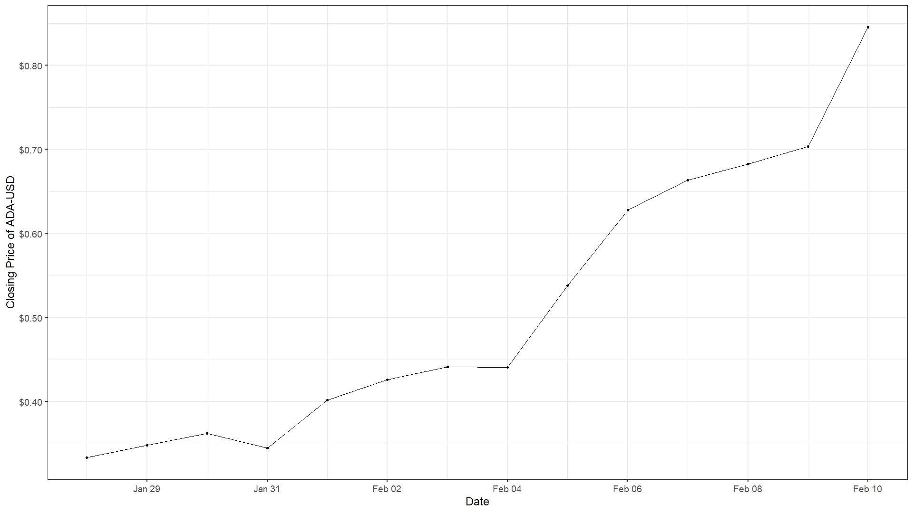
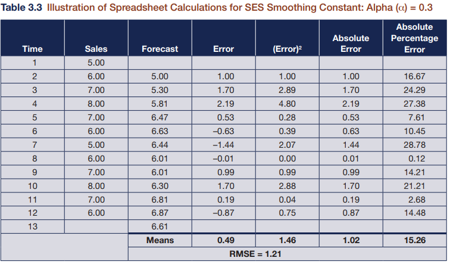
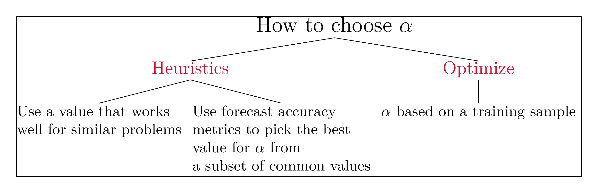

```{r setup, include=FALSE}
knitr::opts_chunk$set(cache = TRUE,
                      echo = TRUE,
                      warning = FALSE,
                      message = FALSE,
                      progress = FALSE, 
                      verbose = FALSE,
                      dev = 'png',
                      dpi = 300,
                      fig.asp = 0.618,
                      fig.align = 'center',
                      out.width = '70%')

options(htmltools.dir.version = FALSE)


miamired = '#C3142D'

if(require(pacman)==FALSE) install.packages("pacman")
if(require(devtools)==FALSE) install.packages("devtools")
if(require(countdown)==FALSE) devtools::install_github("gadenbuie/countdown")
if(require(xaringanExtra)==FALSE) devtools::install_github("gadenbuie/xaringanExtra")
if(require(emo)==FALSE) devtools::install_github("hadley/emo")
if(require(icons)==FALSE) devtools::install_github("mitchelloharawild/icons")

pacman::p_load(gifski, av, gganimate, ggtext, glue, extrafont, # for animations
               emojifont, emo, RefManageR, xaringanExtra, countdown, downlit) # for slides
```

```{r xaringan-themer, include=FALSE, warning=FALSE}
if(require(xaringanthemer) == FALSE) install.packages("xaringanthemer")
library(xaringanthemer)

style_mono_accent(base_color = "#84d6d3",
                  base_font_size = "20px")

xaringanExtra::use_extra_styles(
  hover_code_line = TRUE,         
  mute_unhighlighted_code = TRUE  
)

xaringanExtra::use_xaringan_extra(c("tile_view", "animate_css", "tachyons", "panelset", "share_again", "search", "fit_screen", "editable", "clipboard"))

```


# Quick Refresher from Last Class

`r emo::ji("check")` Describe the benefits and drawbacks of judgmental and quantitative forecasting methods.    

`r emo::ji("check")` Explain the difference between causal and extrapolative forecasting.   

`r emo::ji("check")` Describe and apply smoothing with a cumulative average.       

`r emo::ji("check")` Describe and apply forecasting with a moving average.   


---

# Recap: Assignment 06 (Violin Plot)

.pull-left[
.font70[
```{r get_data}
macro = tidyquant::tq_get(
  x = c('UNRATE', 'GNP', 'RHORUSQ156N'),
  from = '2018-01-01', to = '2023-02-12',
  get = 'economic.data'
) |> dplyr::mutate(cat = 'macro')

stocks = tidyquant::tq_get(
  x = c("PM", "UPS",  "SYK",  "PCAR"),
  from = '2018-01-01', to = '2023-02-12') |> 
  dplyr::select(symbol, date, adjusted) |> 
  dplyr::rename(price = adjusted) |> 
  dplyr::mutate(cat = 'stock')


crypto = tidyquant::tq_get(
  c('BTC-USD', 'ETH-USD', 'USDC-USD', 'DOGE-USD'), 
  from = '2018-01-01', to = '2023-02-12') |> 
  dplyr::select(symbol, date, adjusted) |> 
  dplyr::rename(price = adjusted) |> 
  dplyr::mutate(cat = 'crypto')
  

all_data = dplyr::bind_rows(crypto, macro, stocks) |> 
  dplyr::group_by(symbol) |> 
  dplyr::mutate( 
    naive_o = dplyr::lag(price),
    error_o = price - naive_o,
    pe_o = 100*error_o/price
  ) |> 
  dplyr::group_by(symbol, cat) |> #<<
  dplyr::summarise(
    me_o = mean(error_o, na.rm = T),
    mape_o = mean(abs(pe_o), na.rm = T)
  )
```
]
]


.pull-right[
.font80[
```{r data_head}
tail(all_data, n = 11)
```
]
]


---
count: false

# Recap: Assignment 06 (Violin Plot)

.pull-left[
.font80[
```{r violin, eval=FALSE}
all_data |> 
  ggplot2::ggplot(
    ggplot2::aes(x = cat, y = mape_o) #<<
  ) +
  ggplot2::geom_violin() +
  # next two lines of code are not needed
  # included for aesthetics only
  ggplot2::geom_point(size = 2) +
  ggplot2::theme_bw()
```
]
]

.pull-right[
.font80[

```{r violin_out, ref.label='violin', echo=FALSE, out.width='100%'}

```
]
]

---

# Recap: Assignment 07 (Q3 Insight)

.pull-left[
.font80[
```{r hw07_q3, eval = FALSE}
cardano = 
  tidyquant::tq_get(
    'ADA-USD', from = '2020-01-01', to = '2023-02-14') |> 
  dplyr::select(date, adjusted) |> 
  dplyr::mutate(
    ma7 = zoo::rollmeanr(adjusted, k = 7, fill = NA),
    ma7_f = dplyr::lag(ma7)
  )

tail(cardano, 10)
```

]
]

.pull-right[
.font80[

```{r hw07_q3_out, ref.label='hw07_q3', echo=FALSE, highlight.output = c(13)}

```
]
]

---

# Recap: Assignment 07 (Q4 Insight)

```{r cardano_plot, echo=FALSE, out.width='80%', fig.alt="The Rise of Cardano's Closing Price in Early 2021", fig.align='center', fig.cap="The Rise of Cardano's Closing Price in Early 2021"}

```

---

# Learning Objectives for Today's Class

- Recognize time series that are appropriate for simple exponential smoothing (SES).  

- Use SES for smoothing and forecasting.


---
class: inverse, center, middle

# Simple Exponential Smoothing (SES)


---

# Overview of Univariate Forecasting Methods

```{r read_ts_taxonomy, echo=FALSE, out.width='100%', fig.alt="A 10,000 foot view of univariate forecasting techniques", fig.align='center', fig.cap='A 10,000 foot view of forecasting techniques'}
knitr::include_graphics("../../figures/forecasting_methods1.png")
```

.footnote[
<html>
<hr>
</html>

**Notes:** My (incomplete) classification of **univariate**forecasting techniques, i.e., they exclude popular approaches used in multivariate time series forecasting.  
]

---

# SES: Definition and Basic Principles

Simple Exponential Smoothing (SES) is a method used for one-step-ahead forecasting of a time series when there is no trend or seasonal pattern, but the mean may drift slowly over time. The mean is said to have a "local level".

Similar to the idea behind a moving average, SES averages the values of the times series, but applies weights of decreasing importance to values that are farther away from the forecast. The weights of the observations "exponentially decay" as we move away from them in time.

The SES one-step-ahead forecast is given by: $${l}_{t+1} = l_t + \alpha(y_t - l_t ) = \alpha y_t + (1 - \alpha)l_t,$$
where $0 < \alpha < 1$ is the smoothing parameter, and $l_t$ is the  level of the series at time $t$. Note that $l_{1+1}$ is often denoted as $f_{t+1}$ since it represents our one step-ahead forecast for $t+1$.


---

# SES: Impact of the Smoothing Parameter

$$
\begin{aligned}
l_4 &= \alpha y_3 + (1-\alpha)l_3 \\
    &= \alpha y_3 + (1-\alpha)[\alpha y_2 + (1-\alpha)l_2]\\
    &= \alpha y_3 + \alpha(1-\alpha)y_2 + (1-\alpha)^2l_2\\
    &= \alpha y_3 + \alpha(1-\alpha)y_2 + (1-\alpha)[\alpha y_1 + (1-\alpha)l_1]\\
    &= \alpha y_3 + \alpha(1-\alpha)y_2 + \alpha(1-\alpha)^2 y_1 + (1-\alpha)^3 l_1\\
    &= \alpha y_3 + \alpha(1-\alpha)y_2 + \alpha(1-\alpha)^2 y_1 + (1-\alpha)^3 l_0
\end{aligned}
$$

Note that SES needs **two parameters**: (a) the **smoothing parameter $\alpha$**, and (b) the **initial value for the level** (i.e., $l_0$).} Note that we will use $l_0 = l_1 = y_1$.


---
count: false

# SES: Impact of the Smoothing Parameter

```{r ses_smoothing_parameter, echo=FALSE}
df = data.frame(t= seq(9, 0, -1), `alpha = 0.2` = rep(NA, 10), `alpha = 0.5` = rep(NA, 10), `alpha = 0.8` = rep(NA, 10))

for (i in 1:nrow(df) ) {
  df$alpha...0.2[i] = 0.2*(1-0.2)^(i-1)
  df$alpha...0.5[i] = 0.5*(1-0.5)^(i-1)
  df$alpha...0.8[i] = 0.8*(1-0.8)^(i-1)
}

df$lag = rev(df$t) + 1 

df = df |>  tidyr::pivot_longer(c(2,3,4))

df |> 
  ggplot2::ggplot(
    ggplot2::aes(x = as.integer(lag), y = value, group = name, color = name)
    ) +
  ggplot2::geom_line() + ggplot2::geom_point() + 
  ggplot2::scale_x_continuous(breaks = scales::pretty_breaks()) +
  ggplot2::scale_color_brewer(type = "qual", palette = 'Dark2') +
  ggplot2::labs(
    x = 'Lag', y = 'Weight', title = 'Weights on Different Lags in SES',
    color = 'Smoothing Parameter') +
  ggplot2::theme_bw() +
  ggplot2::theme(legend.position = 'bottom')
```

---

# Example 1: Sales Forecast

We will use `r fontawesome::fa('r-project', fill = miamired)` to forecast sales, mimicking [Table 3.3 in our reference book (See P. 72)](https://cdn.shopify.com/s/files/1/0859/4364/files/Part_I_POBF-_A_First_Course_in_Forecasting_1.pdf?612).

```{r table3.3_book, echo=FALSE, out.width='65%', fig.alt="Illustration of Spreadsheet Calculations for SES Smoothing Constant: Alpha = 0.3", fig.align='center', fig.cap="Illustration of Spreadsheet Calculations for SES Smoothing Constant: alpha = 0.3"}

```


---
count: false

# Example 1: Sales Forecast

.pull-left[
.font80[
```{r sales1, eval=FALSE}
# data from columns 1 and 2
sales_tbl = tibble::tibble(
  time = 1:12, 
  sales = c(5, 6, 7, 8, 7, 6, 5, 6, 7, 8, 7, 6)
  )

# a quick plot to visualize the data
sales_tbl |>  
  # setting the canvas
  ggplot2::ggplot(ggplot2::aes(x= time, y = sales)) + 
  # lines with dots shown
  ggplot2::geom_line() + 
  ggplot2::geom_point() + 
  # cleaning up the chart (x_axis pretty and black & white theme)
  ggplot2::scale_x_continuous( breaks = scales::pretty_breaks(12) ) + 
  ggplot2::theme_bw()
```
]
]

.pull-right[
.font80[

```{r sales1_out, ref.label='sales1', echo=FALSE, out.width='100%'}

```
]
]


---
count: false

# Example 1: Sales Forecast

.pull-left[
.font80[
```{r sales2, eval=FALSE}
ses_fit =
  forecast::ses(
    # recommended to convert y into a ts when possible
    y = ts(sales_tbl$sales, start = 1, end = 12),
    h = 4, # forecast four values ahead
    # 95%PI
    level = 95,
    # use first value for l_0 and l_1
    initial = 'simple', #<<
    # alpha = 0.3
    alpha = 0.3
  )

names(ses_fit)
```
]
]

.pull-right[
.font80[

```{r sales2_out, ref.label='sales2', echo=FALSE, out.width='100%'}

```
]
]


---
count: false

# Example 1: Sales Forecast

.pull-left[
.font80[
```{r sales3, eval=FALSE}
sales_tbl = 
  sales_tbl |> 
  dplyr::mutate(
    ses_f = ses_fit$fitted,
    error = sales - ses_f,
    error2 = error^2,
    abs_error = abs(error),
    abs_pe = 100*(abs(error/sales))
  )

sales_tbl |> 
  dplyr::summarise(
    # needs to be before the other summaries
    # to compute correctly in R
    rmse = sqrt( mean(error^2, na.rm = T) ),
    # a bit fancy but the code below allows you
    # to use the custom mean function with input
    # x to change for each column to compute the
    # mean across the columns from error to
    # abs_pe
    dplyr::across(
      .cols = error:abs_pe,
      .fns = function(x) mean(x, na.rm = T)
    )
  ) 
```
]
]

.pull-right[
.font80[

```{r sales3_out, ref.label='sales3', echo=FALSE, out.width='100%'}

```
]
]


---
count: false

# Example 1: Sales Forecast

.pull-left[
.font80[
```{r sales4, eval=FALSE}
forecast::autoplot(ses_fit) + #<<
  forecast::autolayer(ses_fit$fitted, series = 'ses[0.3]') + #<<
  ggplot2::theme_bw() +
  ggplot2::theme(legend.position = 'bottom') +
  ggplot2::labs(y = 'sales', x = 'time') 
```
]
]

.pull-right[
.font80[

```{r sales4_out, ref.label='sales4', echo=FALSE, out.width='100%'}

```
]
]


---

## Poll: Why are Our Results Different from Table 3.3?

<div style='position: relative; padding-bottom: 56.25%; padding-top: 35px; height: 0; overflow: hidden;'><iframe sandbox='allow-scripts allow-same-origin allow-presentation' allowfullscreen='true' allowtransparency='true' frameborder='0' height='315' src='https://www.mentimeter.com/app/presentation/aloaewyr9vbfbmzb7ojbw7pxwv2nakfc/embed' style='position: absolute; top: 0; left: 0; width: 100%; height: 100%;' width='420'></iframe></div>


---

# Let us Talk about $\alpha$

```{r run_latex_file, echo=FALSE, cache=TRUE, results='hide'}
tinytex::xelatex('../../figures/ses_alpha.tex')
Sys.sleep(2)
pdftools::pdf_convert('../../figures/ses_alpha.pdf', dpi = 600,
                      filenames = '../../figures/ses_alpha.png')
Sys.sleep(2)
```

```{r read_ses_forest, echo=FALSE, out.width='100%', fig.alt="Choosing alpha for ses forecasting", fig.align='center', fig.cap='Strategies for choosing an appropriate alpha value.'}

```


---

# Training and Validation Samples

**Often you determine your smoothing parameter based on a training or baseline sample of observations, not the entire series. Then you apply the model using the smoothing parameter to the new observations and evaluate the fit on the out-of-sample observations.**

```{r train_validation, fig.align='center', echo=FALSE, out.height='60%'}
usdc = 
  tidyquant::tq_get('USDC-USD', from = '2019-01-01', to = '2023-02-01', periodicity = 'monthly') |> 
  dplyr::select(date, adjusted)

usdc |> 
  ggplot2::ggplot(ggplot2::aes(x = date, y = adjusted)) +
  ggplot2::geom_line() + 
  ggplot2::geom_point() +
  ggplot2::theme_bw(base_size = 7) +
  ggplot2::scale_x_date(breaks = scales::pretty_breaks(10)) + # beautifying the x-axis
  ggplot2::geom_rect(xmin = usdc$date[1], xmax = usdc$date[40], 
            ymin = min(usdc$adjusted) - 0.005,
            ymax = max(usdc$adjusted) + 0.005, alpha = 0.01, fill = 'gray') +
  ggplot2::geom_rect(xmin = usdc$date[41], xmax = usdc$date[50], 
            ymin = min(usdc$adjusted) - 0.005,
            ymax = max(usdc$adjusted) + 0.005, alpha = 0.01, fill = 'red') +
  ggplot2::annotate("text", x = usdc$date[20], y = max(usdc$adjusted) + 0.0001,
             color = 'black', label = "Training Region", size = 3, fontface = 'bold') + 
  ggplot2::annotate("text", x = usdc$date[48], y = max(usdc$adjusted) + 0.0001,
             color = 'black', label = "Validation Region", size = 3, fontface = 'bold') + 
  ggplot2::labs(x = 'Date', y = 'Closing Price', caption = 'Data from 2019-01-01 to 2023-02-01',
       title = 'Depicting Training (~80%) and Validation (~20%) Regions for the USDC-USD Data')

```


---
count: false

# Training and Validation Samples

  (1) Determine the size of the training, or baseline sample.  
    a. Training sample size is usually 70-80% of the total available data.   
    b. Training sample should maintain time order. With time series, the training sample usually consists of observations at the beginning of the sample, while validation sample consists of observations at the end of the available data.   
  
  (2) Select the smoothing parameter based on the observations in the training sample only.  

  (3) Evaluate the “in-sample” performance of the forecast using RMSE and graphs using the training sample.   
  
  (4) Apply the model chosen in #2 to the validation sample.    

  (5) Evaluate the “out-of-sample” performance of the forecast using RMSE and graphs.
  

.footnote[
<html>
<hr>
</html>

**Source:** Slide is based on [Dr. Allison Jones-Farmer's Handouts]{https://miamioh.edu/fsb/directory/?up=/directory/farmerl2}{} for ISA 444, Fall 2022.
]


---

# Demo: Optimizing the Smoothing Parameter

.font80[To illustrate the aforementioned concepts, let us examine the data for the [WFJ Sales Example](https://github.com/fmegahed/isa444/blob/master/data/WFJ_sales.xlsx?raw=true) (i.e., [Example 3.2 in our textbook](https://cdn.shopify.com/s/files/1/0859/4364/files/Part_I_POBF-_A_First_Course_in_Forecasting_1.pdf?612)). Per the textbook example, we will use the first the 26 observations as the estimation sample.]


**We will live code the example below in class.**

.font80[
```{r wfj_sales}
wfj_sales = readxl::read_excel('../../data/WFJ_sales.xlsx') |>
  dplyr::select(c(1,2))
```
]


```{r wfj_sol, include=FALSE}

# Step 1: Subset the data for training
train_data = wfj_sales[1:26,] # using the first 26 observations for training

# Step 2: Extract optimal alpha and training metrics 
ses_fit = forecast::ses(train_data$`WFJ Sales`, h = 1)

summary(ses_fit)

metrics = forecast::accuracy(ses_fit)
optimal_alpha = ses_fit$model$par['alpha']

# Step 3: Fit ses on the entire dataset
wfj_sales$ses_opt = 
  forecast::ses(
    wfj_sales$`WFJ Sales`, h =1, 
    initial = 'simple', alpha = optimal_alpha
  ) |>  magrittr::extract2('fitted')

# Step 4: Performance on Validation Metrics Only

validation_data = wfj_sales[27:62,]
valid_metrics = 
  forecast::accuracy(
    object = validation_data$ses_opt, 
    x = validation_data$`WFJ Sales`)
```

---
class: inverse, center, middle

# Recap

---

# Summary of Main Points

By now, you should be able to do the following:   

- Recognize time series that are appropriate for simple exponential smoothing (SES).  

- Use SES for smoothing and forecasting.

---

# Things to Do to Prepare for Our Next Class

 - **Recommended:** Thoroughly read [Chapter 3.1-3.3 of our reference book](https://wessexlearning.com/products/principles-of-business-forecasting-2nd-ed-part-i).  
 
- **Required:** Complete [assignment08](https://miamioh.instructure.com/courses/188655/quizzes/540766).
 