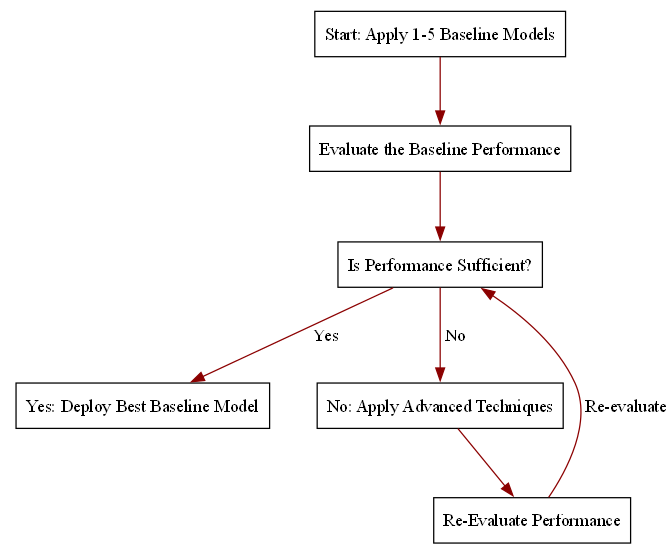

```{r setup, include=FALSE}
knitr::opts_chunk$set(cache = FALSE,
                      echo = TRUE,
                      warning = FALSE,
                      message = FALSE,
                      progress = FALSE, 
                      verbose = FALSE,
                      dev = 'png',
                      fig.height = 2.75,
                      dpi = 300,
                      fig.align = 'center')

options(htmltools.dir.version = FALSE)


miamired = '#C3142D'

if(require(pacman)==FALSE) install.packages("pacman")
if(require(devtools)==FALSE) install.packages("devtools")
if(require(countdown)==FALSE) devtools::install_github("gadenbuie/countdown")
if(require(xaringanExtra)==FALSE) devtools::install_github("gadenbuie/xaringanExtra")
if(require(urbnmapr)==FALSE) devtools::install_github('UrbanInstitute/urbnmapr')
if(require(emo)==FALSE) devtools::install_github("hadley/emo")

pacman::p_load(tidyverse, magrittr, lubridate, janitor, # data analysis pkgs
               DataExplorer, scales, plotly, calendR, pdftools, # plots
               tmap, sf, urbnmapr, tigris, # maps
               bibliometrix, # for bibliometric analysis of my papers
               gifski, av, gganimate, ggtext, glue, extrafont, # for animations
               emojifont, emo, RefManageR, xaringanExtra, countdown) # for slides
```

```{r xaringan-themer, include=FALSE, warning=FALSE}
if(require(xaringanthemer) == FALSE) install.packages("xaringanthemer")
library(xaringanthemer)

style_mono_accent(base_color = "#84d6d3",
                  base_font_size = "20px")

xaringanExtra::use_extra_styles(
  hover_code_line = TRUE,         
  mute_unhighlighted_code = TRUE  
)

xaringanExtra::use_xaringan_extra(c("tile_view", "animate_css", "tachyons", "panelset", "broadcast", "share_again", "search", "fit_screen", "editable", "clipboard"))

```

## Quick Refresher of Last Class

`r emo::ji("check")` Install and import Nixtla's libraries ([StatsForecast](https://nixtlaverse.nixtla.io/statsforecast/index.html), [MLForecast](https://nixtlaverse.nixtla.io/mlforecast/index.html), [NeuralForecast](https://nixtlaverse.nixtla.io/neuralforecast/docs/getting-started/introduction.html), [UtilsForecast](https://nixtlaverse.nixtla.io/utilsforecast/index.html), and [TimeGPT](https://nixtlaverse.nixtla.io/nixtla/docs/getting-started/introduction.html)) for forecasting  

`r emo::ji("check")` Distinguish fixed window from rolling-origin  

`r emo::ji("check")` Introduce forecast accuracy metrics (MAE, MAPE, RMSE)   


---

## Learning Objectives for Today's Class

- Recognize the importance of baseline forecasts in time series forecasting

- Identify common baseline forecasts (Naive, Seasonal Naive, etc.)  

- Implement [baseline models with StatsForecast](https://nixtlaverse.nixtla.io/statsforecast/index.html#baseline-models) 


---
class: inverse, center, middle

# Importance of Baseline Forecasts

---

## Why do we need Baseline Forecasts?

.pull-left[
- Baseline forecasts are **simple, yet powerful**.  

- Baseline forecasts serve as **important benchmarks**:  

  - They **provide a performance "floor"** for more complex models.  

  - Help **assess if advanced models can add meaningful value**.  
  
- They are **easy to interpret** and **require minimal computational resources**. 
]


.pull-right[
```{python flow_chart, echo=FALSE, results='hide'}
from graphviz import Digraph

# Create a new directed graph
dot = Digraph(comment='Flowchart: Baseline Model to Advanced Technique')

# Graph attributes
dot.graph_attr['size'] = '7,6'
dot.graph_attr['ratio'] = 'fill'
dot.node_attr['shape'] = 'rectangle'
dot.attr('edge', color='darkred')


# Define nodes
dot.node('A', 'Start: Apply 1-5 Baseline Models')
dot.node('B', 'Evaluate the Baseline Performance')
dot.node('C', 'Is Performance Sufficient?')
dot.node('D', 'Yes: Deploy Best Baseline Model')
dot.node('E', 'No: Apply Advanced Techniques')
dot.node('F', 'Re-Evaluate Performance')

# Define edges between nodes
dot.edge('A', 'B')
dot.edge('B', 'C')
dot.edge('C', 'D', label=' Yes')
dot.edge('C', 'E', label=' No')
dot.edge('E', 'F')
dot.edge('F', 'C', label=' Re-evaluate')

# Save and render the flowchart to a file (e.g., PDF or PNG)
dot.render('../../figures/flowchart_baseline', format='png')
```

```{r flow_chart_output, echo=FALSE, out.width='100%'}

```

]


---
class: inverse, center, middle

# Common Baseline Forecasts


---

## Historic Mean/Average

- **Historic Mean/Average**: The simplest baseline forecast is to use the average of the historical data as the forecast for all future periods.

- **Mathematical Representation**: $\hat{y}_{t+h} = \frac{1}{t} \sum_{i=1}^{t} y_i$  

- **Assumptions about the Data Generating Process (DGP)**:   

  - Future values will be similar to the past.  

  - The data generating process is **relatively stationary (fixed mean with random noise)**, with **no seasonality** and **no trends** (obviously since the mean is fixed).
  

---

## Historic Mean/Average: Fixed Window

```{python historic_average, echo=FALSE, out.width='100%', results='hide', fig.show='hold'}
import pandas as pd
import seaborn as sns
import matplotlib.pyplot as plt

from statsforecast import StatsForecast
from statsforecast.models import HistoricAverage


# Read and process the data
retail_trade = (
    pd.read_csv("https://fred.stlouisfed.org/graph/fredgraph.csv?bgcolor=%23ebf3fb&chart_type=line&drp=0&fo=open%20sans&graph_bgcolor=%23ffffff&height=450&mode=fred&recession_bars=on&txtcolor=%23444444&ts=12&tts=12&width=1320&nt=0&thu=0&trc=0&show_legend=yes&show_axis_titles=yes&show_tooltip=yes&id=RSXFS&scale=left&cosd=1992-01-01&coed=2025-01-01&line_color=%230073e6&link_values=false&line_style=solid&mark_type=none&mw=3&lw=3&ost=-99999&oet=99999&mma=0&fml=a&fq=Monthly&fam=avg&fgst=lin&fgsnd=2020-02-01&line_index=1&transformation=lin&vintage_date=2025-02-19&revision_date=2025-02-19&nd=1992-01-01")
    .rename(columns={"observation_date": "ds", "RSXFS": "y"})
    .assign(
      unique_id = "RSXFS",
      ds = lambda x: pd.to_datetime(x["ds"])
      )
)

sf = StatsForecast(models = [HistoricAverage()], freq="MS")

# Fit the model
fitted = sf.fit( retail_trade.query("ds < '2024-01-01'"), prediction_intervals = None )
fitted_df = pd.DataFrame({
  'unique_id': retail_trade["unique_id"].unique()[0],
  'ds': retail_trade.query("ds < '2024-01-01'")["ds"].tolist(),
  'HistoricAverage': fitted.fitted_[0][0].model_['fitted'].tolist(),
  'y': retail_trade.query("ds < '2024-01-01'")["y"].tolist(),
  'data': 'Train (Historic Average)'
  }
  )
predictions = (
  sf.predict( h = 13 )
  .assign( 
    y = retail_trade.query("ds >= '2024-01-01'")["y"].tolist(),
    data = 'Holdout (Historic Average)'
    )
  )
  
combined_df = pd.concat([fitted_df, predictions], axis = 0)

last_train_date = retail_trade.query("ds < '2024-01-01'")["ds"].max()

plt.figure(figsize=(8, 4))
sns.set_style("whitegrid")
  
ax = sns.relplot(
  data = combined_df, x = 'ds', y = 'y', kind = 'line', height = 4, aspect = 2, color = 'black'
  )
sns.lineplot(data = combined_df, 
x = 'ds', y = 'HistoricAverage', hue = 'data', ax = ax.ax
)

plt.axvspan(retail_trade['ds'].min(), last_train_date, 
            color='lightgray', alpha=0.3, label='Training Data')
            
plt.axvspan(last_train_date, retail_trade['ds'].max(), 
            color='red', alpha=0.3, label='Test Data')

# Add a vertical line at the split point
plt.axvline(x=last_train_date, color='red', linestyle='--', alpha=0.5)

plt.xlabel('Date', fontweight='bold')
plt.ylabel('Retail Sales (Millions of Dollars)', fontweight='bold')
plt.legend(loc='upper left')

plt.xlim(retail_trade['ds'].min(), retail_trade['ds'].max())

# Add $ sign and commas to the y-axis labels
plt.gca().yaxis.set_major_formatter('${x:,.0f}')

# Add text annotation for the split point
plt.text(
  last_train_date, (plt.ylim()[0]+plt.ylim()[1])/2, 'Train-Test Split', 
  rotation=90, va='top', ha='right', color='black', fontsize=10, fontweight='bold'
  )

# Add annotation for the number of training and test data points (placed in the top middle of each region)
plt.text(
  retail_trade['ds'].min() + (last_train_date - retail_trade['ds'].min()) / 2,
  plt.ylim()[1]-10000,
  f"Train Data: {len(retail_trade[retail_trade['ds'] <= last_train_date])} mo", 
  va='top', ha='center', color='black', fontsize=10, fontweight='bold')
plt.text(
  last_train_date + (retail_trade['ds'].max() - last_train_date) / 2,
  plt.ylim()[1]-10000,
  f"Test: {len(retail_trade[retail_trade['ds'] > last_train_date])} mo", 
  va='top', ha='center', color='black', fontsize=10, fontweight='bold')

# Display the plot
plt.tight_layout(pad=2.5)
plt.show()
```

.footnote[
<html>
<hr>
</html>

**Notes**: The plot above shows the historic average forecast for the retail trade data. The light gray region represents the training data, while the red region represents the test data. The vertical dashed line indicates the split point between the training and test data. The training data is used to fit the model, while the test data is used to evaluate the model's performance.

**Obviously, the historic average forecast is a straight line, as it is the same for all future periods. Furthermore, it is a terrible choice for this dataset since it clearly has a positive trend.**
]


---

## Naive Forecast

- **Naive Forecast**: The naive forecast assumes that the future value will be the same as the last observed value.  

- **Mathematical Representation**: $\hat{y}_{t+h} = y_t$  

- **Assumptions about the Data Generating Process (DGP)**:   

  - Future values will be similar to the most recent past value.  

  - The data generating process can either be **relatively stationary** or **follow a random walk**.
  

---

## Naive Forecast: Fixed Window

```{python naive_forecast, echo=FALSE, out.width='100%', results='hide', fig.show='hold'}
from statsforecast.models import Naive

sf = StatsForecast(models = [Naive()], freq="MS")

# Fit the model
fitted = sf.fit( retail_trade.query("ds < '2024-01-01'"), prediction_intervals = None )
fitted_df = pd.DataFrame({
  'unique_id': retail_trade["unique_id"].unique()[0],
  'ds': retail_trade.query("ds < '2024-01-01'")["ds"].tolist(),
  'Naive': fitted.fitted_[0][0].model_['fitted'].tolist(),
  'y': retail_trade.query("ds < '2024-01-01'")["y"].tolist(),
  'data': 'Train (Naive)'
  }
  )

predictions = (
  sf.predict( h = 13 )
  .assign( 
    y = retail_trade.query("ds >= '2024-01-01'")["y"].tolist(),
    data = 'Holdout (Naive)'
    )
  )

combined_df = pd.concat([fitted_df, predictions], axis = 0).reset_index(drop=True)

last_train_date = retail_trade.query("ds < '2024-01-01'")["ds"].max()

plt.figure(figsize=(8, 4))
sns.set_style("whitegrid")

ax = sns.relplot(
  data = combined_df, x = 'ds', y = 'y', kind = 'line', height = 4, aspect = 2, color = 'black'
  )

sns.lineplot(data = combined_df, x = 'ds', y = 'Naive', hue = 'data', ax = ax.ax)

plt.axvspan(retail_trade['ds'].min(), last_train_date, 
            color='lightgray', alpha=0.3, label='Training Data')
            
plt.axvspan(last_train_date, retail_trade['ds'].max(), 
            color='red', alpha=0.3, label='Test Data')

# Add a vertical line at the split point
plt.axvline(x=last_train_date, color='red', linestyle='--', alpha=0.5)

plt.xlabel('Date', fontweight='bold')
plt.ylabel('Retail Sales (Millions of Dollars)', fontweight='bold')
plt.legend(loc='upper left')

plt.xlim(retail_trade['ds'].min(), retail_trade['ds'].max())

# Add $ sign and commas to the y-axis labels
plt.gca().yaxis.set_major_formatter('${x:,.0f}')

# Add text annotation for the split point
plt.text(
  last_train_date, (plt.ylim()[0]+plt.ylim()[1])/2, 'Train-Test Split', 
  rotation=90, va='top', ha='right', color='black', fontsize=10, fontweight='bold'
  )

# Add annotation for the number of training and test data points (placed in the top middle of each region)
plt.text(
  retail_trade['ds'].min() + (last_train_date - retail_trade['ds'].min()) / 2,
  plt.ylim()[1]-10000,
  f"Train Data: {len(retail_trade[retail_trade['ds'] <= last_train_date])} mo", 
  va='top', ha='center', color='black', fontsize=10, fontweight='bold')
plt.text(
  last_train_date + (retail_trade['ds'].max() - last_train_date) / 2,
  plt.ylim()[1]-10000,
  f"Test: {len(retail_trade[retail_trade['ds'] > last_train_date])} mo", 
  va='top', ha='center', color='black', fontsize=10, fontweight='bold')


# Display the plot
plt.tight_layout(pad=2.5)
plt.show()
```

.footnote[
<html>
<hr>
</html>

**Notes**: The plot above shows the naive forecast for the retail trade data. The light gray region represents the training data, while the red region represents the test data. The vertical dashed line indicates the split point between the training and test data. The training data is used to fit the model, while the test data is used to evaluate the model's performance.

**The naive forecast lags the training data, and is a straightline for the holdout dataset since we do not update the naive forecast for the fixed window approach.** **Similar to the historic average forecast, the naive forecast is a terrible choice for this dataset since it clearly has a positive trend.**
]


---

## Seasonal Naive Forecast

- **Seasonal Naive Forecast**: The seasonal naive forecast assumes that the future value will be the same as the last observed value from the same season.  

- **Mathematical Representation**: $\hat{y}_{t+h} = y_{t+h-m}$, where $m$ is the seasonal period.  

- **Assumptions about the Data Generating Process (DGP)**:   

  - Future values will be similar to the most recent past value from the same season.  

  - The data generating process will be **seasonal but with no trends**.
  

---

## Seasonal Naive Forecast: Fixed Window

```{python seasonal_naive_forecast, echo=FALSE, out.width='100%', results='hide', fig.show='hold'}
from statsforecast.models import SeasonalNaive

sf = StatsForecast(models = [SeasonalNaive(season_length = 12)], freq="MS")

# Fit the model
fitted = sf.fit( retail_trade.query("ds < '2024-01-01'"), prediction_intervals = None )
fitted_df = pd.DataFrame({
  'unique_id': retail_trade["unique_id"].unique()[0],
  'ds': retail_trade.query("ds < '2024-01-01'")["ds"].tolist(),
  'SeasonalNaive': fitted.fitted_[0][0].model_['fitted'].tolist(),
  'y': retail_trade.query("ds < '2024-01-01'")["y"].tolist(),
  'data': 'Train (Seasonal Naive)'
  }
  )

predictions = (
  sf.predict( h = 13 )
  .assign( 
    y = retail_trade.query("ds >= '2024-01-01'")["y"].tolist(),
    data = 'Holdout (Seasonal Naive)'
    )
  )

combined_df = pd.concat([fitted_df, predictions], axis = 0).reset_index(drop=True)

last_train_date = retail_trade.query("ds < '2024-01-01'")["ds"].max()

plt.figure(figsize=(8, 4))
sns.set_style("whitegrid")

ax = sns.relplot(
  data = combined_df, x = 'ds', y = 'y', kind = 'line', height = 4, aspect = 2, color = 'black'
  )

sns.lineplot(data = combined_df, x = 'ds', y = 'SeasonalNaive', hue = 'data', ax = ax.ax)

plt.axvspan(retail_trade['ds'].min(), last_train_date, 
            color='lightgray', alpha=0.3, label='Training Data')
            
plt.axvspan(last_train_date, retail_trade['ds'].max(), 
            color='red', alpha=0.3, label='Test Data')

# Add a vertical line at the split point
plt.axvline(x=last_train_date, color='red', linestyle='--', alpha=0.5)

plt.xlabel('Date', fontweight='bold')
plt.ylabel('Retail Sales (Millions of Dollars)', fontweight='bold')
plt.legend(loc='upper left')

plt.xlim(retail_trade['ds'].min(), retail_trade['ds'].max())

# Add $ sign and commas to the y-axis labels
plt.gca().yaxis.set_major_formatter('${x:,.0f}')

# Add text annotation for the split point
plt.text(
  last_train_date, (plt.ylim()[0]+plt.ylim()[1])/2, 'Train-Test Split', 
  rotation=90, va='top', ha='right', color='black', fontsize=10, fontweight='bold'
  )

# Add annotation for the number of training and test data points (placed in the top middle of each region)
plt.text(
  retail_trade['ds'].min() + (last_train_date - retail_trade['ds'].min()) / 2,
  plt.ylim()[1]-10000,
  f"Train Data: {len(retail_trade[retail_trade['ds'] <= last_train_date])} mo", 
  va='top', ha='center', color='black', fontsize=10, fontweight='bold')
plt.text(
  last_train_date + (retail_trade['ds'].max() - last_train_date) / 2,
  plt.ylim()[1]-10000,
  f"Test: {len(retail_trade[retail_trade['ds'] > last_train_date])} mo", 
  va='top', ha='center', color='black', fontsize=10, fontweight='bold')


# Display the plot
plt.tight_layout(pad=2.5)
plt.show()

```

.footnote[
<html>
<hr>
</html>

**Notes**: The plot above shows the seasonal naive forecast for the retail trade data. The light gray region represents the training data, while the red region represents the test data. The vertical dashed line indicates the split point between the training and test data. The training data is used to fit the model, while the test data is used to evaluate the model's performance.

**The seasonal naive forecast lags the training data, and is worse than the naive model (since now the data lags by 12 months instead of 1 month); it would be better if the data is seasonal with no trends.**
]


---
class: inverse, center, middle

# Implementing Baseline Models with StatsForecast

---

## Live Demo

We will now implement the historic average, naive, and seasonal naive forecasts using the [StatsForecast]() library. Our in-class implementation will highlight both the fixed window and rolling-origin approaches.


---

class: inverse, center, middle

# Recap

---

## Summary of Main Points

By now, you should be able to do the following:  

- Recognize the importance of baseline forecasts in time series forecasting

- Identify common baseline forecasts (Naive, Seasonal Naive, etc.)  

- Implement [baseline models with StatsForecast](https://nixtlaverse.nixtla.io/statsforecast/index.html#baseline-models) 

---

## 📝 Review and Clarification 📝

1. **Class Notes**: Take some time to revisit your class notes for key insights and concepts.
2. **Zoom Recording**: The recording of today's class will be made available on Canvas approximately 3-4 hours after the session ends.
3. **Questions**: Please don't hesitate to ask for clarification on any topics discussed in class. It's crucial not to let questions accumulate. 

