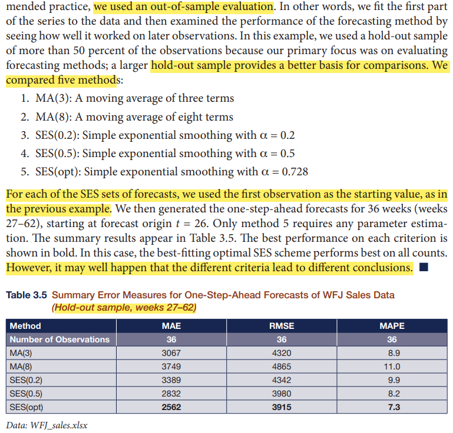

```{r setup, include=FALSE}
knitr::opts_chunk$set(cache = TRUE,
                      echo = TRUE,
                      warning = FALSE,
                      message = FALSE,
                      progress = FALSE, 
                      verbose = FALSE,
                      dev = 'png',
                      dpi = 300,
                      fig.asp = 0.618,
                      fig.align = 'center',
                      out.width = '70%')

options(htmltools.dir.version = FALSE)


miamired = '#C3142D'

if(require(pacman)==FALSE) install.packages("pacman")
if(require(devtools)==FALSE) install.packages("devtools")
if(require(countdown)==FALSE) devtools::install_github("gadenbuie/countdown")
if(require(xaringanExtra)==FALSE) devtools::install_github("gadenbuie/xaringanExtra")
if(require(emo)==FALSE) devtools::install_github("hadley/emo")
if(require(icons)==FALSE) devtools::install_github("mitchelloharawild/icons")

pacman::p_load(gifski, av, gganimate, ggtext, glue, extrafont, # for animations
               emojifont, emo, RefManageR, xaringanExtra, countdown, downlit) # for slides
```

```{r xaringan-themer, include=FALSE, warning=FALSE}
if(require(xaringanthemer) == FALSE) install.packages("xaringanthemer")
library(xaringanthemer)

style_mono_accent(base_color = "#84d6d3",
                  base_font_size = "20px")

xaringanExtra::use_extra_styles(
  hover_code_line = TRUE,         
  mute_unhighlighted_code = TRUE  
)

xaringanExtra::use_xaringan_extra(c("tile_view", "animate_css", "tachyons", "panelset", "share_again", "search", "fit_screen", "editable", "clipboard"))

```


# Quick Refresher from Last Class

`r emo::ji("check")` Recognize time series that are appropriate for simple exponential smoothing (SES).  

`r emo::ji("check")` Use SES for smoothing and forecasting.     


---

# Recap: Assignment 08 

<div style='position: relative; padding-bottom: 56.25%; padding-top: 35px; height: 0; overflow: hidden;'><iframe sandbox='allow-scripts allow-same-origin allow-presentation' allowfullscreen='true' allowtransparency='true' frameborder='0' height='315' src='https://www.mentimeter.com/app/presentation/aldtd8w9j4jukttqpgs9jxwpuqs1a4ed/embed' style='position: absolute; top: 0; left: 0; width: 100%; height: 100%;' width='420'></iframe></div>


---
count: false

# Recap: Assignment 08 

```{r book_example, echo=FALSE, out.height='45%', fig.alt="The description of the computations from our reference book", fig.align='center'}

```


---
count: false

# Recap: Assignment 08 

We will use my tablet to explain the book's strategy for evaluating the performance of the five different forecasting procedures. **In my opinion, this strategy makes a lot of sense.**


---

# Learning Objectives for Today's Class

- Recognize time series that are appropriate for linear exponential smoothing (LES).  

- Use SES for smoothing and forecasting.


---
class: inverse, center, middle

# Linear Exponential Smoothing 

# (LES, Holt's Method or Double Exponential Smoothing)


---

# Overview of Univariate Forecasting Methods

```{r read_ts_taxonomy, echo=FALSE, out.width='100%', fig.alt="A 10,000 foot view of univariate forecasting techniques", fig.align='center', fig.cap='A 10,000 foot view of forecasting techniques'}
knitr::include_graphics("../../figures/forecasting_methods1.png")
```

.footnote[
<html>
<hr>
</html>

**Notes:** My (incomplete) classification of **univariate** forecasting techniques, i.e., they exclude popular approaches used in multivariate time series forecasting.  
]

---

# Definition and Basic Principles

Linear Exponential Smoothing (LES) is a method used for one-step-ahead forecasting of a time series when there **is a local trend, but no** seasonal pattern.

A “global” trend occurs when a trend is increasing or decreasing at a nearly constant rate as in a simple linear regression model:
$$
y_t = \beta_0 + \beta_1t + \epsilon_t
$$

**A “local” trend occurs when a linear trend is increasing or decreasing at a nonconstant rate.** LES, also referred to as Holt’s Method or double exponential smoothing, is appropriate when the level $(\beta_0)$ of the series is slowly changing as with SES, and the trend is also changing over time.

To compute the **forecast** we will use two smoothing constants, $\alpha$, to smooth the level, and $\beta$, the smoothing constant to smooth the trend.  


---
count:false
# Definition and Basic Principles

The estimate of the **level** is: 
$$l_t = \alpha y_t + (1-\alpha)[l_{t-1} + b_{t-1}]$$

The estimate of the **trend** is:
$$b_t = \beta [l_t - l_{t-1}] + (1-\beta) b_{t-1}$$

To estimate the **point forecast** for time $t+h$ time periods ahead made in time $t$:
$$\hat{y}_{t+h}(t) = l_t + (h\times b_t)$$


---

# What needs to be Determined/Optimized for?


- **Starting value** for the level, $L_0$  and the starting value of the trend, $B_0$:  

  - When fitting “by hand” you can use a training sample and fit a simple linear trend regression, $\hat{y}_t = b_0 + b_1 t$, to obtain initial estimates of $L_0$ and $B_0$.  
  
  - $L_0 = b_0$, the intercept from a simple regression equation.  
  
  - $B_0 = b_1$, the slope from a simple regression equation.   
  
- The value of the **smoothing constants** for the: level, $\alpha$, and trend, $\beta$:

  - $0 < \alpha < 1$, and $0 < \beta < 1$;  
  
  - The values for $\alpha$ and $\beta$ may be chosen to be the same or different.  
  
  - Often the choices of the smoothing constants are arbitrary.  
  
  - $\alpha$ and $\beta$ can also be chosen by minimizing the mean squared one-step ahead forecast error (MSE) or equivalently, the square root of the mean squared one-step ahead forecast error (RMSE).


---

# Out-of-Class: Weekly Therm Sales Example

```{r therm_sales_read, echo=FALSE}
therm_sales = readxl::read_excel("../../data/Weekly_Therm_Sales.xlsx")

therm_sales |> 
  ggplot2::ggplot(ggplot2::aes(x = Time, y = WeeklyThermSales)) + 
  ggplot2::geom_line() + 
  ggplot2::geom_point() + 
  ggplot2::theme_bw()

```


---
count:false

# Out-of-Class: Weekly Therm Sales Example

Let us use the first 26 points in the dataset to estimate both $L_0$ and $B_0$.


```{r therm_sales_initialization}
time = therm_sales$Time[1:26]
weekly_sales = therm_sales$WeeklyThermSales[1:26]

reg_model = lm(weekly_sales ~ time)

round(summary(reg_model)$coefficients, digits = 3)
```


---
count:false

# Out-of-Class: Weekly Therm Sales Example

Based on the information in the previous slide, please fill the table below. For the purpose of our example, please use $\alpha = 0.2$ and $\beta = 0.1$. Please create and fill this table in the Excel file.


```{r therm_sales_table, echo=FALSE}
therm_sales[53, 1:2] = list(0, NA)
therm_sales = therm_sales |>  dplyr::arrange(Time)
therm_sales$Level = "..."
therm_sales$Trend = "..."
therm_sales$`1-step ahead Forecast` = "..."

print(therm_sales[1:9, ])

```


---

# Weekly Therm Sales: Using `r fontawesome::fa('r-project')`

.pull-left-2[
.font80[
```{r holt_therm1, eval=FALSE}
therm_sales = 
  readxl::read_excel("../../data/Weekly_Therm_Sales.xlsx")

therm_sales_ts = 
  ts(therm_sales$WeeklyThermSales, start = 1, frequency = 1)

# fitting holt model is similar to ses (two smoothing constants though)
les_model = forecast::holt(#<<
  therm_sales_ts, alpha = 0.2, beta = 0.1, level = 95, h=10#<<
  ) #<<

# visualize the forecasts and fitted values
forecast::autoplot(les_model) + # produces original data + forecast
  forecast::autolayer(les_model$fitted) + # fitted values
  ggplot2::theme_bw() +
  ggplot2::theme(legend.position = 'none')
```
]
]


.pull-right-2[
```{r holt_therm1_out, ref.label='holt_therm1', echo=FALSE, out.width='100%'}

```
]


---
count: false
# Weekly Therm Sales: Using `r fontawesome::fa('r-project')`

.pull-left[
.font80[
```{r holt_therm2}
therm_sales$les_f = les_model$fitted

head(therm_sales)
```
]
]


.pull-right[
```{r holt_therm3}
forecast::accuracy(les_model)
```
]


---

# Demo: Optimal $\alpha$ and $\beta$ for WFJ Sales

Let us examine the data for the [WFJ Sales Example](https://github.com/fmegahed/isa444/blob/main/data/WFJ_sales.xlsx) (i.e., Example 3.2 in our textbook). Per the textbook example, we will use the first the 26 observations as the estimation sample. **Note that we will now apply LES instead of the SES approach we examined last class.**


---
class: inverse, center, middle

# Exam 01 Prep and Advice


---

# Open Discussion


---
class: inverse, center, middle

# Recap

---

# Summary of Main Points

By now, you should be able to do the following:   

- Recognize time series that are appropriate for simple exponential smoothing (SES).  

- Use SES for smoothing and forecasting.

---

# Things to Do to Prepare for Our Next Class

 - **Recommended:** Thoroughly read [Chapter 3.1-3.4 of our reference book](https://wessexlearning.com/products/principles-of-business-forecasting-2nd-ed-part-i).  
 
- **Required:** Complete [assignment09](https://miamioh.instructure.com/courses/188655/quizzes/540764).
 