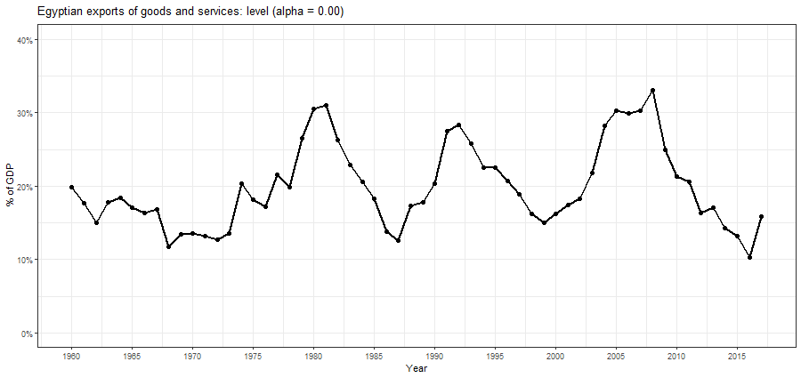
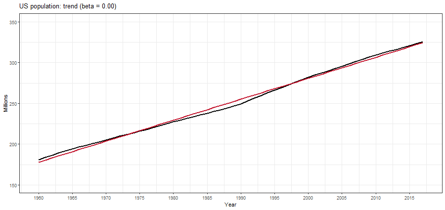
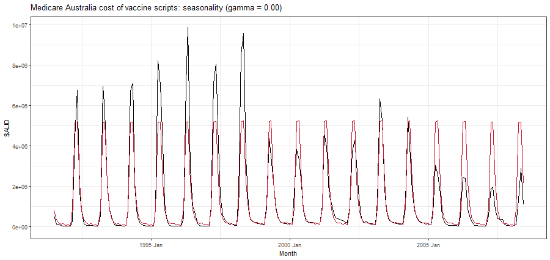

```{r setup, include=FALSE}
knitr::opts_chunk$set(cache = FALSE,
                      echo = TRUE,
                      warning = FALSE,
                      message = FALSE,
                      progress = FALSE, 
                      verbose = FALSE,
                      dev = 'png',
                      fig.height = 2.75,
                      dpi = 300,
                      fig.align = 'center')

options(htmltools.dir.version = FALSE)


miamired = '#C3142D'

if(require(pacman)==FALSE) install.packages("pacman")
if(require(devtools)==FALSE) install.packages("devtools")
if(require(countdown)==FALSE) devtools::install_github("gadenbuie/countdown")
if(require(xaringanExtra)==FALSE) devtools::install_github("gadenbuie/xaringanExtra")
if(require(urbnmapr)==FALSE) devtools::install_github('UrbanInstitute/urbnmapr')
if(require(emo)==FALSE) devtools::install_github("hadley/emo")

pacman::p_load(tidyverse, magrittr, lubridate, janitor, # data analysis pkgs
               DataExplorer, scales, plotly, calendR, pdftools, # plots
               tmap, sf, urbnmapr, tigris, # maps
               bibliometrix, # for bibliometric analysis of my papers
               gifski, av, gganimate, ggtext, glue, extrafont, # for animations
               emojifont, emo, RefManageR, xaringanExtra, countdown) # for slides
```

```{r xaringan-themer, include=FALSE, warning=FALSE}
if(require(xaringanthemer) == FALSE) install.packages("xaringanthemer")
library(xaringanthemer)

style_mono_accent(base_color = "#84d6d3",
                  base_font_size = "20px")

xaringanExtra::use_extra_styles(
  hover_code_line = TRUE,         
  mute_unhighlighted_code = TRUE  
)

xaringanExtra::use_xaringan_extra(c("tile_view", "animate_css", "tachyons", "panelset", "broadcast", "share_again", "search", "fit_screen", "editable", "clipboard"))

```

## Quick Refresher of Last Class

`r emo::ji("check")` Recognize the importance of baseline forecasts in time series forecasting 

`r emo::ji("check")` Identify common baseline forecasts (Naive, Seasonal Naive, etc.) 

`r emo::ji("check")` Implement [baseline models with StatsForecast](https://nixtlaverse.nixtla.io/statsforecast/index.html#baseline-models) 

---

## Learning Objectives for Today's Class

- Understand the mathematical background for exponential smoothing methods, including:  
  + Simple Exponential Smoothing (SES)  
  + Double Exponential Smoothing (Holt)  
  + Triple Exponential Smoothing (Holt-Winters)

- Implement these exponential smoothing methods in Python using StatsForecast

---
class: inverse, center, middle

# Exponential Smoothing Methods

---

## Context: Our Previously Discussed Baseline Models

We have expressed our time series as: $\, y_1,y_2,\dots,y_T$.  

.content-box-gray[

**Naive Forecast:**

.center[
$\hat{y}_{T+h \mid T} = y_T$
]

**Historical Average:**

.center[
$\hat{y}_{T+h \mid T} = \frac{1}{T} \sum_{t=1}^{T} y_t$
]

]

**Is there a more reasonable middle ground between these two extremes?**

.can-edit.key-activity10[

- Naive: ..........
  
- Historical Average: ..........  

- .............................................


]

<!-- * Simple exponential smoothing uses a weighted moving average with weights that decrease exponentially. -->


---

## Simple Exponential Smoothing (SES)

.content-box-gray[
**Forecast equation:** $$\hat{y}_{T+1 \mid T} = \alpha y_T + \alpha(1-\alpha) y_{T-1} + \alpha(1-\alpha)^2 y_{T-2}+ \alpha(1-\alpha)^3 y_{T-3} + \cdots,$$
where $0 \leq \alpha \leq 1$ is the smoothing parameter.
]


.font80[
```{r ses_weights, echo=FALSE, results='asis'}
library(knitr)
library(kableExtra)

df <- data.frame(
  Observation = c("$y_T$", "$y_{T-1}$", "$y_{T-2}$", "$y_{T-3}$", "$y_{T-4}$"),
  `α = 0.2` = c("0.2", "0.16", "0.128", "0.1024", "(0.2)(0.8)^4"),
  `α = 0.4` = c("0.4", "0.24", "0.144", "0.0864", "(0.4)(0.6)^4"),
  `α = 0.6` = c("0.6", "0.24", "0.096", "0.0384", "(0.6)(0.4)^4"),
  `α = 0.8` = c("0.8", "0.16", "0.032", "0.0064", "(0.8)(0.2)^4")
)

colnames(df) <- c("Observation", "$\\alpha = 0.2$", "$\\alpha = 0.4$", "$\\alpha = 0.6$", "$\\alpha = 0.8$")

kable(df, format = "html", escape = TRUE, booktabs = TRUE, align = "c") |>
  kable_styling(latex_options = c("striped", "hold_position"), full_width = TRUE, position = "center") |>
  add_header_above(c(" " = 1, "Exponentially decaying weights assigned to observations for:" = 4)) |>
  column_spec(1, bold = TRUE)


```
]

---

## Simple Exponential Smoothing (SES)

```{r ses_smoothing_parameter, echo=FALSE, fig.asp=0.5}
library(ggplot2)
library(dplyr)
library(tidyr)
library(scales)

# Define Miami Red color (if not already defined)
miamired <- "#B71C1C"  # Adjust if needed

# Create data frame
df <- data.frame(t = seq(9, 0, -1), 
                 `alpha = 0.2` = rep(NA, 10), 
                 `alpha = 0.5` = rep(NA, 10), 
                 `alpha = 0.8` = rep(NA, 10))

# Compute values for each alpha
for (i in 1:nrow(df)) {
  df$`alpha = 0.2`[i] <- 0.2 * (1 - 0.2)^(i - 1)
  df$`alpha = 0.5`[i] <- 0.5 * (1 - 0.5)^(i - 1)
  df$`alpha = 0.8`[i] <- 0.8 * (1 - 0.8)^(i - 1)
}

# Adjust lag values to ensure increasing order (t, t-1, ..., t-8)
df$lag <- df$t - 9

# Reshape data for ggplot
df <- df |> pivot_longer(cols = starts_with("alpha"))

# Define original lags and labels
unique_lags <- sort(unique(df$lag))  # Keep numerical order correct
lag_labels <- c(paste0("t", seq(-length(unique_lags) + 1, -1)), "t")

# Extend x-axis to include t+1
max_lag <- max(unique_lags) + 1  # Extend right side for t+1
expanded_lags <- c(unique_lags, max_lag)  # Add t+1 position at the end
expanded_labels <- c(lag_labels, "t+1")  # Add "t+1" at the right end

# Create the plot
ggplot(df, aes(x = lag, y = value, group = name, color = name)) +
  geom_line(linewidth = 1) + 
  geom_point(size = 2) + 
  geom_vline(xintercept = 0.05, linetype = "dotted", linewidth = 1.25, color = miamired) +  
  scale_x_continuous(
    breaks = expanded_lags,  # Include new break at t+1
    labels = expanded_labels,  # Include "t+1" at the right end
    limits = c(min(unique_lags), max_lag)  # Expand only to the right
  ) +
  scale_color_brewer(type = "qual", palette = 'Dark2') +
  labs(
    x = 'Lag', 
    y = 'Weight', 
    title = 'Weights as a Function of Time for the SES Model',
    color = 'Smoothing Parameter'
  ) +
  theme_bw() +
  theme(legend.position = 'none')

```


---

## Simple Exponential Smoothing (SES)

```{r ses_animation, include=FALSE, eval=FALSE}
library(gganimate)
library(ggplot2)
library(fpp3)
library(purrr)

egypt_economy <- global_economy |>
  filter(Country == "Egypt, Arab Rep.")

alpha_anim <- purrr::map_dfr(
  purrr::set_names(seq(0, 0.99, 0.01)),
  function(alpha) {
    egypt_economy |>
      model(ETS(Exports ~ error("A") + trend("N", alpha = alpha) + season("N"))) |>
      augment() |>
      as_tibble()
  },
  .id = "alpha"
) |>
  mutate(alpha = as.numeric(alpha))

p <- alpha_anim |>
  ggplot(aes(x = Year, y = Exports)) +
  geom_point(size = 2) +
  geom_line(linewidth = 1) +
  geom_line(aes(y = .fitted), colour = miamired, linewidth = 1) +
  transition_manual(alpha) +
  labs(
    y = "% of GDP",
    title = "Egyptian exports of goods and services: level (alpha = {format(as.numeric(as.character(current_frame)), nsmall=2)})",
    capption = "Data source: fpp3 package | Animation inspired by Rob J Hyndman"
  ) + 
  scale_x_continuous(breaks = scales::pretty_breaks(n = 10)) +
  scale_y_continuous(labels = scales::percent_format(scale=1), limits = c(0, (max(egypt_economy$Exports) + 5) |> round(-1) )) +
  theme_bw()

# Save as GIF
anim_save("../../figures/alpha_animation.gif", animation = animate(p, fps = 5, width = 900, height = 425))

```

```{r ses_animation_out, echo=FALSE, out.width="100%"}

```

.footnote[
<html>
<hr>
</html>

**Credits:** This animation is inspired by Rob J Hyndman's presentation of simple exponential smoothing in his book "Forecasting: Principles and Practice". See [here](https://github.com/robjhyndman/fpp3_slides/blob/main/8-1-ses.Rmd) for more details. 

]


---

## Simple Exponential Smoothing (SES)

.content-box-gray[
**Component Form:** 
$$\begin{align*}
\text{Forecast equation}&&\hat{y}_{t+h \mid t} &= \ell_{t} \phantom{xxxxxxxx} \tiny{\text{(mathematically equivalent to equation in Slide 6)}}\\
\text{Smoothing equation}&&\ell_{t} &= \alpha y_{t} + (1 - \alpha)\ell_{t-1}
\end{align*}$$
]
 
- $\ell_{t}$ is the level (or the smoothed value) of the series at time $t$  
- SES is **computationally efficient:** $\hat{y}_{t+h \mid t} = \alpha y_t + (1-\alpha) \hat{y}_{t \mid t-1}$  
- The SES implementation assumes **no trend and no seasonality** since $\hat{y}_{T+h \mid T} = \ell_{T}$, for $h \geq 1$, and $\ell_{T}$ is a constant (last smoothed value).   
- The SES model is equivalent to the ETS(A,N,N) model in the ETS framework (additive error, no trend, no seasonality).


---

## Simple Exponential Smoothing (SES)

.content-box-gray[
**Weighted Average Form:** 

$$\hat{y}_{T+1 \mid T} = \sum_{j=0}^{T-1} \alpha(1-\alpha)^j y_{T-j}+(1-\alpha)^T \ell_{0}$$
]

---

## Smoothing Parameters in SES

- There are two parameters for the SES model: $\alpha$, and $\ell_{0}$.  

- These parameters are either **estimated** or **set** by the user.  

- The [StatsForecast](https://nixtlaverse.nixtla.io/statsforecast/index.html) library provides two implementation of SES:  
  + `SimpleExponentialSmoothing`, where you can set the `alpha` parameter. It uses the first value of the time series as the initial level ($\ell_{0}$); or   
  + `SimpleExponentialSmoothingOptimized`, which finds the optimal $\alpha$ parameter by minimizing the sum of squared errors.  
  
- Please refer to the [SimpleExponentialSmoothing Tutorial](https://nixtlaverse.nixtla.io/statsforecast/docs/models/simpleexponentialsmoothing.html) and the [SimpleExponentialSmoothingOptimized Tutorial](https://nixtlaverse.nixtla.io/statsforecast/docs/models/simpleexponentialsmoothingoptimized.html) for more details on the Nixtla Implementation.  


---

## Class Activity

`r countdown(minutes = 5, seconds = 0, top = 0, font_size = "2em")`

.panelset[

.panel[.panel-name[Description]

- In the beginning of the semester, I noted that the *StatsForecast* **Python** implementation focuses on forecasting at scale, while traditional **R** implementations focus on model explanation and interpretation.  

- The [SimpleExponentialSmoothingOptimized](https://nixtlaverse.nixtla.io/statsforecast/docs/models/simpleexponentialsmoothingoptimized.html) model in StatsForecast is a good example of this, where the model is optimized to find the best $\alpha$ parameter but it does not directly provide the optimized $\alpha$ value.  

- **Your task** is to find the optimized $\alpha$ value from the reported fitted values from their example. 

- Note that the purpose of this activity is **not the mathematical exercise, but to understand the model's output** and **to be able to explain it to your future colleagues**.
]

.panel[.panel-name[Relevant Info]

Let’s visualize the fitted values

```{python, eval=FALSE}
values=sf.forecast_fitted_values()
values.head()
```

.font80[
|  | unique_id | ds                   | y        | SESOpt       |
|-------|-----------|----------------------|----------|-------------|
| 0     | 1         | 2017-09-13 00:00:00  | 80115.0  | NaN         |
| 1     | 1         | 2017-09-13 01:00:00  | 79885.0  | 80115.000000 |
| 2     | 1         | 2017-09-13 02:00:00  | 89325.0  | 79887.296875 |
| 3     | 1         | 2017-09-13 03:00:00  | 101930.0 | 89230.625000 |
| 4     | 1         | 2017-09-13 04:00:00  | 121630.0 | 101803.007812 |

**Note that the `SESOpt` column contains the forecasted values for time $t$; hence $\ell_0$ is placed in the second row.**

]
]

.panel[.panel-name[Your Solution]

If you wanted to compute the $\alpha$ value using Python, build on the following code:

```{python activity_starter, eval=FALSE}
import pandas as pd

values = pd.DataFrame({
    "unique_id": [1, 1, 1, 1, 1],
    "ds": pd.to_datetime([
        "2017-09-13 00:00:00", "2017-09-13 01:00:00", "2017-09-13 02:00:00",
        "2017-09-13 03:00:00", "2017-09-13 04:00:00"
    ]),
    "y": [80115.0, 79885.0, 89325.0, 101930.0, 121630.0],
    "SESOpt": [None, 80115.0, 79887.296875, 89230.625000, 101803.007812]
})

```

.can-edit.key-activity11[

- **Edit me:** Insert your alpha value here

]

```{python activety_sol, include=FALSE}
import pandas as pd

# Assuming `values` contains the data
values = pd.DataFrame({
    "unique_id": [1, 1, 1, 1, 1],
    "ds": pd.to_datetime([
        "2017-09-13 00:00:00", 
        "2017-09-13 01:00:00", 
        "2017-09-13 02:00:00",
        "2017-09-13 03:00:00",
        "2017-09-13 04:00:00"
    ]),
    "y": [80115.0, 79885.0, 89325.0, 101930.0, 121630.0],
    "SESOpt": [None, 80115.0, 79887.296875, 89230.625000, 101803.007812]
})

# Compute alpha using .assign()
values = values.assign(
    num = (values["SESOpt"].shift(-1) - values["SESOpt"]),
    alpha=(values["SESOpt"].shift(-1) - values["SESOpt"]) / (values["y"] - values["SESOpt"])
)

# Display the result
values['alpha'].mean()

```
]

.panel[.panel-name[Validate [Out of Class]]

Using a single time-series of your choice, please compare your result by:  
  - Implementing the `SimpleExponentialSmoothingOptimized` model on a time series of your choice, extracting the fitted values, and computing the $\alpha$ value.   
  - Use the obtained $\alpha$ value within the `SimpleExponentialSmoothing` model and compare the fitted values with those obtained from the `SimpleExponentialSmoothingOptimized` model.  

]
]

---

## Interesting Interpretations of the SES Function

By rearranging the forecast equation, we can express it as:  

$$\begin{align*}
\underbrace{\hat{y}_{t+1 \mid t}}_{\substack{\text{Forecast for next}\\ \text{time period}}} &= \color{darkgray}{\alpha} y_t + (1-\color{darkgray}{\alpha}) \color{teal}{\hat{y}_{t \mid t-1}} \\
                      &=  \underbrace{\color{teal}{\hat{y}_{t \mid t-1}}}_{\color{teal}{\substack{\text{Previous}\\ \text{estimate}}}} \ + \ \underbrace{\color{darkgray}{\alpha}}_{\substack{\color{darkgray}{\text{Smoothing}} \\ \color{darkgray}{\text{parameter}}}}  \underbrace{\color{#C3142D}{(y_t - \hat{y}_{t \mid t-1})}}_{\color{#C3142D}{\text{Forecast error}}} \\
      &=  \underbrace{\color{teal}{\hat{y}_{t \mid t-1}}}_{\color{teal}{\substack{\text{Lag of}\\ \text{level}}}} \ + \ \underbrace{\color{darkgray}{\alpha}}_{\substack{\color{darkgray}{\text{Smoothing}} \\ \color{darkgray}{\text{parameter}}} } \underbrace{\color{#C3142D}{(y_t - \hat{y}_{t \mid t-1})}}_{\color{#C3142D}{\text{Remainder}}}              
\end{align*}$$

.font90[
- The **forecast for next time period** is a weighted sum of the **actual observation** and  **previous forecast**.
- The **smoothing parameter** $\color{darkgray}{\alpha}$ controls how much weight is given to the new observation.
- The **forecast error** $\color{#C3142D}{(y_t - \hat{y}_{t \mid t-1})}$ captures how much the previous estimate deviates from the actual.
- The **previous estimate** $\color{teal}{\hat{y}_{t \mid t-1}}$ represents the forecast from the prior time step.

]


---

## Double Exponential Smoothing (Holt)

- The SES model is suitable for time series with no trend or seasonality.  

- The Holt model extends SES to time series with a  **local (not constant) linear trend**, but no seasonality.  

- The Holt model uses two smoothing parameters: $\alpha$ for the level and $\beta^*$ for the trend.  

- The Holt model is equivalent to the ETS(A,A,N) model in the ETS framework (additive error, additive trend, no seasonality).  

- The Holt model is implemented in the [StatsForecast](https://nixtlaverse.nixtla.io/statsforecast/docs/models/holt.html) library as `Holt`.  


---

## Double Exponential Smoothing (Holt)

$$\begin{align*}
\underbrace{\text{Forecast }}_{\substack{\text{Predict future} \\ \text{value}}} && \underbrace{\hat{y}{t+h \mid t}}_{\text{Forecast for } t+h} &= \underbrace{\ell_{t}}_{\text{Level (Base Value)}} + h \underbrace{b_{t}}_{\text{Trend (Growth Rate)}} \\[30pt]
%
\underbrace{\text{Level }}_{\substack{\text{Smoothed estimate} \\ \text{of series}}} && \underbrace{\ell_{t}}_{\text{New level estimate}} &= \underbrace{\alpha y_{t}}_{\substack{\text{Weight on new} \\ \text{observation}}} + \underbrace{(1 - \alpha)(\ell_{t-1} + b_{t-1})}_{\substack{\text{Weight on past} \\ \text{level + trend}}} \\[20pt]
%
\underbrace{\text{Trend }}_{\substack{\text{Smoothed trend} \\ \text{estimate}}} && \underbrace{b_{t}}_{\text{New trend estimate}} &= \underbrace{\beta^*(\ell_{t} - \ell_{t-1})}_{\substack{\text{New level change} \\ \text{weighted by } \beta^*}} + \underbrace{(1 -\beta^*)b_{t-1}}_{\substack{\text{Past trend estimate} \\ \text{weighted by } (1 - \beta^*)}} 
\end{align*}$$

---

## Double Exponential Smoothing (Holt)

```{r holt_animation, include=FALSE, eval=FALSE}
library(gganimate)
library(ggplot2)
library(fpp3)
library(purrr)

us_economy <- global_economy |>
  filter(Code == "USA") |>
  mutate(Pop = Population / 1e6)

beta_anim <- map_dfr(
  set_names(
    seq(0, 0.99, by = 0.01),
    seq(0, 0.99, by = 0.01)
  ),
  function(beta) {
    us_economy |>
      model(ETS(
        Pop ~
          error("A") +
          trend("A", alpha = 0.001, alpha_range = c(-1, 1), beta = beta) +
          season("N"),
        bounds = "admissible"
      )) |>
      augment() |>
      as_tibble()
  },
  .id = "beta"
) |>
  mutate(beta = as.numeric(beta))

p = beta_anim |>
  left_join(select(us_economy, Year), by = "Year") |>
  ggplot(aes(x = Year, y = Pop)) +
  geom_line(linewidth = 1) +
  geom_line(aes(y = .fitted), colour = miamired, linewidth = 1) +
  transition_manual(beta) +
  scale_x_continuous(breaks = scales::pretty_breaks(n = 10)) +
  scale_y_continuous(limits = c(150, 350), breaks = scales::pretty_breaks(n = 5) ) +
  labs(
    y = "Millions",
    title = "US population: trend (beta = {format(as.numeric(as.character(current_frame)), nsmall=2)})"
  ) +
  theme_bw()

# Save as GIF
anim_save("../../figures/beta_animation.gif", animation = animate(p, fps = .25, width = 900, height = 425))

```

```{r holt_animation_out, echo=FALSE, out.width="100%"}

```

.footnote[
<html>
<hr>
</html>

**Credits:** This animation is inspired by Rob J Hyndman's presentation of double exponential smoothing in his book "Forecasting: Principles and Practice". See [here](https://github.com/robjhyndman/fpp3_slides/blob/main/8-2-trend.Rmd)
]

---

## Triple Exponential Smoothing (Holt-Winters)

- The Holt-Winters model extends Holt to time series with **seasonality**.  

- The Holt-Winters model uses three smoothing parameters: $\alpha$ for the level, $\beta^*$ for the trend, and $\gamma$ for the seasonality.  

- There are two versions of the Holt-Winters model:  
  + **Additive Seasonality**: The seasonal component is added to the level and trend.  
  + **Multiplicative Seasonality**: The seasonal component is multiplied by the level and trend.    
  
- The Holt-Winters model is implemented in the [StatsForecast](https://nixtlaverse.nixtla.io/statsforecast/docs/models/holtwinters.html) library as `HoltWinters`.
  
---

## Triple Exponential Smoothing (Holt-Winters [Add])

$$\begin{align*}
\underbrace{\hat{y}{t+h \mid t}}_{\substack{\text{Forecast for } t+h}} &= \underbrace{\ell_{t}}_{\text{Level (Base Value)}} + h \underbrace{b_{t}}_{\text{Trend (Growth Rate)}} + \underbrace{s_{t+h-m(k+1)}}_{\substack{\text{Seasonal} \\ \text{Effect}}} \\[20pt]
%
\underbrace{\ell_{t}}_{\substack{\text{Smoothed estimate} \\ \text{of level}}} &= \underbrace{\alpha(y_{t} - s_{t-m})}_{\substack{\text{Weight on seasonally} \\ \text{adjusted observation}}} + \underbrace{(1 - \alpha)(\ell_{t-1} + b_{t-1})}_{\substack{\text{Weight on past} \\ \text{level + trend}}} \\[10pt]
%
\underbrace{b_{t}}_{\substack{\text{Smoothed estimate} \\ \text{of trend}}} &= \underbrace{\beta^*(\ell_{t} - \ell_{t-1})}_{\substack{\text{New level change} \\ \text{weighted by } \beta^*}} + \underbrace{(1 - \beta^*)b_{t-1}}_{\substack{\text{Past trend estimate} \\ \text{weighted by } (1 - \beta^*)}} \\[10pt]
%
\underbrace{s_{t}}_{\substack{\text{Smoothed estimate} \\ \text{of seasonality}}} &= \underbrace{\gamma (y_{t}-\ell_{t-1}-b_{t-1})}_{\substack{\text{Weight on new} \\ \text{seasonal effect}}} + \underbrace{(1-\gamma)s_{t-m}}_{\substack{\text{Weight on past} \\ \text{seasonal component}}}
\end{align*}$$


---

## Triple Exponential Smoothing (Holt-Winters [Add])

* Seasonal component is usually expressed as
    $s_{t} = \gamma^* (y_{t}-\ell_{t})+ (1-\gamma^*)s_{t-m}.$
* Substitute in for $\ell_t$:
    $s_{t} = \gamma^*(1-\alpha) (y_{t}-\ell_{t-1}-b_{t-1})+ [1-\gamma^*(1-\alpha)]s_{t-m}$
* We set $\gamma=\gamma^*(1-\alpha)$.
* The usual parameter restriction is $0\le\gamma^*\le1$, which translates to $0\le\gamma\le(1-\alpha)$.  
  

---

## Triple Exponential Smoothing (Holt-Winters [Add])

```{r holtwinters_animation, include=FALSE, eval=FALSE}
j07 <- PBS |>
  filter(ATC2 == "J07") |>
  summarise(Cost = sum(Cost))

gamma_anim <- map_dfr(set_names(seq(0, 0.99, 0.01), seq(0, 0.99, 0.01)), function(gamma) {
  j07 |>
    model(ETS(Cost ~ error("A") + trend("N",
      alpha = 0.002, alpha_range = c(-1, 1), beta = 0.001,
      beta_range = c(-1, 1)
    ) + season("A", gamma = gamma, gamma_range = c(-1, 1)), bounds = "admissible")) |>
    augment() |>
    as_tibble()
}, .id = "gamma") |>
  mutate(gamma = as.numeric(gamma))

gamma_anim |>
  ggplot(aes(x = Month, y = Cost)) +
  geom_line() +
  geom_line(aes(y = .fitted), colour = miamired) +
  transition_manual(gamma) +
  scale_y_continuous(breaks = scales::pretty_breaks(n = 5)) +
  labs(
    y = "$AUD",
    title = "Medicare Australia cost of vaccine scripts: seasonality (gamma = {format(as.numeric(as.character(current_frame)), nsmall=2)})"
  ) +
  theme_bw() -> p

# Save as GIF
anim_save("../../figures/gamma_animation.gif", animation = animate(p, fps = 1, width = 900, height = 425))
```

```{r holtwinters_animation_out, echo=FALSE, out.width="100%"}

```

---

## Triple Exponential Smoothing (Holt-Winters [Mult])

Seasonal variations change in proportion to the level of the series.


$$\begin{align*}
\underbrace{\hat{y}_{t+h \mid t}}_{\substack{\text{Forecast at time } t+h}} &= \underbrace{(\ell_{t} + h b_{t})}_{\substack{\text{Level + Trend} \\ \text{(Growth Adjusted)}}} \times \underbrace{s_{t+h-m(k+1)}}_{\substack{\text{Seasonal} \\ \text{Effect}}} \\[10pt]
%
\underbrace{\ell_{t}}_{\substack{\text{Smoothed estimate} \\ \text{of level}}} &= \underbrace{\alpha \frac{y_{t}}{s_{t-m}}}_{\substack{\text{Seasonally adjusted} \\ \text{new observation}}} + \underbrace{(1 - \alpha)(\ell_{t-1} + b_{t-1})}_{\substack{\text{Weight on past} \\ \text{level + trend}}} \\[5pt]
%
\underbrace{b_{t}}_{\substack{\text{Smoothed estimate} \\ \text{of trend}}} &= \underbrace{\beta^*(\ell_{t}-\ell_{t-1})}_{\substack{\text{New level change} \\ \text{weighted by } \beta^*}} + \underbrace{(1 - \beta^*)b_{t-1}}_{\substack{\text{Past trend estimate} \\ \text{weighted by } (1 - \beta^*)}} \\[5pt]
%
\underbrace{s_{t}}_{\substack{\text{Smoothed estimate} \\ \text{of seasonality}}} &= \underbrace{\gamma \frac{y_{t}}{(\ell_{t-1} + b_{t-1})}}_{\substack{\text{New seasonal adjustment} \\ \text{weighted by } \gamma}} + \underbrace{(1 - \gamma)s_{t-m}}_{\substack{\text{Past seasonal component} \\ \text{weighted by } (1 - \gamma)}}
\end{align*}$$


  * $k$ is integer part of $(h-1)/m$.
  * Additive method: $s_t$ in absolute terms --- within each year $\sum_i s_i \approx 0$.
  * Multiplicative method: $s_t$ in relative terms --- within each year $\sum_i s_i \approx m$.


---

class: inverse, center, middle

# Recap

---

## Summary of Main Points

By now, you should be able to do the following:  

- Understand the mathematical background for exponential smoothing methods, including:  
  + Simple Exponential Smoothing (SES)  
  + Double Exponential Smoothing (Holt)  
  + Triple Exponential Smoothing (Holt-Winters)

- Implement these exponential smoothing methods in Python using StatsForecast

---

## 📝 Review and Clarification 📝

1. **Class Notes**: Take some time to revisit your class notes for key insights and concepts.
2. **Zoom Recording**: The recording of today's class will be made available on Canvas approximately 3-4 hours after the session ends.
3. **Questions**: Please don't hesitate to ask for clarification on any topics discussed in class. It's crucial not to let questions accumulate. 

