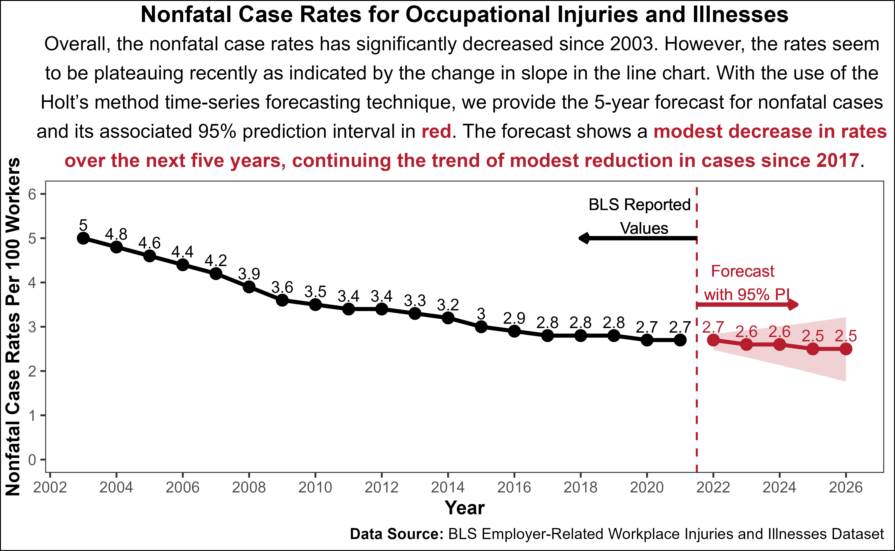
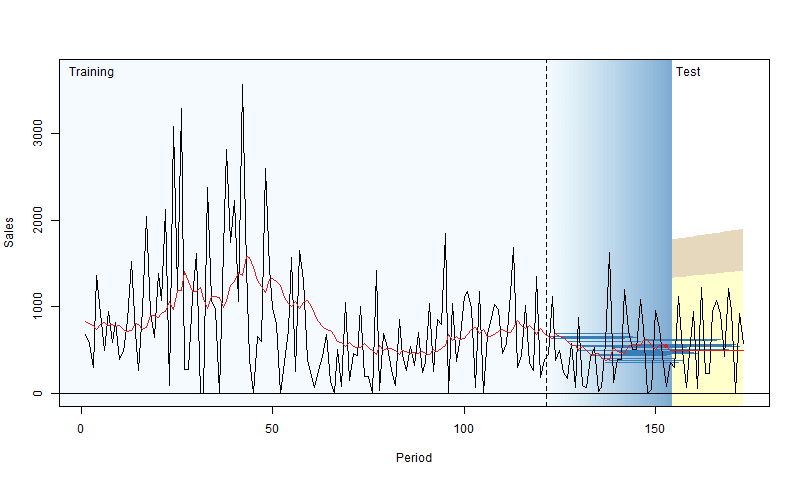

```{r setup, include=FALSE}
knitr::opts_chunk$set(cache = TRUE,
                      echo = TRUE,
                      warning = FALSE,
                      message = FALSE,
                      progress = FALSE, 
                      verbose = FALSE,
                      dev = 'png',
                      dpi = 300,
                      fig.asp = 0.618,
                      fig.align = 'center',
                      out.width = '70%')

options(htmltools.dir.version = FALSE)


miamired = '#C3142D'

if(require(pacman)==FALSE) install.packages("pacman")
if(require(devtools)==FALSE) install.packages("devtools")
if(require(countdown)==FALSE) devtools::install_github("gadenbuie/countdown")
if(require(xaringanExtra)==FALSE) devtools::install_github("gadenbuie/xaringanExtra")
if(require(emo)==FALSE) devtools::install_github("hadley/emo")
if(require(icons)==FALSE) devtools::install_github("mitchelloharawild/icons")

pacman::p_load(gifski, av, gganimate, ggtext, glue, extrafont, # for animations
               emojifont, emo, RefManageR, xaringanExtra, countdown, downlit) # for slides
```

```{r xaringan-themer, include=FALSE, warning=FALSE}
if(require(xaringanthemer) == FALSE) install.packages("xaringanthemer")
library(xaringanthemer)

style_mono_accent(base_color = "#84d6d3",
                  base_font_size = "20px")

xaringanExtra::use_extra_styles(
  hover_code_line = TRUE,         
  mute_unhighlighted_code = TRUE  
)

xaringanExtra::use_xaringan_extra(c("tile_view", "animate_css", "tachyons", "panelset", "share_again", "search", "fit_screen", "editable", "clipboard"))

```


# Quick Refresher from Last Class

`r emo::ji("check")` Explain when to use an additive vs. multiplicative model for a time series.  

`r emo::ji("check")` Use classic decomposition methods to detrend and deseasonalize a time series.  

`r emo::ji("check")` Recognize time series that are appropriate for triple exponential smoothing (HW).  

`r emo::ji("check")` Use HW to forecast future observations of a time series.


---

# Learning Objectives for Today's Class

- Explain the difference between fixed window and rolling origin forecasting.  

- Apply several forecasting methods to the fixed forecasting window strategy.


---
class: inverse, center, middle


# Fixed vs. Rolling Origin Forecasting

---

# Extrapolative Fixed Origin Forecasting

```{r read_forecast1, echo=FALSE, out.width='100%', fig.alt="General Framework for A Fixed Origin Forecast of a Single Series", fig.align='center', fig.cap='General Framework for Forecasting with a Single Series'}
knitr::include_graphics("../../figures/forecast1.png")
```


---
count: false

# Extrapolative Fixed Origin Forecasting

```{r read_forecast2, echo=FALSE, fig.alt="An holt-based application of the fixed origin forecasting strategy on nonfatal injury rates.", fig.align='center', fig.cap='A demonstration of the extrapolative fixed origin forecasting framework on nonfatal case rates for occupational injuries and illnesses', out.height='40%'}

```


---

# Extrapolative Rolling Origin Forecasting

```{r read_forecast3, echo=FALSE, fig.alt="Visualization of rolling origin by Nikos Kourentzes", fig.align='center', fig.cap='Visualization of rolling origin by Nikos Kourentzes', out.height='40%'}

```

.footnote[
<html>
<hr>
</html>

**Source:** Image downloaded from [Forecasting and Analytics with ADAM: Chapter 2.4](https://openforecast.org/adam/rollingOrigin.html)
]


---
count: false

# Extrapolative Rolling Origin Forecasting

```{r read_forecast4, echo=FALSE, out.width='100%', fig.alt="Rolling origin with constant holdout size", fig.align='center', fig.cap='Rolling origin with constant holdout size'}
knitr::include_graphics("../../figures/03-ROProcessCO.gif")
```

.footnote[
<html>
<hr>
</html>

**Source:** Image downloaded from [Forecasting and Analytics with ADAM: Chapter 2.4](https://openforecast.org/adam/rollingOrigin.html)
]


---
count: false

# Extrapolative Rolling Origin Forecasting

```{r read_forecast5, echo=FALSE, out.width='100%', fig.alt="Rolling origin with constant in-sample size", fig.align='center', fig.cap='Rolling origin with constant in-sample size'}
knitr::include_graphics("../../figures/03-ROProcessCOCI.gif")
```

.footnote[
<html>
<hr>
</html>

**Source:** Image downloaded from [Forecasting and Analytics with ADAM: Chapter 2.4](https://openforecast.org/adam/rollingOrigin.html)
]


---

class: inverse, center, middle

# Live Demo

---

# Live Demo: Fixed Origin

Let us apply an appropriate smoothing-based forecasting method for the [GNP data](https://fred.stlouisfed.org/series/GNP).

```{r train_validation, fig.align='center', echo=FALSE, out.height='80%'}
gnp = 
  tidyquant::tq_get('GNP', from = '1947-01-01', to = '2022-10-01', get = 'economic.data') |> 
  dplyr::select(date, price)

gnp |> 
  ggplot2::ggplot(ggplot2::aes(x = date, y = price)) +
  ggplot2::geom_line() +
  ggplot2::theme_bw(base_size = 7) +
  ggplot2::scale_x_date(breaks = scales::pretty_breaks(10)) + # beautifying the x-axis
  ggplot2::scale_y_continuous(breaks = scales::pretty_breaks(5), labels = scales::comma) + # beautifying the y-axis
  ggplot2::geom_rect(xmin = gnp$date[1], xmax = gnp$date[252], 
            ymin = 0,
            ymax = max(gnp$price) + 1000, alpha = 0.01, fill = 'gray') +
  ggplot2::geom_rect(xmin = gnp$date[253], xmax = gnp$date[303], 
            ymin = 0,
            ymax = max(gnp$price) + 1000, alpha = 0.01, fill = 'red') +
  ggplot2::geom_rect(xmin = lubridate::ymd('2022-10-01'), xmax = lubridate::ymd('2024-12-01'), 
            ymin = 0,
            ymax = max(gnp$price) + 1000, alpha = 0.01, fill = 'blue') +
  ggplot2::annotate("text", x = gnp$date[126], y = max(gnp$price) - 500,
             color = 'black', label = "Training", size = 3, fontface = 'bold') + 
  ggplot2::annotate("text", x = gnp$date[280], y = max(gnp$price) - 500,
             color = 'black', label = "Validation", size = 3, fontface = 'bold') +
  ggplot2::labs(x = 'Date', y = 'Billions', caption = 'Data from 2019-01-01 to 2023-02-01',
       title = 'Depicting Training (~80% in Gray), Validation (~20% in Red), and Future Forecasting (Blue) Regions for the GNP Data')

```

---
count: false

# Live Demo: Fixed Origin

Let us apply an appropriate smoothing-based forecasting method for the [GNP data](https://fred.stlouisfed.org/series/GNP).  
  - We will start with applying `forecast::holt()` on the log of the GNP.  
    - We will attempt to optimize for $\alpha$ and $\beta$, using `initial='simple'` for a change. We will use data up to and including `r gnp$date[252]` to find the optimal values for the smoothing parameters.  
    - Then, we will use the validation dataset to check how well our model performs.  
    - We will also obtain the forecasts for the two years post how our last observation.

```{r fixed1, include=FALSE}
macro_ts_models = function(x){
  # getting the data
data = 
  tidyquant::tq_get(x, from = '1947-01-01', get = 'economic.data') |> 
  dplyr::select(symbol, date, price)

# Approach 1: Write your own function

## Renaming data, creating year/mo/quarter, and renaming response to price if needed
data = data |> 
  dplyr::mutate(
    year = lubridate::year(date),
    quarter = lubridate::quarter(date),
    month = lubridate::month(date)
  ) |> 
  dplyr::rename(dplyr::any_of( c(price = 'adjusted') ) )
    
# obtain ts properties 
length_ts = nrow(data)
train_size = ceiling(0.8*length_ts)
auto_freq = data |> 
  dplyr::mutate(year = lubridate::year(date)) |> 
  dplyr::group_by(year) |> 
  dplyr::count() |> dplyr::pull(n) |> max()

# automatically set the starting value of ts according to data and its frequency
if(auto_freq == 1)  start_val = data$year[1] 
if(auto_freq == 4)  start_val = c(data$year[1], data$quarter[1])
if(auto_freq == 12) start_val = c(data$year[1], data$month[1])
if(!auto_freq %in% c(1,4, 12)) start_val = 1

# converting into a ts
train_ts = ts(data[1:train_size, ]$price, start = start_val, frequency = auto_freq )
all_ts = ts(data$price, start = start_val, frequency = auto_freq )

# train model and find optimal parameters
train_model = forecast::holt(y = train_ts, initial = 'simple') 
alpha_opt = train_model$model$par['alpha']
beta_opt = train_model$model$par['beta']

# fit model to training and validation
holt_model = forecast::holt(
  y = all_ts, h = 2*auto_freq, alpha = alpha_opt, beta = beta_opt, level = 95
)

# add to entire data
data = data |> 
  dplyr::mutate(
    naive_fct = dplyr::lag(x = price, n = 1),
    seasonal_naive = dplyr::lag(x = price, n = auto_freq),
    ma4 = zoo::rollmeanr(x = price, k = 4, fill = NA) |> dplyr::lag(),
    fct_holt_opt = holt_model$fitted
  )

# validation data
valid_data = data[(train_size+1):length_ts, ]

results_tbl = rbind(
  forecast::accuracy(object = valid_data$naive_fct, x = valid_data$price),
  forecast::accuracy(object = valid_data$seasonal_naive, x = valid_data$price),
  forecast::accuracy(object = valid_data$ma4, x = valid_data$price),
  forecast::accuracy(object = valid_data$fct_holt_opt, x = valid_data$price)
)

row.names(results_tbl) = c('naive', 'seasonal_naive', 'ma4', 'holt')

results_tbl = data.frame(results_tbl) |> dplyr::mutate(symbol = unique(data$symbol))

results_tbl = results_tbl |> 
  tibble::rownames_to_column("model") |>
  tidyr::pivot_longer(cols = 2:6, names_to = 'metric')

return(results_tbl)
}


multi_ts_results = purrr::map_df(
  .x = c('GNP', 'TOTALSA'), .f = macro_ts_models
)


multi_mape = multi_ts_results |> dplyr::filter(metric == 'MAPE') |> 
  tidyr::pivot_wider(names_from = model)

```


---

# Live Demo: Fixed Origin - Multiple TS and Methods

Let us apply what we learned to multiple time-series. 


---
class: inverse, center, middle

# Recap

---

# Summary of Main Points

By now, you should be able to do the following:   

- Explain the difference between fixed window and rolling origin forecasting.  

- Apply several forecasting methods to the fixed forecasting window strategy.

---

# Things to Do to Prepare for Our Next Class

 - **Recommended:** Thoroughly read [Chapter 4.1-4.4](https://wessexlearning.com/products/principles-of-business-forecasting-2nd-ed-part-i) and [Chapter 4.6-4.7](https://wessexlearning.com/products/principles-of-business-forecasting-2nd-ed-part-i) of our reference book.  
 