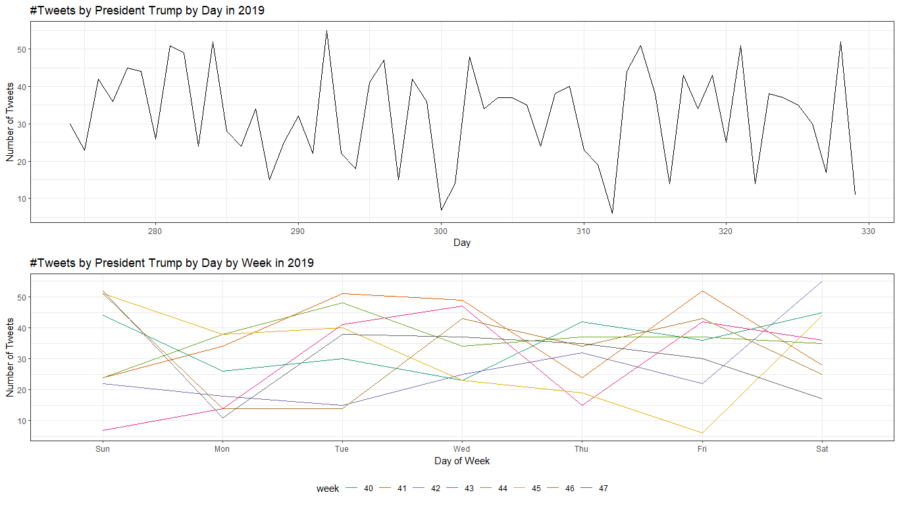
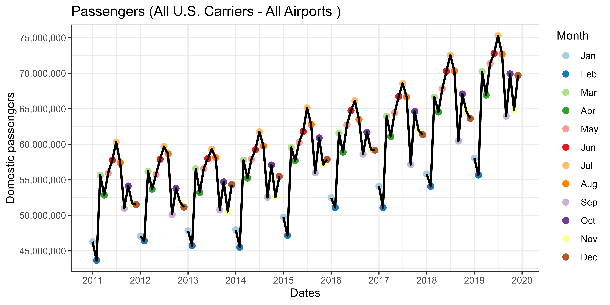

```{r setup, include=FALSE}
knitr::opts_chunk$set(cache = TRUE,
                      echo = TRUE,
                      warning = FALSE,
                      message = FALSE,
                      progress = FALSE, 
                      verbose = FALSE,
                      dev = 'png',
                      dpi = 300,
                      fig.asp = 0.618,
                      fig.align = 'center',
                      out.width = '70%')

options(htmltools.dir.version = FALSE)


miamired = '#C3142D'

if(require(pacman)==FALSE) install.packages("pacman")
if(require(devtools)==FALSE) install.packages("devtools")
if(require(countdown)==FALSE) devtools::install_github("gadenbuie/countdown")
if(require(xaringanExtra)==FALSE) devtools::install_github("gadenbuie/xaringanExtra")
if(require(emo)==FALSE) devtools::install_github("hadley/emo")
if(require(icons)==FALSE) devtools::install_github("mitchelloharawild/icons")

pacman::p_load(gifski, av, gganimate, ggtext, glue, extrafont, # for animations
               emojifont, emo, RefManageR, xaringanExtra, countdown, downlit) # for slides
```

```{r xaringan-themer, include=FALSE, warning=FALSE}
if(require(xaringanthemer) == FALSE) install.packages("xaringanthemer")
library(xaringanthemer)

style_mono_accent(base_color = "#84d6d3",
                  base_font_size = "20px")

xaringanExtra::use_extra_styles(
  hover_code_line = TRUE,         
  mute_unhighlighted_code = TRUE  
)

xaringanExtra::use_xaringan_extra(c("tile_view", "animate_css", "tachyons", "panelset", "share_again", "search", "fit_screen", "editable", "clipboard"))

```


# Exam 02 Review

.panelset[

.panel[.panel-name[Q1]

.font80[Assuming that this sample is a representative sample of former President Trump's tweeting patterns, which of the following conclusions are reasonable to make about the daily tweeting patterns of the former President:] 

```{r tweets, echo=FALSE, out.width='60%', fig.height='1.2in'}

```


]

.panel[.panel-name[Q1 Solution]

```{r tweets_calc, include=FALSE}
tweets = readr::read_csv('../../data/trumpTweetCount.csv/')
```

Based on examining the charts and/or inspecting the [trumpTweetCount.csv](https://raw.githubusercontent.com/fmegahed/isa444/main/data/trumpTweetCount.csv]), one can observe the following:  
  - The data seems to be varying around a stationary mean of `r mean(tweets$n) |> round(digits = 1)` and the variance seems to be near constant as well.  
  - There is no evidence for seasonality (e.g., lines cross on the num tweets vs. day of week chart, indicating that there are no fixed patterns; Friday is sometimes the day of highest tweet volume and sometimes among the lowest)

]
]


---
count: false

# Exam 02 Review

.panelset[

.panel[.panel-name[Q2]

.font80[By closely investigating the actual tweet count data available at trumpTweetCount.csv,  select all possible accuracy metrics that can be used to evaluate the goodness-of-fit produced by a specific forecasting/smoothing for the column $n$] 

]

.panel[.panel-name[Q2 Solution]

Based on examining the [trumpTweetCount.csv](https://raw.githubusercontent.com/fmegahed/isa444/main/data/trumpTweetCount.csv]), the following metrics can be used:  
  - ME can be used to measure the bias in the forecast per [Slide 12 in Class 06](https://fmegahed.github.io/isa444/spring2023/class06/06_forecast_accuracy.html#20).  
  - MAE and RMSE can be used to measure the variability in the forecast per [Slide 13 in Class 06](https://fmegahed.github.io/isa444/spring2023/class06/06_forecast_accuracy.html#21).  
  - MAPE **cannot** be used since the number of tweets = 0 o yearDay 82.  
      + Note that this question is similar to Q7 in Exam 01.

]
]


---
count: false

# Exam 02 Review

.panelset[

.panel[.panel-name[Q3]

.font80[Suppose you were to apply Holt's Method as a forecasting procedure `(alpha =0.2, beta = 0.1, initial = 'optimal')` on the GDP Data from FRED. What is your computed forecast for the GDP (i.e., price column) on 2023-07-01? Do not apply any transformations to your dataset.] 

]


.panel[.panel-name[Q3 Solution]

.font80[
```{r gdp_holt, eval=FALSE}
gdp = tidyquant::tq_get('GDP', from = '1947-01-01', to = '2022-12-01', get = 'economic.data')

gdp_holt = forecast::holt(gdp$price, h = 10, alpha = 0.2, beta = 0.1, initial = 'optimal')

# solution 1
summary(gdp_holt) # third value in the printout since we need Q3 data

# solution 2
gdp_holt$mean

# solution 3
gdp_holt
```
]
]
]


---
count: false

# Exam 02 Review

.panelset[

.panel[.panel-name[Q4]

.font80[Based on the `forecast::accuracy()` function, the fitted holt model from the previous question outperforms the naive forecast.] 

]

.panel[.panel-name[Q4 Solution]

.font80[
```{r gdp_holt2, eval=T}
gdp = tidyquant::tq_get('GDP', from = '1947-01-01', to = '2022-12-01', get = 'economic.data')

gdp_holt = forecast::holt(gdp$price, h = 10, alpha = 0.2, beta = 0.1, initial = 'optimal')

# MASE = 1.06, which means that this is a worse forecast when compared the naive
forecast::accuracy(gdp_holt)
```
]
]
]


---
count: false

# Exam 02 Review

.panelset[

.panel[.panel-name[Q5 and its Solution]

.font80[Based on the plot below, the airlines dataset can be considered seasonal.]

```{r passengers, echo=FALSE, out.width='60%', fig.height='1.2in'}

```

**Yes**, monthly patterns are repeating from one year to another.
]
]


---
count: false

# Exam 02 Review

.panelset[

.panel[.panel-name[Q6]

.font80[Provide an R code that can be used to replicate the chart above. For the plot, I would like you to:  
  - Have a date variable, which you will need to create, on the x-axis;   
  - Have the DOMESTIC on the y-axis;  
  - Have the line be connected only for the year; and  
  - Have the points to be colored according to each month. 

You do not have to worry about the x-axis/y-axis titles/formatting, plot titles, themes, and my choice of color palette, i.e., focus on achieving the above four requirements.
]
]

.panel[.panel-name[Q6 Code]

.font80[
```{r q6_sol, eval = F}
airlines = readr::read_csv('../../data/us_passengers_domestic.csv') |> 
  # to focus on post financial crisis and pre-COVID19 data
  dplyr::filter(Year > 2010 & Year < 2020)

airlines |>
  dplyr::mutate(
    date = lubridate::ymd( paste(Year, Month, '01', sep = '-') ),
    # you do not have to overwrite month
    Month = lubridate::month(date, label = T)) |> 
  ggplot2::ggplot( ggplot2::aes(x = date, y = DOMESTIC, group = Year)) +
  ggplot2::geom_point(ggplot2::aes(color = Month), size = 2.5) +
  ggplot2::geom_line(size = 1) +
  ggplot2::theme_bw() +
  ggplot2::scale_x_date(breaks = scales::pretty_breaks(n=12)) +
  ggplot2::scale_y_continuous(breaks = scales::pretty_breaks(n=6), labels = scales::comma) +
  ggplot2::scale_color_brewer(palette = 'Paired') +
  ggplot2::labs(
    title = 'Passengers (All U.S. Carriers - All Airports )',
    x = 'Dates',
    y = 'Domestic passengers')
```
]
]

.panel[.panel-name[Q6 Output]

```{r q6_sol_out, ref.label='q6_sol', echo=FALSE, out.width='70%'}

```
]
]


---
count: false

# Exam 02: Review

.panelset[

.panel[.panel-name[Q7]

.font80[If you were to build on the R code below, what is the `airlines` dataset's seasonal factor for July?:  

```{r q7, results='hide', out.height='1.5in'}
airlines_ts = ts(data = airlines$DOMESTIC, start = c(2011,1), frequency = 12)

decomposed_ts = decompose(airlines_ts, type = 'additive') 

forecast::autoplot(decomposed_ts)
```

**Please insert your answer to rounded to the nearest digit (i.e. you do not have to return any decimal places for example 12321).**  
]
]

.panel[.panel-name[Q7 Solution]

```{r q7_solution}
# solution 1
decomposed_ts$seasonal[7] |> scales::comma()

# solution 2
decomposed_ts$figure[7] |> scales::comma()

# solution 3 (making your previous figure interactive)
# forecast::autoplot(decomposed_ts) |> plotly::ggplotly()
```
]
]


---
count: false

# Exam 02: Review

.panelset[

.panel[.panel-name[Q8]

.font80[
What is the interpretation of your reported value from the previous question? 
]
]

.panel[.panel-name[Q8 Solution]

.font80[
**The number of air passengers is 6,573,221 higher in July than the average for a particular year, i.e., many more people travel in July.** 
]
]
]


---
count: false 

# Exam 02: Review

.panelset[

.panel[.panel-name[Q9]

.font80[
Should the data be modeled/decomposed using an additive or multiplicative seasonal model? 
]
]

.panel[.panel-name[Q9 Solution]

.font80[
**This is close; however, the range seems to increase with larger values. This can also be confirmed via:**
```{r q9_solution}
forecast::hw(airlines_ts, seasonal = 'additive') |> forecast::accuracy()
forecast::hw(airlines_ts, seasonal = 'multiplicative') |> forecast::accuracy()
```

]
]
]


---
count: false

# Exam 02 Review

.panelset[

.panel[.panel-name[Q10]

.font80[
Based on an EIA Article published on March 14, 2023Links to an external site., the plot below shows the monthly averages of U.S. natural gas consumption per day over the past decade  (i.e., for Jan 2013, we averaged 31 days of daily consumption). **The plot shows a clear seasonal pattern. Hence, seasonal decomposition can be used to forecast future values in 2023.** 
]
]

.panel[.panel-name[Q10 Solution]

.font80[
**Decomposition methods are not suitable for forecasting per [Class 12 Slide 11](https://fmegahed.github.io/isa444/spring2023/class12/12_seasonal_decomposition_hw.html#12)**.
]
]
]


---
count: false

# Exam 02 Review

One possible solution for Q11 can be found online at: [exam 02 case study](https://fmegahed.github.io/isa444/spring2023/exam02/16_exam02_case_study_solution.html)


---

# Quick Refresher from Last Week

`r emo::ji("check")` Explain what do we mean by population/sample mean, variance, covariance and correlation (**review**).  

`r emo::ji("check")`  Explain the population autocovariance and autocorrelation.  

`r emo::ji("check")` Compute sample estimates of the autcovariance and autocorrelation.  

`r emo::ji("check")` Describe the large sample distribution of the autocorrelation function.  

`r emo::ji("check")` Explain how sample (partial) autocorrelation is calculated.  

`r emo::ji("check")`  Use `r fontawesome::fa('r-project', fill = miamired)` to compute both the ACF and PACF.  


---

# Learning Objectives for Today's Class

- Utilize time-series plots (line charts and ACF) to identify whether a ts is stationary.  

- Apply transformations to a nonstationary time series to bring it into
stationarity (**review**).    

- Conduct formal tests for stationarity using the ADF and KPSS tests.


---
class: inverse, center, middle

# A Visual Exploration of Stationary and Nonstationary TS


---

# Stationary TS: ACF Dies Down

```{r acf_dies_down, echo=FALSE}
set.seed(202303)
ar_sim = arima.sim( model=list(ar=c(.6)), n=500)

p1 = ar_sim |> forecast::autoplot() + ggplot2::theme_bw() + ggplot2::labs(y = 'TS')

p2 = acf(ar_sim, plot = FALSE, lag.max = 12) |>  
  forecast::autoplot() + ggplot2::theme_bw() + ggplot2::labs(y = 'ACF of TS')

ggpubr::ggarrange(p1, p2, ncol = 1, labels = c('', ''), nrow = 2) 
```

---

# Stationary TS: ACF Cuts Off

```{r acf_cuts_off, echo=FALSE}
set.seed(202303)
ma_sim = arima.sim( model=list(ma=c(.3, 0.7)), n=500)

p1 = ma_sim |> forecast::autoplot() + ggplot2::theme_bw() + ggplot2::labs(y = 'TS')

p2 = acf(ma_sim, plot = FALSE, lag.max = 12) |>  
  forecast::autoplot() + ggplot2::theme_bw() + ggplot2::labs(y = 'ACF of TS')

ggpubr::ggarrange(p1, p2, ncol = 1, labels = c('', ''), nrow = 2) 
```


---

# Nonstationary TS: Random Walk

```{r google, echo=FALSE}
google = tidyquant::tq_get("GOOG", from = Sys.Date() - 731, to = Sys.Date() -1) |> 
  dplyr::select(date, adjusted)

google |> ggplot2::ggplot(ggplot2::aes(x= date, y = adjusted)) + ggplot2::geom_line() + ggplot2::theme_bw() -> g1

acf_google = acf(google$adjusted, plot = F)

acf_google |> forecast::autoplot() + ggplot2::theme_bw() -> g2

ggpubr::ggarrange(g1, g2, ncol = 1) 
```


---

# A Formal Definition for Stationarity

**Weak Stationarity:** A weakly stationary time series is a finite variance process such that:   
  1. The mean, $\mu_t$, is constant and does not depend on the time $t$; and   
  2. The autocovariance function, $\gamma(s, t)$ depends on $s$ and $t$ only through their difference $|s-t|$.  
  
We will use the term **stationary** to refer to weak stationarity.  

  - The concept of weak stationarity forms the basis of much of the foundation for time series modeling.  
  - The fundamental properties (1 & 2) required for weak stationarity are satisfied by many of the models that are widely used.


---
class: inverse, center, middle

# Differencing


---

# Recap: Guidelines for Transforming TS Data

```{r read_ts_taxonomy, echo=FALSE, out.width='100%', fig.alt="A classification of common transformation approaches for time series data", fig.align='center', fig.cap='A classification of common transformation approaches for time series data'}
knitr::include_graphics("../../figures/transformations.png")
```

.footnote[
<html>
<hr>
</html>

My (incomplete) attempt to provide you with a taxonomy for time series data transformations.
]


---


# What to do when we have a Nonstationary series?

In order to model a time series, it must usually be in a state of stationarity. If the time series is not stationary, you must transform it to achieve stationarity.

Successive **differencing** is typically used to achieve stationarity.

**First Differences:** $$y_t^\prime = y_t - y_{t-1}$$

**Second Differences:** $$y_t'' = y_t^\prime - y_{t-1}^\prime$$


---

# GNP Example


```{r gnp_example, eval=FALSE}
gnp = tidyquant::tq_get('GNP', get = 'economic.data')

gnp = gnp |> 
  dplyr::mutate(
    diff1 = price - dplyr::lag(price), #<< 
    diff2 = c(NA, NA,  diff(price, differences = 2)) #<<
  )

df =  tidyr::pivot_longer(data= gnp, cols = c(3,4,5)) 

df |> 
  ggplot2::ggplot(ggplot2::aes(x= date, y = value, group = name, color = name)) + 
  ggplot2::geom_line(size = 1) + 
  ggplot2::facet_wrap(~ name, ncol = 1, scales = "free_y") + 
  ggplot2::theme_bw() +
  ggplot2::theme(legend.position = 'none') + ggplot2::labs(x = 'Date') 
```


---
count: false

# GNP Example

```{r gnp_example_out, ref.label='gnp_example', echo=FALSE, out.width='85%'}

```


---

# So Why Does Differencing Work? 

**Because many nonstationary time series have features of a random walk.**

---

# Random Walk Model

**Random Walk with Drift:** A random walk is a model such that successive differences (first differences) are independent. 

The classic random walk model: $$Y_t = Y_{t-1} + \epsilon_t$$

A random walk with a drift: $$Y_t = \delta + Y_{t-1} + \epsilon_t$$

**Notes:** When $\delta = 0$, the value of the current observation is just the value of the prior observation plus random noise.


---
count: false

# Random Walk

```{r rw1, echo = FALSE}
set.seed(1)
randomWalk = data.frame(obsNum = 1:500, rawData = rnorm(500)) |> 
  dplyr::mutate(walk = cumsum(rawData), walkWdrift = cumsum(rawData + 0.2))

df = randomWalk |> dplyr::select(obsNum, walk, walkWdrift) |> 
  tidyr::pivot_longer(c(2,3), names_to = 'TimeSeries')

df |> ggplot2::ggplot(
  ggplot2::aes(x = obsNum, y = value, group = TimeSeries, color = TimeSeries)) +
  ggplot2::geom_line() + 
  ggplot2::geom_smooth(method = 'lm') + 
  ggplot2::theme_bw() + 
  ggplot2::theme(legend.position = 'bottom')
```


---
count: false

# Random Walk

```{r rw2, echo = FALSE}
acf(randomWalk$walk, plot = FALSE) |>  forecast::autoplot() +
  ggplot2::theme_bw() + ggplot2::labs(title = 'ACF of the Random Walk (no drift)')
```


---
count: false

# Random Walk


```{r rw3, echo = FALSE}
acf(randomWalk$walkWdrift, plot = FALSE) |>  forecast::autoplot() +
  ggplot2::theme_bw() + ggplot2::labs(title = 'ACF of the Random Walk (With drift)')
```


---
class: inverse, center, middle

# Formal Tests for Stationarity


---

# Augmented Dickey Fuller (ADF) Test

The **Augmented Dickey Fuller (ADF) Test** tests whether or not there is a unit root. The hypotheses are as follows:  

  $\qquad \qquad$ Ho: The series is nonstationary  
  
  $\qquad \qquad$ Ha: The series is stationary  
  
Thus, if we have a *SMALL p-value*, we reject the null hypothesis and conclude **STATIONARITY**.


---
count: false


# Augmented Dickey Fuller (ADF) Test

.font80[
```{r adf_example}
gnp = tidyquant::tq_get('GNP', get = 'economic.data')

tseries::adf.test(gnp$price) #<<
```
]


**So what do we conclude from the test above?**

.can-edit.key-adf[
... Insert conclusion here ...
]

---

# Kwiatkowski-Phillips-Schmidt-Shin (KPSS) Test

The **Kwiatkowski-Phillips-Schmidt-Shin (KPSS) Test** tests whether or not there is a unit root. The hypotheses are as follows:  

  $\qquad \qquad$ Ho: The series is stationary  

  $\qquad \qquad$ Ha: The series is nonstationary  

Thus, if we have a *SMALL p-value*, we reject the null hypothesis and conclude **NONSTATIONARITY**.


---
count: false

# Kwiatkowski-Phillips-Schmidt-Shin (KPSS) Test

.font80[
```{r kpss_example}
gnp = tidyquant::tq_get('GNP', get = 'economic.data')

tseries::kpss.test(gnp$price) #<<
```
]

**So what do we conclude from the test above?**

.can-edit.key-kpss[
... Insert conclusion here ...
]

---

# Successive KPSS Tests

As a followup to the case when the `kpss.test()` is rejected (or alternatively when you do not reject the `adf.test()`), you can utilize the `ndiffs()` from the package [forecast](https://cran.r-project.org/web/packages/forecast/forecast.pdf), which uses a series of the KPSS tests in a sequence to determine the appropriate number of first differences required for a nonseasonal time series. 

`ndiffs()` returns the number of first differences needed to achieve stationarity according to the KPSS test.


```{r ndiffs}
forecast::ndiffs(gnp$price)
```

According to the `ndiffs() function`, `r forecast::ndiffs(gnp$price)` **successive differences are recommended to transform the GNP data into a stationary ts**.


---
class: inverse, center, middle

# Recap

---

# Summary of Main Points

By now, you should be able to do the following:  

- Utilize time-series plots (line charts and ACF) to identify whether a ts is stationary.  

- Apply transformations to a nonstationary time series to bring it into
stationarity (**review**).    

- Conduct formal tests for stationarity using the ADF and KPSS tests.


---


# Things to Do to Prepare for Our Next Class
 
 - **Required:** Complete [assignment12](https://miamioh.instructure.com/courses/188655/quizzes/540768/).
 