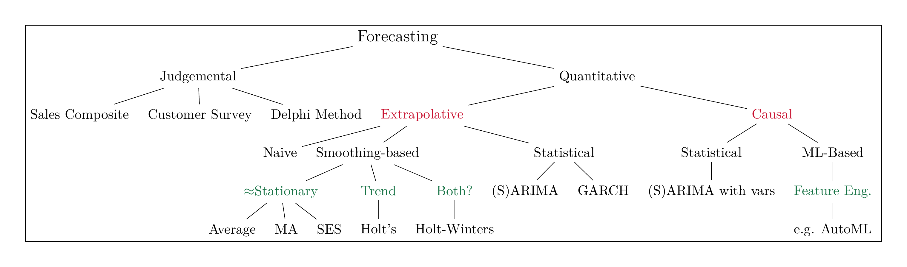

```{r setup, include=FALSE}
knitr::opts_chunk$set(cache = FALSE,
                      echo = TRUE,
                      warning = FALSE,
                      message = FALSE,
                      progress = FALSE, 
                      verbose = FALSE,
                      dev = 'png',
                      dpi = 300,
                      fig.asp = 0.618,
                      fig.align = 'center',
                      out.width = '70%')

options(htmltools.dir.version = FALSE)


miamired = '#C3142D'

if(require(pacman)==FALSE) install.packages("pacman")
if(require(devtools)==FALSE) install.packages("devtools")
if(require(countdown)==FALSE) devtools::install_github("gadenbuie/countdown")
if(require(xaringanExtra)==FALSE) devtools::install_github("gadenbuie/xaringanExtra")
if(require(emo)==FALSE) devtools::install_github("hadley/emo")
if(require(icons)==FALSE) devtools::install_github("mitchelloharawild/icons")

pacman::p_load(gifski, av, gganimate, ggtext, glue, extrafont, # for animations
               emojifont, emo, RefManageR, xaringanExtra, countdown, downlit) # for slides
```

```{r xaringan-themer, include=FALSE, warning=FALSE}
if(require(xaringanthemer) == FALSE) install.packages("xaringanthemer")
library(xaringanthemer)

style_mono_accent(base_color = "#84d6d3",
                  base_font_size = "20px")

xaringanExtra::use_extra_styles(
  hover_code_line = TRUE,         
  mute_unhighlighted_code = TRUE  
)

xaringanExtra::use_xaringan_extra(c("tile_view", "animate_css", "tachyons", "panelset", "share_again", "search", "fit_screen", "editable", "clipboard"))

```


# Quick Refresher from Last Week

**ARMA Models:** Models we considered may have three components, an autoregressive component (AR), and a moving average component (MA).

`r emo::ji("check")` Describe the behavior of the ACF and PACF of an AR(p) process.   

`r emo::ji("check")` Describe the behavior of the ACF and PACF of an MA(q) process.        

`r emo::ji("check")` Describe the behavior of the ACF and PACF of an ARMA (p,q) process.     

`r emo::ji("check")` Fit an ARMA model to a time series, evaluate the residuals of a fitted ARMA model to assess goodness of fit, use the Ljung-Box test for correlation among the residuals of an ARMA model.  

`r emo::ji("check")` Fit an ARIMA model to a time series, evaluate the residuals of a fitted ARMA model to assess goodness of fit, use the Ljung-Box test for correlation among the residuals of an ARIMA model.


---

# Overview of Univariate Forecasting Methods

```{r read_ts_taxonomy, echo=FALSE, out.width='100%', fig.alt="A 10,000 foot view of univariate forecasting techniques", fig.align='center', fig.cap='A 10,000 foot view of forecasting techniques'}

```

.footnote[
<html>
<hr>
</html>

**Notes:** My (incomplete) classification of **univariate** forecasting techniques, i.e., they exclude popular approaches used in multivariate time series forecasting.  
]


---


# ARMA Processes

Last class, we discussed on how we capitalized on the ACF and PACF plots to identify which ARMA model can be used to model/approximate the observed time-series.

<html>
<table>
<tr>
<td><b>Model</b></td>
<td><b>ACF</b></td>
<td><b>PACF</b></td>
</tr>
<tr>
<td><b>AR(p)</b></td>
<td>Exponentially decays or <br>
damped sinusoidal pattern</td>
<td> Cuts off after lag p </td>
</tr>
<tr>
<td><b>MA(q)</b></td>
<td> Cuts off after lag q </td>
<td>Exponentially decays or <br>
damped sinusoidal pattern</td>
</tr>
<tr>
<td><b>ARMA(p,q)</b></td>
<td>Exponentially decays or <br>
damped sinusoidal pattern</td>
<td>Exponentially decays or <br>
damped sinusoidal pattern</td>
</tr>
</table>
</html>


---

# Learning Objectives for Today's Class

- Explain how ARIMA models work when compared to ARMA models.  

- Fit an ARIMA model to a time series, evaluate the residuals of a fitted ARMA model to assess goodness of fit, use the Ljung-Box test for correlation among the residuals of an ARIMA model.  

- Describe AIC, AICc, and BIC and how they are used to measure model fit.  

- Describe the algorithm used within the `AutoARIMA` method within statsforecast to fit an
ARIMA model.  

- Describe the results of the `AutoARIMA` method within statsforecast to fit an
ARIMA model. 

---
class: inverse, center, middle

# ARIMA Models


---

# ARIMA Models for Nonstationary Processes

- When the time series is nonstationary, differencing can be used to transform the series.   
  + The `num_diffs()` function from [coreforecast](https://nixtlaverse.nixtla.io/coreforecast/differences) can be used to determine: (a) whether the ts is stationary, and (b) the number of differences necessary to achieve stationarity.  
  
---

# Our 5-Step ARMA Fitting Process

.font90[
1. Plot the data over time.  

2. Do the data seem stationary? If necessary, conduct a test for stationarity.  

3. Once you can assume stationarity, find the ACF plot.  
  - If the ACF plot cuts off, fit an MA(q), where $q=$ the cutoff point.  
  - If the ACF plot dies down, find the PACF plot.  
    + If the PACF plot cuts off, fit an AR(p) model, where $p=$ the cutoff point.
    + If the PACF plot dies down, fit an ARMA (p,q) model.  
      * You must iterate through $p$ and $q$ using a guess and check method starting with ARMA(1,1) models -- increment each by  1.

4. Evaluate the model residuals and consider the ACF and PACF of the residuals.  

5. If model fit is good, forecast future values.
]

.font90[
**Note:** Often you will fit multiple models in Step 3 and compare models in Step 4 to select the best fit.
]


---

# Extending Our 5-Step ARMA Fitting Process

```{r fpp3_arima, echo=FALSE, out.width='33%'}
knitr::include_graphics('https://otexts.com/fpp3/figs/arimaflowchart.png')
```


---

# Fitting an Appropriate ARIMA for Modeling GDP

Use the [GDP Data](https://fred.stlouisfed.org/series/GDP) to highlight how ARIMA models can be fit and used for forecasting. We will limit the GDP data to the period from 1990-01-01 to 2020-01-01.

```{python gnp_arima_model, include=FALSE}
import pandas as pd
import matplotlib.pyplot as plt
import seaborn as sns

from coreforecast.differences import num_diffs
from statsmodels.graphics.tsaplots import plot_acf, plot_pacf
from statsmodels.stats.diagnostic import acorr_ljungbox

from statsforecast import StatsForecast
from statsforecast.models import ARIMA, AutoARIMA
from statsforecast.arima import arima_string

from utilsforecast.evaluation import evaluate
from utilsforecast.losses import *

import requests
req = requests.get("https://raw.githubusercontent.com/fmegahed/isa444/refs/heads/main/utils/fitted.py")
exec(req.text)


# Step 1: Convert to a TS and Plot
df = (
  pd.read_csv("https://fred.stlouisfed.org/graph/fredgraph.csv?bgcolor=%23ebf3fb&chart_type=line&drp=0&fo=open%20sans&graph_bgcolor=%23ffffff&height=450&mode=fred&recession_bars=on&txtcolor=%23444444&ts=12&tts=12&width=1320&nt=0&thu=0&trc=0&show_legend=yes&show_axis_titles=yes&show_tooltip=yes&id=GDP&scale=left&cosd=1990-01-01&coed=2020-01-01&line_color=%230073e6&link_values=false&line_style=solid&mark_type=none&mw=3&lw=3&ost=-99999&oet=99999&mma=0&fml=a&fq=Quarterly&fam=avg&fgst=lin&fgsnd=2020-02-01&line_index=1&transformation=lin&vintage_date=2025-04-08&revision_date=2025-04-08&nd=1947-01-01")
  .rename(columns={"observation_date": "ds", "GDP": "y"})
  .assign(
    unique_id = 'GDP',
    ds=lambda x: pd.to_datetime(x["ds"])
    )
  [['unique_id', 'ds', 'y']]
  )

sns.lineplot(data=df, x='ds', y='y')
plt.show()

# Step 2 - ndiffs()
num_diffs(df['y']) # 1 difference is needed


## Side Note - plot the differenced data
diff_df = (
  df.copy()
  .assign(
    y = df['y'].diff()
    )
  )
sns.lineplot(data=diff_df, x='ds', y='y')
plt.show()

fig, axes = plt.subplots(2, 1, figsize=(10, 8))
plot_acf(diff_df['y'].dropna(), lags=25, ax=axes[0])
plot_pacf(diff_df['y'].dropna(), lags=25, ax=axes[1])
plt.show()
plt.close()


# We will start by examining a ARIMA(1,1,1) type model
models = [
    ARIMA(order=(1, 1, 1), alias = 'arima111'),
    AutoARIMA(alias = 'autoarima')
]

sf = StatsForecast(
    models=models,
    freq="QS",
    n_jobs=-1 # will parallelize if possible
)

fitted = sf.fit( df[['unique_id', 'ds', 'y']] )

res = create_res_df(
    df, fitted, ['arima111', 'autoarima']
)

acorr_ljungbox(res['autoarima'], lags=10, model_df=1)

arima_string(sf.fitted_[0][1].model_)

cross_validation = sf.cross_validation(
    df = df[['unique_id', 'ds', 'y']],
    h=8,
    step_size=8,
    n_windows=3
)

evaluation_df = evaluate(
  df = cross_validation,
  metrics = [bias, mae, rmse, mape],
  models = ['arima111', 'autoarima']
)

```


---
class: inverse, center, middle

# Goodness of Fit Measures


---

# Akaike Information Criterion (AIC)

.font90[
- The AIC is a statistical measure used to **compare the goodness of fit of different statistical models to a given dataset**.   

- AIC is based on the `parsimony` principle, favoring simpler models with fewer parameters over more complex ones (while still accounting for the model's ability to fit the data).   
    + This helps to avoid overfitting, which occurs when a model is too complex and fits the noise in the data, rather than the underlying pattern.

- The **AIC formula** is given by: $AIC = 2k - 2ln(L)$, where  
    + `k` is the number of parameters in the model (including the intercept, if applicable)  
    + `L` is the likelihood of the model, measuring how well the model fits the observed data   

In essence, the AIC balances the trade-off between the goodness of fit (measured by the log-likelihood) and the complexity of the model (measured by the number of parameters). **Lower AIC values indicate better model performance, so when comparing multiple models, the one with the lowest AIC is generally considered the best fitting, while also being the simplest**.
]


---

# Corrected Akaike Information Criterion (AICc)

.font90[

- The AICcis a modification of the AIC that provides a **more accurate model selection criterion when the sample size is small or the ratio of the sample size to the number of model parameters is low**.   

- Like the AIC, the AICc is used to compare different statistical models and select the one that best fits the data while penalizing model complexity.

- $AICc = AIC + (2 * k * (k + 1)) / (n - k - 1)$, where  
    + `AIC` is the original Akaike Information Criterion: $AIC = 2k - 2ln(L)$  
    + `k` is the number of parameters in the model (including the intercept, if applicable)  
    + `n` is the sample size  

- The **second term in the AICc formula represents a correction factor that accounts for the small sample size**. As the sample size $(n)$ increases, the correction factor approaches zero, and the AICc converges to the original AIC. Therefore, in cases where the sample size is large, using the AICc instead of AIC won't make a significant difference.  

- When comparing models, the one with the lowest AICc value is considered the best-fitting model while also being the simplest, similar to the AIC. 
]


---

# Bayesian Information Criterion (BIC)

.font90[
-  The BIC helps in model selection by balancing the trade-off between model complexity and goodness of fit. However, the **BIC penalizes model complexity more heavily than the AIC**.  

- The formula for BIC is: $BIC = -2ln(L) + k * ln(n)$, where   
    + `L` is the likelihood of the model, measuring how well the model fits the observed data   
    + `k` is the number of parameters in the model (including the intercept, if applicable)  
    + `n` is the sample size  

- In the BIC formula, the first term represents the goodness of fit (measured by the log-likelihood), and the second term represents the penalty for model complexity. 

- The penalty term is larger in the BIC than in the AIC, as it is proportional to the natural logarithm of the sample size instead of being a constant value.  

- When comparing models, the one with the lowest BIC value is considered the best-fitting model while also being the simplest, similar to the AIC and AICc. 

- The BIC might be preferred over the AIC or AICc, especially when there is **a preference for more parsimonious models or when dealing with large sample sizes**.
]


---

# AIC, AICc and BIC Summary

**Studies have shown that the:**  
- BIC does well at getting correct model in large samples.  
- AICc tends to get correct models in smaller samples with a large number of parameters. 

**Why did we discuss these metrics today?**  
- They were printed with some of the models that we have examined in class.   
- They are used with the [AutoARIMA method](https://nixtlaverse.nixtla.io/statsforecast/docs/models/autoarima.html).  


---
class: inverse, center, middle

# The AutoARIMA Method 


---

# The AutoARIMA Method 

.font90[
The [AutoARIMA method](https://nixtlaverse.nixtla.io/statsforecast/docs/models/autoarima.html) can be used to automatically fit ARIMA models to a time series. It is a useful function, but it should be used with caution.  

The [AutoARIMA method](https://nixtlaverse.nixtla.io/statsforecast/docs/models/autoarima.html):      
  - Uses “brute force” to fit many models and then selects the “best” based on a certain model criterion  
  - Works best when the data are stationary, but can be used with nonstationary data  
  - May overfit the data  
  - Should always be used as a starting point for selecting a model and all models derived from the [AutoARIMA method](https://nixtlaverse.nixtla.io/statsforecast/docs/models/autoarima.html) should be properly vetted and evaluated.  
  
The [AutoARIMA method](https://nixtlaverse.nixtla.io/statsforecast/docs/models/autoarima.html) method combines:
  - Unit root tests (KPSS by default)  
  - Minimization of AICc to obtain an `ARIMA(p, d, q)` model using the following algorithm:
]


---
count: false

# The AutoARIMA method

.font80[
  1. Determine the number of differences, $d$, using a sequence of KPSS tests.  
  
  2. Determine $p$ and $q$ by minimizing AICc after differencing the data d times. Rather than considering all possible $p$ and $q$ combinations, a stepwise approach is taken.  
      - The best initial model with lowest AICc is selected from the following four:   
          + ARIMA(2,d,2),  
          + ARIMA(0,d,0),  
          + ARIMA(1,d,0), and   
          + ARIMA(0,d,1).  
          + *If d=0, then a constant, $c$, is included. If $d \ge 1$, then the constant is set to 0. The results of this step is called the current model.*  
      - Variations on the current model are considered by  
          + Vary $p$ and/or $q$ from current model by $\pm 1$   
          + Include/exclude $c$ from current model.   
          + The best model considered so far (current or one of variations) becomes the *new current model*.   
      - Repeat previous step until no lower AICc can be found.
]


---

# Live Coding 

Let us examine how the [AutoARIMA method](https://nixtlaverse.nixtla.io/statsforecast/docs/models/autoarima.html) can be used to model and forecast the [GDP Data](https://fred.stlouisfed.org/series/GNP). We will limit the GDP data to the period from 1990-01-01 to 2020-01-01.

```{python gnp_auto_arima_model, include=FALSE}
import pandas as pd
import matplotlib.pyplot as plt
import seaborn as sns

from coreforecast.differences import num_diffs
from statsmodels.graphics.tsaplots import plot_acf, plot_pacf
from statsmodels.stats.diagnostic import acorr_ljungbox

from statsforecast import StatsForecast
from statsforecast.models import ARIMA, AutoARIMA
from statsforecast.arima import arima_string

from utilsforecast.evaluation import evaluate
from utilsforecast.losses import *

import requests
req = requests.get("https://raw.githubusercontent.com/fmegahed/isa444/refs/heads/main/utils/fitted.py")
exec(req.text)


# Step 1: Convert to a TS and Plot
df = (
  pd.read_csv("https://fred.stlouisfed.org/graph/fredgraph.csv?bgcolor=%23ebf3fb&chart_type=line&drp=0&fo=open%20sans&graph_bgcolor=%23ffffff&height=450&mode=fred&recession_bars=on&txtcolor=%23444444&ts=12&tts=12&width=1320&nt=0&thu=0&trc=0&show_legend=yes&show_axis_titles=yes&show_tooltip=yes&id=GDP&scale=left&cosd=1990-01-01&coed=2020-01-01&line_color=%230073e6&link_values=false&line_style=solid&mark_type=none&mw=3&lw=3&ost=-99999&oet=99999&mma=0&fml=a&fq=Quarterly&fam=avg&fgst=lin&fgsnd=2020-02-01&line_index=1&transformation=lin&vintage_date=2025-04-08&revision_date=2025-04-08&nd=1947-01-01")
  .rename(columns={"observation_date": "ds", "GDP": "y"})
  .assign(
    unique_id = 'GDP',
    ds=lambda x: pd.to_datetime(x["ds"])
    )
  [['unique_id', 'ds', 'y']]
  )

sns.lineplot(data=df, x='ds', y='y')
plt.show()

# Step 2 - ndiffs()
num_diffs(df['y']) # 1 difference is needed


## Side Note - plot the differenced data
diff_df = (
  df.copy()
  .assign(
    y = df['y'].diff()
    )
  )
sns.lineplot(data=diff_df, x='ds', y='y')
plt.show()

fig, axes = plt.subplots(2, 1, figsize=(10, 8))
plot_acf(diff_df['y'].dropna(), lags=25, ax=axes[0])
plot_pacf(diff_df['y'].dropna(), lags=25, ax=axes[1])
plt.show()
plt.close()


# We will start by examining a ARIMA(1,1,1) type model
models = [
    ARIMA(order=(1, 1, 1), alias = 'arima111'),
    AutoARIMA(alias = 'autoarima')
]

sf = StatsForecast(
    models=models,
    freq="QS",
    n_jobs=-1 # will parallelize if possible
)

fitted = sf.fit( df[['unique_id', 'ds', 'y']] )

res = create_res_df(
    df, fitted, ['arima111', 'autoarima']
)

acorr_ljungbox(res['autoarima'], lags=10, model_df=1)

arima_string(sf.fitted_[0][1].model_)

cross_validation = sf.cross_validation(
    df = df[['unique_id', 'ds', 'y']],
    h=8,
    step_size=8,
    n_windows=3
)

evaluation_df = evaluate(
  df = cross_validation,
  metrics = [bias, mae, rmse, mape],
  models = ['arima111', 'autoarima']
)

```


---
class: inverse, center, middle

# Recap

---

# Summary of Main Points

By now, you should be able to do the following:   

- Explain how ARIMA models work when compared to ARMA models.  

- Fit an ARIMA model to a time series, evaluate the residuals of a fitted ARMA model to assess goodness of fit, use the Ljung-Box test for correlation among the residuals of an ARIMA model.  

- Describe AIC, AICc, and BIC and how they are used to measure model fit.  

- Describe the algorithm used within the [AutoARIMA method](https://nixtlaverse.nixtla.io/statsforecast/docs/models/autoarima.html) to fit an
ARIMA model.  

- Describe the results of the [AutoARIMA method](https://nixtlaverse.nixtla.io/statsforecast/docs/models/autoarima.html). 


