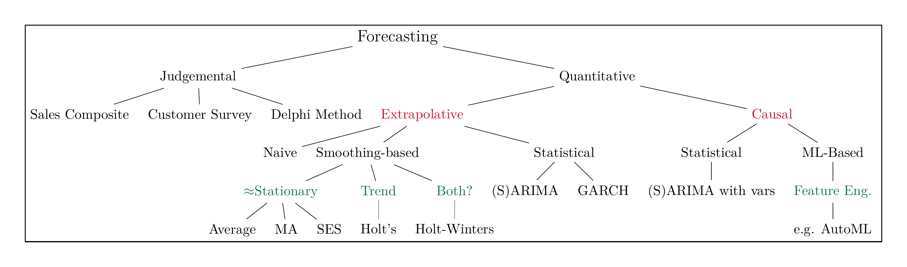

```{r setup, include=FALSE}
knitr::opts_chunk$set(cache = TRUE,
                      echo = TRUE,
                      warning = FALSE,
                      message = FALSE,
                      progress = FALSE, 
                      verbose = FALSE,
                      dev = 'png',
                      dpi = 300,
                      fig.asp = 0.618,
                      fig.align = 'center',
                      out.width = '70%')

options(htmltools.dir.version = FALSE)


miamired = '#C3142D'

if(require(pacman)==FALSE) install.packages("pacman")
if(require(devtools)==FALSE) install.packages("devtools")
if(require(countdown)==FALSE) devtools::install_github("gadenbuie/countdown")
if(require(xaringanExtra)==FALSE) devtools::install_github("gadenbuie/xaringanExtra")
if(require(emo)==FALSE) devtools::install_github("hadley/emo")
if(require(icons)==FALSE) devtools::install_github("mitchelloharawild/icons")

pacman::p_load(gifski, av, gganimate, ggtext, glue, extrafont, # for animations
               emojifont, emo, RefManageR, xaringanExtra, countdown, downlit) # for slides
```

```{r xaringan-themer, include=FALSE, warning=FALSE}
if(require(xaringanthemer) == FALSE) install.packages("xaringanthemer")
library(xaringanthemer)

style_mono_accent(base_color = "#84d6d3",
                  base_font_size = "20px")

xaringanExtra::use_extra_styles(
  hover_code_line = TRUE,         
  mute_unhighlighted_code = TRUE  
)

xaringanExtra::use_xaringan_extra(c("tile_view", "animate_css", "tachyons", "panelset", "share_again", "search", "fit_screen", "editable", "clipboard"))

```


# Quick Refresher from Last Class

`r emo::ji("check")` Use a simple linear regression model for trend adjustment (time-series data).   

`r emo::ji("check")` Interpret regression diagnostic plots.  

`r emo::ji("check")`  Create prediction intervals for individual values of the response variable.  

`r emo::ji("check")` Use regression to **account (?)** for seasonality in a time series.


---

# Interpreting the Model from Last Class

`r countdown(minutes = 10, seconds = 0, top = 0, font_size = "2em")`

.pull-left[
.font60[
```{r jj18, eval=FALSE}
log_jj = log(astsa::jj)

# extracting time and quarter
t = time(log_jj) 
q = cycle(log_jj) |> factor() 

model3 = lm(log_jj ~ t + q)

summary(model3)

```

.center[**From the output, what are the:**]

.can-edit.key-activity5[

- Regression equation: ...   

- Intercept interpretation: ...   

- The predicted value for logged EPS at 1964 Q1: ...   

- Interpretation of 0.02812 coefficient for Q2: ...   

- The baseline for Q3 coefficient: ...

]

]
]   

.pull-right[

.font70[
```{r jj18_out, ref.label = 'jj18', out.width = '100%', echo=FALSE, fig.dim= c(4.4, 4.4)}
```
]

]


---

# Overview of Univariate Forecasting Methods

```{r read_ts_taxonomy, echo=FALSE, out.width='100%', fig.alt="A 10,000 foot view of univariate forecasting techniques", fig.align='center', fig.cap='A 10,000 foot view of forecasting techniques'}

```

.footnote[
<html>
<hr>
</html>

**Notes:** My (incomplete) classification of **univariate** forecasting techniques, i.e., they exclude popular approaches used in multivariate time series forecasting.  
]

---


# Learning Objectives for Today's Class

- Combine regression with ARIMA models to model a time series with autocorrelated errors.  

- Use the `xreg` argument to combine ARIMA models with regression predictors.


---
class: inverse, center, middle

# Combining Regression with ARIMA Models


---

# Preface

- We have learned to fit ARIMA models to predict a series from itself, **removing the autocorrelation from a series**.   
    + These methods are useful, but don’t allow us to combine **outside** information to boost our forecast.    

- Now we will discuss combining regression (**outside information**) and ARIMA models (**inside information**) to forecast a time series.

- A multiple regression model takes on the form:  
$$Y_t = \beta_0 + \beta_1 x_{t,1} + \beta_2 x_{t,2} + \dots + \beta_q x_{t,q} + \epsilon_t,$$
where we typically assume that $\epsilon_t$ is independent, identically distributed white noise (normally distributed).


---

# What we Learned from the J&J Example

.pull-left[
.font80[

```{r jj19a, include=FALSE}
source('resPlotTS.R')
```

```{r jj19, eval=FALSE}
log_jj = log(astsa::jj)

t = time(log_jj) 
q = cycle(log_jj) |> factor() 

model3 = lm(log_jj ~ t + q)

resplot(
  res = model3$residuals, 
  fit = model3$fitted.values,
  freq= 4)
```

- **Based on the J&J Example**, when our dependent and independent variables are observed over time, $\epsilon_t$  **is often correlated over time**.  

- *In such cases, the assumptions of iid residuals are not met and the fitted regression models should not be used.*
]
]


.pull-right[
.font80[
```{r jj19_out, ref.label = 'jj19', out.width = '100%', echo=FALSE, fig.dim= c(4.4, 4.4)}
```
]
]


---

# One Possible Solution

.font80[
We will restate our model as follows: $Y_t = \beta_0 + \beta_1 x_{t,1} + \beta_2 x_{t,2} + \dots + \beta_q x_{t,q} + \eta_t,$

where $\eta_t$ **follows an ARIMA model.**  When we model $\eta_t$, there will be errors from this model, denoted as $\epsilon_t$.  Thus, we have the errors from the regression, $\eta_t$, and the errors from the ARIMA model, denoted as $\epsilon_t$.  Only the errors from the ARIMA, $\eta_t$ are iid white noise.

<br>

**If we are using an AR(1) model for the residuals**, in this case our model would look as follows

$$Y_t = \beta_0 + \beta_1 x_{t,1} + \beta_2 x_{t,2} + \dots + \beta_q x_{t,q} + \eta_t,$$

where $\eta_t = \delta + \phi_1 \eta_{t-1} + \epsilon_t$ **follows an AR(1) model.**  

<br>

**If we were to use an ARMA(1,1) model for the residuals**, in this case our model would look as follows
$$Y_t = \beta_0 + \beta_1 x_{t,1} + \beta_2 x_{t,2} + \dots + \beta_q x_{t,q} + \eta_t,$$
where $\eta_t = \delta + \phi_1 \eta_{t-1} + \epsilon_t - \theta_1 \epsilon_{t-1}$ **follows an ARMA(1,1) model.**  

]


---

# R Implementation

We will use the “uschange” dataset from the `fpp2` package to forecast changes in personal consumption expenditures based on personal disposable income from 1970 to 2016. 

**Process:**  

  (1) Start by plotting the quarterly changes in US consumption and personal income  
  (2) Fit a regression with Y = change in consumption and X = Change in personal income, with autocorrelated errors  -- using the `auto.arima()`. The **new part** is that we would be using the argument `xreg` for the predictor/explanatory variables.  
  (3) Check the residual plots to ensure the assumptions of the model are met.  
  

---

# The Example

.pull-left[

.font80[
```{r uschange1, eval=FALSE}
uschange = fpp2::uschange

class(uschange)

forecast::autoplot( #<<
  uschange[, c('Consumption', 'Income')], facets = TRUE #<<
  ) +  #<<
  ggplot2::labs(y = "Pct Change by Quarter") +
  ggplot2::theme_bw()
```
]
]

.pull-right[
.font80[
```{r uschange1_out, ref.label = 'uschange1', out.width = '90%', echo=FALSE, fig.dim= c(4.4, 4.4)}
```
]
]


---
count: false

# The Example

.pull-left[
.font80[
```{r uschange2, eval=FALSE}
uschange = fpp2::uschange

p = # store plot into an object so it won't print
  forecast::autoplot( 
  uschange[, c('Consumption', 'Income')], facets = TRUE 
  ) +  
  ggplot2::labs(y = "Pct Change by Quarter") +
  ggplot2::theme_bw()

model1 = 
  forecast::auto.arima( #<<
    uschange[,'Consumption'], #<< 
    xreg = uschange[, 'Income'] #<<
    ) #<<

summary(model1)
```
]
]

.pull-right[
.font80[
```{r uschange2_out, ref.label = 'uschange2', out.width = '90%', echo=FALSE, fig.dim= c(4.4, 4.4)}
```
]
]

.font80[
**From the above example, our regression equation would look like this:**
$$Consumption_{t} = 0.5990 + 0.2028Income_{t} + \eta_t,$$
where $\eta_t = \delta + \phi_1 \eta_{t-1} + \epsilon_t + \theta_1 \epsilon_{t-1} + \theta_2 \epsilon_{t-2}$ **follows an ARMA(1,2) model.**

]


---

count: false

# The Example

.pull-left[
.font70[
.center[**Checking Residuals: Approach 1**]
```{r uschange3a, out.width = '85%', echo=TRUE, fig.dim= c(4, 4)}
resplot(res = model1$residuals, fit = model1$fitted, freq = 4)
```
]
]

.pull-right[
.font70[
.center[**Checking Residuals: Approach 2**]
```{r uschange3b, out.width = '65%', echo=TRUE, fig.dim= c(4, 4)}
forecast::checkresiduals(model1)
```
]
]

---

# Class Activity

`r countdown(minutes = 10, seconds = 0, top = 0, font_size = "2em")`

.font80[

- Compare the results from the class example, with the following four models:  
      + `forecast::auto.arima()` using only the Y series. Name this as `model2`.   
      + `forecast::auto.arima()` using two explanatory variables ("Income" and "Savings"). Name this as `model3`.   
      + `lm()` using both income and savings. Name this as `model4`.     
      + `lm()` using income only.  Name this as `model5`.   
    
- Which models are suitable? (i.e., the assumptions about the model residuals are met).  
  
- Among the suitable models, pick the best model using the BIC. R function: `BIC()` from base R. 
  
- Predict 1-4 quarters ahead using `model1` (irrespective of whether it is the best model)

]

```{r inClassActivity_sol, include=FALSE}
# Solutions for the Questions
# (1a) Extrapolative forecasting using auto.arima (i.e., only the time-series for Consumption)
model2 = forecast::auto.arima(uschange[, 'Consumption'])
summary(model2)
resplot(res = model2$residuals, fit = model2$fitted, freq = 4)

# (1b) Reg with Income and Savings and ARIMA structure imposed on the error term
model3 = forecast::auto.arima(uschange[,'Consumption'], xreg = uschange[, c('Income', 'Savings') ])
summary(model3)
resplot(res = model3$residuals, fit = model3$fitted, freq = 4)

# (1c) Lm using both income and savings 
model4 = lm(uschange[,'Consumption'] ~ uschange[,'Income'] + uschange[,'Savings'])
summary(model4)

# (1d) Income only
model5 = lm(uschange[,'Consumption'] ~ uschange[,'Income'] )
summary(model5)
resplot(model5$residuals, model5$fitted.values, freq = 4)


# Bonus Question: How to make predictions about future values
predict(model1, newxreg = c(0.1, -0.2)) # for model1 (one predictor)
# Alternatively 
forecast::forecast(model1, xreg = c(0.1, -0.2)) # for model1 ( (one predictor)

# For forecast models with multiple predictors, you will have to add the information as a data.matrix
forecast::forecast(model3, 
         xreg = data.frame( Income = c(0.1, -0.2), Savings = c(0.1, 0.2) ) |> data.matrix()  )
```


---
class: inverse, center, middle

# Recap

---

# Summary of Main Points

By now, you should be able to do the following:   

- Combine regression with ARIMA models to model a time series with autocorrelated errors.  

- Use the `xreg` argument to combine ARIMA models with regression predictors.


---

# Things to Do to Prepare for Next Class

- Go through the slides, examples and make sure you have a good understanding of what we have covered.  

- Read Chapter $7$ in our reference book [Principles of Business Forecasting](https://cdn.shopify.com/s/files/1/0859/4364/files/Part_I_POBF-_A_First_Course_in_Forecasting_1.pdf?612).  
